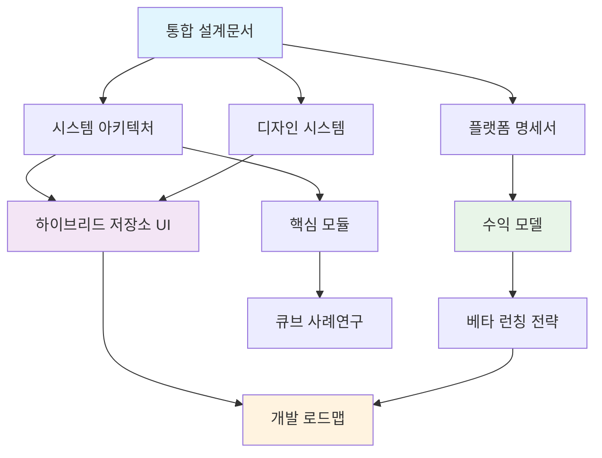

# 📋 Paperwork AI B2B 하이브리드 시스템 문서 색인

> **프로젝트**: Paperwork AI B2B 하이브리드 시스템 완전 문서화  
> **최종 업데이트**: 2025-08-22  
> **담당**: HEAL7 AI Architecture Team  
> **목적**: B2B 하이브리드 전환 관련 모든 문서의 중앙 색인

---

## 🎯 **핵심 설계문서**

### **📋 1. 통합 설계문서** ⭐ **메인 청사진**
- **파일**: `/feature-specs/paperwork-ai-b2b-unified-design(페이퍼워크AI B2B통합설계).complete.md`
- **내용**: 완전한 B2B 하이브리드 시스템 설계 청사진
- **포함사항**:
  - 기존 시스템 아키텍처 분석 및 활용 방안
  - 3단계 하이브리드 요금제 (29,000원/59,000원/99,000원)
  - 하이브리드 저장소 시스템 (서버 + 클라우드)
  - 500개 기업 타겟, 월 순이익 2,800만원 달성 계획
  - 4단계 개발 로드맵 및 베타 런칭 전략

### **🏗️ 2. 시스템 아키텍처** 
- **파일**: `/architecture-diagrams/paperwork-ai-system(페이퍼워크AI시스템).guide.md`
- **내용**: B2B 하이브리드 확장 아키텍처
- **업데이트 사항**:
  - 기존 프로덕션 시스템 + B2B 하이브리드 확장
  - 하이브리드 저장소 시스템 다이어그램
  - B2B 요금제 시스템 아키텍처
  - 멀티테넌트 구조 설계

### **📝 3. 플랫폼 명세서**
- **파일**: `/feature-specs/paperwork-ai-platform(페이퍼워크AI플랫폼).spec.md`
- **내용**: B2B 수익 모델 및 비즈니스 로직
- **업데이트 사항**:
  - B2B 3단계 하이브리드 요금제
  - 하이브리드 저장소 차별화 전략
  - 예상 매출 57% 증가 (연 3.72억원)
  - 마진율 90% 수익 구조

---

## 🎨 **디자인 및 UI 시스템**

### **🎨 4. 디자인 시스템**
- **파일**: `/reference-docs/paperwork-ai-design-system(페이퍼워크AI디자인시스템).guide.md`
- **내용**: B2B 하이브리드 디자인 시스템 확장
- **업데이트 사항**:
  - v3.0.0 B2B 하이브리드 확장 버전
  - 기존 Glassmorphism 디자인 유지
  - B2B 요금제별 UI 차별화
  - 하이브리드 저장소 UI 컴포넌트

### **🔄 5. 하이브리드 저장소 UI 컴포넌트** ⭐ **신규 작성**
- **파일**: `/reference-docs/paperwork-ai-b2b-hybrid-storage-ui-components.guide.md`
- **내용**: 하이브리드 저장소 전용 UI 컴포넌트 완전 가이드
- **포함사항**:
  - 저장소 선택기 (Storage Selector)
  - 민감도 분석기 (Sensitivity Analyzer)
  - 클라우드 연동 관리자 (Cloud Connection Manager)
  - 완전한 HTML/CSS/JavaScript 구현 코드
  - 요금제별 기능 제한 로직

---

## 🏭 **기존 시스템 기반 문서**

### **⚙️ 6. 핵심 모듈**
- **파일**: `/core-logic/paperwork-ai-core-modules(페이퍼워크AI핵심모듈).guide.md`
- **내용**: 기존 핵심 모듈 구조 (B2B 확장 기반)
- **활용 방안**: 
  - 기존 AI 통합 모듈 재활용
  - 파일 처리 시스템 확장
  - 사용자 관리 멀티테넌트 전환

### **📊 7. 큐브 아키텍처 사례연구**
- **파일**: `/architecture-diagrams/cube-case-study-paperwork-crawler-v2.0(페이퍼워크크롤러큐브사례연구).md`
- **내용**: Paperwork AI의 큐브 모듈러 아키텍처 적용 사례
- **연관성**: B2B 시스템 확장 시 큐브 구조 활용 방안

---

## 📊 **비즈니스 모델 및 수익성**

### **💰 수익 모델 비교**

#### **기존 B2C 모델**
```
Free Tier: 무료 (월 5건)
Pro Tier: 9,900원 (월 50건)
Enterprise Tier: 99,000원 (무제한)

예상 연 매출: 2.38억원
```

#### **신규 B2B 하이브리드 모델** ⭐
```
스타터 플랜: 29,000원 (10명, 300건, 서버 20MB)
프로페셔널 플랜: 59,000원 (25명, 750건, 서버 50MB)
엔터프라이즈 플랜: 99,000원 (50명, 1,500건, 서버 100MB)

예상 연 매출: 3.72억원 (57% 증가)
월 순이익: 2,800만원 (마진율 90%)
```

### **🎯 타겟 시장**
- **1차 타겟**: 스타트업 300개 기업 (직원 10-30명)
- **2차 타겟**: 중소기업 200개 기업 (직원 30-50명)
- **총 목표**: 500개 기업 확보

---

## 🚀 **개발 로드맵**

### **Phase 1: 하이브리드 코어 시스템 (2개월)**
- Week 1-2: 프로젝트 셋업 및 기반 구조
- Week 3-4: 하이브리드 저장소 시스템
- Week 5-6: 요금제 및 사용량 관리
- Week 7-8: 테스팅 및 최적화

### **Phase 2: 클라우드 연동 시스템 (1개월)**
- Week 9-10: OAuth 2.0 클라우드 인증
- Week 11-12: 클라우드 파일 관리

### **Phase 3: 운영 최적화 (1개월)**
- Week 13-14: 모니터링 및 관리
- Week 15-16: 최종 최적화 및 런칭

### **베타 런칭 전략**
1. **50개 기업 베타** (무료 3개월)
2. **200개 기업 얼리어답터** (50% 할인 6개월)
3. **500개 기업 풀 런칭** (정가 운영)

---

## 🔧 **기술적 구현 요소**

### **하이브리드 저장소 시스템**
- **서버 저장소**: AES-256 암호화, 요금제별 할당량
- **클라우드 연동**: Google Drive, Dropbox, OneDrive, iCloud
- **AI 라우팅**: 민감도 분석 기반 자동 저장소 선택

### **멀티테넌트 아키텍처**
- **회사별 격리**: 데이터 및 권한 완전 분리
- **사용량 추적**: 문서 처리량, 저장소 사용량
- **권한 관리**: 관리자/멤버 역할 구분

### **보안 강화**
- **데이터 암호화**: 저장/전송 중 암호화
- **OAuth 2.0**: 클라우드 서비스 안전한 연동
- **GDPR 준수**: 데이터 삭제 요청 처리

---

## 📚 **참조 관계도**



---

## ✅ **문서 완성도 체크리스트**

### **✅ 완료된 문서**
- [x] **통합 설계문서**: 완전한 B2B 청사진 작성
- [x] **시스템 아키텍처**: B2B 하이브리드 확장 반영
- [x] **플랫폼 명세서**: 수익 모델 B2B 전환
- [x] **디자인 시스템**: v3.0.0 B2B 확장 버전
- [x] **하이브리드 저장소 UI**: 신규 컴포넌트 완전 가이드

### **🔄 연관 문서 (기존 활용)**
- [x] **핵심 모듈**: B2B 확장 기반으로 활용
- [x] **큐브 사례연구**: 아키텍처 참조 자료

### **📋 후속 작업 (필요시)**
- [ ] API 문서 업데이트 (하이브리드 저장소 API)
- [ ] 데이터베이스 스키마 설계 (멀티테넌트)
- [ ] 보안 정책 문서 (B2B 전용)

---

## 🎯 **핵심 성공 요소**

### **1. 차별화된 하이브리드 접근법**
- 민감한 문서는 서버에, 일반 문서는 클라우드에
- AI 기반 스마트 라우팅으로 최적 저장소 자동 선택
- 기업 맞춤형 3단계 요금제

### **2. 기존 자산 활용 극대화**
- 검증된 Glassmorphism 디자인 유지
- 15개 AI 모델 통합 시스템 재활용
- 최적화된 FastAPI + Quill.js 아키텍처

### **3. 현실적 비즈니스 모델**
- 90% 마진율로 지속가능한 수익 구조
- 점진적 확장 (50개 → 200개 → 500개 기업)
- 검증된 B2B SaaS 시장 진출

---

**🔄 문서 관리**: 모든 문서는 REFERENCE_LIBRARY 구조 내에서 체계적으로 관리되며, 변경 사항은 이 색인을 통해 추적됩니다.

**📞 문의**: arne40@heal7.com | 050-7722-7328

---

*이 색인은 Paperwork AI B2B 하이브리드 시스템의 모든 문서를 총괄하는 마스터 가이드입니다. 각 문서는 상호 연관되어 있으며, 통합 설계문서를 중심으로 구성되어 있습니다.*