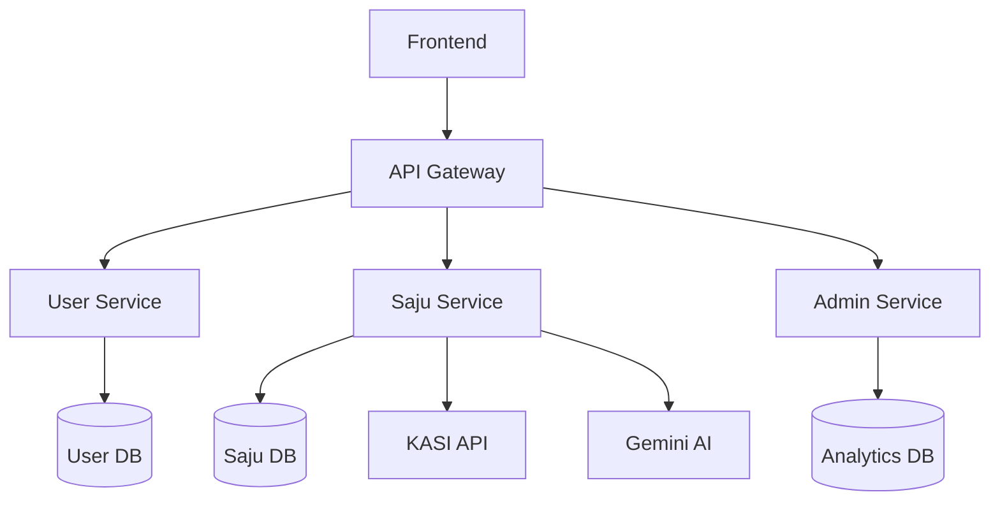
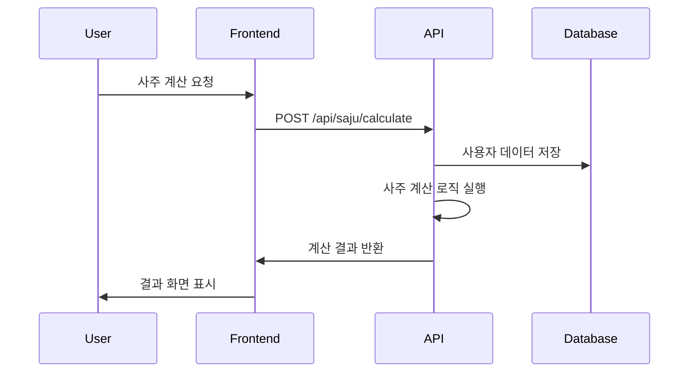
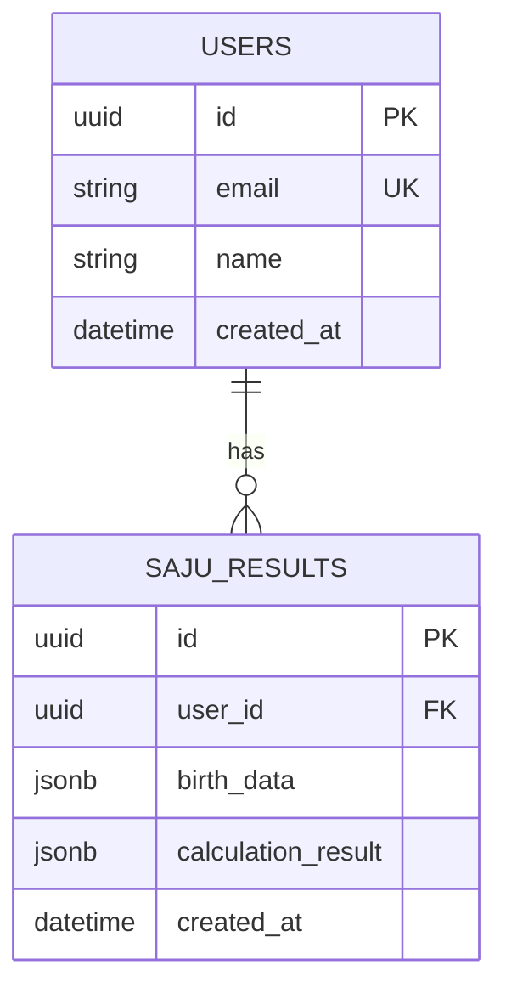
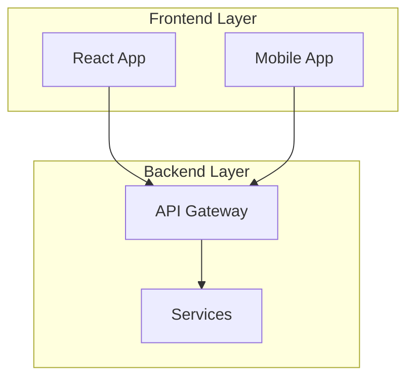

# 🏗️ Architecture Diagrams - 시스템 구조 시각화

## 🎯 목적
- **시스템 아키텍처** 시각적 이해
- **데이터 플로우** 명확한 도식화
- **컴포넌트 관계** 정의
- **배포 구조** 문서화

## 📂 구조

### **system-architecture/** - 시스템 아키텍처
```
heal7-overall-system.mermaid    # HEAL7 전체 시스템 구조
microservices-map.mermaid      # 마이크로서비스 맵
data-flow-diagram.mermaid      # 데이터 플로우 다이어그램
deployment-architecture.mermaid # 배포 아키텍처
```

### **service-architecture/** - 서비스별 아키텍처
```
saju-service-architecture.mermaid    # 사주 서비스 아키텍처
user-service-architecture.mermaid    # 사용자 서비스 아키텍처
admin-service-architecture.mermaid   # 관리자 서비스 아키텍처
api-gateway-architecture.mermaid     # API 게이트웨이 구조
```

### **database-design/** - 데이터베이스 설계
```
heal7-erd.mermaid              # HEAL7 ERD (Entity Relationship Diagram)
saju-data-model.mermaid        # 사주 데이터 모델
user-data-model.mermaid        # 사용자 데이터 모델
analytics-data-model.mermaid   # 분석 데이터 모델
```

### **integration-flows/** - 통합 플로우
```
kasi-api-integration.mermaid   # KASI API 통합 플로우
ai-service-flow.mermaid        # AI 서비스 플로우
payment-process-flow.mermaid   # 결제 프로세스 플로우
notification-flow.mermaid      # 알림 플로우
```

### **infrastructure/** - 인프라 구조
```
server-topology.mermaid        # 서버 토폴로지
network-diagram.mermaid        # 네트워크 다이어그램
security-architecture.mermaid  # 보안 아키텍처
monitoring-setup.mermaid       # 모니터링 설정
```

## 🎨 Mermaid 다이어그램 가이드

### **시스템 다이어그램**


### **시퀀스 다이어그램**


### **ERD (Entity Relationship Diagram)**


### **플로우차트**


## 📋 다이어그램 작성 기준

### **명명 규칙**
```
[도메인]-[다이어그램타입].mermaid
예: saju-service-architecture.mermaid
```

### **스타일 가이드**
- **노드**: 명확하고 간결한 이름 사용
- **화살표**: 방향성과 관계 명확히 표시
- **색상**: 시스템별 일관된 색상 사용
- **그룹핑**: 논리적 그룹으로 분류

### **문서화 표준**


## 🔄 버전 관리

### **파일명 규칙**
```
[다이어그램명]-v[버전].mermaid
예: heal7-overall-system-v2.1.mermaid
```

### **변경 이력**
```markdown
# 변경 이력

## v2.1 (2025-08-18)
- AI 서비스 통합 추가
- 보안 계층 강화

## v2.0 (2025-08-15)  
- 마이크로서비스 아키텍처 적용
- 데이터베이스 분리

## v1.0 (2025-08-10)
- 초기 아키텍처 설계
```

## 🚀 활용 방법

### **시스템 이해**
1. heal7-overall-system.mermaid 부터 전체 구조 파악
2. 서비스별 상세 아키텍처 확인
3. 데이터 플로우 이해

### **개발 가이드**
1. 해당 서비스의 아키텍처 다이어그램 참조
2. 컴포넌트 간 관계 확인  
3. 데이터 모델 구조 파악

### **배포 및 운영**
1. 배포 아키텍처 확인
2. 인프라 구조 이해
3. 모니터링 포인트 파악

## 🛠️ 도구 사용

### **Mermaid 렌더링**
- **VSCode**: Mermaid Preview 확장
- **GitHub**: 자동 렌더링 지원
- **온라인**: mermaid.live 에디터

### **내보내기**
- **PNG**: 문서용 이미지
- **SVG**: 벡터 그래픽
- **PDF**: 인쇄용 문서

## ✅ 품질 기준
- [ ] 논리적 구조가 명확히 표현됨
- [ ] 컴포넌트 간 관계가 정확함
- [ ] 데이터 플로우가 이해하기 쉬움
- [ ] 버전 관리가 체계적임
- [ ] 문서화가 충분함