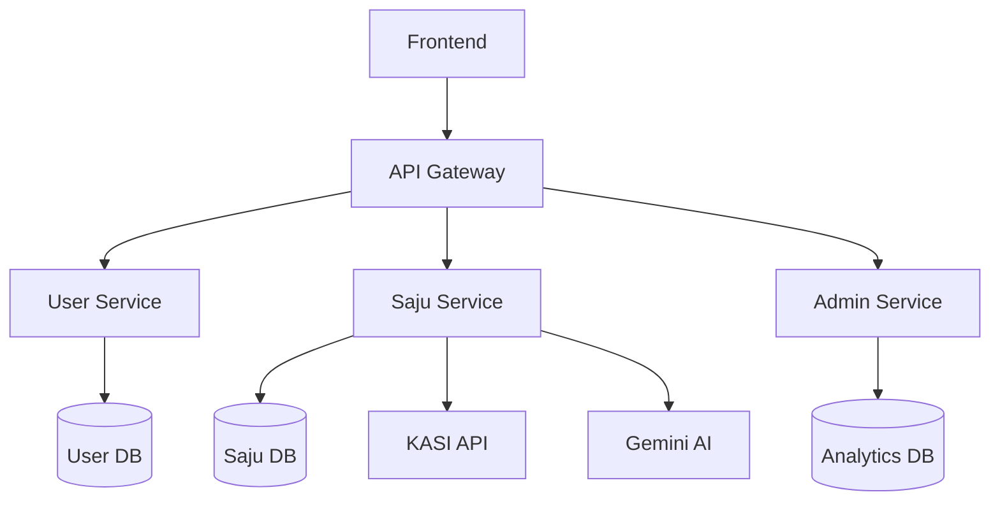
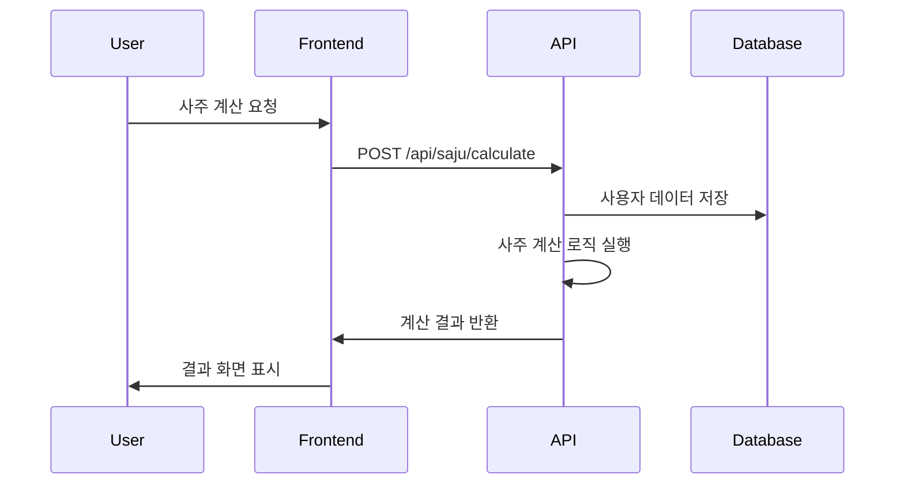
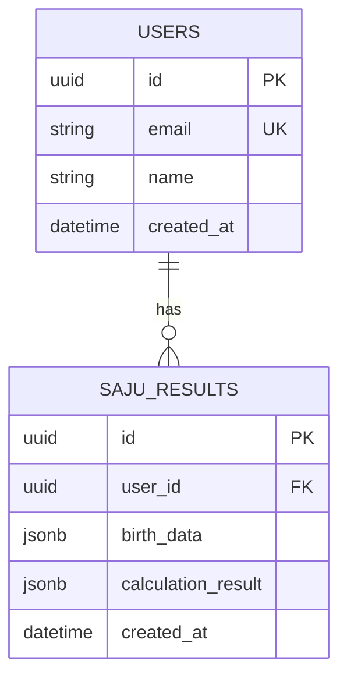
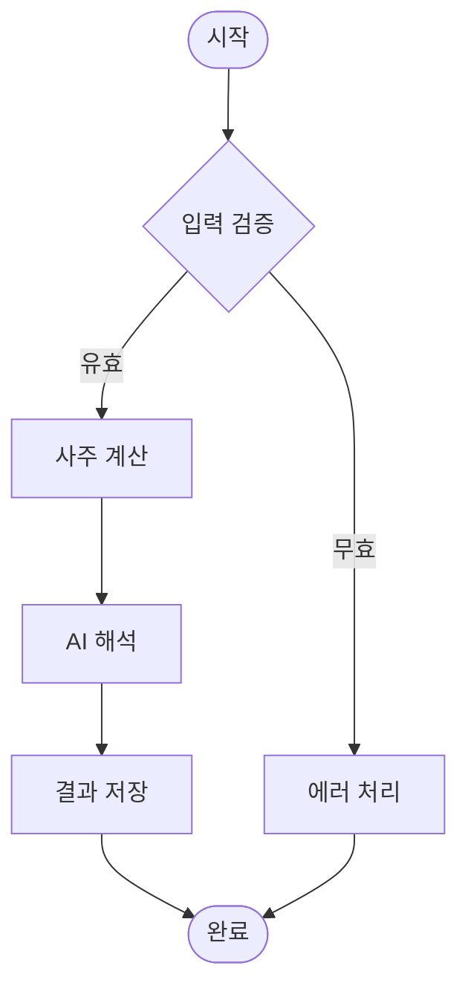
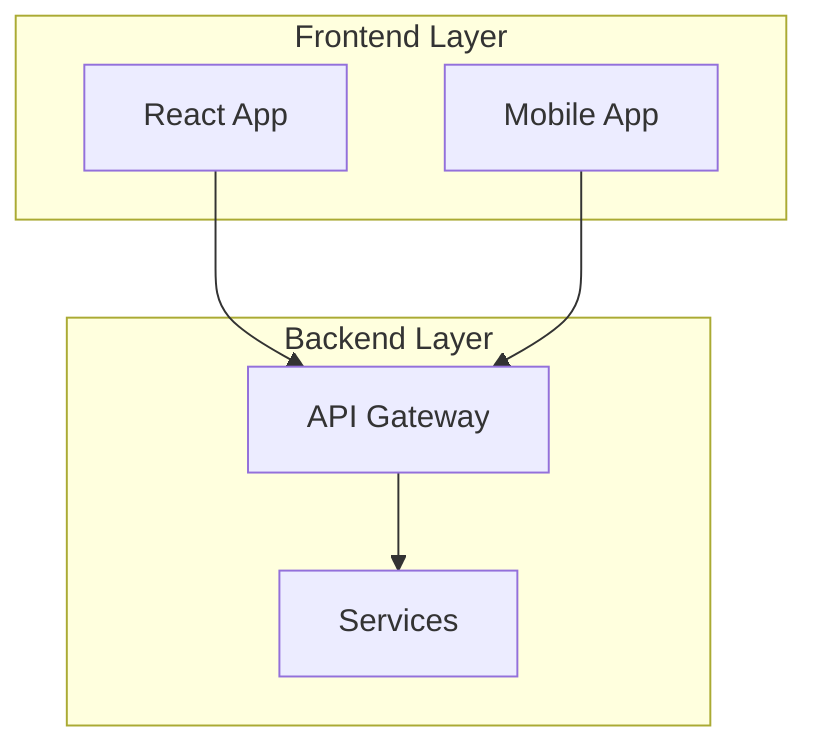

# 🏗️ Architecture Diagrams - 시스템 구조 시각화

## 🎯 목적
- **시스템 아키텍처** 시각적 이해
- **데이터 플로우** 명확한 도식화
- **컴포넌트 관계** 정의
- **배포 구조** 문서화

## 📂 구조

### **case-studies/** - 큐브 케이스 스터디
```
cube-case-study-ai-v2.0(AI큐브사례연구).md                           # AI 큐브 사례 연구
cube-case-study-paperwork-crawler-v2.0(페이퍼워크크롤러큐브사례연구).md  # 페이퍼워크 크롤러 큐브 사례
cube-case-study-saju-v2.0(사주큐브사례연구).md                       # 사주 큐브 사례 연구
```

### **devops-architecture/** - DevOps 아키텍처
```
Deployment-Infrastructure-Design-v1.0(배포인프라설계).md  # 배포 인프라 설계
```

### **frameworks/** - 프레임워크 및 큐브 아키텍처
```
AI-Document-Composition-Engine-v2.0(AI문서조합엔진).complete.md          # AI 문서 조합 엔진
HEAL7-Cube-Modular-Architecture-v1.0(HEAL7큐브모듈러아키텍처).md          # HEAL7 큐브 모듈러 아키텍처
cube-assembly-patterns-v2.0(큐브조립패턴).md                           # 큐브 조립 패턴
cube-color-system-v2.0(큐브색상체계가이드).md                          # 큐브 색상 체계 가이드
cube-design-flow-v2.0(레고블럭설계플로우).md                           # 레고 블럭 설계 플로우
cube-migration-strategy-v2.0(큐브마이그레이션전략).md                   # 큐브 마이그레이션 전략
cube-modular-architecture(큐브모듈러아키텍처).complete.md               # 큐브 모듈러 아키텍처 완성본
cube-modular-architecture-v2.0(큐브모듈러아키텍처심화).md               # 큐브 모듈러 아키텍처 심화
```

### **integration-flows/** - 통합 플로우
```
Frontend-Backend-Integration-v1.0(프론트엔드백엔드연동).md  # 프론트엔드-백엔드 통합 플로우
```

### **system-designs/** - 시스템 설계
```
Backend-API-Architecture-v1.0(백엔드API아키텍처).md                           # 백엔드 API 아키텍처
Cyber-Fantasy-Fortune-Platform-Architecture-v1.0(사이버판타지운명학플랫폼아키텍처).md  # 사이버 판타지 운명학 플랫폼
Database-Schema-Performance-Architecture-v1.0(데이터베이스스키마성능아키텍처).md        # 데이터베이스 스키마 성능 아키텍처
DevOps-CICD-Pipeline-Architecture-v1.0(데브옵스CICD파이프라인아키텍처).md             # DevOps CI/CD 파이프라인
File-Structure-Project-Architecture-v1.0(파일구조프로젝트아키텍처).md              # 파일 구조 프로젝트 아키텍처
Government-Portal-Intelligence-System-v2.0(정부포털지능화시스템).complete.md      # 정부 포털 지능화 시스템
NGINX-Port-Configuration-v1.0(NGINX포트연동설계).md                           # NGINX 포트 연동 설계
Omnichannel-Experience-Architecture-v2.0(옴니채널경험아키텍처).md                # 옴니채널 경험 아키텍처
Operations-Management-Architecture-v2.0(운영관리아키텍처).md                   # 운영 관리 아키텍처
SajuSite-Renovation-Architecture(사주사이트개편아키텍처).md                     # 사주 사이트 개편 아키텍처
Security-Data-Protection-Architecture-v1.0(보안데이터보호아키텍처).md           # 보안 데이터 보호 아키텍처
celestial-fortune-palace-architecture-v1.0(천체운명궁전아키텍처).md              # 천체 운명 궁전 아키텍처
paperwork-ai-system(페이퍼워크AI시스템).guide.md                              # 페이퍼워크 AI 시스템 가이드
service-cube-implementation-v2.0(서비스별큐브구현).md                         # 서비스별 큐브 구현
```

## 🎨 Mermaid 다이어그램 가이드

### **시스템 다이어그램**


### **시퀀스 다이어그램**


### **ERD (Entity Relationship Diagram)**


### **플로우차트**


## 📋 다이어그램 작성 기준

### **명명 규칙**
```
[도메인]-[다이어그램타입].mermaid
예: saju-service-architecture.mermaid
```

### **스타일 가이드**
- **노드**: 명확하고 간결한 이름 사용
- **화살표**: 방향성과 관계 명확히 표시
- **색상**: 시스템별 일관된 색상 사용
- **그룹핑**: 논리적 그룹으로 분류

### **문서화 표준**


## 🔄 버전 관리

### **파일명 규칙**
```
[다이어그램명]-v[버전].mermaid
예: heal7-overall-system-v2.1.mermaid
```

### **변경 이력**
```markdown
# 변경 이력

## v2.1 (2025-08-18)
- AI 서비스 통합 추가
- 보안 계층 강화

## v2.0 (2025-08-15)  
- 마이크로서비스 아키텍처 적용
- 데이터베이스 분리

## v1.0 (2025-08-10)
- 초기 아키텍처 설계
```

## 🚀 활용 방법

### **시스템 이해**
1. **system-designs/** 폴더의 전체 시스템 아키텍처 문서 참조
2. **frameworks/** 폴더의 큐브 모듈러 아키텍처로 구조 이해
3. **case-studies/** 폴더의 실제 구현 사례 분석

### **개발 가이드**
1. **frameworks/** - 개발 프레임워크 및 큐브 아키텍처 패턴 확인
2. **integration-flows/** - 프론트엔드-백엔드 연동 방법 참조
3. **system-designs/** - 백엔드 API, 데이터베이스 설계 확인

### **배포 및 운영**
1. **devops-architecture/** - 배포 인프라 설계 확인
2. **system-designs/** - NGINX 설정, CI/CD 파이프라인 이해
3. **system-designs/** - 보안 및 운영 관리 아키텍처 참조

## 🛠️ 도구 사용

### **Mermaid 렌더링**
- **VSCode**: Mermaid Preview 확장
- **GitHub**: 자동 렌더링 지원
- **온라인**: mermaid.live 에디터

### **내보내기**
- **PNG**: 문서용 이미지
- **SVG**: 벡터 그래픽
- **PDF**: 인쇄용 문서

## ✅ 품질 기준
- [ ] 논리적 구조가 명확히 표현됨
- [ ] 컴포넌트 간 관계가 정확함
- [ ] 데이터 플로우가 이해하기 쉬움
- [ ] 버전 관리가 체계적임
- [ ] 문서화가 충분함