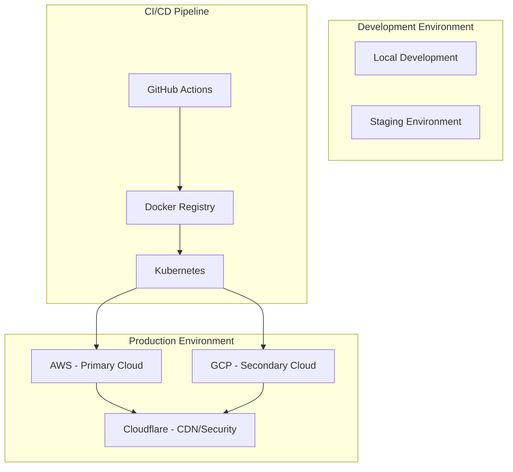

# Deployment-Infrastructure-Design-v1.0(배포아키텍처인프라설계)

> **HEAL7 배포 아키텍처 & 인프라 설계서**  
> Version 1.0 | 2025-08-23 | Docker + Kubernetes + 멀티클라우드 전략

## 📋 **문서 개요**

### **목적**
- HEAL7 포춘텔링 플랫폼의 완전 자동화된 배포 인프라 설계
- Docker 컨테이너화 + Kubernetes 오케스트레이션 전략
- AWS + GCP 멀티클라우드 아키텍처
- CI/CD 파이프라인을 통한 제로다운타임 배포

### **대상 독자**
- DevOps 엔지니어
- 인프라 아키텍트
- 개발팀 리드
- 시스템 관리자

### **관련 문서**
- [File-Structure-Project-Architecture-v1.0](../system-designs/File-Structure-Project-Architecture-v1.0.md)
- [NGINX-Port-Configuration-v1.0](../system-designs/NGINX-Port-Configuration-v1.0.md) (예정)
- [Testing-Quality-Assurance-v1.0](../../feature-specs/performance-specs/Testing-Quality-Assurance-v1.0.md) (예정)

---

## 🏗️ **인프라 아키텍처 전체 구조**

### **멀티클라우드 전략**


### **서비스별 배포 전략**
- **heal7-web-main**: AWS EKS (Primary) + GCP GKE (Backup)
- **heal7-api-gateway**: AWS + GCP Load Balancing
- **heal7-saju-engine**: High-CPU AWS Instances
- **heal7-ai-models**: GPU-enabled GCP Instances
- **heal7-database**: AWS RDS + GCP Cloud SQL (Read Replicas)

---

## 🐳 **Docker 컨테이너화 전략**

### **베이스 이미지 표준화**
```dockerfile
# Base Image: heal7-base
FROM node:20-alpine AS base
LABEL maintainer="heal7@heal7.com"
LABEL version="1.0"

# Security & Performance Optimization
RUN apk add --no-cache dumb-init curl \
    && npm install -g pnpm@8 \
    && addgroup -g 1001 -S heal7 \
    && adduser -S heal7 -u 1001

USER 1001
WORKDIR /app
COPY --chown=heal7:heal7 . .

# Health Check
HEALTHCHECK --interval=30s --timeout=3s --start-period=5s --retries=3 \
    CMD curl -f http://localhost:${PORT:-3000}/health || exit 1
```

### **서비스별 Dockerfile 구성**

#### **1. Web Main (Next.js + TypeScript)**
```dockerfile
FROM heal7-base AS web-main

# Dependencies Installation
COPY package.json pnpm-lock.yaml ./
RUN pnpm install --frozen-lockfile --prod

# Build Process
COPY . .
RUN pnpm build

# Production
FROM node:20-alpine AS production
COPY --from=web-main /app/dist ./dist
COPY --from=web-main /app/node_modules ./node_modules
COPY --from=web-main /app/package.json ./

EXPOSE 3000
CMD ["dumb-init", "node", "dist/server.js"]
```

#### **2. API Gateway (Go + Fiber)**
```dockerfile
FROM golang:1.21-alpine AS api-gateway

WORKDIR /app
COPY go.mod go.sum ./
RUN go mod download

COPY . .
RUN CGO_ENABLED=0 GOOS=linux go build -a -installsuffix cgo -o main ./cmd/api

FROM alpine:latest AS production
RUN apk --no-cache add ca-certificates
WORKDIR /root/

COPY --from=api-gateway /app/main .
COPY --from=api-gateway /app/config ./config

EXPOSE 8000
CMD ["./main"]
```

#### **3. Saju Engine (Rust + Python)**
```dockerfile
FROM rust:1.75 AS saju-engine

WORKDIR /app
COPY Cargo.toml Cargo.lock ./
RUN cargo build --release --bin saju_core

FROM python:3.11-slim AS production
RUN pip install --no-cache-dir fastapi uvicorn[standard] numpy pandas

WORKDIR /app
COPY --from=saju-engine /app/target/release/saju_core ./
COPY ./python/ ./python/

EXPOSE 8001
CMD ["uvicorn", "python.main:app", "--host", "0.0.0.0", "--port", "8001"]
```

### **멀티스테이지 빌드 최적화**
- **빌드 캐시**: `RUN --mount=type=cache,target=/root/.npm`
- **레이어 최적화**: 자주 변경되지 않는 dependencies 먼저
- **보안 스캔**: `docker scout cves` 통합
- **이미지 크기**: Alpine Linux 기반으로 50MB 이하 목표

---

## ⚓ **Kubernetes 오케스트레이션**

### **클러스터 구성**
```yaml
# heal7-cluster-config.yaml
apiVersion: v1
kind: Namespace
metadata:
  name: heal7-production
  labels:
    environment: production
    team: heal7
---
apiVersion: apps/v1
kind: Deployment
metadata:
  name: heal7-web-main
  namespace: heal7-production
spec:
  replicas: 3
  strategy:
    type: RollingUpdate
    rollingUpdate:
      maxSurge: 1
      maxUnavailable: 0
  selector:
    matchLabels:
      app: heal7-web-main
  template:
    metadata:
      labels:
        app: heal7-web-main
    spec:
      containers:
      - name: web-main
        image: heal7/web-main:latest
        ports:
        - containerPort: 3000
        env:
        - name: NODE_ENV
          value: "production"
        - name: DATABASE_URL
          valueFrom:
            secretKeyRef:
              name: heal7-secrets
              key: database-url
        resources:
          requests:
            memory: "256Mi"
            cpu: "250m"
          limits:
            memory: "512Mi"
            cpu: "500m"
        livenessProbe:
          httpGet:
            path: /health
            port: 3000
          initialDelaySeconds: 30
          periodSeconds: 10
        readinessProbe:
          httpGet:
            path: /ready
            port: 3000
          initialDelaySeconds: 5
          periodSeconds: 5
```

### **서비스 메시 구성 (Istio)**
```yaml
# heal7-istio-gateway.yaml
apiVersion: networking.istio.io/v1alpha3
kind: Gateway
metadata:
  name: heal7-gateway
  namespace: heal7-production
spec:
  selector:
    istio: ingressgateway
  servers:
  - port:
      number: 443
      name: https
      protocol: HTTPS
    tls:
      mode: SIMPLE
      credentialName: heal7-tls-secret
    hosts:
    - heal7.com
    - www.heal7.com
    - api.heal7.com
    - ai.heal7.com
---
apiVersion: networking.istio.io/v1alpha3
kind: VirtualService
metadata:
  name: heal7-routes
  namespace: heal7-production
spec:
  hosts:
  - heal7.com
  - www.heal7.com
  gateways:
  - heal7-gateway
  http:
  - match:
    - uri:
        prefix: /api/
    route:
    - destination:
        host: heal7-api-gateway
        port:
          number: 8000
  - match:
    - uri:
        prefix: /
    route:
    - destination:
        host: heal7-web-main
        port:
          number: 3000
```

### **오토스케일링 구성**
```yaml
# heal7-hpa.yaml
apiVersion: autoscaling/v2
kind: HorizontalPodAutoscaler
metadata:
  name: heal7-web-main-hpa
  namespace: heal7-production
spec:
  scaleTargetRef:
    apiVersion: apps/v1
    kind: Deployment
    name: heal7-web-main
  minReplicas: 3
  maxReplicas: 20
  metrics:
  - type: Resource
    resource:
      name: cpu
      target:
        type: Utilization
        averageUtilization: 70
  - type: Resource
    resource:
      name: memory
      target:
        type: Utilization
        averageUtilization: 80
  - type: Pods
    pods:
      metric:
        name: requests_per_second
      target:
        type: AverageValue
        averageValue: "100"
```

---

## 🚀 **CI/CD 파이프라인**

### **GitHub Actions 워크플로우**
```yaml
# .github/workflows/deploy-production.yml
name: Deploy to Production

on:
  push:
    branches: [main]
  pull_request:
    branches: [main]

env:
  REGISTRY: ghcr.io
  IMAGE_NAME: ${{ github.repository }}

jobs:
  test:
    runs-on: ubuntu-latest
    strategy:
      matrix:
        node-version: [18.x, 20.x]
    
    steps:
    - uses: actions/checkout@v4
    
    - name: Setup Node.js
      uses: actions/setup-node@v4
      with:
        node-version: ${{ matrix.node-version }}
        cache: 'pnpm'
    
    - name: Install dependencies
      run: pnpm install --frozen-lockfile
    
    - name: Run tests
      run: |
        pnpm run test:unit
        pnpm run test:integration
        pnpm run test:e2e
    
    - name: Security audit
      run: pnpm audit --audit-level moderate

  build:
    needs: test
    runs-on: ubuntu-latest
    if: github.ref == 'refs/heads/main'
    
    outputs:
      image-digest: ${{ steps.build.outputs.digest }}
      image-tag: ${{ steps.meta.outputs.tags }}
    
    steps:
    - uses: actions/checkout@v4
    
    - name: Set up Docker Buildx
      uses: docker/setup-buildx-action@v3
    
    - name: Log in to Container Registry
      uses: docker/login-action@v3
      with:
        registry: ${{ env.REGISTRY }}
        username: ${{ github.actor }}
        password: ${{ secrets.GITHUB_TOKEN }}
    
    - name: Extract metadata
      id: meta
      uses: docker/metadata-action@v5
      with:
        images: ${{ env.REGISTRY }}/${{ env.IMAGE_NAME }}
        tags: |
          type=ref,event=branch
          type=ref,event=pr
          type=sha,prefix=sha-{{branch}}-
          type=raw,value=latest,enable={{is_default_branch}}
    
    - name: Build and push Docker image
      id: build
      uses: docker/build-push-action@v5
      with:
        context: .
        push: true
        tags: ${{ steps.meta.outputs.tags }}
        labels: ${{ steps.meta.outputs.labels }}
        cache-from: type=gha
        cache-to: type=gha,mode=max
        platforms: linux/amd64,linux/arm64

  security-scan:
    needs: build
    runs-on: ubuntu-latest
    
    steps:
    - name: Scout Security Scan
      uses: docker/scout-action@v1
      with:
        command: cves
        image: ${{ needs.build.outputs.image-tag }}
        sarif-file: sarif.output.json
        summary: true

  deploy-staging:
    needs: [build, security-scan]
    runs-on: ubuntu-latest
    environment: staging
    
    steps:
    - name: Deploy to Staging
      run: |
        echo "Deploying ${{ needs.build.outputs.image-tag }} to staging..."
        # kubectl commands here

  deploy-production:
    needs: [build, deploy-staging]
    runs-on: ubuntu-latest
    environment: production
    if: github.ref == 'refs/heads/main'
    
    steps:
    - name: Deploy to Production
      run: |
        echo "Deploying ${{ needs.build.outputs.image-tag }} to production..."
        # kubectl commands with blue-green deployment
```

### **배포 전략: Blue-Green + Canary**
```bash
#!/bin/bash
# deploy-strategy.sh

set -euo pipefail

IMAGE_TAG=${1:-latest}
NAMESPACE=${2:-heal7-production}
CANARY_PERCENTAGE=${3:-10}

echo "🚀 Starting Blue-Green + Canary Deployment"
echo "📦 Image: ${IMAGE_TAG}"
echo "🎯 Namespace: ${NAMESPACE}"
echo "🐦 Canary: ${CANARY_PERCENTAGE}%"

# Step 1: Deploy Green (new version)
kubectl set image deployment/heal7-web-main-green \
  web-main=heal7/web-main:${IMAGE_TAG} \
  -n ${NAMESPACE}

# Step 2: Wait for Green deployment
kubectl rollout status deployment/heal7-web-main-green -n ${NAMESPACE}

# Step 3: Health check
kubectl exec deployment/heal7-web-main-green -n ${NAMESPACE} -- \
  curl -f http://localhost:3000/health

# Step 4: Canary traffic split
kubectl apply -f - <<EOF
apiVersion: networking.istio.io/v1alpha3
kind: DestinationRule
metadata:
  name: heal7-web-main-canary
  namespace: ${NAMESPACE}
spec:
  host: heal7-web-main
  subsets:
  - name: blue
    labels:
      version: blue
  - name: green
    labels:
      version: green
---
apiVersion: networking.istio.io/v1alpha3
kind: VirtualService
metadata:
  name: heal7-web-main-canary
  namespace: ${NAMESPACE}
spec:
  hosts:
  - heal7-web-main
  http:
  - match:
    - headers:
        canary:
          exact: "true"
    route:
    - destination:
        host: heal7-web-main
        subset: green
  - route:
    - destination:
        host: heal7-web-main
        subset: blue
      weight: $((100 - CANARY_PERCENTAGE))
    - destination:
        host: heal7-web-main
        subset: green
      weight: ${CANARY_PERCENTAGE}
EOF

# Step 5: Monitor metrics for 10 minutes
echo "📊 Monitoring canary deployment for 10 minutes..."
sleep 600

# Step 6: Check success metrics
ERROR_RATE=$(kubectl exec deployment/prometheus -n monitoring -- \
  promtool query instant 'rate(http_requests_total{job="heal7-web-main",code=~"5.."}[5m])' | \
  jq -r '.data.result[0].value[1] // "0"')

if (( $(echo "$ERROR_RATE < 0.01" | bc -l) )); then
  echo "✅ Canary deployment successful, switching to 100%"
  # Switch all traffic to Green
  kubectl patch service heal7-web-main -p '{"spec":{"selector":{"version":"green"}}}'
  # Scale down Blue
  kubectl scale deployment heal7-web-main-blue --replicas=0
else
  echo "❌ Canary deployment failed, rolling back"
  kubectl rollout undo deployment/heal7-web-main-green
fi

echo "🎉 Deployment complete!"
```

---

## ☁️ **멀티클라우드 인프라**

### **AWS 프라이머리 환경**
```yaml
# aws-infrastructure.yaml (Terraform)
provider "aws" {
  region = "ap-northeast-2"
}

# EKS Cluster
resource "aws_eks_cluster" "heal7_primary" {
  name     = "heal7-production"
  role_arn = aws_iam_role.heal7_eks_cluster.arn
  version  = "1.28"

  vpc_config {
    subnet_ids = [
      aws_subnet.heal7_private_1a.id,
      aws_subnet.heal7_private_1c.id,
      aws_subnet.heal7_public_1a.id,
      aws_subnet.heal7_public_1c.id,
    ]
    endpoint_private_access = true
    endpoint_public_access  = true
  }

  depends_on = [
    aws_iam_role_policy_attachment.heal7_eks_cluster_policy,
    aws_iam_role_policy_attachment.heal7_eks_service_policy,
  ]
}

# RDS PostgreSQL
resource "aws_db_instance" "heal7_primary" {
  identifier = "heal7-production"
  
  engine         = "postgres"
  engine_version = "15.4"
  instance_class = "db.r6g.xlarge"
  
  allocated_storage     = 1000
  max_allocated_storage = 5000
  storage_type         = "gp3"
  storage_encrypted    = true
  
  db_name  = "heal7_production"
  username = "heal7_admin"
  password = var.db_password
  
  vpc_security_group_ids = [aws_security_group.heal7_db.id]
  db_subnet_group_name   = aws_db_subnet_group.heal7.name
  
  backup_retention_period = 7
  backup_window          = "03:00-04:00"
  maintenance_window     = "sun:04:00-sun:05:00"
  
  performance_insights_enabled = true
  monitoring_interval         = 60
  monitoring_role_arn         = aws_iam_role.heal7_rds_monitoring.arn
  
  tags = {
    Name        = "heal7-production-db"
    Environment = "production"
  }
}

# ElastiCache Redis
resource "aws_elasticache_replication_group" "heal7_redis" {
  replication_group_id       = "heal7-production-redis"
  description                = "HEAL7 Production Redis Cluster"
  
  node_type                  = "cache.r6g.large"
  port                       = 6379
  parameter_group_name       = "default.redis7"
  
  num_cache_clusters         = 3
  automatic_failover_enabled = true
  multi_az_enabled          = true
  
  subnet_group_name = aws_elasticache_subnet_group.heal7.name
  security_group_ids = [aws_security_group.heal7_redis.id]
  
  at_rest_encryption_enabled = true
  transit_encryption_enabled = true
  auth_token                = var.redis_auth_token
  
  tags = {
    Name        = "heal7-production-redis"
    Environment = "production"
  }
}
```

### **GCP 세컨더리 환경**
```yaml
# gcp-infrastructure.yaml (Terraform)
provider "google" {
  project = "heal7-production"
  region  = "asia-northeast3"
}

# GKE Cluster
resource "google_container_cluster" "heal7_secondary" {
  name     = "heal7-secondary"
  location = "asia-northeast3"
  
  remove_default_node_pool = true
  initial_node_count       = 1
  
  network    = google_compute_network.heal7_vpc.name
  subnetwork = google_compute_subnetwork.heal7_private.name
  
  ip_allocation_policy {
    cluster_secondary_range_name  = "heal7-pod-range"
    services_secondary_range_name = "heal7-service-range"
  }
  
  private_cluster_config {
    enable_private_nodes    = true
    enable_private_endpoint = false
    master_ipv4_cidr_block  = "172.16.0.0/28"
  }
  
  workload_identity_config {
    workload_pool = "${var.project_id}.svc.id.goog"
  }
}

# Cloud SQL PostgreSQL (Read Replica)
resource "google_sql_database_instance" "heal7_replica" {
  name             = "heal7-production-replica"
  database_version = "POSTGRES_15"
  region           = "asia-northeast3"
  
  replica_configuration {
    master_instance_name = "heal7-production-primary"
  }
  
  settings {
    tier = "db-custom-4-16384"
    
    backup_configuration {
      enabled                        = true
      start_time                     = "03:00"
      point_in_time_recovery_enabled = true
    }
    
    ip_configuration {
      ipv4_enabled    = false
      private_network = google_compute_network.heal7_vpc.id
    }
    
    database_flags {
      name  = "max_connections"
      value = "200"
    }
  }
}
```

### **트래픽 분산 전략**
```yaml
# cloudflare-config.yaml
dns_records:
  - name: "heal7.com"
    type: "A"
    content: 
      - value: "aws-primary-lb.heal7.com"
        weight: 70
      - value: "gcp-secondary-lb.heal7.com"
        weight: 30
    proxied: true
    
load_balancing:
  pools:
    - name: "aws-primary"
      origins:
        - name: "aws-seoul"
          address: "52.78.xxx.xxx"
          weight: 1.0
      monitor: "/health"
      notification_email: "ops@heal7.com"
      
    - name: "gcp-secondary"
      origins:
        - name: "gcp-seoul"
          address: "34.64.xxx.xxx"
          weight: 1.0
      monitor: "/health"
      
  geo_steering:
    - country: "KR"
      pool: "aws-primary"
    - country: "JP"
      pool: "gcp-secondary"
    - default: "aws-primary"
```

---

## 📊 **모니터링 및 관찰성**

### **Prometheus + Grafana 스택**
```yaml
# monitoring-stack.yaml
apiVersion: v1
kind: ConfigMap
metadata:
  name: prometheus-config
  namespace: monitoring
data:
  prometheus.yml: |
    global:
      scrape_interval: 15s
      evaluation_interval: 15s
    
    rule_files:
      - "/etc/prometheus/rules/*.yml"
    
    scrape_configs:
      - job_name: 'heal7-web-main'
        kubernetes_sd_configs:
          - role: pod
            namespaces:
              names: ['heal7-production']
        relabel_configs:
          - source_labels: [__meta_kubernetes_pod_label_app]
            action: keep
            regex: heal7-web-main
      
      - job_name: 'heal7-api-gateway'
        kubernetes_sd_configs:
          - role: pod
            namespaces:
              names: ['heal7-production']
        relabel_configs:
          - source_labels: [__meta_kubernetes_pod_label_app]
            action: keep
            regex: heal7-api-gateway
            
    alerting:
      alertmanagers:
        - static_configs:
            - targets:
              - alertmanager:9093

  alert-rules.yml: |
    groups:
      - name: heal7-alerts
        rules:
          - alert: HighErrorRate
            expr: rate(http_requests_total{code=~"5.."}[5m]) > 0.05
            for: 5m
            labels:
              severity: critical
            annotations:
              summary: "High error rate detected"
              description: "Error rate is {{ $value }} errors per second"
              
          - alert: PodCrashLooping
            expr: increase(kube_pod_container_status_restarts_total[1h]) > 5
            for: 10m
            labels:
              severity: warning
            annotations:
              summary: "Pod {{ $labels.pod }} is crash looping"
              
          - alert: DatabaseConnectionHigh
            expr: sum(pg_stat_activity_count) by (datname) > 80
            for: 5m
            labels:
              severity: warning
            annotations:
              summary: "High database connections in {{ $labels.datname }}"
```

### **로그 집계 (ELK Stack)**
```yaml
# elasticsearch-config.yaml
apiVersion: apps/v1
kind: StatefulSet
metadata:
  name: elasticsearch
  namespace: logging
spec:
  serviceName: elasticsearch
  replicas: 3
  selector:
    matchLabels:
      app: elasticsearch
  template:
    metadata:
      labels:
        app: elasticsearch
    spec:
      containers:
      - name: elasticsearch
        image: elasticsearch:8.10.4
        env:
        - name: discovery.type
          value: single-node
        - name: ES_JAVA_OPTS
          value: "-Xms2g -Xmx2g"
        volumeMounts:
        - name: data
          mountPath: /usr/share/elasticsearch/data
        resources:
          requests:
            memory: 4Gi
            cpu: 1000m
          limits:
            memory: 8Gi
            cpu: 2000m
  volumeClaimTemplates:
  - metadata:
      name: data
    spec:
      accessModes: [ "ReadWriteOnce" ]
      resources:
        requests:
          storage: 100Gi
```

---

## 🔒 **보안 및 컴플라이언스**

### **보안 정책**
```yaml
# security-policies.yaml
apiVersion: networking.k8s.io/v1
kind: NetworkPolicy
metadata:
  name: heal7-network-policy
  namespace: heal7-production
spec:
  podSelector: {}
  policyTypes:
  - Ingress
  - Egress
  ingress:
  - from:
    - namespaceSelector:
        matchLabels:
          name: istio-system
    - namespaceSelector:
        matchLabels:
          name: monitoring
    ports:
    - protocol: TCP
      port: 3000
    - protocol: TCP
      port: 8000
  egress:
  - to: []
    ports:
    - protocol: TCP
      port: 443
    - protocol: TCP
      port: 5432
    - protocol: TCP
      port: 6379
---
apiVersion: security.istio.io/v1beta1
kind: PeerAuthentication
metadata:
  name: heal7-mtls
  namespace: heal7-production
spec:
  mtls:
    mode: STRICT
---
apiVersion: security.istio.io/v1beta1
kind: AuthorizationPolicy
metadata:
  name: heal7-authz
  namespace: heal7-production
spec:
  rules:
  - from:
    - source:
        principals: ["cluster.local/ns/heal7-production/sa/heal7-web-main"]
    to:
    - operation:
        methods: ["GET", "POST"]
```

### **시크릿 관리 (External Secrets)**
```yaml
# external-secrets.yaml
apiVersion: external-secrets.io/v1beta1
kind: SecretStore
metadata:
  name: aws-secrets-manager
  namespace: heal7-production
spec:
  provider:
    aws:
      service: SecretsManager
      region: ap-northeast-2
      auth:
        serviceAccount:
          name: heal7-secret-sa
---
apiVersion: external-secrets.io/v1beta1
kind: ExternalSecret
metadata:
  name: heal7-database-secret
  namespace: heal7-production
spec:
  refreshInterval: 1h
  secretStoreRef:
    name: aws-secrets-manager
    kind: SecretStore
  target:
    name: heal7-database-secret
    creationPolicy: Owner
  data:
  - secretKey: database-url
    remoteRef:
      key: heal7/production/database
      property: url
  - secretKey: database-password
    remoteRef:
      key: heal7/production/database
      property: password
```

---

## ⚡ **성능 최적화**

### **성능 목표**
- **응답 시간**: 95th percentile < 500ms
- **처리량**: 10,000 RPS 이상
- **가용성**: 99.9% 이상
- **배포 시간**: < 5분 (제로다운타임)

### **최적화 전략**
```yaml
# performance-optimization.yaml
apiVersion: v1
kind: ConfigMap
metadata:
  name: nginx-performance-config
data:
  nginx.conf: |
    worker_processes auto;
    worker_rlimit_nofile 65535;
    
    events {
        worker_connections 4096;
        use epoll;
        multi_accept on;
    }
    
    http {
        # Compression
        gzip on;
        gzip_vary on;
        gzip_min_length 1024;
        gzip_comp_level 6;
        gzip_types text/css text/javascript application/javascript application/json;
        
        # Caching
        open_file_cache max=10000 inactive=5m;
        open_file_cache_valid 2m;
        open_file_cache_min_uses 1;
        open_file_cache_errors on;
        
        # Keep-alive
        keepalive_timeout 30;
        keepalive_requests 100;
        
        # Rate limiting
        limit_req_zone $binary_remote_addr zone=api:10m rate=100r/s;
        limit_req_zone $binary_remote_addr zone=web:10m rate=1000r/s;
        
        upstream heal7_backend {
            least_conn;
            server heal7-api-gateway-1:8000 max_fails=3 fail_timeout=30s;
            server heal7-api-gateway-2:8000 max_fails=3 fail_timeout=30s;
            server heal7-api-gateway-3:8000 max_fails=3 fail_timeout=30s;
        }
    }
```

### **데이터베이스 최적화**
```sql
-- database-optimization.sql
-- Connection Pooling
ALTER SYSTEM SET max_connections = 200;
ALTER SYSTEM SET shared_preload_libraries = 'pg_stat_statements';

-- Memory Settings
ALTER SYSTEM SET shared_buffers = '4GB';
ALTER SYSTEM SET effective_cache_size = '12GB';
ALTER SYSTEM SET work_mem = '16MB';
ALTER SYSTEM SET maintenance_work_mem = '512MB';

-- Query Optimization
CREATE INDEX CONCURRENTLY IF NOT EXISTS idx_user_birth_date 
ON users(birth_date) WHERE birth_date IS NOT NULL;

CREATE INDEX CONCURRENTLY IF NOT EXISTS idx_saju_calculation_user_created 
ON saju_calculations(user_id, created_at);

-- Partitioning for large tables
CREATE TABLE saju_calculations_2025 PARTITION OF saju_calculations
FOR VALUES FROM ('2025-01-01') TO ('2026-01-01');

-- Auto-vacuum settings
ALTER TABLE saju_calculations SET (autovacuum_vacuum_scale_factor = 0.1);
ALTER TABLE user_sessions SET (autovacuum_vacuum_scale_factor = 0.05);
```

---

## 📈 **용량 계획 및 확장성**

### **트래픽 예측**
- **현재**: 1,000 DAU, 50,000 PV/day
- **6개월**: 10,000 DAU, 500,000 PV/day
- **1년**: 50,000 DAU, 2,500,000 PV/day
- **피크**: 평소 대비 300% 증가 (명절, 새해)

### **리소스 확장 계획**
```yaml
# capacity-planning.yaml
apiVersion: v1
kind: ConfigMap
metadata:
  name: heal7-capacity-plan
data:
  scaling-policy: |
    # Web Tier
    Baseline: 3 replicas (1 CPU, 2GB RAM each)
    Scale-out: +1 replica per 1000 concurrent users
    Maximum: 20 replicas
    
    # API Tier
    Baseline: 2 replicas (2 CPU, 4GB RAM each)
    Scale-out: +1 replica per 500 RPS
    Maximum: 15 replicas
    
    # Database
    Primary: db.r6g.2xlarge (8 CPU, 64GB RAM)
    Read Replicas: 2x db.r6g.xlarge (4 CPU, 32GB RAM)
    Connection Pool: 200 connections max
    
    # Cache
    Redis: 3-node cluster, 16GB each
    Hit Ratio Target: > 95%
    
    # Storage
    Database: 2TB initial, auto-expand to 10TB
    File Storage: S3 with Intelligent Tiering
    Logs: 90 days retention, compressed
  
  cost-optimization: |
    # Spot Instances for Dev/Test: 60% cost reduction
    # Reserved Instances for Production: 40% cost reduction
    # Auto-shutdown for non-production: weekends & nights
    # CDN caching: 80% bandwidth reduction
    
    Estimated Monthly Cost:
    - Development: $500
    - Staging: $800
    - Production: $3,000
    Total: $4,300/month
```

---

## 🎯 **결론 및 다음 단계**

### **주요 달성 목표**
1. **제로다운타임 배포**: Blue-Green + Canary 전략으로 무중단 서비스
2. **고가용성**: 멀티클라우드 구성으로 99.9% 업타임 보장
3. **자동확장**: 트래픽 증가에 따른 자동 스케일링
4. **보안 강화**: mTLS, 네트워크 정책, 시크릿 관리 통합
5. **비용 최적화**: Spot/Reserved 인스턴스로 40-60% 비용 절감

### **구현 우선순위**
1. **Phase 1**: Docker 컨테이너화 + GitHub Actions CI/CD (2주)
2. **Phase 2**: Kubernetes 기본 배포 + 모니터링 (3주)
3. **Phase 3**: 멀티클라우드 구성 + 보안 정책 (4주)
4. **Phase 4**: 성능 최적화 + 오토스케일링 (2주)
5. **Phase 5**: 운영 자동화 + 장애 대응 (2주)

### **관련 문서**
- **다음 문서**: [NGINX-Port-Configuration-v1.0](../system-designs/NGINX-Port-Configuration-v1.0.md)
- **참조 문서**: [Development-Process-Roadmap-v1.0](../../feature-specs/master-plans/Development-Process-Roadmap-v1.0.md) (예정)
- **성능 문서**: [Testing-Quality-Assurance-v1.0](../../feature-specs/performance-specs/Testing-Quality-Assurance-v1.0.md) (예정)

---

**📝 문서 정보**
- **버전**: 1.0
- **최종 수정**: 2025-08-23
- **다음 리뷰**: 2025-09-23
- **담당자**: HEAL7 DevOps Team
- **승인자**: CTO, Lead Developer

*이 문서는 HEAL7의 완전 자동화된 배포 인프라 설계를 위한 마스터 가이드입니다.*