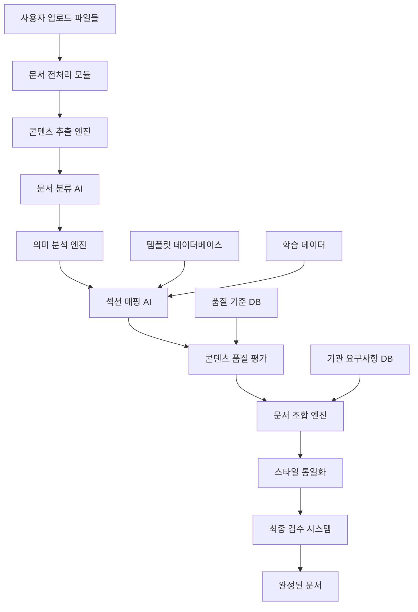

# 🤖 AI 문서 조합 엔진 아키텍처 v2.0

> **프로젝트**: 파편화된 문서를 AI가 완성된 제출서류로 조합하는 핵심 엔진  
> **버전**: v2.0.0  
> **작성일**: 2025-08-23  
> **목적**: "제출할 문서양식을 AI가 대신 작성해드립니다" 시스템의 핵심 두뇌  

---

## 🎯 **핵심 미션**

### 🔥 **문제 상황**
```
😰 사용자의 현실:
📁 회사소개서.pdf
📁 사업계획_초안.docx  
📁 재무현황_2024.xlsx
📁 팀소개_프레젠테이션.pptx
📁 기술설명서_버전3.hwp
📁 기타_참고자료.txt

→ "이걸로 SBA 지원사업 신청서를 만들어야 하는데... 어디서부터 시작해야 할지..."
```

### 🚀 **AI 솔루션**
```
🤖 AI가 자동으로:
1️⃣ 각 파일의 내용과 성격 분석
2️⃣ 템플릿 섹션별로 관련 내용 추출
3️⃣ 부족한 부분 식별 및 보강 제안
4️⃣ 완성된 제출서류 생성
5️⃣ 품질 검수 및 개선 제안

= 📋 즉시 제출 가능한 완성 문서
```

---

## 🏗️ **시스템 아키텍처**

### 📊 **전체 데이터 플로우**


### 🧠 **AI 모델 구성**
```python
class AIDocumentCompositionEngine:
    """AI 문서 조합 엔진 마스터 클래스"""
    
    def __init__(self):
        self.ai_models = {
            # 1차 분석 모델들
            'document_classifier': 'gpt-4o',          # 문서 유형 분류
            'content_extractor': 'claude-3.5-sonnet', # 핵심 내용 추출
            'semantic_analyzer': 'gemini-pro',        # 의미 분석
            
            # 2차 조합 모델들  
            'section_mapper': 'gpt-4o',               # 섹션 매핑
            'content_composer': 'claude-3.5-sonnet', # 콘텐츠 조합
            'quality_checker': 'gemini-pro',          # 품질 검증
            
            # 3차 최적화 모델들
            'style_unifier': 'gpt-4o-mini',          # 스타일 통일
            'final_reviewer': 'claude-3.5-haiku',    # 최종 검수
            'improvement_suggester': 'gemini-flash'   # 개선 제안
        }
        
        self.processing_pipeline = [
            self.stage1_document_analysis,
            self.stage2_content_mapping,
            self.stage3_document_composition,
            self.stage4_quality_optimization,
            self.stage5_final_assembly
        ]
    
    async def compose_complete_document(
        self,
        user_files: List[UploadedFile],
        target_template: str,
        institution: str = None,
        user_preferences: Dict = None
    ) -> ComposedDocument:
        """완전한 문서 조합 프로세스"""
        
        composition_context = CompositionContext(
            files=user_files,
            template=target_template,
            institution=institution,
            preferences=user_preferences or {},
            started_at=datetime.now()
        )
        
        # 5단계 파이프라인 실행
        for stage_func in self.processing_pipeline:
            composition_context = await stage_func(composition_context)
            await self.log_stage_completion(composition_context)
        
        return ComposedDocument(
            content=composition_context.final_document,
            metadata=composition_context.metadata,
            quality_metrics=composition_context.quality_metrics,
            suggestions=composition_context.suggestions,
            processing_time=composition_context.get_processing_time()
        )
```

---

## 🔍 **Stage 1: 문서 분석 단계**

### 📝 **문서 전처리 및 분류**
```python
class DocumentAnalysisStage:
    """1단계: 문서 분석 및 분류"""
    
    async def stage1_document_analysis(self, context: CompositionContext) -> CompositionContext:
        """문서 분석 및 콘텐츠 추출"""
        
        context.stage = "document_analysis"
        analyzed_documents = []
        
        for file in context.files:
            # 1.1 파일 유형 및 콘텐츠 추출
            extracted_content = await self.extract_content_from_file(file)
            
            # 1.2 문서 유형 분류
            document_type = await self.classify_document_type(extracted_content)
            
            # 1.3 핵심 정보 추출
            key_information = await self.extract_key_information(extracted_content, document_type)
            
            # 1.4 콘텐츠 품질 평가
            quality_score = await self.evaluate_content_quality(extracted_content)
            
            analyzed_doc = AnalyzedDocument(
                filename=file.filename,
                file_type=file.content_type,
                document_type=document_type,
                content=extracted_content,
                key_information=key_information,
                quality_score=quality_score,
                word_count=len(extracted_content.split()),
                language=await self.detect_language(extracted_content)
            )
            
            analyzed_documents.append(analyzed_doc)
        
        context.analyzed_documents = analyzed_documents
        context.analysis_summary = await self.generate_analysis_summary(analyzed_documents)
        
        return context
    
    async def classify_document_type(self, content: str) -> DocumentType:
        """문서 유형 자동 분류"""
        
        classification_prompt = f"""
        다음 문서의 유형을 분류해주세요.
        
        문서 내용 (첫 500자):
        {content[:500]}...
        
        분류 기준:
        1. company_intro - 회사소개서, 기업개요
        2. business_plan - 사업계획서, 사업제안서
        3. financial_data - 재무제표, 손익계산서, 예산서
        4. technical_spec - 기술명세서, 개발계획서
        5. team_info - 팀소개, 조직도, 인력현황
        6. market_research - 시장조사, 경쟁분석
        7. reference_material - 참고자료, 기타 문서
        
        결과 형식:
        {{
            "primary_type": "business_plan",
            "confidence": 0.85,
            "secondary_types": ["company_intro"],
            "key_indicators": ["사업목표", "추진계획", "예상수익"]
        }}
        """
        
        result = await self.call_ai_model('document_classifier', classification_prompt)
        return DocumentType.from_dict(json.loads(result))
```

---

## 🎯 **Stage 2: 콘텐츠 매핑 단계**

### 🗺️ **섹션별 콘텐츠 매핑**
```python
class ContentMappingStage:
    """2단계: 콘텐츠를 템플릿 섹션에 매핑"""
    
    async def stage2_content_mapping(self, context: CompositionContext) -> CompositionContext:
        """콘텐츠 섹션 매핑"""
        
        context.stage = "content_mapping"
        
        # 2.1 템플릿 구조 분석
        template_structure = await self.get_template_structure(
            context.template, context.institution
        )
        
        # 2.2 각 섹션별 관련 콘텐츠 찾기
        section_mappings = {}
        
        for section in template_structure.sections:
            mapping_result = await self.map_content_to_section(
                section, context.analyzed_documents
            )
            section_mappings[section.id] = mapping_result
        
        # 2.3 매핑 품질 평가
        mapping_quality = await self.evaluate_mapping_quality(section_mappings)
        
        # 2.4 부족한 섹션 식별
        missing_content = await self.identify_missing_content(
            section_mappings, template_structure
        )
        
        context.section_mappings = section_mappings
        context.mapping_quality = mapping_quality
        context.missing_content = missing_content
        
        return context
    
    async def map_content_to_section(
        self, 
        section: TemplateSection, 
        documents: List[AnalyzedDocument]
    ) -> SectionMapping:
        """개별 섹션에 대한 콘텐츠 매핑"""
        
        # 섹션별 키워드 및 의미 벡터 생성
        section_keywords = section.keywords + section.related_terms
        section_embedding = await self.get_semantic_embedding(
            section.description + " " + " ".join(section_keywords)
        )
        
        # 각 문서와의 관련도 계산
        document_scores = []
        for doc in documents:
            doc_embedding = await self.get_semantic_embedding(doc.content)
            similarity_score = await self.calculate_semantic_similarity(
                section_embedding, doc_embedding
            )
            
            # 키워드 매칭 점수
            keyword_score = self.calculate_keyword_matching_score(
                section_keywords, doc.content
            )
            
            # 종합 점수 계산
            total_score = (similarity_score * 0.7) + (keyword_score * 0.3)
            
            document_scores.append({
                'document': doc,
                'score': total_score,
                'similarity': similarity_score,
                'keyword_match': keyword_score
            })
        
        # 점수 기준 정렬 및 상위 문서들 선택
        relevant_documents = sorted(document_scores, key=lambda x: x['score'], reverse=True)
        
        # AI를 사용한 최종 콘텐츠 선별 및 조합
        combined_content = await self.combine_relevant_content(
            section, relevant_documents[:3]  # 상위 3개 문서만 사용
        )
        
        return SectionMapping(
            section_id=section.id,
            matched_documents=relevant_documents,
            combined_content=combined_content,
            confidence_score=combined_content['confidence'],
            gaps_identified=combined_content['missing_elements']
        )
```

---

## 🔧 **Stage 3: 문서 조합 단계**

### 📖 **완전한 문서 조합**
```python
class DocumentCompositionStage:
    """3단계: 매핑된 콘텐츠를 완전한 문서로 조합"""
    
    async def stage3_document_composition(self, context: CompositionContext) -> CompositionContext:
        """문서 조합 및 생성"""
        
        context.stage = "document_composition"
        
        # 3.1 섹션별 콘텐츠 생성
        composed_sections = {}
        for section_id, mapping in context.section_mappings.items():
            composed_section = await self.compose_section_content(
                section_id, mapping, context.institution
            )
            composed_sections[section_id] = composed_section
        
        # 3.2 섹션간 연결성 및 일관성 확보
        coherent_sections = await self.ensure_document_coherence(composed_sections)
        
        # 3.3 전체 문서 구조 조립
        assembled_document = await self.assemble_complete_document(
            coherent_sections, context.template, context.institution
        )
        
        # 3.4 기관별 요구사항 적용
        customized_document = await self.apply_institutional_requirements(
            assembled_document, context.institution
        )
        
        context.composed_sections = coherent_sections
        context.assembled_document = customized_document
        
        return context
```

---

## ✨ **Stage 4: 품질 최적화 단계**

### 🔍 **품질 평가 및 최적화**
```python
class QualityOptimizationStage:
    """4단계: 품질 평가 및 최적화"""
    
    async def stage4_quality_optimization(self, context: CompositionContext) -> CompositionContext:
        """품질 최적화 프로세스"""
        
        context.stage = "quality_optimization"
        
        # 4.1 종합 품질 평가
        quality_metrics = await self.evaluate_document_quality(
            context.assembled_document, context.template, context.institution
        )
        
        # 4.2 개선 포인트 식별
        improvement_areas = await self.identify_improvement_areas(
            context.assembled_document, quality_metrics
        )
        
        # 4.3 자동 개선 적용
        improved_document = await self.apply_automatic_improvements(
            context.assembled_document, improvement_areas
        )
        
        # 4.4 최종 검수 및 제안
        final_suggestions = await self.generate_final_suggestions(
            improved_document, quality_metrics, context.institution
        )
        
        context.quality_metrics = quality_metrics
        context.improved_document = improved_document
        context.improvement_suggestions = final_suggestions
        
        return context
```

---

## 🎯 **Stage 5: 최종 조립 단계**

### 📋 **완성된 문서 생성**
```python
class FinalAssemblyStage:
    """5단계: 최종 문서 조립 및 완성"""
    
    async def stage5_final_assembly(self, context: CompositionContext) -> CompositionContext:
        """최종 문서 조립"""
        
        context.stage = "final_assembly"
        
        # 5.1 형식 통일 및 스타일링
        styled_document = await self.apply_document_styling(
            context.improved_document, context.institution
        )
        
        # 5.2 목차 및 페이지 구성
        formatted_document = await self.apply_document_formatting(
            styled_document, context.template
        )
        
        # 5.3 메타데이터 추가
        final_document = await self.add_document_metadata(
            formatted_document, context
        )
        
        # 5.4 최종 검증
        validation_result = await self.final_validation(
            final_document, context.template, context.institution
        )
        
        context.final_document = final_document
        context.validation_result = validation_result
        context.completed_at = datetime.now()
        
        return context
```

---

## 📊 **성능 모니터링 시스템**

### 📈 **품질 지표 추적**
```python
class CompositionMetricsTracker:
    """문서 조합 성능 추적 시스템"""
    
    def __init__(self):
        self.metrics_db = MetricsDatabase()
    
    async def track_composition_performance(self, context: CompositionContext):
        """조합 성능 추적"""
        
        performance_metrics = {
            'composition_id': context.composition_id,
            'processing_time': context.get_processing_time(),
            'file_count': len(context.files),
            'total_file_size': sum(f.size for f in context.files),
            'template_type': context.template,
            'institution': context.institution,
            
            'quality_metrics': {
                'overall_score': context.quality_metrics.overall_score,
                'completeness': context.quality_metrics.detailed_scores['completeness'],
                'consistency': context.quality_metrics.detailed_scores['consistency'],
                'professionalism': context.quality_metrics.detailed_scores['professionalism']
            },
            
            'ai_model_usage': context.ai_model_usage,
            'token_consumption': context.token_consumption,
            
            'created_at': datetime.now()
        }
        
        await self.metrics_db.insert_performance_metrics(performance_metrics)
```

---

## 🚀 **배포 및 확장성**

### 🔧 **시스템 확장 계획**
```yaml
성능 목표:
  - 동시 처리 가능한 조합 작업: 100개
  - 평균 조합 시간: 5분 이내
  - 품질 점수: 85점 이상
  - 사용자 만족도: 4.5/5.0 이상

확장성 설계:
  - 마이크로서비스 아키텍처: 각 단계별 독립 확장 가능
  - AI 모델 로드밸런싱: 요청량에 따른 모델 동적 할당
  - 캐싱 시스템: 자주 사용되는 템플릿과 매핑 결과 캐시
  - 큐 시스템: 대량 요청 시 순차 처리
```

---

**🎯 핵심 가치**: "파편화된 자료를 완전한 제출서류로" - AI가 사용자의 불완전한 자료들을 분석하고 조합하여 즉시 제출 가능한 전문 문서를 생성하는 혁신적인 엔진

*📝 이 AI 엔진으로 기업들이 서류 작성에 소요하는 시간을 80% 이상 단축하고, 문서 품질을 전문가 수준으로 끌어올릴 수 있습니다.*