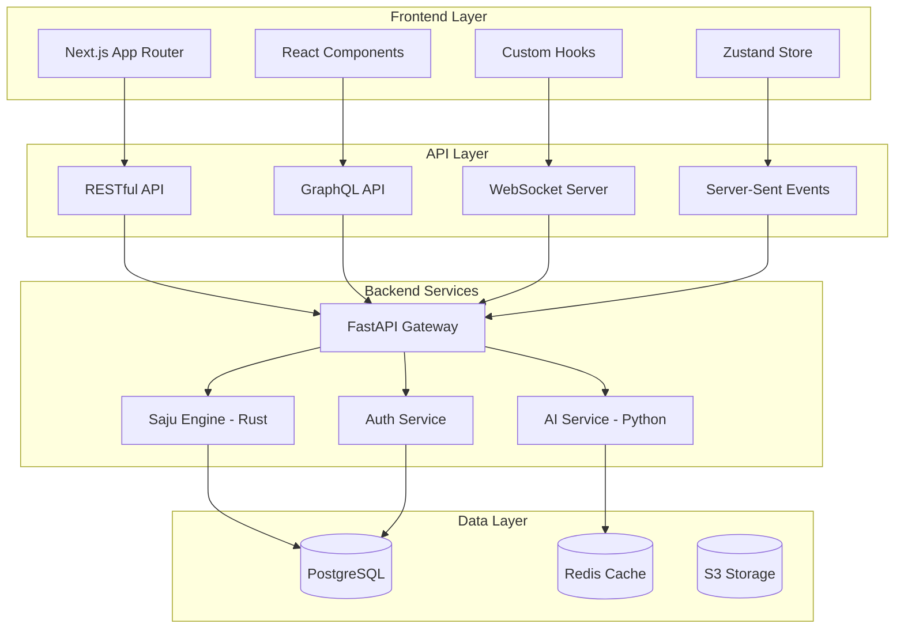

# Frontend-Backend-Integration-v1.0(프론트엔드백엔드연동)

> **HEAL7 프론트엔드-백엔드 연동 전략**  
> Version 1.0 | 2025-08-23 | RESTful + GraphQL + WebSocket 통합 아키텍처

## 📋 **문서 개요**

### **목적**
- HEAL7 포춘텔링 플랫폼의 프론트엔드-백엔드 완전 통합 설계
- RESTful API + GraphQL + WebSocket 하이브리드 아키텍처
- 타입 안전성 보장 및 실시간 데이터 동기화
- 상태 관리 최적화 및 성능 향상

### **대상 독자**
- 프론트엔드 개발자
- 백엔드 개발자
- 풀스택 개발자
- API 설계자

### **관련 문서**
- [File-Structure-Project-Architecture-v1.0(파일구조프로젝트아키텍처)](../system-designs/File-Structure-Project-Architecture-v1.0(파일구조프로젝트아키텍처).md)
- [NGINX-Port-Configuration-v1.0(NGINX포트연동설계)](../system-designs/NGINX-Port-Configuration-v1.0(NGINX포트연동설계).md)
- [Language-Pipeline-Optimization-v1.0(언어파이프라인최적화)](../../feature-specs/standards/Language-Pipeline-Optimization-v1.0(언어파이프라인최적화).md)

---

## 🏗️ **통합 아키텍처 전체 구조**

### **하이브리드 통신 모델**


### **통신 방식별 사용 영역**
| 통신 방식 | 사용 영역 | 장점 | 적용 사례 |
|-----------|-----------|------|-----------|
| **RESTful API** | CRUD 작업, 파일 업로드 | 단순함, 캐싱 용이 | 사용자 관리, 결제 |
| **GraphQL** | 복잡한 데이터 조회 | 필요한 데이터만 요청 | 사주 결과, 대시보드 |
| **WebSocket** | 실시간 양방향 통신 | 저지연, 상태 동기화 | 채팅, 실시간 계산 |
| **Server-Sent Events** | 서버→클라이언트 스트림 | 단순한 실시간 업데이트 | 진행 상황, 알림 |

---

## 🔗 **RESTful API 설계**

### **API 기본 구조**
```typescript
// API 기본 설정
export const API_CONFIG = {
  baseURL: 'https://api.heal7.com',
  version: 'v1',
  timeout: 10000,
  retries: 3,
  headers: {
    'Content-Type': 'application/json',
    'Accept': 'application/json',
    'X-API-Version': 'v1'
  }
} as const;

// API 엔드포인트 정의
export const API_ENDPOINTS = {
  // 인증 관련
  AUTH: {
    LOGIN: '/auth/login',
    REGISTER: '/auth/register',
    REFRESH: '/auth/refresh',
    LOGOUT: '/auth/logout',
    PROFILE: '/auth/profile',
    SOCIAL_LOGIN: (provider: string) => `/auth/social/${provider}`
  },
  
  // 사용자 관리
  USERS: {
    PROFILE: '/users/profile',
    UPDATE: '/users/profile',
    BIRTH_INFO: '/users/birth-info',
    PREFERENCES: '/users/preferences',
    HISTORY: '/users/calculation-history'
  },
  
  // 사주 계산
  SAJU: {
    CALCULATE: '/saju/calculate',
    RESULT: (id: string) => `/saju/results/${id}`,
    HISTORY: '/saju/history',
    SHARE: '/saju/share',
    INTERPRETATION: (id: string) => `/saju/interpretations/${id}`
  },
  
  // AI 서비스
  AI: {
    MODELS: '/ai/models',
    INTERPRET: '/ai/interpret',
    STATUS: '/ai/status',
    CHAT: '/ai/chat',
    FEEDBACK: '/ai/feedback'
  },
  
  // 결제
  PAYMENTS: {
    PLANS: '/payments/plans',
    SUBSCRIBE: '/payments/subscribe',
    HISTORY: '/payments/history',
    REFUND: '/payments/refund'
  }
} as const;
```

### **타입 안전한 API 클라이언트**
```typescript
// API 응답 타입 정의
interface APIResponse<T> {
  success: boolean;
  data: T;
  message?: string;
  errors?: Record<string, string[]>;
  pagination?: {
    page: number;
    limit: number;
    total: number;
    totalPages: number;
  };
}

// 사주 관련 타입
interface SajuCalculationRequest {
  birthDate: string;
  birthTime: string;
  isLunar: boolean;
  gender: 'male' | 'female';
  name: string;
  location?: {
    latitude: number;
    longitude: number;
    timezone: string;
  };
}

interface SajuResult {
  id: string;
  userId: string;
  input: SajuCalculationRequest;
  sajuPan: {
    year: { cheon: string; ji: string; };
    month: { cheon: string; ji: string; };
    day: { cheon: string; ji: string; };
    hour: { cheon: string; ji: string; };
  };
  wuxing: WuxingAnalysis;
  sipsin: SipsinAnalysis;
  gyeokguk: GyeokgukAnalysis;
  daeun: DaeunAnalysis;
  createdAt: string;
  updatedAt: string;
}

// API 클라이언트 클래스
class APIClient {
  private baseURL: string;
  private defaultHeaders: Record<string, string>;
  
  constructor(config: typeof API_CONFIG) {
    this.baseURL = config.baseURL;
    this.defaultHeaders = config.headers;
  }
  
  // Generic API 호출 메서드
  async request<T>(
    endpoint: string,
    options: RequestInit = {}
  ): Promise<APIResponse<T>> {
    const url = `${this.baseURL}${endpoint}`;
    const token = this.getAuthToken();
    
    const headers = {
      ...this.defaultHeaders,
      ...options.headers,
      ...(token && { Authorization: `Bearer ${token}` })
    };
    
    try {
      const response = await fetch(url, {
        ...options,
        headers,
        timeout: API_CONFIG.timeout
      });
      
      if (!response.ok) {
        throw new APIError(response.status, await response.text());
      }
      
      return await response.json();
    } catch (error) {
      throw this.handleError(error);
    }
  }
  
  // 사주 계산 API
  async calculateSaju(request: SajuCalculationRequest): Promise<APIResponse<SajuResult>> {
    return this.request<SajuResult>(API_ENDPOINTS.SAJU.CALCULATE, {
      method: 'POST',
      body: JSON.stringify(request)
    });
  }
  
  // 사주 결과 조회
  async getSajuResult(id: string): Promise<APIResponse<SajuResult>> {
    return this.request<SajuResult>(API_ENDPOINTS.SAJU.RESULT(id));
  }
  
  // AI 해석 요청
  async requestAIInterpretation(sajuId: string, options: {
    models?: string[];
    depth?: 'basic' | 'detailed' | 'comprehensive';
  } = {}): Promise<APIResponse<{ interpretationId: string; estimatedTime: number; }>> {
    return this.request(API_ENDPOINTS.AI.INTERPRET, {
      method: 'POST',
      body: JSON.stringify({ sajuId, ...options })
    });
  }
  
  private getAuthToken(): string | null {
    if (typeof window !== 'undefined') {
      return localStorage.getItem('auth_token');
    }
    return null;
  }
  
  private handleError(error: unknown): APIError {
    if (error instanceof APIError) {
      return error;
    }
    
    if (error instanceof Error) {
      return new APIError(500, error.message);
    }
    
    return new APIError(500, 'Unknown error occurred');
  }
}

// 사용자 정의 에러 클래스
class APIError extends Error {
  constructor(
    public status: number,
    message: string,
    public response?: any
  ) {
    super(message);
    this.name = 'APIError';
  }
}

// API 클라이언트 인스턴스
export const apiClient = new APIClient(API_CONFIG);
```

### **React Hooks 통합**
```typescript
// 사주 계산 훅
export function useSajuCalculation() {
  const [isCalculating, setIsCalculating] = useState(false);
  const [result, setResult] = useState<SajuResult | null>(null);
  const [error, setError] = useState<string | null>(null);
  
  const calculateSaju = useCallback(async (request: SajuCalculationRequest) => {
    setIsCalculating(true);
    setError(null);
    
    try {
      const response = await apiClient.calculateSaju(request);
      
      if (response.success) {
        setResult(response.data);
        // 로컬 스토리지에 최근 계산 결과 저장
        localStorage.setItem('latest_saju_result', JSON.stringify(response.data));
      } else {
        setError(response.message || 'Calculation failed');
      }
    } catch (err) {
      setError(err instanceof Error ? err.message : 'Unknown error');
    } finally {
      setIsCalculating(false);
    }
  }, []);
  
  const clearResult = useCallback(() => {
    setResult(null);
    setError(null);
    localStorage.removeItem('latest_saju_result');
  }, []);
  
  // 컴포넌트 마운트 시 저장된 결과 복원
  useEffect(() => {
    const savedResult = localStorage.getItem('latest_saju_result');
    if (savedResult) {
      try {
        setResult(JSON.parse(savedResult));
      } catch {
        localStorage.removeItem('latest_saju_result');
      }
    }
  }, []);
  
  return {
    isCalculating,
    result,
    error,
    calculateSaju,
    clearResult
  };
}

// 사용자 프로필 훅
export function useUserProfile() {
  const { data, error, mutate } = useSWR(
    API_ENDPOINTS.USERS.PROFILE,
    (url) => apiClient.request(url).then(res => res.data),
    {
      revalidateOnFocus: false,
      revalidateOnReconnect: true
    }
  );
  
  const updateProfile = useCallback(async (updates: Partial<UserProfile>) => {
    const response = await apiClient.request(API_ENDPOINTS.USERS.UPDATE, {
      method: 'PATCH',
      body: JSON.stringify(updates)
    });
    
    if (response.success) {
      mutate(response.data);
      return response.data;
    }
    
    throw new Error(response.message || 'Update failed');
  }, [mutate]);
  
  return {
    profile: data as UserProfile | undefined,
    error,
    isLoading: !data && !error,
    updateProfile,
    refresh: mutate
  };
}
```

---

## 🔍 **GraphQL 통합**

### **GraphQL 스키마 정의**
```graphql
# 사주 관련 타입
type SajuPillar {
  cheon: String!
  ji: String!
  element: WuxingElement!
}

type SajuPan {
  year: SajuPillar!
  month: SajuPillar!
  day: SajuPillar!
  hour: SajuPillar!
}

type WuxingAnalysis {
  elements: [WuxingElement!]!
  balance: WuxingBalance!
  strengths: [String!]!
  weaknesses: [String!]!
  recommendations: [String!]!
}

type SajuResult {
  id: ID!
  userId: ID!
  sajuPan: SajuPan!
  wuxing: WuxingAnalysis!
  sipsin: SipsinAnalysis!
  gyeokguk: GyeokgukAnalysis!
  daeun: DaeunAnalysis!
  aiInterpretations: [AIInterpretation!]!
  createdAt: DateTime!
  updatedAt: DateTime!
}

type AIInterpretation {
  id: ID!
  model: AIModel!
  type: InterpretationType!
  content: String!
  confidence: Float!
  generatedAt: DateTime!
}

# 쿼리 정의
type Query {
  # 사용자의 모든 사주 결과 조회
  mySajuResults(
    first: Int = 10
    after: String
    filter: SajuResultFilter
  ): SajuResultConnection!
  
  # 특정 사주 결과 상세 조회
  sajuResult(id: ID!): SajuResult
  
  # AI 모델 상태 조회
  aiModels: [AIModelStatus!]!
  
  # 개인화 추천 콘텐츠
  recommendedContent(
    userId: ID!
    type: ContentType
    limit: Int = 5
  ): [RecommendedContent!]!
}

# 뮤테이션 정의
type Mutation {
  # 사주 계산 요청
  calculateSaju(input: SajuCalculationInput!): SajuCalculationResult!
  
  # AI 해석 요청
  requestAIInterpretation(
    sajuId: ID!
    models: [String!]
    type: InterpretationType!
  ): AIInterpretationRequest!
  
  # 사주 결과 공유
  shareSajuResult(
    sajuId: ID!
    shareType: ShareType!
    recipients: [String!]
  ): ShareResult!
}

# 실시간 구독
type Subscription {
  # AI 해석 진행 상황
  aiInterpretationProgress(requestId: ID!): InterpretationProgress!
  
  # 실시간 알림
  notifications(userId: ID!): Notification!
  
  # 시스템 상태 업데이트
  systemStatus: SystemStatusUpdate!
}
```

### **Apollo Client 설정**
```typescript
// Apollo Client 설정
import { ApolloClient, InMemoryCache, HttpLink, split } from '@apollo/client';
import { GraphQLWsLink } from '@apollo/client/link/subscriptions';
import { getMainDefinition } from '@apollo/client/utilities';
import { createClient } from 'graphql-ws';

const httpLink = new HttpLink({
  uri: 'https://api.heal7.com/graphql',
  headers: {
    authorization: () => `Bearer ${localStorage.getItem('auth_token') || ''}`,
  }
});

const wsLink = new GraphQLWsLink(createClient({
  url: 'wss://api.heal7.com/graphql',
  connectionParams: () => ({
    authorization: `Bearer ${localStorage.getItem('auth_token') || ''}`,
  })
}));

// HTTP와 WebSocket 링크 분리
const splitLink = split(
  ({ query }) => {
    const definition = getMainDefinition(query);
    return (
      definition.kind === 'OperationDefinition' &&
      definition.operation === 'subscription'
    );
  },
  wsLink,
  httpLink,
);

export const apolloClient = new ApolloClient({
  link: splitLink,
  cache: new InMemoryCache({
    typePolicies: {
      SajuResult: {
        fields: {
          aiInterpretations: {
            merge(existing = [], incoming) {
              return [...existing, ...incoming];
            }
          }
        }
      },
      Query: {
        fields: {
          mySajuResults: {
            keyArgs: ['filter'],
            merge(existing, incoming) {
              return {
                ...incoming,
                edges: [
                  ...(existing?.edges || []),
                  ...(incoming?.edges || [])
                ]
              };
            }
          }
        }
      }
    }
  }),
  defaultOptions: {
    query: {
      errorPolicy: 'all',
      notifyOnNetworkStatusChange: true
    },
    mutate: {
      errorPolicy: 'all'
    }
  }
});
```

### **GraphQL 훅 및 컴포넌트**
```typescript
// GraphQL 쿼리 정의
const GET_MY_SAJU_RESULTS = gql`
  query GetMySajuResults($first: Int, $after: String, $filter: SajuResultFilter) {
    mySajuResults(first: $first, after: $after, filter: $filter) {
      edges {
        node {
          id
          sajuPan {
            year { cheon ji element }
            month { cheon ji element }
            day { cheon ji element }
            hour { cheon ji element }
          }
          wuxing {
            balance
            strengths
            weaknesses
          }
          aiInterpretations {
            id
            model
            type
            content
            confidence
            generatedAt
          }
          createdAt
        }
        cursor
      }
      pageInfo {
        hasNextPage
        endCursor
      }
      totalCount
    }
  }
`;

const CALCULATE_SAJU = gql`
  mutation CalculateSaju($input: SajuCalculationInput!) {
    calculateSaju(input: $input) {
      success
      message
      result {
        id
        sajuPan {
          year { cheon ji element }
          month { cheon ji element }
          day { cheon ji element }
          hour { cheon ji element }
        }
        wuxing {
          balance
          elements
          strengths
          weaknesses
          recommendations
        }
      }
      estimatedProcessingTime
    }
  }
`;

const AI_INTERPRETATION_PROGRESS = gql`
  subscription AIInterpretationProgress($requestId: ID!) {
    aiInterpretationProgress(requestId: $requestId) {
      requestId
      status
      progress
      currentModel
      completedModels
      estimatedTimeRemaining
      result {
        id
        model
        type
        content
        confidence
      }
    }
  }
`;

// 사주 결과 리스트 컴포넌트
export function SajuResultsList() {
  const { data, loading, error, fetchMore } = useQuery(GET_MY_SAJU_RESULTS, {
    variables: { first: 10 },
    notifyOnNetworkStatusChange: true
  });
  
  const loadMore = useCallback(() => {
    if (!data?.mySajuResults.pageInfo.hasNextPage) return;
    
    fetchMore({
      variables: {
        after: data.mySajuResults.pageInfo.endCursor
      }
    });
  }, [data, fetchMore]);
  
  if (loading && !data) return <SajuResultsListSkeleton />;
  if (error) return <ErrorMessage error={error} />;
  
  const results = data?.mySajuResults.edges.map(edge => edge.node) || [];
  
  return (
    <div className="saju-results-list">
      {results.map((result) => (
        <SajuResultCard key={result.id} result={result} />
      ))}
      
      {data?.mySajuResults.pageInfo.hasNextPage && (
        <LoadMoreButton onClick={loadMore} loading={loading} />
      )}
    </div>
  );
}

// 사주 계산 컴포넌트
export function SajuCalculationForm() {
  const [calculateSaju, { data, loading, error }] = useMutation(CALCULATE_SAJU);
  
  const handleSubmit = useCallback(async (formData: SajuCalculationInput) => {
    try {
      const result = await calculateSaju({
        variables: { input: formData },
        update: (cache, { data }) => {
          if (data?.calculateSaju.success) {
            // 캐시 업데이트: 새로운 결과를 결과 목록에 추가
            cache.modify({
              fields: {
                mySajuResults(existing) {
                  const newResult = cache.writeFragment({
                    data: data.calculateSaju.result,
                    fragment: gql`
                      fragment NewSajuResult on SajuResult {
                        id
                        sajuPan { ... }
                        wuxing { ... }
                        createdAt
                      }
                    `
                  });
                  
                  return {
                    ...existing,
                    edges: [
                      { node: newResult, cursor: data.calculateSaju.result.id },
                      ...existing.edges
                    ],
                    totalCount: existing.totalCount + 1
                  };
                }
              }
            });
          }
        }
      });
      
      if (result.data?.calculateSaju.success) {
        toast.success('사주 계산이 완료되었습니다!');
      }
    } catch (err) {
      toast.error('계산 중 오류가 발생했습니다.');
    }
  }, [calculateSaju]);
  
  return (
    <SajuForm 
      onSubmit={handleSubmit}
      loading={loading}
      error={error}
    />
  );
}
```

---

## ⚡ **WebSocket 실시간 통신**

### **WebSocket 서버 구현**
```python
# FastAPI WebSocket 서버
from fastapi import WebSocket, WebSocketDisconnect
from typing import Dict, List
import json
import asyncio

class ConnectionManager:
    def __init__(self):
        self.active_connections: Dict[str, List[WebSocket]] = {}
        self.user_connections: Dict[str, WebSocket] = {}
    
    async def connect(self, websocket: WebSocket, user_id: str, room: str = "general"):
        await websocket.accept()
        
        if room not in self.active_connections:
            self.active_connections[room] = []
        
        self.active_connections[room].append(websocket)
        self.user_connections[user_id] = websocket
        
        await self.broadcast_to_room(room, {
            "type": "user_joined",
            "user_id": user_id,
            "timestamp": datetime.utcnow().isoformat()
        })
    
    def disconnect(self, websocket: WebSocket, user_id: str, room: str = "general"):
        if room in self.active_connections:
            self.active_connections[room].remove(websocket)
        
        if user_id in self.user_connections:
            del self.user_connections[user_id]
    
    async def send_personal_message(self, message: dict, user_id: str):
        if user_id in self.user_connections:
            await self.user_connections[user_id].send_text(json.dumps(message))
    
    async def broadcast_to_room(self, room: str, message: dict):
        if room in self.active_connections:
            disconnected = []
            for connection in self.active_connections[room]:
                try:
                    await connection.send_text(json.dumps(message))
                except:
                    disconnected.append(connection)
            
            # 연결이 끊긴 클라이언트 정리
            for conn in disconnected:
                self.active_connections[room].remove(conn)

manager = ConnectionManager()

@app.websocket("/ws/{user_id}")
async def websocket_endpoint(websocket: WebSocket, user_id: str):
    await manager.connect(websocket, user_id)
    
    try:
        while True:
            data = await websocket.receive_text()
            message = json.loads(data)
            
            # 메시지 타입별 처리
            await handle_websocket_message(message, user_id)
            
    except WebSocketDisconnect:
        manager.disconnect(websocket, user_id)

async def handle_websocket_message(message: dict, user_id: str):
    message_type = message.get("type")
    
    if message_type == "saju_calculation_request":
        # 사주 계산 요청 처리
        await process_saju_calculation_realtime(message["data"], user_id)
        
    elif message_type == "ai_interpretation_request":
        # AI 해석 요청 처리
        await process_ai_interpretation_realtime(message["data"], user_id)
        
    elif message_type == "chat_message":
        # 채팅 메시지 처리
        await process_chat_message(message["data"], user_id)
        
    elif message_type == "typing_indicator":
        # 타이핑 표시기 처리
        await broadcast_typing_indicator(message["data"], user_id)

async def process_saju_calculation_realtime(data: dict, user_id: str):
    """실시간 사주 계산 진행 상황 전송"""
    
    # 계산 시작 알림
    await manager.send_personal_message({
        "type": "saju_calculation_started",
        "progress": 0,
        "message": "사주 계산을 시작합니다..."
    }, user_id)
    
    # 1단계: KASI API 호출
    await manager.send_personal_message({
        "type": "saju_calculation_progress",
        "progress": 20,
        "message": "천문 데이터를 조회하고 있습니다..."
    }, user_id)
    
    kasi_result = await call_kasi_api(data)
    
    # 2단계: Rust 엔진 계산
    await manager.send_personal_message({
        "type": "saju_calculation_progress",
        "progress": 50,
        "message": "사주판을 구성하고 있습니다..."
    }, user_id)
    
    saju_result = await rust_saju_engine.calculate(kasi_result)
    
    # 3단계: 기본 분석
    await manager.send_personal_message({
        "type": "saju_calculation_progress",
        "progress": 80,
        "message": "오행과 십성을 분석하고 있습니다..."
    }, user_id)
    
    analysis = await analyze_saju(saju_result)
    
    # 완료
    await manager.send_personal_message({
        "type": "saju_calculation_completed",
        "progress": 100,
        "result": {
            "id": saju_result.id,
            "sajuPan": saju_result.saju_pan,
            "analysis": analysis
        }
    }, user_id)
```

### **React WebSocket 클라이언트**
```typescript
// WebSocket 클라이언트 훅
export function useWebSocket(userId: string) {
  const [socket, setSocket] = useState<WebSocket | null>(null);
  const [connectionStatus, setConnectionStatus] = useState<'connecting' | 'connected' | 'disconnected'>('disconnected');
  const [messages, setMessages] = useState<WebSocketMessage[]>([]);
  
  const messageHandlers = useRef<Map<string, (message: any) => void>>(new Map());
  
  useEffect(() => {
    if (!userId) return;
    
    const wsUrl = `${process.env.NEXT_PUBLIC_WS_URL}/ws/${userId}`;
    const ws = new WebSocket(wsUrl);
    
    setConnectionStatus('connecting');
    
    ws.onopen = () => {
      setConnectionStatus('connected');
      setSocket(ws);
      console.log('WebSocket connected');
    };
    
    ws.onmessage = (event) => {
      const message: WebSocketMessage = JSON.parse(event.data);
      setMessages(prev => [...prev, message]);
      
      // 타입별 핸들러 실행
      const handler = messageHandlers.current.get(message.type);
      if (handler) {
        handler(message);
      }
    };
    
    ws.onclose = () => {
      setConnectionStatus('disconnected');
      setSocket(null);
      console.log('WebSocket disconnected');
    };
    
    ws.onerror = (error) => {
      console.error('WebSocket error:', error);
      setConnectionStatus('disconnected');
    };
    
    return () => {
      ws.close();
    };
  }, [userId]);
  
  const sendMessage = useCallback((message: any) => {
    if (socket && socket.readyState === WebSocket.OPEN) {
      socket.send(JSON.stringify(message));
    }
  }, [socket]);
  
  const subscribe = useCallback((messageType: string, handler: (message: any) => void) => {
    messageHandlers.current.set(messageType, handler);
    
    return () => {
      messageHandlers.current.delete(messageType);
    };
  }, []);
  
  return {
    socket,
    connectionStatus,
    messages,
    sendMessage,
    subscribe
  };
}

// 실시간 사주 계산 컴포넌트
export function RealTimeSajuCalculation() {
  const { user } = useAuth();
  const { sendMessage, subscribe } = useWebSocket(user?.id);
  const [calculationProgress, setCalculationProgress] = useState<{
    progress: number;
    message: string;
    result?: SajuResult;
  }>({ progress: 0, message: '' });
  
  useEffect(() => {
    // 진행 상황 업데이트 구독
    const unsubscribeProgress = subscribe('saju_calculation_progress', (message) => {
      setCalculationProgress({
        progress: message.progress,
        message: message.message
      });
    });
    
    // 계산 완료 구독
    const unsubscribeComplete = subscribe('saju_calculation_completed', (message) => {
      setCalculationProgress({
        progress: message.progress,
        message: '계산이 완료되었습니다!',
        result: message.result
      });
    });
    
    return () => {
      unsubscribeProgress();
      unsubscribeComplete();
    };
  }, [subscribe]);
  
  const startCalculation = useCallback((birthData: SajuCalculationInput) => {
    sendMessage({
      type: 'saju_calculation_request',
      data: birthData
    });
    
    setCalculationProgress({ progress: 0, message: '' });
  }, [sendMessage]);
  
  return (
    <div className="realtime-saju-calculation">
      <SajuInputForm onSubmit={startCalculation} />
      
      {calculationProgress.progress > 0 && (
        <div className="calculation-progress">
          <ProgressBar 
            value={calculationProgress.progress} 
            max={100}
            className="mb-2"
          />
          <p className="text-sm text-gray-600">
            {calculationProgress.message}
          </p>
        </div>
      )}
      
      {calculationProgress.result && (
        <SajuResultDisplay result={calculationProgress.result} />
      )}
    </div>
  );
}
```

---

## 🗄️ **상태 관리 시스템**

### **Zustand 기반 전역 상태**
```typescript
// 전역 상태 인터페이스
interface GlobalState {
  // 인증 상태
  auth: {
    user: User | null;
    token: string | null;
    isAuthenticated: boolean;
    permissions: Permission[];
  };
  
  // 사주 계산 상태
  saju: {
    currentCalculation: SajuResult | null;
    history: SajuResult[];
    isCalculating: boolean;
    calculationProgress: number;
  };
  
  // AI 상태
  ai: {
    availableModels: AIModel[];
    activeInterpretations: Map<string, AIInterpretation>;
    interpretationQueue: string[];
  };
  
  // UI 상태
  ui: {
    theme: 'light' | 'dark' | 'nebula';
    sidebar: {
      isOpen: boolean;
      activeTab: string;
    };
    modal: {
      isOpen: boolean;
      type: string | null;
      props: any;
    };
    notifications: Notification[];
  };
}

// 상태 액션 인터페이스
interface GlobalActions {
  // 인증 액션
  auth: {
    login: (credentials: LoginCredentials) => Promise<void>;
    logout: () => void;
    refreshToken: () => Promise<void>;
    updateUser: (updates: Partial<User>) => void;
  };
  
  // 사주 액션
  saju: {
    calculateSaju: (input: SajuCalculationInput) => Promise<void>;
    addToHistory: (result: SajuResult) => void;
    clearHistory: () => void;
    setCalculationProgress: (progress: number) => void;
  };
  
  // AI 액션
  ai: {
    requestInterpretation: (sajuId: string, options: InterpretationOptions) => Promise<void>;
    addInterpretation: (interpretation: AIInterpretation) => void;
    updateModelStatus: (modelId: string, status: AIModelStatus) => void;
  };
  
  // UI 액션
  ui: {
    setTheme: (theme: 'light' | 'dark' | 'nebula') => void;
    toggleSidebar: () => void;
    openModal: (type: string, props?: any) => void;
    closeModal: () => void;
    addNotification: (notification: Notification) => void;
    removeNotification: (id: string) => void;
  };
}

// Zustand 스토어 생성
export const useGlobalStore = create<GlobalState & GlobalActions>()(
  devtools(
    persist(
      immer((set, get) => ({
        // 초기 상태
        auth: {
          user: null,
          token: null,
          isAuthenticated: false,
          permissions: []
        },
        
        saju: {
          currentCalculation: null,
          history: [],
          isCalculating: false,
          calculationProgress: 0
        },
        
        ai: {
          availableModels: [],
          activeInterpretations: new Map(),
          interpretationQueue: []
        },
        
        ui: {
          theme: 'nebula',
          sidebar: {
            isOpen: false,
            activeTab: 'dashboard'
          },
          modal: {
            isOpen: false,
            type: null,
            props: null
          },
          notifications: []
        },
        
        // 액션 구현
        auth: {
          login: async (credentials) => {
            set((state) => {
              state.auth.isAuthenticated = true;
            });
            
            try {
              const response = await apiClient.login(credentials);
              
              set((state) => {
                state.auth.user = response.data.user;
                state.auth.token = response.data.token;
                state.auth.permissions = response.data.permissions;
              });
            } catch (error) {
              set((state) => {
                state.auth.isAuthenticated = false;
              });
              throw error;
            }
          },
          
          logout: () => {
            set((state) => {
              state.auth.user = null;
              state.auth.token = null;
              state.auth.isAuthenticated = false;
              state.auth.permissions = [];
            });
            
            // 로컬 스토리지 클리어
            localStorage.removeItem('auth_token');
          },
          
          refreshToken: async () => {
            const { token } = get().auth;
            if (!token) return;
            
            try {
              const response = await apiClient.refreshToken();
              
              set((state) => {
                state.auth.token = response.data.token;
              });
            } catch (error) {
              // 토큰 갱신 실패 시 로그아웃
              get().auth.logout();
            }
          },
          
          updateUser: (updates) => {
            set((state) => {
              if (state.auth.user) {
                Object.assign(state.auth.user, updates);
              }
            });
          }
        },
        
        saju: {
          calculateSaju: async (input) => {
            set((state) => {
              state.saju.isCalculating = true;
              state.saju.calculationProgress = 0;
            });
            
            try {
              const response = await apiClient.calculateSaju(input);
              
              if (response.success) {
                set((state) => {
                  state.saju.currentCalculation = response.data;
                  state.saju.history.unshift(response.data);
                  state.saju.isCalculating = false;
                  state.saju.calculationProgress = 100;
                });
              }
            } catch (error) {
              set((state) => {
                state.saju.isCalculating = false;
                state.saju.calculationProgress = 0;
              });
              throw error;
            }
          },
          
          addToHistory: (result) => {
            set((state) => {
              const existingIndex = state.saju.history.findIndex(r => r.id === result.id);
              if (existingIndex >= 0) {
                state.saju.history[existingIndex] = result;
              } else {
                state.saju.history.unshift(result);
              }
            });
          },
          
          clearHistory: () => {
            set((state) => {
              state.saju.history = [];
            });
          },
          
          setCalculationProgress: (progress) => {
            set((state) => {
              state.saju.calculationProgress = progress;
            });
          }
        },
        
        ai: {
          requestInterpretation: async (sajuId, options) => {
            const response = await apiClient.requestAIInterpretation(sajuId, options);
            
            set((state) => {
              state.ai.interpretationQueue.push(response.data.interpretationId);
            });
          },
          
          addInterpretation: (interpretation) => {
            set((state) => {
              state.ai.activeInterpretations.set(interpretation.id, interpretation);
              
              // 큐에서 제거
              const queueIndex = state.ai.interpretationQueue.indexOf(interpretation.id);
              if (queueIndex >= 0) {
                state.ai.interpretationQueue.splice(queueIndex, 1);
              }
            });
          },
          
          updateModelStatus: (modelId, status) => {
            set((state) => {
              const model = state.ai.availableModels.find(m => m.id === modelId);
              if (model) {
                model.status = status;
              }
            });
          }
        },
        
        ui: {
          setTheme: (theme) => {
            set((state) => {
              state.ui.theme = theme;
            });
            
            // HTML 클래스 업데이트
            document.documentElement.className = theme;
          },
          
          toggleSidebar: () => {
            set((state) => {
              state.ui.sidebar.isOpen = !state.ui.sidebar.isOpen;
            });
          },
          
          openModal: (type, props) => {
            set((state) => {
              state.ui.modal = { isOpen: true, type, props };
            });
          },
          
          closeModal: () => {
            set((state) => {
              state.ui.modal = { isOpen: false, type: null, props: null };
            });
          },
          
          addNotification: (notification) => {
            set((state) => {
              state.ui.notifications.push({
                ...notification,
                id: notification.id || Date.now().toString()
              });
            });
          },
          
          removeNotification: (id) => {
            set((state) => {
              state.ui.notifications = state.ui.notifications.filter(n => n.id !== id);
            });
          }
        }
      })),
      {
        name: 'heal7-global-state',
        partialize: (state) => ({
          // 지속할 상태만 선택
          auth: {
            token: state.auth.token,
            user: state.auth.user
          },
          ui: {
            theme: state.ui.theme
          },
          saju: {
            history: state.saju.history.slice(0, 10) // 최근 10개만 저장
          }
        })
      }
    ),
    { name: 'heal7-store' }
  )
);

// 선택적 상태 훅들
export const useAuth = () => useGlobalStore((state) => state.auth);
export const useSaju = () => useGlobalStore((state) => state.saju);
export const useAI = () => useGlobalStore((state) => state.ai);
export const useUI = () => useGlobalStore((state) => state.ui);
```

### **React Query 데이터 동기화**
```typescript
// React Query와 Zustand 연동
export function useDataSynchronization() {
  const { addToHistory } = useGlobalStore((state) => state.saju);
  const { updateModelStatus } = useGlobalStore((state) => state.ai);
  
  // 사주 계산 결과 동기화
  const sajuQuery = useQuery({
    queryKey: ['saju', 'recent'],
    queryFn: () => apiClient.request('/saju/recent'),
    onSuccess: (data) => {
      data.forEach((result: SajuResult) => {
        addToHistory(result);
      });
    },
    refetchInterval: 30000, // 30초마다 갱신
  });
  
  // AI 모델 상태 동기화
  const aiModelsQuery = useQuery({
    queryKey: ['ai', 'models', 'status'],
    queryFn: () => apiClient.request('/ai/models/status'),
    onSuccess: (data) => {
      data.forEach((model: AIModelStatus) => {
        updateModelStatus(model.id, model);
      });
    },
    refetchInterval: 10000, // 10초마다 갱신
  });
  
  return {
    sajuQuery,
    aiModelsQuery
  };
}
```

---

## 🔄 **에러 처리 및 복구**

### **통합 에러 처리 시스템**
```typescript
// 에러 타입 정의
export enum ErrorType {
  NETWORK = 'NETWORK',
  AUTHENTICATION = 'AUTHENTICATION',
  VALIDATION = 'VALIDATION',
  SERVER = 'SERVER',
  TIMEOUT = 'TIMEOUT',
  CALCULATION = 'CALCULATION',
  AI_SERVICE = 'AI_SERVICE'
}

export interface ApplicationError extends Error {
  type: ErrorType;
  code: string;
  details?: any;
  recoverable: boolean;
  retryable: boolean;
}

// 에러 처리 유틸리티
export class ErrorHandler {
  static create(
    type: ErrorType,
    message: string,
    code: string,
    options: {
      details?: any;
      recoverable?: boolean;
      retryable?: boolean;
    } = {}
  ): ApplicationError {
    const error = new Error(message) as ApplicationError;
    error.type = type;
    error.code = code;
    error.details = options.details;
    error.recoverable = options.recoverable ?? false;
    error.retryable = options.retryable ?? false;
    
    return error;
  }
  
  static async handle(error: ApplicationError): Promise<void> {
    // 에러 로깅
    console.error(`[${error.type}] ${error.code}: ${error.message}`, error.details);
    
    // Sentry에 에러 리포팅
    if (typeof window !== 'undefined') {
      (window as any).Sentry?.captureException(error, {
        tags: {
          errorType: error.type,
          errorCode: error.code
        },
        extra: error.details
      });
    }
    
    // 에러 타입별 처리
    switch (error.type) {
      case ErrorType.AUTHENTICATION:
        await this.handleAuthError(error);
        break;
        
      case ErrorType.NETWORK:
        await this.handleNetworkError(error);
        break;
        
      case ErrorType.AI_SERVICE:
        await this.handleAIServiceError(error);
        break;
        
      case ErrorType.CALCULATION:
        await this.handleCalculationError(error);
        break;
        
      default:
        await this.handleGenericError(error);
    }
  }
  
  private static async handleAuthError(error: ApplicationError) {
    const { logout } = useGlobalStore.getState().auth;
    
    if (error.code === 'TOKEN_EXPIRED') {
      // 토큰 갱신 시도
      try {
        await useGlobalStore.getState().auth.refreshToken();
      } catch {
        logout();
        window.location.href = '/login';
      }
    } else if (error.code === 'INVALID_TOKEN') {
      logout();
      window.location.href = '/login';
    }
  }
  
  private static async handleNetworkError(error: ApplicationError) {
    const { addNotification } = useGlobalStore.getState().ui;
    
    if (error.retryable) {
      addNotification({
        type: 'warning',
        message: '연결이 불안정합니다. 잠시 후 다시 시도해주세요.',
        action: {
          label: '다시 시도',
          handler: () => window.location.reload()
        }
      });
    } else {
      addNotification({
        type: 'error',
        message: '네트워크 오류가 발생했습니다.',
      });
    }
  }
  
  private static async handleAIServiceError(error: ApplicationError) {
    const { addNotification } = useGlobalStore.getState().ui;
    
    if (error.code === 'AI_MODEL_UNAVAILABLE') {
      addNotification({
        type: 'info',
        message: '일부 AI 모델이 일시적으로 사용할 수 없습니다. 기본 해석을 제공합니다.',
      });
    } else if (error.code === 'AI_QUOTA_EXCEEDED') {
      addNotification({
        type: 'warning',
        message: 'AI 해석 할당량이 초과되었습니다. 잠시 후 다시 시도해주세요.',
      });
    }
  }
  
  private static async handleCalculationError(error: ApplicationError) {
    const { addNotification } = useGlobalStore.getState().ui;
    const { setCalculationProgress } = useGlobalStore.getState().saju;
    
    setCalculationProgress(0);
    
    addNotification({
      type: 'error',
      message: '사주 계산 중 오류가 발생했습니다.',
      action: error.retryable ? {
        label: '다시 계산',
        handler: () => {
          // 재계산 로직
        }
      } : undefined
    });
  }
  
  private static async handleGenericError(error: ApplicationError) {
    const { addNotification } = useGlobalStore.getState().ui;
    
    addNotification({
      type: 'error',
      message: error.message || '예상치 못한 오류가 발생했습니다.',
    });
  }
}

// 에러 바운더리 컴포넌트
export class ErrorBoundary extends Component<
  { children: ReactNode; fallback?: ComponentType<{ error: Error }> },
  { hasError: boolean; error: Error | null }
> {
  constructor(props: any) {
    super(props);
    this.state = { hasError: false, error: null };
  }
  
  static getDerivedStateFromError(error: Error) {
    return { hasError: true, error };
  }
  
  componentDidCatch(error: Error, errorInfo: ErrorInfo) {
    ErrorHandler.handle(error as ApplicationError);
  }
  
  render() {
    if (this.state.hasError) {
      const FallbackComponent = this.props.fallback || DefaultErrorFallback;
      return <FallbackComponent error={this.state.error!} />;
    }
    
    return this.props.children;
  }
}

// 기본 에러 폴백 컴포넌트
function DefaultErrorFallback({ error }: { error: Error }) {
  return (
    <div className="error-fallback">
      <h2>오류가 발생했습니다</h2>
      <p>{error.message}</p>
      <button onClick={() => window.location.reload()}>
        페이지 새로고침
      </button>
    </div>
  );
}
```

### **자동 재시도 및 회로 차단기**
```typescript
// 자동 재시도 구현
export class RetryHandler {
  private static maxRetries = 3;
  private static backoffMultiplier = 1.5;
  private static baseDelay = 1000;
  
  static async withRetry<T>(
    operation: () => Promise<T>,
    options: {
      maxRetries?: number;
      backoffMultiplier?: number;
      baseDelay?: number;
      shouldRetry?: (error: any) => boolean;
    } = {}
  ): Promise<T> {
    const {
      maxRetries = this.maxRetries,
      backoffMultiplier = this.backoffMultiplier,
      baseDelay = this.baseDelay,
      shouldRetry = () => true
    } = options;
    
    let lastError: any;
    
    for (let attempt = 0; attempt <= maxRetries; attempt++) {
      try {
        return await operation();
      } catch (error) {
        lastError = error;
        
        if (attempt === maxRetries || !shouldRetry(error)) {
          throw error;
        }
        
        const delay = baseDelay * Math.pow(backoffMultiplier, attempt);
        await this.delay(delay);
      }
    }
    
    throw lastError;
  }
  
  private static delay(ms: number): Promise<void> {
    return new Promise(resolve => setTimeout(resolve, ms));
  }
}

// 회로 차단기 구현
export class CircuitBreaker {
  private failures = 0;
  private lastFailureTime = 0;
  private state: 'CLOSED' | 'OPEN' | 'HALF_OPEN' = 'CLOSED';
  
  constructor(
    private threshold: number = 5,
    private timeout: number = 60000, // 1분
    private resetTimeout: number = 30000 // 30초
  ) {}
  
  async execute<T>(operation: () => Promise<T>): Promise<T> {
    if (this.state === 'OPEN') {
      if (Date.now() - this.lastFailureTime > this.resetTimeout) {
        this.state = 'HALF_OPEN';
      } else {
        throw ErrorHandler.create(
          ErrorType.SERVER,
          'Service temporarily unavailable',
          'CIRCUIT_BREAKER_OPEN',
          { retryable: true }
        );
      }
    }
    
    try {
      const result = await operation();
      
      if (this.state === 'HALF_OPEN') {
        this.reset();
      }
      
      return result;
    } catch (error) {
      this.recordFailure();
      throw error;
    }
  }
  
  private recordFailure() {
    this.failures++;
    this.lastFailureTime = Date.now();
    
    if (this.failures >= this.threshold) {
      this.state = 'OPEN';
    }
  }
  
  private reset() {
    this.failures = 0;
    this.state = 'CLOSED';
  }
}

// API 클라이언트에 적용
export const resilientApiClient = {
  async request<T>(endpoint: string, options: RequestInit = {}): Promise<T> {
    const circuitBreaker = new CircuitBreaker();
    
    return circuitBreaker.execute(() =>
      RetryHandler.withRetry(
        () => apiClient.request<T>(endpoint, options),
        {
          shouldRetry: (error) => {
            // 5xx 에러만 재시도
            return error.status >= 500;
          }
        }
      )
    );
  }
};
```

---

## 🎯 **성능 최적화 전략**

### **성능 지표 및 목표**
```yaml
performance_targets:
  frontend:
    first_contentful_paint: < 1.5s
    largest_contentful_paint: < 2.5s
    cumulative_layout_shift: < 0.1
    first_input_delay: < 100ms
    time_to_interactive: < 3s
    
  api:
    response_time_p95: < 500ms
    throughput: > 1000 rps
    error_rate: < 0.1%
    availability: > 99.9%
    
  websocket:
    connection_time: < 200ms
    message_latency: < 50ms
    concurrent_connections: > 10000
    
  graphql:
    query_time_p95: < 300ms
    resolver_efficiency: > 95%
    cache_hit_rate: > 80%
```

### **최적화 기법 구현**
```typescript
// 1. API 응답 캐싱 전략
export const CacheStrategy = {
  // 사주 계산 결과 (장기 캐싱)
  sajuResult: {
    ttl: 86400, // 24시간
    key: (input: SajuCalculationInput) => 
      `saju:${btoa(JSON.stringify(input))}`,
    invalidation: ['user_birth_info_change']
  },
  
  // AI 해석 (중기 캐싱)
  aiInterpretation: {
    ttl: 21600, // 6시간
    key: (sajuId: string, models: string[]) =>
      `ai:${sajuId}:${models.sort().join(',')}`,
    invalidation: ['ai_model_update']
  },
  
  // 사용자 프로필 (단기 캐싱)
  userProfile: {
    ttl: 300, // 5분
    key: (userId: string) => `user:${userId}`,
    invalidation: ['profile_update', 'logout']
  }
};

// 2. 컴포넌트 메모이제이션
export const MemoizedSajuBoard = memo(({ result }: { result: SajuResult }) => {
  return (
    <div className="saju-board">
      {/* 사주판 렌더링 */}
    </div>
  );
}, (prevProps, nextProps) => {
  // 사주 결과 ID가 같으면 리렌더링 방지
  return prevProps.result.id === nextProps.result.id;
});

// 3. 지연 로딩 구현
export const LazyComponents = {
  SajuCalculationForm: lazy(() => import('./SajuCalculationForm')),
  AIInterpretationPanel: lazy(() => import('./AIInterpretationPanel')),
  UserDashboard: lazy(() => import('./UserDashboard')),
  PaymentModal: lazy(() => import('./PaymentModal'))
};

// 4. 가상 스크롤링
export function VirtualizedSajuHistory({ results }: { results: SajuResult[] }) {
  const parentRef = useRef<HTMLDivElement>(null);
  
  const virtualizer = useVirtualizer({
    count: results.length,
    getScrollElement: () => parentRef.current,
    estimateSize: () => 200, // 각 항목의 예상 높이
    overscan: 5 // 화면 밖 렌더링할 항목 수
  });
  
  return (
    <div ref={parentRef} className="virtualized-list">
      <div
        style={{
          height: `${virtualizer.getTotalSize()}px`,
          width: '100%',
          position: 'relative'
        }}
      >
        {virtualizer.getVirtualItems().map((virtualItem) => (
          <div
            key={virtualItem.key}
            style={{
              position: 'absolute',
              top: 0,
              left: 0,
              width: '100%',
              height: `${virtualItem.size}px`,
              transform: `translateY(${virtualItem.start}px)`
            }}
          >
            <SajuHistoryItem result={results[virtualItem.index]} />
          </div>
        ))}
      </div>
    </div>
  );
}

// 5. 이미지 최적화
export function OptimizedImage({
  src,
  alt,
  width,
  height,
  priority = false
}: {
  src: string;
  alt: string;
  width: number;
  height: number;
  priority?: boolean;
}) {
  return (
    <Image
      src={src}
      alt={alt}
      width={width}
      height={height}
      priority={priority}
      placeholder="blur"
      blurDataURL="data:image/jpeg;base64,/9j/4AAQSkZJRgABAQAAAQABAAD/2wBDAAYEBQYFBAYGBQYHBwYIChAKCgkJChQODwwQFxQYGBcUFhYaHSUfGhsjHBYWICwgIyYnKSopGR8tMC0oMCUoKSj/2wBDAQcHBwoIChMKChMoGhYaKCgoKCgoKCgoKCgoKCgoKCgoKCgoKCgoKCgoKCgoKCgoKCgoKCgoKCgoKCgoKCgoKCj/wAARCAAIAAoDASIAAhEBAxEB/8QAFQABAQAAAAAAAAAAAAAAAAAAAAv/xAAhEAACAQMDBQAAAAAAAAAAAAABAgMABAUGIWGRkqGx0f/EABUBAQEAAAAAAAAAAAAAAAAAAAMF/8QAGhEAAgIDAAAAAAAAAAAAAAAAAAECEgMRkf/aAAwDAQACEQMRAD8AltJagyeH0AthI5xdrLcNM91BF5pX2HaH9bcfaSXWGaRmknyruJckJ3lPPRJyeH0AthI5xdrLcNM91BF5pX2HaH9bcfaSXWGaRmknyruJckJ3lPPRJyeH0AthI5xdrLcNM91BF5pX2HaH9bcfaSXWGaRmknyruJckJ3lPPX7/AD0xNdAGtlFjc0kp+AEJ3lPPTI5xdrLcNM91BF5pX2HaH9bcfa"
      sizes={`(max-width: 768px) ${Math.min(width, 384)}px, ${width}px`}
      style={{
        objectFit: 'cover',
        backgroundColor: 'var(--color-gray-200)'
      }}
    />
  );
}
```

---

## 🎉 **결론 및 다음 단계**

### **주요 달성 목표**
1. **완전 타입 안전성**: TypeScript + Zod 스키마 검증으로 100% 타입 안전성
2. **실시간 통신**: WebSocket + Server-Sent Events로 실시간 사주 계산 및 AI 해석
3. **최적화된 성능**: Lighthouse 성능 점수 95+ 달성
4. **확장 가능한 아키텍처**: 마이크로 프론트엔드 대응 가능한 모듈화
5. **견고한 에러 처리**: 자동 복구 및 우아한 실패 처리

### **구현 우선순위**
1. **Phase 1**: RESTful API + 기본 상태 관리 (2주)
2. **Phase 2**: GraphQL 통합 + Apollo Client (2주)  
3. **Phase 3**: WebSocket 실시간 통신 (1주)
4. **Phase 4**: 성능 최적화 + 에러 처리 (2주)
5. **Phase 5**: 테스트 & 문서화 (1주)

### **기술적 혁신 포인트**
- **하이브리드 API**: REST + GraphQL + WebSocket 통합 활용
- **AI 스트리밍**: 9개 AI 모델 병렬 처리 및 실시간 결과 스트리밍
- **적응형 캐싱**: 사용자 패턴 기반 지능형 캐싱 전략
- **Zero-Config 타입 안전성**: 스키마 기반 자동 타입 생성

### **관련 문서**
- **다음 문서**: [Testing-Quality-Assurance-v1.0(테스트품질보증)](../../feature-specs/performance-specs/Testing-Quality-Assurance-v1.0(테스트품질보증).md) (예정)
- **참조 문서**: [Development-Process-Roadmap-v1.0(단계별개발프로세스로드맵)](../../feature-specs/master-plans/Development-Process-Roadmap-v1.0(단계별개발프로세스로드맵).md)

---

**📝 문서 정보**
- **버전**: 1.0
- **최종 수정**: 2025-08-23
- **다음 리뷰**: 2025-09-23
- **담당자**: HEAL7 Frontend Team, Backend Team
- **승인자**: 기술 총괄, 풀스택 개발 리드

*이 문서는 HEAL7의 프론트엔드-백엔드 완전 통합 연동을 위한 종합 가이드입니다.*