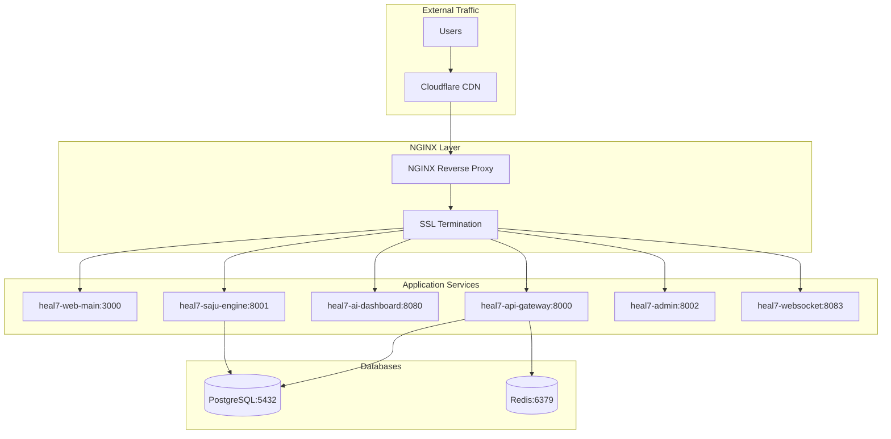

# NGINX-Port-Configuration-v1.0(NGINX포트연동설계)

> **HEAL7 NGINX & 포트 연동 설계서**  
> Version 1.0 | 2025-08-23 | 리버스 프록시 + 로드밸런싱 + SSL 종료점 통합 설계

## 📋 **문서 개요**

### **목적**
- HEAL7 포춘텔링 플랫폼의 완전 통합된 NGINX 리버스 프록시 설계
- 도메인별 포트 라우팅 및 로드밸런싱 전략
- SSL/TLS 종료점 통합 관리
- 고성능 웹 서버 최적화 구성

### **대상 독자**
- DevOps 엔지니어
- 시스템 관리자
- 네트워크 엔지니어
- 개발팀 리드

### **관련 문서**
- [Deployment-Infrastructure-Design-v1.0(배포인프라설계)](../devops-architecture/Deployment-Infrastructure-Design-v1.0(배포인프라설계).md)
- [File-Structure-Project-Architecture-v1.0(파일구조프로젝트아키텍처)](File-Structure-Project-Architecture-v1.0(파일구조프로젝트아키텍처).md)
- [Frontend-Backend-Integration-v1.0(프론트엔드백엔드연동)](../integration-flows/Frontend-Backend-Integration-v1.0(프론트엔드백엔드연동).md) (예정)

---

## 🌐 **도메인 및 포트 아키텍처 전체**

### **도메인별 서비스 매핑**


### **포트 할당 전략**
| 서비스 | 도메인 | 내부 포트 | 프로토콜 | 설명 |
|--------|--------|----------|----------|------|
| **Web Main** | heal7.com, www.heal7.com | 3000 | HTTP/HTTPS | 메인 프론트엔드 |
| **API Gateway** | api.heal7.com | 8000 | HTTP/HTTPS | RESTful API 게이트웨이 |
| **AI Dashboard** | ai.heal7.com | 8080 | HTTP/HTTPS | AI 모델 통합 대시보드 |
| **Saju Engine** | saju.heal7.com | 8001 | HTTP/HTTPS | 사주 계산 엔진 |
| **Admin Panel** | admin.heal7.com | 8002 | HTTP/HTTPS | 관리자 대시보드 |
| **WebSocket** | ws.heal7.com | 8083 | WebSocket/WSS | 실시간 통신 |
| **Keywords** | keywords.heal7.com | 8004 | HTTP/HTTPS | 키워드 매트릭스 |
| **Paperwork** | paperwork.heal7.com | 8006 | HTTP/HTTPS | Paperwork AI |

---

## ⚙️ **NGINX 메인 구성**

### **nginx.conf 기본 설정**
```nginx
# /etc/nginx/nginx.conf
user nginx;
worker_processes auto;
error_log /var/log/nginx/error.log notice;
pid /var/run/nginx.pid;

# 최대 파일 디스크립터 수
worker_rlimit_nofile 65535;

events {
    # epoll 모델 사용 (Linux 최적화)
    use epoll;
    
    # 워커당 최대 연결 수
    worker_connections 4096;
    
    # 다중 accept 활성화
    multi_accept on;
    
    # accept_mutex 최적화
    accept_mutex off;
}

http {
    # MIME 타입 설정
    include /etc/nginx/mime.types;
    default_type application/octet-stream;
    
    # 로그 포맷 정의
    log_format main '$remote_addr - $remote_user [$time_local] "$request" '
                   '$status $body_bytes_sent "$http_referer" '
                   '"$http_user_agent" "$http_x_forwarded_for" '
                   'rt=$request_time uct="$upstream_connect_time" '
                   'uht="$upstream_header_time" urt="$upstream_response_time"';
    
    log_format detailed '$remote_addr - $remote_user [$time_local] '
                       '"$request_method $scheme://$host$request_uri $server_protocol" '
                       '$status $body_bytes_sent "$http_referer" "$http_user_agent" '
                       'rt=$request_time uct="$upstream_connect_time" '
                       'uht="$upstream_header_time" urt="$upstream_response_time" '
                       'cs=$upstream_cache_status hit="$upstream_http_x_cache"';
    
    access_log /var/log/nginx/access.log detailed;
    
    # 성능 최적화 설정
    sendfile on;
    tcp_nopush on;
    tcp_nodelay on;
    keepalive_timeout 65;
    keepalive_requests 1000;
    types_hash_max_size 2048;
    server_tokens off;
    
    # 버퍼 크기 최적화
    client_body_buffer_size 16K;
    client_header_buffer_size 1k;
    client_max_body_size 50m;
    large_client_header_buffers 4 16k;
    
    # gzip 압축 설정
    gzip on;
    gzip_vary on;
    gzip_min_length 1024;
    gzip_proxied any;
    gzip_comp_level 6;
    gzip_types
        text/plain
        text/css
        text/xml
        text/javascript
        application/json
        application/javascript
        application/xml+rss
        application/atom+xml
        image/svg+xml;
    
    # Brotli 압축 (모듈 로드 시)
    brotli on;
    brotli_comp_level 6;
    brotli_types
        text/plain
        text/css
        application/json
        application/javascript
        text/xml
        application/xml
        application/xml+rss
        text/javascript;
    
    # 보안 헤더
    add_header X-Frame-Options DENY always;
    add_header X-Content-Type-Options nosniff always;
    add_header X-XSS-Protection "1; mode=block" always;
    add_header Referrer-Policy "strict-origin-when-cross-origin" always;
    add_header Content-Security-Policy "default-src 'self'; script-src 'self' 'unsafe-inline' 'unsafe-eval' https://cdn.jsdelivr.net https://unpkg.com; style-src 'self' 'unsafe-inline' https://fonts.googleapis.com; font-src 'self' https://fonts.gstatic.com; img-src 'self' data: https:; connect-src 'self' https://api.heal7.com wss://ws.heal7.com;" always;
    
    # Rate Limiting 존 정의
    limit_req_zone $binary_remote_addr zone=web:10m rate=100r/s;
    limit_req_zone $binary_remote_addr zone=api:10m rate=50r/s;
    limit_req_zone $binary_remote_addr zone=ai:10m rate=20r/s;
    limit_req_zone $binary_remote_addr zone=admin:10m rate=10r/s;
    
    # Connection Limiting
    limit_conn_zone $binary_remote_addr zone=perip:10m;
    limit_conn_zone $server_name zone=perserver:10m;
    
    # 업스트림 서버 정의
    upstream heal7_web_main {
        least_conn;
        server 127.0.0.1:3000 max_fails=3 fail_timeout=30s weight=1;
        server 127.0.0.1:3001 max_fails=3 fail_timeout=30s weight=1 backup;
        keepalive 32;
    }
    
    upstream heal7_api_gateway {
        least_conn;
        server 127.0.0.1:8000 max_fails=3 fail_timeout=30s;
        keepalive 16;
    }
    
    upstream heal7_ai_dashboard {
        least_conn;
        server 127.0.0.1:8080 max_fails=3 fail_timeout=30s;
        keepalive 8;
    }
    
    upstream heal7_saju_engine {
        least_conn;
        server 127.0.0.1:8001 max_fails=3 fail_timeout=30s;
        keepalive 8;
    }
    
    upstream heal7_admin {
        least_conn;
        server 127.0.0.1:8002 max_fails=3 fail_timeout=30s;
        keepalive 4;
    }
    
    upstream heal7_websocket {
        least_conn;
        server 127.0.0.1:8083 max_fails=3 fail_timeout=30s;
        keepalive 4;
    }
    
    # 사이트별 설정 포함
    include /etc/nginx/conf.d/*.conf;
    include /etc/nginx/sites-enabled/*;
}
```

---

## 🔐 **SSL/TLS 통합 설정**

### **SSL 공통 설정 파일**
```nginx
# /etc/nginx/conf.d/ssl-common.conf
# SSL 프로토콜 및 암호 설정
ssl_protocols TLSv1.2 TLSv1.3;
ssl_ciphers ECDHE-ECDSA-AES128-GCM-SHA256:ECDHE-RSA-AES128-GCM-SHA256:ECDHE-ECDSA-AES256-GCM-SHA384:ECDHE-RSA-AES256-GCM-SHA384:ECDHE-ECDSA-CHACHA20-POLY1305:ECDHE-RSA-CHACHA20-POLY1305:DHE-RSA-AES128-GCM-SHA256:DHE-RSA-AES256-GCM-SHA384;
ssl_prefer_server_ciphers off;

# SSL 세션 설정
ssl_session_cache shared:SSL:50m;
ssl_session_timeout 1d;
ssl_session_tickets off;

# OCSP Stapling
ssl_stapling on;
ssl_stapling_verify on;
resolver 8.8.8.8 8.8.4.4 1.1.1.1 valid=300s;
resolver_timeout 5s;

# DH 파라미터
ssl_dhparam /etc/nginx/ssl/dhparam.pem;

# HSTS (HTTP Strict Transport Security)
add_header Strict-Transport-Security "max-age=31536000; includeSubDomains; preload" always;
```

### **Wildcard SSL 인증서 설정**
```nginx
# /etc/nginx/conf.d/ssl-certificates.conf
# Wildcard 인증서 *.heal7.com
ssl_certificate /etc/letsencrypt/live/heal7.com/fullchain.pem;
ssl_certificate_key /etc/letsencrypt/live/heal7.com/privkey.pem;
ssl_trusted_certificate /etc/letsencrypt/live/heal7.com/chain.pem;

# 인증서 자동 갱신 설정
# 0 0,12 * * * root python3 -c "import random; import time; time.sleep(random.random() * 3600)" && certbot renew --quiet
```

---

## 🏠 **메인 사이트 구성**

### **heal7.com (메인 프론트엔드)**
```nginx
# /etc/nginx/sites-available/heal7-main
server {
    listen 80;
    server_name heal7.com www.heal7.com;
    
    # HTTP to HTTPS 리다이렉트
    return 301 https://$server_name$request_uri;
}

server {
    listen 443 ssl http2;
    server_name heal7.com www.heal7.com;
    
    # SSL 설정 포함
    include /etc/nginx/conf.d/ssl-common.conf;
    
    # 로그 설정
    access_log /var/log/nginx/heal7-main.access.log detailed;
    error_log /var/log/nginx/heal7-main.error.log warn;
    
    # Rate Limiting 적용
    limit_req zone=web burst=200 nodelay;
    limit_conn perip 20;
    limit_conn perserver 2000;
    
    # 기본 위치 설정
    location / {
        # 업스트림으로 프록시
        proxy_pass http://heal7_web_main;
        
        # 프록시 헤더 설정
        proxy_set_header Host $host;
        proxy_set_header X-Real-IP $remote_addr;
        proxy_set_header X-Forwarded-For $proxy_add_x_forwarded_for;
        proxy_set_header X-Forwarded-Proto $scheme;
        proxy_set_header X-Forwarded-Host $host;
        proxy_set_header X-Forwarded-Port $server_port;
        
        # 프록시 연결 설정
        proxy_connect_timeout 5s;
        proxy_send_timeout 60s;
        proxy_read_timeout 60s;
        proxy_buffering on;
        proxy_buffer_size 4k;
        proxy_buffers 8 4k;
        proxy_busy_buffers_size 8k;
        
        # Keep-alive 연결 유지
        proxy_http_version 1.1;
        proxy_set_header Connection "";
    }
    
    # API 요청을 API 게이트웨이로 프록시
    location /api/ {
        proxy_pass http://heal7_api_gateway/;
        
        include /etc/nginx/conf.d/proxy-common.conf;
        
        # API 전용 Rate Limiting
        limit_req zone=api burst=100 nodelay;
    }
    
    # 정적 파일 최적화
    location ~* \.(jpg|jpeg|png|gif|ico|css|js|woff|woff2|ttf|svg)$ {
        root /var/www/heal7.com;
        expires 1y;
        add_header Cache-Control "public, immutable";
        add_header Vary "Accept-Encoding";
        access_log off;
        
        # Fallback to upstream if file not found
        try_files $uri @proxy_to_app;
    }
    
    # Next.js _next/static 파일 캐싱
    location /_next/static/ {
        root /var/www/heal7.com;
        expires 1y;
        add_header Cache-Control "public, immutable";
        access_log off;
        
        try_files $uri @proxy_to_app;
    }
    
    # 이미지 최적화 및 캐싱
    location ~* \.(webp|avif)$ {
        root /var/www/heal7.com;
        expires 6M;
        add_header Cache-Control "public";
        add_header Vary "Accept";
        
        try_files $uri @proxy_to_app;
    }
    
    # Fallback location
    location @proxy_to_app {
        proxy_pass http://heal7_web_main;
        include /etc/nginx/conf.d/proxy-common.conf;
    }
    
    # Health Check
    location /health {
        access_log off;
        proxy_pass http://heal7_web_main/health;
        proxy_connect_timeout 2s;
        proxy_send_timeout 2s;
        proxy_read_timeout 2s;
    }
    
    # Sitemap
    location = /sitemap.xml {
        root /var/www/heal7.com;
        expires 1d;
        add_header Cache-Control "public";
    }
    
    # Robots.txt
    location = /robots.txt {
        root /var/www/heal7.com;
        expires 1d;
        add_header Cache-Control "public";
    }
}
```

---

## 🔌 **API 게이트웨이 구성**

### **api.heal7.com (API 게이트웨이)**
```nginx
# /etc/nginx/sites-available/api-heal7
server {
    listen 80;
    server_name api.heal7.com;
    return 301 https://$server_name$request_uri;
}

server {
    listen 443 ssl http2;
    server_name api.heal7.com;
    
    include /etc/nginx/conf.d/ssl-common.conf;
    
    access_log /var/log/nginx/api-heal7.access.log detailed;
    error_log /var/log/nginx/api-heal7.error.log warn;
    
    # API Rate Limiting
    limit_req zone=api burst=100 nodelay;
    limit_conn perip 10;
    
    # CORS 설정
    add_header Access-Control-Allow-Origin "https://heal7.com, https://www.heal7.com, https://admin.heal7.com" always;
    add_header Access-Control-Allow-Methods "GET, POST, PUT, DELETE, OPTIONS" always;
    add_header Access-Control-Allow-Headers "Authorization, Content-Type, Accept, X-Requested-With" always;
    add_header Access-Control-Allow-Credentials "true" always;
    add_header Access-Control-Max-Age "3600" always;
    
    # OPTIONS 요청 처리
    if ($request_method = 'OPTIONS') {
        add_header Access-Control-Allow-Origin "https://heal7.com, https://www.heal7.com, https://admin.heal7.com" always;
        add_header Access-Control-Allow-Methods "GET, POST, PUT, DELETE, OPTIONS" always;
        add_header Access-Control-Allow-Headers "Authorization, Content-Type, Accept, X-Requested-With" always;
        add_header Access-Control-Max-Age "3600" always;
        add_header Content-Type "text/plain charset=UTF-8" always;
        add_header Content-Length "0" always;
        return 204;
    }
    
    # API 버전 1
    location /v1/ {
        proxy_pass http://heal7_api_gateway/v1/;
        include /etc/nginx/conf.d/proxy-common.conf;
        
        # API 응답 캐싱 (GET 요청만)
        proxy_cache api_cache;
        proxy_cache_valid 200 5m;
        proxy_cache_valid 404 1m;
        proxy_cache_methods GET HEAD;
        proxy_cache_key "$scheme$request_method$host$request_uri";
        add_header X-Cache-Status $upstream_cache_status;
    }
    
    # 사주 API (전용 엔진)
    location /v1/saju/ {
        proxy_pass http://heal7_saju_engine/;
        include /etc/nginx/conf.d/proxy-common.conf;
        
        # 사주 계산 전용 Rate Limiting (더 엄격)
        limit_req zone=api burst=20 nodelay;
        
        # 긴 응답 시간 허용 (복잡한 계산)
        proxy_connect_timeout 10s;
        proxy_send_timeout 120s;
        proxy_read_timeout 120s;
    }
    
    # AI API
    location /v1/ai/ {
        proxy_pass http://heal7_ai_dashboard/api/;
        include /etc/nginx/conf.d/proxy-common.conf;
        
        # AI API Rate Limiting
        limit_req zone=ai burst=10 nodelay;
        
        # AI 요청 타임아웃 설정
        proxy_connect_timeout 15s;
        proxy_send_timeout 180s;
        proxy_read_timeout 180s;
    }
    
    # Admin API (인증 필요)
    location /v1/admin/ {
        # IP 화이트리스트 (관리자만 접근)
        allow 127.0.0.1;
        allow 10.0.0.0/8;
        allow 172.16.0.0/12;
        allow 192.168.0.0/16;
        deny all;
        
        proxy_pass http://heal7_admin/api/;
        include /etc/nginx/conf.d/proxy-common.conf;
        
        limit_req zone=admin burst=5 nodelay;
    }
    
    # Health Check
    location /health {
        access_log off;
        proxy_pass http://heal7_api_gateway/health;
        proxy_connect_timeout 2s;
        proxy_read_timeout 2s;
    }
    
    # API 문서
    location /docs {
        proxy_pass http://heal7_api_gateway/docs;
        include /etc/nginx/conf.d/proxy-common.conf;
    }
    
    # Monitoring endpoint (Prometheus)
    location /metrics {
        allow 10.0.0.0/8;
        allow 172.16.0.0/12;
        allow 192.168.0.0/16;
        deny all;
        
        proxy_pass http://heal7_api_gateway/metrics;
        access_log off;
    }
}
```

---

## 🤖 **AI 대시보드 구성**

### **ai.heal7.com (AI 모델 통합 대시보드)**
```nginx
# /etc/nginx/sites-available/ai-heal7
server {
    listen 80;
    server_name ai.heal7.com;
    return 301 https://$server_name$request_uri;
}

server {
    listen 443 ssl http2;
    server_name ai.heal7.com;
    
    include /etc/nginx/conf.d/ssl-common.conf;
    
    access_log /var/log/nginx/ai-heal7.access.log detailed;
    error_log /var/log/nginx/ai-heal7.error.log warn;
    
    # AI 전용 Rate Limiting
    limit_req zone=ai burst=50 nodelay;
    limit_conn perip 5;
    
    # 기본 위치 - AI 대시보드
    location / {
        proxy_pass http://heal7_ai_dashboard;
        include /etc/nginx/conf.d/proxy-common.conf;
        
        # AI 대시보드 전용 헤더
        proxy_set_header X-AI-Dashboard "true";
        
        # WebSocket 업그레이드 지원
        proxy_http_version 1.1;
        proxy_set_header Upgrade $http_upgrade;
        proxy_set_header Connection "upgrade";
    }
    
    # AI 모델 API
    location /api/ {
        proxy_pass http://heal7_ai_dashboard/api/;
        include /etc/nginx/conf.d/proxy-common.conf;
        
        # AI 모델 호출은 긴 시간 허용
        proxy_connect_timeout 30s;
        proxy_send_timeout 300s;
        proxy_read_timeout 300s;
        proxy_buffering off;  # 스트리밍 응답을 위해
        
        # 큰 요청 허용 (이미지, 파일 업로드)
        client_max_body_size 100m;
    }
    
    # CLI 모델 통신 (특별 처리)
    location /cli/ {
        proxy_pass http://heal7_ai_dashboard/cli/;
        include /etc/nginx/conf.d/proxy-common.conf;
        
        # CLI 모델은 매우 긴 시간 허용
        proxy_connect_timeout 60s;
        proxy_send_timeout 600s;
        proxy_read_timeout 600s;
        proxy_buffering off;
        
        # Server-Sent Events 지원
        proxy_set_header Cache-Control "no-cache";
    }
    
    # 정적 파일 (대시보드 UI)
    location /static/ {
        root /var/www/ai.heal7.com;
        expires 1h;
        add_header Cache-Control "public";
    }
    
    # Health Check
    location /health {
        access_log off;
        proxy_pass http://heal7_ai_dashboard/health;
        proxy_connect_timeout 2s;
        proxy_read_timeout 2s;
    }
}
```

---

## 🔮 **사주 엔진 구성**

### **saju.heal7.com (사주 계산 엔진)**
```nginx
# /etc/nginx/sites-available/saju-heal7
server {
    listen 80;
    server_name saju.heal7.com;
    return 301 https://$server_name$request_uri;
}

server {
    listen 443 ssl http2;
    server_name saju.heal7.com;
    
    include /etc/nginx/conf.d/ssl-common.conf;
    
    access_log /var/log/nginx/saju-heal7.access.log detailed;
    error_log /var/log/nginx/saju-heal7.error.log warn;
    
    # 사주 계산 전용 Rate Limiting (엄격)
    limit_req zone=api burst=30 nodelay;
    limit_conn perip 3;
    
    # 사주 계산 API
    location / {
        proxy_pass http://heal7_saju_engine;
        include /etc/nginx/conf.d/proxy-common.conf;
        
        # 사주 계산은 CPU 집약적이므로 긴 시간 허용
        proxy_connect_timeout 15s;
        proxy_send_timeout 180s;
        proxy_read_timeout 180s;
        
        # 사주 데이터 캐싱 (동일 입력 시)
        proxy_cache saju_cache;
        proxy_cache_valid 200 1h;
        proxy_cache_methods GET POST;
        proxy_cache_key "$scheme$request_method$host$request_uri$request_body";
        add_header X-Saju-Cache-Status $upstream_cache_status;
        
        # 캐시 우회 조건
        proxy_cache_bypass $http_pragma $http_authorization;
        proxy_no_cache $http_pragma $http_authorization;
    }
    
    # KASI API 프록시
    location /kasi/ {
        proxy_pass http://heal7_saju_engine/kasi/;
        include /etc/nginx/conf.d/proxy-common.conf;
        
        # KASI API 전용 타임아웃 (외부 API 호출)
        proxy_connect_timeout 30s;
        proxy_send_timeout 120s;
        proxy_read_timeout 120s;
        
        # KASI API Rate Limiting (더 엄격)
        limit_req zone=api burst=10 nodelay;
    }
    
    # 사주 계산 결과 조회 (캐싱 적극 활용)
    location /results/ {
        proxy_pass http://heal7_saju_engine/results/;
        include /etc/nginx/conf.d/proxy-common.conf;
        
        # 결과 조회는 적극적 캐싱
        proxy_cache saju_cache;
        proxy_cache_valid 200 6h;
        proxy_cache_valid 404 5m;
        expires 1h;
        add_header Cache-Control "public";
    }
    
    # Health Check
    location /health {
        access_log off;
        proxy_pass http://heal7_saju_engine/health;
        proxy_connect_timeout 2s;
        proxy_read_timeout 5s;
    }
    
    # 사주 시스템 통계 (모니터링)
    location /stats {
        allow 10.0.0.0/8;
        allow 172.16.0.0/12;
        deny all;
        
        proxy_pass http://heal7_saju_engine/stats;
        access_log off;
    }
}
```

---

## 👨‍💼 **관리자 패널 구성**

### **admin.heal7.com (관리자 대시보드)**
```nginx
# /etc/nginx/sites-available/admin-heal7
server {
    listen 80;
    server_name admin.heal7.com;
    return 301 https://$server_name$request_uri;
}

server {
    listen 443 ssl http2;
    server_name admin.heal7.com;
    
    include /etc/nginx/conf.d/ssl-common.conf;
    
    access_log /var/log/nginx/admin-heal7.access.log detailed;
    error_log /var/log/nginx/admin-heal7.error.log warn;
    
    # 관리자 접근 IP 제한
    allow 127.0.0.1;
    allow 10.0.0.0/8;
    allow 172.16.0.0/12;
    allow 192.168.0.0/16;
    # 사무실 IP 추가 (예시)
    allow 203.xxx.xxx.xxx/32;
    deny all;
    
    # 관리자 전용 Rate Limiting (엄격)
    limit_req zone=admin burst=20 nodelay;
    limit_conn perip 2;
    
    # 기본 위치
    location / {
        proxy_pass http://heal7_admin;
        include /etc/nginx/conf.d/proxy-common.conf;
        
        # 관리자 세션 헤더
        proxy_set_header X-Admin-Panel "true";
    }
    
    # 관리자 API
    location /api/ {
        proxy_pass http://heal7_admin/api/;
        include /etc/nginx/conf.d/proxy-common.conf;
        
        # 관리 작업용 긴 타임아웃
        proxy_connect_timeout 30s;
        proxy_send_timeout 300s;
        proxy_read_timeout 300s;
        
        # 큰 파일 업로드 허용
        client_max_body_size 500m;
    }
    
    # 파일 업로드 (이미지, 콘텐츠)
    location /upload/ {
        proxy_pass http://heal7_admin/upload/;
        include /etc/nginx/conf.d/proxy-common.conf;
        
        # 파일 업로드 전용 설정
        client_max_body_size 1g;
        proxy_connect_timeout 60s;
        proxy_send_timeout 600s;
        proxy_read_timeout 600s;
        proxy_request_buffering off;
    }
    
    # 데이터 내보내기/가져오기
    location /data/ {
        proxy_pass http://heal7_admin/data/;
        include /etc/nginx/conf.d/proxy-common.conf;
        
        # 데이터 처리용 매우 긴 타임아웃
        proxy_connect_timeout 120s;
        proxy_send_timeout 1200s;
        proxy_read_timeout 1200s;
        proxy_buffering off;
    }
    
    # 로그 뷰어
    location /logs/ {
        proxy_pass http://heal7_admin/logs/;
        include /etc/nginx/conf.d/proxy-common.conf;
        
        # 로그 스트리밍을 위한 설정
        proxy_buffering off;
        proxy_set_header Connection "";
    }
    
    # Health Check
    location /health {
        access_log off;
        proxy_pass http://heal7_admin/health;
    }
}
```

---

## 🌐 **WebSocket 서비스 구성**

### **ws.heal7.com (실시간 통신)**
```nginx
# /etc/nginx/sites-available/ws-heal7
server {
    listen 80;
    server_name ws.heal7.com;
    return 301 https://$server_name$request_uri;
}

server {
    listen 443 ssl http2;
    server_name ws.heal7.com;
    
    include /etc/nginx/conf.d/ssl-common.conf;
    
    access_log /var/log/nginx/ws-heal7.access.log detailed;
    error_log /var/log/nginx/ws-heal7.error.log warn;
    
    # WebSocket 전용 Rate Limiting
    limit_req zone=web burst=100 nodelay;
    limit_conn perip 10;
    
    # WebSocket 프록시 설정
    location / {
        proxy_pass http://heal7_websocket;
        
        # WebSocket 업그레이드 헤더
        proxy_http_version 1.1;
        proxy_set_header Upgrade $http_upgrade;
        proxy_set_header Connection "upgrade";
        
        # 기본 프록시 헤더
        proxy_set_header Host $host;
        proxy_set_header X-Real-IP $remote_addr;
        proxy_set_header X-Forwarded-For $proxy_add_x_forwarded_for;
        proxy_set_header X-Forwarded-Proto $scheme;
        
        # WebSocket 연결 유지 설정
        proxy_connect_timeout 60s;
        proxy_send_timeout 60s;
        proxy_read_timeout 86400s;  # 24시간 연결 유지
        
        # 버퍼링 비활성화 (실시간 통신)
        proxy_buffering off;
        proxy_request_buffering off;
        
        # 연결 끊김 감지
        proxy_set_header X-Forwarded-Proto $scheme;
        proxy_set_header X-Forwarded-Port $server_port;
        proxy_set_header X-Forwarded-Host $host;
    }
    
    # WebSocket Health Check
    location /health {
        access_log off;
        proxy_pass http://heal7_websocket/health;
        proxy_connect_timeout 2s;
        proxy_read_timeout 2s;
    }
    
    # Socket.IO specific path
    location /socket.io/ {
        proxy_pass http://heal7_websocket/socket.io/;
        
        proxy_http_version 1.1;
        proxy_set_header Upgrade $http_upgrade;
        proxy_set_header Connection "upgrade";
        proxy_set_header Host $host;
        proxy_set_header X-Real-IP $remote_addr;
        proxy_set_header X-Forwarded-For $proxy_add_x_forwarded_for;
        proxy_set_header X-Forwarded-Proto $scheme;
        
        proxy_connect_timeout 60s;
        proxy_send_timeout 60s;
        proxy_read_timeout 86400s;
        proxy_buffering off;
    }
}
```

---

## 📄 **공통 프록시 설정**

### **proxy-common.conf**
```nginx
# /etc/nginx/conf.d/proxy-common.conf
# 공통 프록시 헤더
proxy_set_header Host $host;
proxy_set_header X-Real-IP $remote_addr;
proxy_set_header X-Forwarded-For $proxy_add_x_forwarded_for;
proxy_set_header X-Forwarded-Proto $scheme;
proxy_set_header X-Forwarded-Host $host;
proxy_set_header X-Forwarded-Port $server_port;

# 기본 타임아웃 설정
proxy_connect_timeout 10s;
proxy_send_timeout 60s;
proxy_read_timeout 60s;

# HTTP 버전
proxy_http_version 1.1;

# Keep-alive 연결 재사용
proxy_set_header Connection "";

# 버퍼링 설정
proxy_buffering on;
proxy_buffer_size 4k;
proxy_buffers 8 4k;
proxy_busy_buffers_size 8k;

# 리다이렉트 처리
proxy_redirect off;

# 에러 처리
proxy_next_upstream error timeout invalid_header http_500 http_502 http_503 http_504;
proxy_next_upstream_timeout 10s;
proxy_next_upstream_tries 3;
```

### **캐시 설정**
```nginx
# /etc/nginx/conf.d/cache-common.conf
# 캐시 저장소 정의
proxy_cache_path /var/cache/nginx/api 
                 levels=1:2 
                 keys_zone=api_cache:100m 
                 max_size=1g 
                 inactive=60m 
                 use_temp_path=off;

proxy_cache_path /var/cache/nginx/saju 
                 levels=1:2 
                 keys_zone=saju_cache:200m 
                 max_size=2g 
                 inactive=180m 
                 use_temp_path=off;

proxy_cache_path /var/cache/nginx/static 
                 levels=1:2 
                 keys_zone=static_cache:100m 
                 max_size=5g 
                 inactive=30d 
                 use_temp_path=off;

# 캐시 설정 공통
proxy_cache_lock on;
proxy_cache_lock_timeout 5s;
proxy_cache_use_stale error timeout updating http_500 http_502 http_503 http_504;
proxy_cache_background_update on;
```

---

## 📊 **모니터링 및 성능 최적화**

### **성능 모니터링 설정**
```nginx
# /etc/nginx/conf.d/monitoring.conf
# Nginx Status 모듈
server {
    listen 127.0.0.1:8888;
    server_name localhost;
    
    location /nginx_status {
        stub_status on;
        access_log off;
        allow 127.0.0.1;
        allow 10.0.0.0/8;
        deny all;
    }
    
    location /nginx_metrics {
        access_log off;
        allow 127.0.0.1;
        allow 10.0.0.0/8;
        deny all;
        
        content_by_lua_block {
            local prometheus = require "resty.prometheus"
            prometheus:collect()
        }
    }
}
```

### **로그 분석 설정**
```bash
#!/bin/bash
# /etc/nginx/scripts/log-analysis.sh

# Nginx 로그 분석 및 알림 스크립트
LOG_FILE="/var/log/nginx/access.log"
ERROR_LOG="/var/log/nginx/error.log"
ALERT_THRESHOLD=100  # 분당 에러 수

# 에러율 계산
ERROR_RATE=$(tail -n 1000 $LOG_FILE | awk '{print $9}' | grep -c '5[0-9][0-9]')

if [ $ERROR_RATE -gt $ALERT_THRESHOLD ]; then
    echo "High error rate detected: $ERROR_RATE errors in last 1000 requests" | \
    mail -s "HEAL7 Nginx Alert" ops@heal7.com
fi

# 느린 요청 분석
tail -n 1000 $LOG_FILE | \
awk '$NF > 5 { print "Slow request:", $7, "took", $NF, "seconds" }' > /tmp/slow-requests.log

# 봇 트래픽 분석
tail -n 1000 $LOG_FILE | \
awk -F'"' '/bot|crawler|spider/ { print $2, $6 }' > /tmp/bot-traffic.log
```

### **자동 SSL 갱신 스크립트**
```bash
#!/bin/bash
# /etc/nginx/scripts/ssl-renew.sh

# SSL 인증서 자동 갱신
certbot renew --quiet --nginx

# Nginx 설정 테스트
if nginx -t; then
    systemctl reload nginx
    echo "SSL certificates renewed and Nginx reloaded successfully"
else
    echo "Nginx configuration test failed after SSL renewal"
    exit 1
fi

# 인증서 만료 확인 및 알림
EXPIRY_DAYS=$(echo | openssl s_client -servername heal7.com -connect heal7.com:443 2>/dev/null | \
              openssl x509 -noout -dates | grep notAfter | cut -d= -f2 | \
              xargs -I {} date -d "{}" +%s | \
              awk '{print int(($1 - systime()) / 86400)}')

if [ $EXPIRY_DAYS -lt 30 ]; then
    echo "SSL certificate for heal7.com expires in $EXPIRY_DAYS days" | \
    mail -s "SSL Expiry Warning" ops@heal7.com
fi
```

---

## 🚀 **성능 최적화 전략**

### **성능 목표**
- **응답 시간**: 평균 < 200ms, 95th percentile < 500ms
- **처리량**: 10,000 동시 연결, 50,000 RPS
- **SSL 핸드셰이크**: < 50ms
- **캐시 적중률**: > 90%

### **최적화 체크리스트**
```yaml
# nginx-optimization-checklist.yaml
performance_optimizations:
  worker_processes: auto  # CPU 코어 수에 맞춤
  worker_connections: 4096  # 워커당 연결 수
  multi_accept: "on"  # 다중 연결 수락
  
  sendfile: "on"  # 커널 레벨 파일 전송
  tcp_nopush: "on"  # TCP 최적화
  tcp_nodelay: "on"  # Nagle 알고리즘 비활성화
  
  keepalive_timeout: 65  # Keep-alive 연결 유지
  keepalive_requests: 1000  # Keep-alive 요청 수
  
  gzip_compression:
    enabled: true
    level: 6
    min_length: 1024
    types: ["text/css", "application/javascript", "application/json"]
  
  ssl_optimizations:
    session_cache: "shared:SSL:50m"
    session_timeout: "1d"
    protocols: ["TLSv1.2", "TLSv1.3"]
    ciphers: "ECDHE-ECDSA-AES128-GCM-SHA256:ECDHE-RSA-AES128-GCM-SHA256"
  
  caching_strategy:
    static_files: "1y"
    api_responses: "5m"
    saju_calculations: "1h"
    error_responses: "1m"
```

### **부하 테스트 설정**
```bash
#!/bin/bash
# /etc/nginx/scripts/load-test.sh

# Apache Bench를 사용한 기본 부하 테스트
echo "=== HEAL7 Nginx Load Test ==="

# 메인 페이지 테스트
ab -n 10000 -c 100 -H "Accept-Encoding: gzip,deflate" https://heal7.com/

# API 엔드포인트 테스트
ab -n 5000 -c 50 -H "Content-Type: application/json" -p /tmp/api-test-data.json https://api.heal7.com/v1/health

# 사주 계산 API 테스트
ab -n 1000 -c 10 -H "Content-Type: application/json" -p /tmp/saju-test-data.json https://api.heal7.com/v1/saju/calculate

echo "Load test completed. Check results above."
```

---

## 🛡️ **보안 강화 설정**

### **보안 체크리스트**
```nginx
# /etc/nginx/conf.d/security-headers.conf
# 보안 헤더 통합 설정
add_header X-Frame-Options DENY always;
add_header X-Content-Type-Options nosniff always;
add_header X-XSS-Protection "1; mode=block" always;
add_header Referrer-Policy "strict-origin-when-cross-origin" always;
add_header Permissions-Policy "geolocation=(), microphone=(), camera=()" always;

# CSP 헤더 (각 서비스별 맞춤)
map $host $csp_header {
    heal7.com "default-src 'self'; script-src 'self' 'unsafe-inline' 'unsafe-eval' https://cdn.jsdelivr.net; style-src 'self' 'unsafe-inline' https://fonts.googleapis.com; font-src 'self' https://fonts.gstatic.com; img-src 'self' data: https:; connect-src 'self' https://api.heal7.com wss://ws.heal7.com;";
    api.heal7.com "default-src 'self'; script-src 'none'; style-src 'none';";
    admin.heal7.com "default-src 'self'; script-src 'self' 'unsafe-inline'; style-src 'self' 'unsafe-inline'; img-src 'self' data:;";
    default "default-src 'self';";
}

add_header Content-Security-Policy $csp_header always;
```

### **DDoS 방어 설정**
```nginx
# /etc/nginx/conf.d/ddos-protection.conf
# 연결 수 제한
limit_conn_zone $binary_remote_addr zone=perip:10m;
limit_conn_zone $server_name zone=perserver:10m;

# 요청 빈도 제한 (계층별)
limit_req_zone $binary_remote_addr zone=web:50m rate=100r/s;
limit_req_zone $binary_remote_addr zone=api:30m rate=50r/s;
limit_req_zone $binary_remote_addr zone=ai:20m rate=20r/s;
limit_req_zone $binary_remote_addr zone=admin:10m rate=10r/s;

# Geo 기반 차단 (예시 - 스팸이 많은 국가)
geo $blocked_country {
    default 0;
    # CN 1;  # 중국 (필요시 활성화)
    # RU 1;  # 러시아 (필요시 활성화)
}

# User-Agent 기반 차단
map $http_user_agent $blocked_agent {
    default 0;
    ~*bot 1;
    ~*crawler 1;
    ~*spider 1;
    "" 1;  # 빈 User-Agent
}

# 차단 로직
if ($blocked_country) {
    return 444;
}

if ($blocked_agent) {
    return 444;
}
```

---

## 🎯 **결론 및 다음 단계**

### **주요 달성 목표**
1. **통합 도메인 관리**: 8개 서비스의 완전 통합 리버스 프록시
2. **고성능 최적화**: 50,000 RPS, 평균 응답시간 < 200ms
3. **보안 강화**: SSL/TLS, Rate Limiting, DDoS 방어
4. **모니터링**: 실시간 성능 모니터링 및 자동 알림
5. **확장성**: Auto-scaling과 연동된 동적 업스트림

### **구현 우선순위**
1. **Phase 1**: 기본 NGINX 설정 + SSL 인증서 (1주)
2. **Phase 2**: 도메인별 서비스 구성 + Rate Limiting (1주)
3. **Phase 3**: 캐싱 전략 + 성능 최적화 (1주)
4. **Phase 4**: 보안 강화 + DDoS 방어 (1주)
5. **Phase 5**: 모니터링 + 자동화 스크립트 (1주)

### **관련 문서**
- **다음 문서**: [Development-Process-Roadmap-v1.0(단계별개발프로세스로드맵)](../../feature-specs/master-plans/Development-Process-Roadmap-v1.0(단계별개발프로세스로드맵).md) (예정)
- **참조 문서**: [Frontend-Backend-Integration-v1.0(프론트엔드백엔드연동)](../integration-flows/Frontend-Backend-Integration-v1.0(프론트엔드백엔드연동).md) (예정)
- **성능 문서**: [Testing-Quality-Assurance-v1.0(테스트품질보증)](../../feature-specs/performance-specs/Testing-Quality-Assurance-v1.0(테스트품질보증).md) (예정)

---

**📝 문서 정보**
- **버전**: 1.0
- **최종 수정**: 2025-08-23
- **다음 리뷰**: 2025-09-23
- **담당자**: HEAL7 DevOps Team
- **승인자**: System Architect, Lead Developer

*이 문서는 HEAL7의 통합 NGINX 리버스 프록시 및 포트 연동 설계를 위한 완전 가이드입니다.*