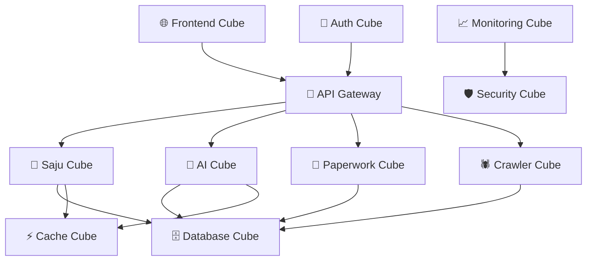

# 서비스별 큐브 구현 v2.0 📦🎯
> **HEAL7 생태계의 큐브 모듈러 아키텍처 실제 구현 가이드**
> 
> **문서 버전**: v2.0 | **최종 업데이트**: 2025-08-20 | **담당**: HEAL7 아키텍처팀

---

## 📋 **문서 개요**

### **목적**
- HEAL7 주요 서비스들의 큐브 모듈러 아키텍처 실제 구현 방안 제시
- 각 서비스별 특화된 큐브 구성과 조립 패턴 정의
- 서비스 간 상호 연동을 위한 큐브 인터페이스 설계
- 실제 코드 레벨에서의 구현 가이드라인 제공

### **범위**
- **대상 서비스**: 사주명리, AI분석, 페이퍼워크, 크롤러, 통합프론트엔드
- **구현 레벨**: 아키텍처 설계 + 코드 구조 + 배포 패턴
- **연동 범위**: 서비스 간 데이터 플로우 + API 게이트웨이 + 공통 리소스

---

## 🎯 **HEAL7 서비스 생태계 큐브 맵**

### **🔮 서비스 큐브 분류 체계**

```
🏗️ HEAL7 큐브 생태계
├── 🔵 Core Service Cubes (핵심 서비스)
│   ├── 🔮 Saju Engine Cube (사주명리 엔진)
│   ├── 🧠 AI Analysis Cube (AI 분석 엔진) 
│   ├── 📄 Paperwork AI Cube (문서 처리)
│   └── 🕷️ Web Crawler Cube (데이터 수집)
│
├── 🟢 Interface Service Cubes (인터페이스)
│   ├── 🌐 Unified Frontend Cube (통합 프론트엔드)
│   ├── 🔗 API Gateway Cube (API 게이트웨이)
│   └── 🔐 Auth Service Cube (인증 서비스)
│
├── 🟡 Data Service Cubes (데이터)
│   ├── 🗄️ Database Cube (PostgreSQL)
│   ├── ⚡ Cache Cube (Redis)
│   └── 📊 Analytics Cube (데이터 분석)
│
└── 🟠 Infrastructure Cubes (인프라)
    ├── 🚀 Deployment Cube (배포 시스템)
    ├── 📈 Monitoring Cube (모니터링)
    └── 🛡️ Security Cube (보안)
```

---

## 🔮 **1. 사주명리 엔진 큐브 (Saju Engine Cube)**

### **📦 큐브 정의**
- **타입**: Core Service Cube (🔵)
- **색상**: Deep Purple (신비로운 명리학)
- **책임**: 사주명리학 계산, 해석, 검증
- **의존성**: KASI API, AI 해석 엔진, 한자-한글 매핑

### **🏗️ 큐브 내부 구조**

```python
# /heal7-project/backend/saju_engines/saju_system/
📦 SajuEngineeCube/
├── 🔧 core/                    # 핵심 엔진
│   ├── calculator.py           # 사주 계산 로직
│   ├── interpreter.py          # 해석 엔진
│   ├── validator.py            # 무결성 검증
│   └── korean_mapping.py       # 한자-한글 매핑
│
├── 🔌 interfaces/              # 외부 인터페이스
│   ├── rest_api.py            # REST API 엔드포인트
│   ├── websocket_api.py       # 실시간 통신
│   └── grpc_service.py        # 마이크로서비스 통신
│
├── 🎯 services/               # 비즈니스 로직
│   ├── fortune_service.py     # 운세 서비스
│   ├── compatibility_service.py # 궁합 서비스
│   └── analysis_service.py    # 분석 서비스
│
├── 🗄️ data/                   # 데이터 계층
│   ├── repositories/          # 데이터 저장소
│   ├── models/               # 데이터 모델
│   └── migrations/           # 스키마 변경
│
└── 🛡️ security/              # 보안 계층
    ├── encryption.py         # 민감정보 암호화
    ├── audit_log.py          # 감사 로그
    └── privacy_filter.py     # 개인정보 필터링
```

### **🔗 큐브 인터페이스 정의**

```python
# SajuCubeInterface
class SajuCubeInterface:
    """사주 엔진 큐브 표준 인터페이스"""
    
    # 🔵 입력 인터페이스
    def calculate_saju(self, birth_info: BirthInfo) -> SajuChart:
        """사주 계산 - 생년월일시 → 사주 차트"""
        
    def interpret_fortune(self, saju_chart: SajuChart) -> FortuneAnalysis:
        """운세 해석 - 사주 차트 → 운세 분석"""
        
    def check_compatibility(self, person1: SajuChart, person2: SajuChart) -> CompatibilityResult:
        """궁합 확인 - 두 사주 → 궁합 결과"""
    
    # 🔵 출력 인터페이스
    def get_daily_fortune(self, user_id: str, date: datetime) -> DailyFortune:
        """일운 조회"""
        
    def get_annual_fortune(self, user_id: str, year: int) -> AnnualFortune:
        """연운 조회"""
    
    # 🔵 설정 인터페이스
    def configure_ai_model(self, model_config: AIModelConfig) -> bool:
        """AI 모델 설정"""
        
    def update_interpretation_rules(self, rules: InterpretationRules) -> bool:
        """해석 규칙 업데이트"""
```

### **⚙️ 큐브 설정 예시**

```yaml
# saju_cube_config.yaml
cube:
  name: "SajuEngineCube"
  version: "5.0.2"
  type: "core_service"
  color: "deep_purple"
  
  # 리소스 할당
  resources:
    memory: "2Gi"
    cpu: "1000m"
    storage: "10Gi"
  
  # 의존성 큐브
  dependencies:
    - name: "DatabaseCube"
      version: ">=1.0.0"
    - name: "CacheCube" 
      version: ">=0.5.0"
    - name: "AICube"
      version: ">=2.0.0"
  
  # 환경 설정
  environment:
    KASI_API_KEY: "${KASI_API_KEY}"
    AI_MODEL_ENDPOINT: "http://ai-cube:8080"
    DATABASE_URL: "postgresql://saju_db:5432"
    REDIS_URL: "redis://cache-cube:6379"
  
  # 인터페이스 설정
  interfaces:
    rest_api:
      port: 8001
      path: "/api/saju"
    grpc:
      port: 9001
    websocket:
      port: 8801
      path: "/ws/saju"
```

---

## 🧠 **2. AI 분석 엔진 큐브 (AI Analysis Cube)**

### **📦 큐브 정의**
- **타입**: Core Service Cube (🔵)
- **색상**: Electric Blue (첨단 AI 기술)
- **책임**: AI 모델 통합, 자연어 처리, 분석 결과 생성
- **의존성**: OpenAI API, Google Gemini, Anthropic Claude

### **🏗️ 큐브 내부 구조**

```python
# /heal7-project/backend/ai_engines/
📦 AIAnalysisCube/
├── 🤖 models/                  # AI 모델 관리
│   ├── openai_client.py       # GPT-4o 클라이언트
│   ├── gemini_client.py       # Google Gemini 클라이언트
│   ├── claude_client.py       # Anthropic Claude 클라이언트
│   └── model_router.py        # 모델 라우팅
│
├── 🔧 processors/             # 처리 엔진
│   ├── text_analyzer.py      # 텍스트 분석
│   ├── sentiment_analyzer.py # 감정 분석
│   ├── personality_analyzer.py # 성격 분석
│   └── report_generator.py   # 리포트 생성
│
├── 🔌 interfaces/             # 외부 인터페이스
│   ├── analysis_api.py       # 분석 API
│   ├── streaming_api.py      # 스트리밍 응답
│   └── batch_api.py          # 배치 처리
│
├── 🎯 services/              # 비즈니스 로직
│   ├── personality_service.py # 성격 분석 서비스
│   ├── psychology_service.py  # 심리 분석 서비스
│   └── coaching_service.py    # 코칭 서비스
│
└── 🛡️ security/             # AI 보안
    ├── prompt_injection_filter.py # 프롬프트 인젝션 방지
    ├── content_filter.py      # 콘텐츠 필터링
    └── rate_limiter.py        # 사용량 제한
```

### **🔗 큐브 인터페이스 정의**

```python
# AICubeInterface
class AICubeInterface:
    """AI 분석 큐브 표준 인터페이스"""
    
    # 🔵 분석 인터페이스
    def analyze_personality(self, user_input: str, context: dict) -> PersonalityAnalysis:
        """성격 분석 - 사용자 입력 → 성격 분석 결과"""
        
    def analyze_psychology(self, responses: List[str]) -> PsychologyReport:
        """심리 분석 - 응답 리스트 → 심리 분석 리포트"""
        
    def generate_coaching(self, analysis: AnalysisResult) -> CoachingPlan:
        """코칭 플랜 생성 - 분석 결과 → 맞춤 코칭"""
    
    # 🔵 스트리밍 인터페이스
    async def stream_analysis(self, request: AnalysisRequest) -> AsyncIterator[AnalysisChunk]:
        """실시간 분석 스트리밍"""
        
    # 🔵 배치 인터페이스
    def batch_analyze(self, requests: List[AnalysisRequest]) -> List[AnalysisResult]:
        """배치 분석 처리"""
    
    # 🔵 모델 관리 인터페이스
    def switch_model(self, model_name: str, config: ModelConfig) -> bool:
        """AI 모델 전환"""
        
    def get_model_status(self) -> ModelStatus:
        """모델 상태 조회"""
```

### **⚙️ 큐브 설정 예시**

```yaml
# ai_cube_config.yaml
cube:
  name: "AIAnalysisCube"
  version: "2.1.0"
  type: "core_service"
  color: "electric_blue"
  
  # 리소스 할당 (GPU 포함)
  resources:
    memory: "8Gi"
    cpu: "2000m"
    gpu: "1"
    storage: "50Gi"
  
  # AI 모델 설정
  ai_models:
    primary: "gpt-4o"
    secondary: "gemini-2.0"
    fallback: "claude-3.5-sonnet"
    
  # API 키 관리
  api_keys:
    openai: "${OPENAI_API_KEY}"
    google: "${GOOGLE_API_KEY}"
    anthropic: "${ANTHROPIC_API_KEY}"
  
  # 사용량 제한
  rate_limits:
    requests_per_minute: 100
    tokens_per_day: 1000000
    cost_limit_per_day: 50.00
  
  # 인터페이스 설정
  interfaces:
    analysis_api:
      port: 8002
      path: "/api/ai"
    streaming_api:
      port: 8802
      path: "/ws/ai-stream"
```

---

## 📄 **3. 페이퍼워크 AI 큐브 (Paperwork AI Cube)**

### **📦 큐브 정의**
- **타입**: Core Service Cube (🔵)
- **색상**: Forest Green (문서 처리)
- **책임**: 문서 처리, OCR, 자동 분류, 정보 추출
- **의존성**: OCR 엔진, AI 분석 큐브, 파일 스토리지

### **🏗️ 큐브 내부 구조**

```python
# /archive/legacy/platforms/paperwork_ai/
📦 PaperworkAICube/
├── 📄 processors/             # 문서 처리
│   ├── ocr_engine.py         # OCR 처리
│   ├── pdf_processor.py      # PDF 처리
│   ├── image_processor.py    # 이미지 처리
│   └── text_extractor.py     # 텍스트 추출
│
├── 🔍 analyzers/             # 분석 엔진
│   ├── document_classifier.py # 문서 분류
│   ├── content_analyzer.py    # 콘텐츠 분석
│   ├── form_recognizer.py     # 양식 인식
│   └── data_extractor.py      # 데이터 추출
│
├── 🔌 interfaces/            # 외부 인터페이스
│   ├── upload_api.py         # 파일 업로드
│   ├── processing_api.py     # 처리 API
│   └── result_api.py         # 결과 조회
│
├── 🗄️ storage/              # 스토리지 관리
│   ├── file_manager.py       # 파일 관리
│   ├── metadata_store.py     # 메타데이터 저장
│   └── backup_manager.py     # 백업 관리
│
└── 🔧 workflows/            # 워크플로우
    ├── processing_pipeline.py # 처리 파이프라인
    ├── quality_checker.py     # 품질 검사
    └── result_formatter.py    # 결과 포맷팅
```

### **🔗 큐브 인터페이스 정의**

```python
# PaperworkCubeInterface
class PaperworkCubeInterface:
    """페이퍼워크 AI 큐브 표준 인터페이스"""
    
    # 🔵 문서 처리 인터페이스
    def process_document(self, file_path: str, options: ProcessingOptions) -> ProcessingResult:
        """문서 처리 - 파일 → 처리 결과"""
        
    def extract_text(self, document: Document) -> ExtractedText:
        """텍스트 추출"""
        
    def classify_document(self, document: Document) -> DocumentClass:
        """문서 분류"""
    
    # 🔵 배치 처리 인터페이스
    def process_batch(self, file_list: List[str]) -> BatchResult:
        """배치 문서 처리"""
        
    # 🔵 결과 조회 인터페이스
    def get_processing_status(self, job_id: str) -> ProcessingStatus:
        """처리 상태 조회"""
        
    def get_result(self, job_id: str) -> ProcessingResult:
        """처리 결과 조회"""
    
    # 🔵 관리 인터페이스
    def cleanup_files(self, older_than: datetime) -> CleanupResult:
        """파일 정리"""
        
    def get_storage_stats(self) -> StorageStats:
        """스토리지 통계"""
```

---

## 🕷️ **4. 웹 크롤러 큐브 (Web Crawler Cube)**

### **📦 큐브 정의**
- **타입**: Core Service Cube (🔵)
- **색상**: Orange Red (데이터 수집)
- **책임**: 웹 데이터 수집, 스크래핑, 데이터 정제
- **의존성**: 프록시 서버, 데이터베이스, 스케줄러

### **🏗️ 큐브 내부 구조**

```python
# /heal7-project/backend/crawlers/
📦 WebCrawlerCube/
├── 🕷️ crawlers/              # 크롤러 엔진
│   ├── web_crawler.py        # 웹 크롤러
│   ├── api_crawler.py        # API 크롤러
│   ├── social_crawler.py     # 소셜미디어 크롤러
│   └── news_crawler.py       # 뉴스 크롤러
│
├── 🔧 processors/            # 데이터 처리
│   ├── html_parser.py        # HTML 파싱
│   ├── data_cleaner.py       # 데이터 정제
│   ├── content_filter.py     # 콘텐츠 필터링
│   └── duplicate_remover.py  # 중복 제거
│
├── 📊 schedulers/            # 스케줄러
│   ├── job_scheduler.py      # 작업 스케줄러
│   ├── retry_manager.py      # 재시도 관리
│   └── rate_limiter.py       # 속도 제한
│
├── 🔌 interfaces/           # 외부 인터페이스
│   ├── crawler_api.py       # 크롤러 API
│   ├── job_management_api.py # 작업 관리
│   └── data_export_api.py   # 데이터 내보내기
│
└── 🛡️ compliance/          # 준수사항
    ├── robots_checker.py    # robots.txt 확인
    ├── rate_controller.py   # 요청 속도 제어
    └── legal_checker.py     # 법적 준수 확인
```

### **🔗 큐브 인터페이스 정의**

```python
# CrawlerCubeInterface
class CrawlerCubeInterface:
    """웹 크롤러 큐브 표준 인터페이스"""
    
    # 🔵 크롤링 인터페이스
    def start_crawling(self, target: CrawlTarget, config: CrawlConfig) -> CrawlJob:
        """크롤링 시작"""
        
    def stop_crawling(self, job_id: str) -> bool:
        """크롤링 중지"""
        
    def schedule_crawling(self, target: CrawlTarget, schedule: CronSchedule) -> ScheduledJob:
        """크롤링 스케줄 등록"""
    
    # 🔵 데이터 조회 인터페이스
    def get_crawled_data(self, job_id: str, filters: DataFilter) -> CrawledData:
        """크롤링 데이터 조회"""
        
    def export_data(self, job_id: str, format: ExportFormat) -> ExportResult:
        """데이터 내보내기"""
    
    # 🔵 모니터링 인터페이스
    def get_job_status(self, job_id: str) -> JobStatus:
        """작업 상태 조회"""
        
    def get_crawler_stats(self) -> CrawlerStats:
        """크롤러 통계"""
```

---

## 🌐 **5. 통합 프론트엔드 큐브 (Unified Frontend Cube)**

### **📦 큐브 정의**
- **타입**: Interface Service Cube (🟢)
- **색상**: Sky Blue (사용자 인터페이스)
- **책임**: 사용자 인터페이스, 라우팅, 상태 관리
- **의존성**: 모든 백엔드 서비스 큐브

### **🏗️ 큐브 내부 구조**

```typescript
// /heal7-project/frontend/
📦 UnifiedFrontendCube/
├── 🎨 components/           // UI 컴포넌트
│   ├── common/             // 공통 컴포넌트
│   ├── saju/               // 사주 관련 컴포넌트
│   ├── ai/                 // AI 분석 컴포넌트
│   └── paperwork/          // 문서 처리 컴포넌트
│
├── 📱 pages/               // 페이지 컴포넌트
│   ├── home/               // 메인 페이지
│   ├── diagnosis/          // 진단 페이지
│   ├── analysis/           // 분석 페이지
│   └── dashboard/          // 대시보드
│
├── 🔗 services/            // API 서비스
│   ├── saju-service.ts     // 사주 API 클라이언트
│   ├── ai-service.ts       // AI API 클라이언트
│   ├── paperwork-service.ts // 문서 API 클라이언트
│   └── crawler-service.ts  // 크롤러 API 클라이언트
│
├── 🗄️ store/              // 상태 관리
│   ├── auth/               // 인증 상태
│   ├── user/               // 사용자 상태
│   ├── analysis/           // 분석 상태
│   └── global/             // 전역 상태
│
└── 🛠️ utils/              // 유틸리티
    ├── api-client.ts       // API 클라이언트
    ├── auth-utils.ts       // 인증 유틸
    └── type-definitions.ts // 타입 정의
```

### **🔗 큐브 인터페이스 정의**

```typescript
// FrontendCubeInterface
interface FrontendCubeInterface {
  // 🔵 페이지 라우팅
  navigateToPage(route: string, params?: RouteParams): void
  getCurrentRoute(): RouteInfo
  
  // 🔵 상태 관리
  getGlobalState(): GlobalState
  updateGlobalState(updates: Partial<GlobalState>): void
  
  // 🔵 서비스 연동
  callSajuService(method: string, params: any): Promise<any>
  callAIService(method: string, params: any): Promise<any>
  callPaperworkService(method: string, params: any): Promise<any>
  
  // 🔵 사용자 인터페이스
  showNotification(message: string, type: NotificationType): void
  showLoading(show: boolean): void
  showModal(modalConfig: ModalConfig): void
}
```

---

## 🔗 **큐브 간 상호 연동 패턴**

### **🌊 데이터 플로우 설계**



### **🔌 큐브 간 통신 프로토콜**

```python
# 표준 큐브 간 통신 인터페이스
class InterCubeProtocol:
    """큐브 간 표준 통신 프로토콜"""
    
    # 🔵 동기 통신 (REST API)
    def call_cube_sync(self, cube_name: str, method: str, params: dict) -> CubeResponse:
        """동기식 큐브 호출"""
        
    # 🔵 비동기 통신 (Message Queue)
    async def call_cube_async(self, cube_name: str, message: CubeMessage) -> str:
        """비동기식 큐브 호출 (작업 ID 반환)"""
        
    # 🔵 실시간 통신 (WebSocket)
    async def stream_from_cube(self, cube_name: str, stream_config: StreamConfig) -> AsyncIterator[StreamData]:
        """실시간 스트림 수신"""
        
    # 🔵 이벤트 발행/구독
    def publish_event(self, event: CubeEvent) -> bool:
        """이벤트 발행"""
        
    def subscribe_events(self, event_types: List[str], handler: EventHandler) -> Subscription:
        """이벤트 구독"""
```

---

## 🚀 **큐브 배포 전략**

### **🐳 컨테이너 기반 배포**

```yaml
# docker-compose.cubes.yml
version: '3.8'

services:
  # 🔮 사주 엔진 큐브
  saju-cube:
    build: ./saju_engines/
    image: heal7/saju-cube:5.0.2
    ports:
      - "8001:8001"
    environment:
      - CUBE_TYPE=core_service
      - CUBE_COLOR=deep_purple
    depends_on:
      - database-cube
      - cache-cube
    networks:
      - heal7-cube-network
    
  # 🧠 AI 분석 큐브
  ai-cube:
    build: ./ai_engines/
    image: heal7/ai-cube:2.1.0
    ports:
      - "8002:8002"
    environment:
      - CUBE_TYPE=core_service
      - CUBE_COLOR=electric_blue
    deploy:
      resources:
        reservations:
          devices:
            - driver: nvidia
              count: 1
              capabilities: [gpu]
    networks:
      - heal7-cube-network
    
  # 📄 페이퍼워크 큐브
  paperwork-cube:
    build: ./paperwork_ai/
    image: heal7/paperwork-cube:1.0.5
    ports:
      - "8003:8003"
    volumes:
      - paperwork-storage:/app/storage
    networks:
      - heal7-cube-network
    
  # 🕷️ 크롤러 큐브
  crawler-cube:
    build: ./crawlers/
    image: heal7/crawler-cube:1.2.0
    ports:
      - "8004:8004"
    environment:
      - CUBE_TYPE=core_service
      - CUBE_COLOR=orange_red
    networks:
      - heal7-cube-network

networks:
  heal7-cube-network:
    driver: bridge

volumes:
  paperwork-storage:
    driver: local
```

### **☸️ 쿠버네티스 배포**

```yaml
# k8s-cubes-deployment.yaml
apiVersion: apps/v1
kind: Deployment
metadata:
  name: saju-cube-deployment
  labels:
    cube-type: core-service
    cube-color: deep-purple
spec:
  replicas: 3
  selector:
    matchLabels:
      app: saju-cube
  template:
    metadata:
      labels:
        app: saju-cube
        cube-type: core-service
    spec:
      containers:
      - name: saju-cube
        image: heal7/saju-cube:5.0.2
        ports:
        - containerPort: 8001
        env:
        - name: CUBE_TYPE
          value: "core_service"
        - name: CUBE_COLOR
          value: "deep_purple"
        resources:
          requests:
            memory: "1Gi"
            cpu: "500m"
          limits:
            memory: "2Gi"
            cpu: "1000m"
---
apiVersion: v1
kind: Service
metadata:
  name: saju-cube-service
spec:
  selector:
    app: saju-cube
  ports:
  - protocol: TCP
    port: 8001
    targetPort: 8001
  type: LoadBalancer
```

---

## 📊 **큐브 성능 최적화**

### **🔧 개별 큐브 최적화**

```python
# 큐브별 성능 최적화 설정
CUBE_OPTIMIZATION_CONFIG = {
    "SajuCube": {
        "cache_strategy": "redis_cluster",
        "cache_ttl": 3600,  # 1시간
        "connection_pool": 20,
        "async_processing": True,
        "batch_size": 100
    },
    
    "AICube": {
        "model_cache": True,
        "gpu_memory_fraction": 0.7,
        "batch_inference": True,
        "stream_processing": True,
        "rate_limiting": {
            "requests_per_minute": 100,
            "tokens_per_hour": 50000
        }
    },
    
    "PaperworkCube": {
        "ocr_batch_size": 10,
        "file_compression": True,
        "thumbnail_generation": True,
        "storage_cleanup_interval": 86400  # 24시간
    },
    
    "CrawlerCube": {
        "concurrent_requests": 50,
        "request_delay": 1.0,  # 1초
        "retry_attempts": 3,
        "respect_robots_txt": True,
        "user_agent_rotation": True
    }
}
```

### **🚀 전체 시스템 최적화**

```python
# 시스템 레벨 최적화
SYSTEM_OPTIMIZATION = {
    "load_balancing": {
        "algorithm": "round_robin",
        "health_check_interval": 30,
        "failover_timeout": 5
    },
    
    "caching": {
        "levels": ["memory", "redis", "database"],
        "invalidation_strategy": "time_based",
        "compression": True
    },
    
    "monitoring": {
        "metrics_collection_interval": 15,
        "log_level": "INFO",
        "alerting_thresholds": {
            "cpu_usage": 80,
            "memory_usage": 85,
            "response_time": 2000  # 2초
        }
    }
}
```

---

## 🔒 **큐브 보안 아키텍처**

### **🛡️ 계층별 보안 전략**

```python
# 큐브 보안 설정
CUBE_SECURITY_CONFIG = {
    "authentication": {
        "method": "jwt_token",
        "token_expiry": 3600,
        "refresh_token": True,
        "multi_factor": True
    },
    
    "authorization": {
        "rbac": True,
        "resource_based": True,
        "fine_grained": True
    },
    
    "encryption": {
        "data_at_rest": "AES-256",
        "data_in_transit": "TLS-1.3",
        "key_rotation_interval": 2592000  # 30일
    },
    
    "audit": {
        "log_all_requests": True,
        "sensitive_data_masking": True,
        "retention_period": 7776000  # 90일
    }
}
```

---

## 📈 **큐브 모니터링 & 메트릭스**

### **📊 핵심 성능 지표**

```python
# 큐브별 핵심 메트릭스
CUBE_METRICS = {
    "SajuCube": [
        "saju_calculations_per_second",
        "interpretation_accuracy_rate",
        "cache_hit_ratio",
        "average_response_time"
    ],
    
    "AICube": [
        "ai_inference_requests_per_minute",
        "model_accuracy_score",
        "gpu_utilization_rate",
        "token_usage_per_hour"
    ],
    
    "PaperworkCube": [
        "documents_processed_per_hour",
        "ocr_accuracy_rate",
        "storage_utilization",
        "processing_success_rate"
    ],
    
    "CrawlerCube": [
        "pages_crawled_per_minute",
        "data_extraction_success_rate",
        "duplicate_detection_rate",
        "bandwidth_usage"
    ]
}
```

### **🚨 알림 및 알람 설정**

```yaml
# monitoring-alerts.yaml
alerts:
  - name: "CubeHighCPUUsage"
    condition: "cpu_usage > 85%"
    duration: "5m"
    severity: "warning"
    action: "scale_up"
    
  - name: "CubeHighMemoryUsage"
    condition: "memory_usage > 90%"
    duration: "2m"
    severity: "critical"
    action: "restart_cube"
    
  - name: "CubeResponseTimeout"
    condition: "response_time > 5s"
    duration: "1m"
    severity: "warning"
    action: "check_dependencies"
    
  - name: "CubeHealthCheckFailed"
    condition: "health_check_failure_count > 3"
    duration: "30s"
    severity: "critical"
    action: "failover_to_backup"
```

---

## 🔮 **미래 확장 계획**

### **🚀 Phase 1: 기본 큐브 시스템 구축 (3개월)**
- 핵심 5개 큐브 개발 및 배포
- 기본적인 큐브 간 통신 구현
- 컨테이너 기반 배포 시스템 구축

### **🌟 Phase 2: 고급 기능 추가 (6개월)**
- 자동 스케일링 시스템 구현
- 실시간 모니터링 대시보드 구축
- 큐브 간 의존성 자동 관리

### **🎯 Phase 3: AI 기반 최적화 (9개월)**
- AI 기반 리소스 할당 최적화
- 예측적 확장/축소 시스템
- 자동 성능 튜닝 시스템

### **🌈 Phase 4: 완전 자율 운영 (12개월)**
- 자가 치유 시스템 구현
- 지능형 장애 예방 시스템
- 완전 자동화된 DevOps 파이프라인

---

## 📝 **구현 체크리스트**

### **✅ 필수 구현 사항**
- [ ] 각 큐브별 표준 인터페이스 정의
- [ ] 큐브 간 통신 프로토콜 구현
- [ ] 컨테이너 기반 배포 스크립트 작성
- [ ] 기본 모니터링 시스템 구축
- [ ] 보안 정책 적용
- [ ] 단위 테스트 및 통합 테스트 작성

### **🎯 최적화 사항**
- [ ] 성능 벤치마크 수행
- [ ] 메모리 사용량 최적화
- [ ] 응답 시간 최적화
- [ ] 리소스 사용량 모니터링
- [ ] 자동 스케일링 테스트

### **🔒 보안 사항**
- [ ] 취약점 스캔 수행
- [ ] 암호화 적용 확인
- [ ] 접근 권한 검증
- [ ] 감사 로그 확인
- [ ] 개인정보 보호 정책 적용

---

## 🎓 **결론**

이 문서는 HEAL7 생태계의 각 서비스를 큐브 모듈러 아키텍처로 구현하는 구체적인 방안을 제시합니다. 각 큐브는 독립적으로 개발, 배포, 확장 가능하면서도 표준화된 인터페이스를 통해 원활하게 상호 연동됩니다.

**핵심 성공 요소**:
1. **표준화**: 모든 큐브가 동일한 인터페이스 규약을 따름
2. **독립성**: 각 큐브는 독립적인 생명주기를 가짐
3. **확장성**: 필요에 따라 큐브를 추가하거나 제거 가능
4. **안정성**: 한 큐브의 장애가 전체 시스템에 영향을 주지 않음
5. **효율성**: 리소스 사용량 최적화와 성능 극대화

이 구현 가이드를 통해 HEAL7는 더욱 견고하고 유연한 서비스 아키텍처를 구축할 수 있을 것입니다.

---

**📚 관련 문서**:
- [큐브 모듈러 아키텍처 심화 v2.0](./cube-modular-architecture-advanced-v2.0.md)
- [레고블럭 설계 플로우 v2.0](./cube-design-flow-v2.0.md)
- [큐브 조립 패턴 v2.0](./cube-assembly-patterns-v2.0.md)

**🔗 참고 자료**:
- [마이크로서비스 아키텍처 패턴](https://microservices.io/)
- [컨테이너 오케스트레이션 모범 사례](https://kubernetes.io/docs/concepts/)
- [클라우드 네이티브 아키텍처](https://www.cncf.io/)

*📝 문서 관리: 2025-08-20 작성 | HEAL7 아키텍처팀*
*🔄 다음 업데이트: 구현 진행 상황에 따라 월간 업데이트*