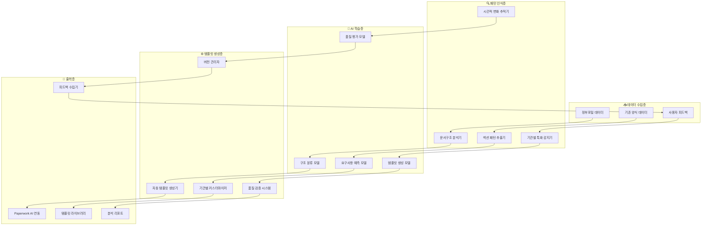

# 🧠 AI 기반 패턴 분석 엔진 설계서 v2.0

> **프로젝트**: Government Portal Intelligence System - AI Pattern Analysis  
> **버전**: v2.0.0  
> **작성일**: 2025-08-23  
> **목적**: 정부 포털 데이터에서 양식 패턴을 자동 학습하고 템플릿을 생성하는 AI 엔진  

---

## 🎯 **핵심 미션**

### 💡 **AI 패턴 분석의 목표**
```
📊 입력: 수천 개의 정부 지원사업 데이터
     ⬇️ AI 분석 엔진
🧠 처리: 패턴 인식, 구조 분석, 템플릿 추출
     ⬇️ 자동 생성
📋 출력: 기관별 맞춤 문서 템플릿
```

### 🚀 **AI 엔진의 핵심 능력**
1. **패턴 인식**: 수많은 지원사업에서 공통 구조 발견
2. **기관별 특화**: 각 기관의 고유한 요구사항 학습
3. **자동 템플릿화**: 패턴을 바탕으로 실용적인 템플릿 생성
4. **품질 검증**: 생성된 템플릿의 실용성 평가
5. **지속 학습**: 새로운 데이터로 패턴 정확도 향상

---

## 🏗️ **AI 엔진 아키텍처**

### 📊 **5단계 AI 파이프라인**


### 🤖 **핵심 AI 모델 구성**

#### **1. 문서 구조 분석 모델**
```python
class DocumentStructureAnalyzer:
    """정부 문서 구조 자동 분석 AI"""
    
    def __init__(self):
        self.models = {
            'section_detector': 'gpt-4o',           # 섹션 구분 감지
            'hierarchy_analyzer': 'claude-3.5',     # 계층 구조 분석
            'content_classifier': 'gemini-pro',     # 내용 분류
            'pattern_extractor': 'gpt-4.1'          # 패턴 추출
        }
        
        # 한국 정부 문서 특화 패턴
        self.korean_document_patterns = {
            'common_sections': [
                '사업개요', '추진배경', '사업목적', '추진근거',
                '사업내용', '추진체계', '추진일정', '소요예산',
                '기대효과', '향후계획', '첨부서류'
            ],
            'institution_prefixes': {
                'sba': ['혁신', '창업', '벤처', '글로벌'],
                'kosmes': ['실용화', '상용화', '기술사업화', '중소기업'],
                'nipa': ['IT', '디지털', '플랫폼', '데이터'],
                'techno': ['기술', '검증', '신뢰성', '안정성']
            }
        }
    
    async def analyze_document_structure(self, documents: List[Dict]) -> Dict:
        """문서 구조 종합 분석"""
        
        analysis_result = {
            'total_documents': len(documents),
            'structure_patterns': {},
            'section_frequency': {},
            'hierarchy_analysis': {},
            'institution_patterns': {},
            'template_recommendations': []
        }
        
        # 1. 전체 문서의 섹션 패턴 분석
        section_patterns = await self.extract_section_patterns(documents)
        analysis_result['structure_patterns'] = section_patterns
        
        # 2. 섹션별 출현 빈도 계산
        section_frequency = self.calculate_section_frequency(documents)
        analysis_result['section_frequency'] = section_frequency
        
        # 3. 문서 계층 구조 분석
        hierarchy_analysis = await self.analyze_hierarchy_patterns(documents)
        analysis_result['hierarchy_analysis'] = hierarchy_analysis
        
        # 4. 기관별 특화 패턴 식별
        institution_patterns = await self.identify_institution_patterns(documents)
        analysis_result['institution_patterns'] = institution_patterns
        
        # 5. 템플릿 생성 권장사항
        recommendations = await self.generate_template_recommendations(analysis_result)
        analysis_result['template_recommendations'] = recommendations
        
        return analysis_result
    
    async def extract_section_patterns(self, documents: List[Dict]) -> Dict:
        """섹션 패턴 추출"""
        
        patterns = {
            'universal_sections': [],  # 모든 기관에서 공통
            'frequent_sections': [],   # 80% 이상에서 등장
            'optional_sections': [],   # 50% 이상에서 등장
            'rare_sections': []        # 20% 이상에서 등장
        }
        
        # 모든 문서에서 섹션 추출
        all_sections = []
        for doc in documents:
            doc_sections = await self.extract_sections_from_document(doc)
            all_sections.extend(doc_sections)
        
        # 빈도 계산
        from collections import Counter
        section_counts = Counter(all_sections)
        total_docs = len(documents)
        
        for section, count in section_counts.items():
            frequency = count / total_docs
            
            if frequency >= 0.95:
                patterns['universal_sections'].append({
                    'section': section,
                    'frequency': frequency,
                    'count': count
                })
            elif frequency >= 0.8:
                patterns['frequent_sections'].append({
                    'section': section,
                    'frequency': frequency,
                    'count': count
                })
            elif frequency >= 0.5:
                patterns['optional_sections'].append({
                    'section': section,
                    'frequency': frequency,
                    'count': count
                })
            elif frequency >= 0.2:
                patterns['rare_sections'].append({
                    'section': section,
                    'frequency': frequency,
                    'count': count
                })
        
        return patterns
    
    async def extract_sections_from_document(self, document: Dict) -> List[str]:
        """개별 문서에서 섹션 추출"""
        
        content = document.get('detailed_description', '') or document.get('title', '')
        
        extraction_prompt = f"""
        다음 정부 지원사업 문서에서 섹션 구조를 분석하고 표준화된 섹션명을 추출해주세요:
        
        문서 내용:
        {content}
        
        한국 정부 문서의 일반적인 섹션들:
        - 사업개요 (사업명, 목적, 배경)
        - 사업내용 (추진내용, 세부계획)
        - 지원대상 (신청자격, 선정기준)
        - 지원조건 (지원규모, 지원방식, 지원기간)
        - 신청방법 (접수방법, 제출서류, 심사절차)
        - 평가기준 (심사기준, 배점)
        - 사후관리 (성과관리, 환수조건)
        
        추출 지시사항:
        1. 문서에 명시되거나 암시된 섹션들을 식별하세요
        2. 표준화된 섹션명으로 정규화하세요
        3. JSON 배열 형태로 반환하세요
        
        예시: ["사업개요", "지원대상", "신청방법"]
        """
        
        response = await self.models['section_detector'].generate(extraction_prompt)
        
        # JSON 파싱 시도
        try:
            import json
            sections = json.loads(response.strip())
            return sections if isinstance(sections, list) else []
        except:
            # 파싱 실패시 수동 추출
            return self.manual_section_extraction(content)
    
    def manual_section_extraction(self, content: str) -> List[str]:
        """수동 섹션 추출 (백업 방법)"""
        sections = []
        
        for standard_section in self.korean_document_patterns['common_sections']:
            if standard_section in content:
                sections.append(standard_section)
        
        return sections
```

#### **2. 기관별 특화 패턴 학습 모델**
```python
class InstitutionPatternLearner:
    """기관별 특화 패턴 학습 AI"""
    
    def __init__(self):
        self.learning_models = {
            'preference_analyzer': 'claude-3.5',    # 기관 선호도 분석
            'style_detector': 'gpt-4o',            # 문체/스타일 감지
            'requirement_predictor': 'gemini-pro',  # 요구사항 예측
            'trend_analyzer': 'gpt-4.1'            # 트렌드 분석
        }
        
        self.institution_profiles = {}
    
    async def learn_institution_patterns(self, institution_id: str, documents: List[Dict]) -> Dict:
        """특정 기관의 패턴 학습"""
        
        learning_result = {
            'institution_id': institution_id,
            'total_samples': len(documents),
            'learned_patterns': {},
            'confidence_scores': {},
            'recommendations': {}
        }
        
        # 1. 문체 및 톤 분석
        style_analysis = await self.analyze_writing_style(documents)
        learning_result['learned_patterns']['writing_style'] = style_analysis
        
        # 2. 구조적 선호도 분석
        structure_preference = await self.analyze_structure_preference(documents)
        learning_result['learned_patterns']['structure_preference'] = structure_preference
        
        # 3. 키워드 선호도 분석
        keyword_analysis = await self.analyze_keyword_preferences(documents)
        learning_result['learned_patterns']['keyword_preferences'] = keyword_analysis
        
        # 4. 평가 기준 패턴 분석
        evaluation_patterns = await self.analyze_evaluation_patterns(documents)
        learning_result['learned_patterns']['evaluation_criteria'] = evaluation_patterns
        
        # 5. 시간적 변화 트렌드 분석
        trend_analysis = await self.analyze_temporal_trends(documents)
        learning_result['learned_patterns']['trends'] = trend_analysis
        
        # 6. 신뢰도 점수 계산
        confidence_scores = self.calculate_confidence_scores(learning_result['learned_patterns'])
        learning_result['confidence_scores'] = confidence_scores
        
        # 7. 개선 권장사항 생성
        recommendations = await self.generate_improvement_recommendations(learning_result)
        learning_result['recommendations'] = recommendations
        
        return learning_result
    
    async def analyze_writing_style(self, documents: List[Dict]) -> Dict:
        """문체 및 톤 분석"""
        
        # 문서들의 내용 추출
        contents = []
        for doc in documents:
            content = doc.get('detailed_description', '') or doc.get('title', '')
            if content and len(content) > 100:  # 충분한 길이의 내용만
                contents.append(content)
        
        if not contents:
            return {'style': 'unknown', 'confidence': 0}
        
        analysis_prompt = f"""
        다음 정부 기관의 지원사업 문서들을 분석하여 문체적 특징을 파악해주세요:
        
        문서 샘플들:
        {' | '.join(contents[:5])}  # 처음 5개 샘플만 사용
        
        분석할 요소들:
        1. 문체 스타일 (개조식 vs 서술형)
        2. 톤앤매너 (공식적/친근함/전문적 등)
        3. 강조 패턴 (어떤 부분을 강조하는 경향)
        4. 용어 사용 특징 (전문용어/일반용어 비율)
        5. 문장 길이 및 복잡도
        
        결과를 JSON 형식으로 반환해주세요:
        {{
            "style_type": "개조식/서술형/혼용",
            "tone": "공식적/친근함/전문적",
            "emphasis_pattern": "혁신성/실용성/안정성 등",
            "terminology_level": "고급/중급/초급",
            "sentence_complexity": "복잡/보통/단순",
            "key_characteristics": ["특징1", "특징2", "특징3"]
        }}
        """
        
        response = await self.learning_models['style_detector'].generate(analysis_prompt)
        
        try:
            import json
            return json.loads(response.strip())
        except:
            return {'style': 'analysis_failed', 'confidence': 0}
```

#### **3. 자동 템플릿 생성 모델**
```python
class AutoTemplateGenerator:
    """학습된 패턴을 바탕으로 템플릿 자동 생성"""
    
    def __init__(self):
        self.generation_models = {
            'template_architect': 'gpt-4o',         # 템플릿 구조 설계
            'section_generator': 'claude-3.5',     # 섹션별 상세 생성
            'validator': 'gemini-pro',              # 품질 검증
            'optimizer': 'gpt-4.1'                 # 최적화
        }
        
        self.quality_thresholds = {
            'minimum_quality': 7.0,   # 최소 품질 점수
            'approval_quality': 8.5,  # 자동 승인 점수
            'excellent_quality': 9.5  # 우수 템플릿 점수
        }
    
    async def generate_template_from_patterns(
        self, 
        pattern_analysis: Dict, 
        institution_id: str,
        template_type: str = 'support_business'
    ) -> Dict:
        """패턴 분석 결과를 바탕으로 템플릿 생성"""
        
        generation_result = {
            'template_id': f"auto_{institution_id}_{template_type}_{int(time.time())}",
            'institution_id': institution_id,
            'template_type': template_type,
            'generated_template': {},
            'quality_assessment': {},
            'generation_metadata': {}
        }
        
        # 1. 템플릿 구조 설계
        template_structure = await self.design_template_structure(
            pattern_analysis, institution_id, template_type
        )
        
        # 2. 섹션별 상세 생성
        detailed_sections = await self.generate_detailed_sections(
            template_structure, pattern_analysis
        )
        
        # 3. 기관별 커스터마이징 적용
        customized_template = await self.apply_institution_customization(
            detailed_sections, institution_id, pattern_analysis
        )
        
        # 4. 품질 평가
        quality_assessment = await self.assess_template_quality(customized_template)
        
        # 5. 최적화 (필요시)
        if quality_assessment['score'] < self.quality_thresholds['approval_quality']:
            optimized_template = await self.optimize_template(
                customized_template, quality_assessment
            )
            final_quality = await self.assess_template_quality(optimized_template)
        else:
            optimized_template = customized_template
            final_quality = quality_assessment
        
        generation_result['generated_template'] = optimized_template
        generation_result['quality_assessment'] = final_quality
        generation_result['generation_metadata'] = {
            'patterns_used': len(pattern_analysis.get('structure_patterns', {})),
            'customization_applied': bool(pattern_analysis.get('institution_patterns')),
            'optimization_performed': quality_assessment['score'] < self.quality_thresholds['approval_quality'],
            'generation_time': datetime.now().isoformat()
        }
        
        return generation_result
    
    async def design_template_structure(
        self, 
        pattern_analysis: Dict, 
        institution_id: str, 
        template_type: str
    ) -> Dict:
        """템플릿 기본 구조 설계"""
        
        structure_patterns = pattern_analysis.get('structure_patterns', {})
        institution_patterns = pattern_analysis.get('institution_patterns', {})
        
        design_prompt = f"""
        다음 분석 결과를 바탕으로 {institution_id} 기관의 {template_type} 템플릿 구조를 설계해주세요:
        
        패턴 분석 결과:
        - 범용 섹션: {structure_patterns.get('universal_sections', [])}
        - 빈번한 섹션: {structure_patterns.get('frequent_sections', [])}
        - 선택적 섹션: {structure_patterns.get('optional_sections', [])}
        
        기관별 특화사항:
        {json.dumps(institution_patterns.get(institution_id, {}), ensure_ascii=False, indent=2)}
        
        템플릿 구조 설계 요구사항:
        1. 논리적 순서로 섹션 배치
        2. 각 섹션의 필수/선택 여부 결정
        3. 섹션별 예상 길이 및 복잡도 설정
        4. 기관 특화 요소 반영
        5. 사용자 편의성 고려
        
        결과 형식:
        {{
            "template_name": "템플릿명",
            "sections": [
                {{
                    "id": "section_id",
                    "name": "섹션명",
                    "order": 1,
                    "required": true/false,
                    "description": "섹션 설명",
                    "expected_length": "예상 길이",
                    "complexity": "낮음/보통/높음",
                    "institution_specific": true/false
                }}
            ],
            "overall_structure": "개조식/서술형/혼용",
            "emphasis_points": ["강조점1", "강조점2"]
        }}
        """
        
        response = await self.generation_models['template_architect'].generate(design_prompt)
        
        try:
            import json
            return json.loads(response.strip())
        except:
            # 기본 구조 반환
            return self.get_default_template_structure(template_type)
```

---

## 📊 **학습 데이터 관리**

### 🗄️ **패턴 학습 데이터베이스**
```sql
-- AI 학습용 패턴 데이터 테이블
CREATE TABLE ai_pattern_data (
    id SERIAL PRIMARY KEY,
    institution_id VARCHAR(20) NOT NULL,
    document_type VARCHAR(50) NOT NULL,
    pattern_category VARCHAR(30) NOT NULL,     -- 'structure', 'style', 'requirement'
    pattern_data JSONB NOT NULL,               -- 패턴 상세 데이터
    confidence_score FLOAT DEFAULT 0.0,       -- 패턴 신뢰도
    sample_count INTEGER DEFAULT 0,           -- 학습 샘플 수
    last_updated TIMESTAMP DEFAULT NOW(),
    version VARCHAR(20) DEFAULT '1.0'
);

-- 템플릿 생성 이력 테이블
CREATE TABLE template_generation_history (
    id SERIAL PRIMARY KEY,
    template_id VARCHAR(100) NOT NULL,
    institution_id VARCHAR(20) NOT NULL,
    generation_method VARCHAR(30) NOT NULL,   -- 'ai_auto', 'ai_assisted', 'manual'
    input_patterns JSONB,                     -- 입력된 패턴 데이터
    generated_template JSONB NOT NULL,        -- 생성된 템플릿
    quality_score FLOAT NOT NULL,             -- 품질 점수
    user_feedback JSONB,                      -- 사용자 피드백
    approval_status VARCHAR(20) DEFAULT 'pending', -- 'pending', 'approved', 'rejected'
    created_at TIMESTAMP DEFAULT NOW()
);

-- AI 모델 성능 추적 테이블
CREATE TABLE ai_model_performance (
    id SERIAL PRIMARY KEY,
    model_name VARCHAR(50) NOT NULL,
    task_type VARCHAR(30) NOT NULL,           -- 'structure_analysis', 'template_generation'
    input_data_hash VARCHAR(64),              -- 입력 데이터 해시
    output_quality_score FLOAT,               -- 출력 품질 점수
    processing_time_ms INTEGER,               -- 처리 시간
    success BOOLEAN DEFAULT true,
    error_message TEXT,
    created_at TIMESTAMP DEFAULT NOW()
);
```

---

## 🚀 **구현 우선순위**

### 📅 **Phase 1: 기본 패턴 인식 (2주)**
- [ ] 문서 구조 분석 AI 모델 구현
- [ ] 한국 정부 문서 패턴 데이터베이스 구축
- [ ] 기본 섹션 추출 및 분류 시스템
- [ ] 패턴 신뢰도 평가 메커니즘

### 📅 **Phase 2: 기관별 특화 학습 (2주)**  
- [ ] 기관별 문체/스타일 분석 모델
- [ ] 요구사항 예측 및 분류 시스템
- [ ] 시간적 변화 추적 및 트렌드 분석
- [ ] 적응형 학습 알고리즘

### 📅 **Phase 3: 자동 템플릿 생성 (2주)**
- [ ] 템플릿 자동 생성 AI 모델
- [ ] 품질 평가 및 검증 시스템
- [ ] 사용자 피드백 기반 개선 루프
- [ ] 대량 템플릿 생성 및 관리

---

**💡 핵심 가치**: "AI가 학습하는 정부 양식" - 수천 개의 지원사업 데이터에서 패턴을 자동 학습하여 각 기관에 최적화된 템플릿을 실시간 생성하는 지능형 시스템

*📝 이제 정부가 새로운 지원사업을 공고하면, AI가 즉시 패턴을 분석하여 맞춤형 신청서 템플릿을 자동 생성할 수 있습니다!*