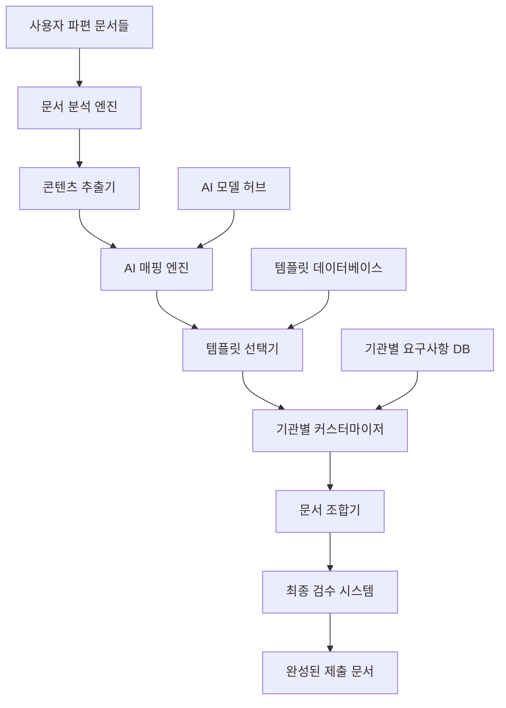

# 🎯 Paperwork AI 2.0 템플릿 엔진 핵심 모듈 설계

> **프로젝트**: "제출할 문서양식을 AI가 대신 작성해드립니다" 시스템  
> **버전**: v2.0.0  
> **작성일**: 2025-08-23  
> **목적**: 파편화된 문서를 AI가 템플릿에 맞게 자동 조합하는 핵심 엔진  

---

## 🎯 **핵심 미션**

### 🔥 **문제 정의**
기업들이 정부지원사업이나 공모전에 지원할 때, 같은 내용이지만 기관마다 다른 양식과 요구사항 때문에 매번 새로 작성해야 하는 고충을 해결합니다.

### ⭐ **솔루션 개요**
```
📄 파편화된 자료들 + 🤖 AI 조합 엔진 = 📋 완성된 제출서류
(소개서, 계획서, 재무자료, 기타 문서들) → (기관별 맞춤 템플릿) → (즉시 제출 가능한 문서)
```

---

## 🏗️ **시스템 아키텍처**

### 📊 **전체 구조**


### 🧩 **핵심 컴포넌트**

#### **1. 문서 템플릿 시스템**
```python
class DocumentTemplateEngine:
    """문서 템플릿 핵심 엔진"""
    
    def __init__(self):
        self.templates = {
            # 정부지원사업 템플릿
            'support_business': {
                'name': '지원사업 신청서',
                'institutions': ['sba', 'kosmes', 'nipa', 'techno'],
                'sections': [
                    'business_overview',      # 사업개요
                    'market_analysis',        # 시장분석
                    'technical_approach',     # 기술적 접근방법
                    'business_model',         # 사업화 계획
                    'financial_plan',         # 재무계획
                    'team_composition',       # 팀 구성
                    'risk_management',        # 위험관리
                    'expected_outcomes'       # 기대효과
                ]
            },
            
            # 공모전 제안서 템플릿
            'contest_proposal': {
                'name': '공모전 제안서',
                'institutions': ['ministry', 'public_agency', 'private_contest'],
                'sections': [
                    'proposal_summary',       # 제안 요약
                    'problem_definition',     # 문제 정의
                    'solution_approach',      # 해결방안
                    'innovation_point',       # 혁신성
                    'feasibility_study',      # 실현가능성
                    'social_impact',          # 사회적 효과
                    'implementation_plan'     # 실행계획
                ]
            },
            
            # 예산신청서 템플릿
            'budget_request': {
                'name': '예산신청서/지출결의서',
                'institutions': ['internal', 'government', 'foundation'],
                'sections': [
                    'request_purpose',        # 신청목적
                    'detailed_budget',        # 세부예산
                    'justification',          # 소요근거
                    'expected_result',        # 기대결과
                    'alternative_analysis',   # 대안분석
                    'approval_process'        # 승인절차
                ]
            },
            
            # 기안서 템플릿
            'draft_proposal': {
                'name': '기안서/제안서',
                'institutions': ['internal', 'client', 'partner'],
                'sections': [
                    'proposal_background',    # 제안배경
                    'current_situation',      # 현황분석
                    'proposal_content',       # 제안내용
                    'implementation_method',  # 실행방법
                    'required_resources',     # 소요자원
                    'timeline',              # 추진일정
                    'expected_benefits'      # 기대효과
                ]
            }
        }
    
    def get_template_structure(self, template_type: str, institution: str = None):
        """템플릿 구조 반환"""
        template = self.templates.get(template_type)
        if not template:
            return None
            
        # 기관별 커스터마이징
        if institution:
            return self.customize_for_institution(template, institution)
        
        return template
    
    def customize_for_institution(self, template: dict, institution: str):
        """기관별 템플릿 커스터마이징"""
        customizer = InstitutionCustomizer()
        return customizer.apply_requirements(template, institution)
```

#### **2. AI 기반 콘텐츠 매핑 시스템**
```python
class AIContentMapper:
    """AI 기반 콘텐츠 자동 매핑"""
    
    def __init__(self):
        self.ai_models = {
            'content_analyzer': 'gpt-4o',      # 콘텐츠 분석용
            'section_mapper': 'claude-3.5',    # 섹션 매핑용
            'quality_checker': 'gemini-pro',   # 품질 검증용
        }
    
    async def analyze_user_documents(self, documents: List[Document]) -> Dict:
        """사용자 문서들 분석 및 분류"""
        analysis_result = {
            'document_types': {},
            'content_categories': {},
            'key_information': {},
            'missing_elements': []
        }
        
        for doc in documents:
            # 1. 문서 타입 식별
            doc_type = await self.identify_document_type(doc)
            analysis_result['document_types'][doc.filename] = doc_type
            
            # 2. 핵심 정보 추출
            key_info = await self.extract_key_information(doc)
            analysis_result['key_information'][doc.filename] = key_info
            
            # 3. 콘텐츠 카테고리 분류
            categories = await self.categorize_content(doc)
            analysis_result['content_categories'][doc.filename] = categories
        
        # 4. 부족한 요소 파악
        analysis_result['missing_elements'] = await self.identify_missing_elements(
            analysis_result, target_template
        )
        
        return analysis_result
    
    async def map_content_to_sections(self, documents: List[Document], template: Dict) -> Dict:
        """문서 내용을 템플릿 섹션에 자동 매핑"""
        mapping_result = {}
        
        for section_id in template['sections']:
            section_info = self.get_section_info(section_id)
            
            # AI 모델을 사용하여 관련 콘텐츠 찾기
            relevant_content = await self.find_relevant_content(
                documents, section_info
            )
            
            # 콘텐츠 품질 평가 및 개선 제안
            quality_score = await self.evaluate_content_quality(
                relevant_content, section_info
            )
            
            mapping_result[section_id] = {
                'content': relevant_content,
                'quality_score': quality_score,
                'suggestions': await self.generate_improvement_suggestions(
                    relevant_content, section_info
                ),
                'confidence': await self.calculate_mapping_confidence(
                    relevant_content, section_info
                )
            }
        
        return mapping_result
    
    async def find_relevant_content(self, documents: List[Document], section_info: Dict) -> str:
        """섹션에 관련된 콘텐츠 찾기"""
        
        prompt = f"""
        다음 섹션에 적합한 내용을 제공된 문서들에서 찾아서 정리해주세요.
        
        섹션 정보:
        - 섹션명: {section_info['name']}
        - 목적: {section_info['purpose']}
        - 필요 요소: {section_info['required_elements']}
        
        문서들:
        {self.format_documents_for_prompt(documents)}
        
        지시사항:
        1. 해당 섹션에 가장 적합한 내용을 추출하세요
        2. 부족한 부분이 있으면 명시하세요
        3. 내용을 논리적으로 재구성하세요
        4. 전문적이고 설득력 있게 작성하세요
        
        결과:
        """
        
        response = await self.call_ai_model('content_analyzer', prompt)
        return response
```

---

## 🗄️ **데이터베이스 스키마**

### 📊 **핵심 테이블 구조**
```sql
-- 문서 템플릿 테이블
CREATE TABLE document_templates (
    id SERIAL PRIMARY KEY,
    template_type VARCHAR(50) NOT NULL,        -- 'support_business', 'contest_proposal' 등
    template_name VARCHAR(100) NOT NULL,       -- '지원사업 신청서'
    category VARCHAR(30) NOT NULL,             -- 'government', 'contest', 'internal'
    version VARCHAR(20) DEFAULT '1.0',
    is_active BOOLEAN DEFAULT true,
    created_at TIMESTAMP DEFAULT NOW()
);

-- 템플릿 섹션 테이블
CREATE TABLE template_sections (
    id SERIAL PRIMARY KEY,
    template_id INTEGER REFERENCES document_templates(id),
    section_id VARCHAR(50) NOT NULL,           -- 'business_overview', 'market_analysis' 등
    section_name VARCHAR(100) NOT NULL,        -- '사업개요', '시장분석' 등
    display_order INTEGER NOT NULL,
    required BOOLEAN DEFAULT true,
    description TEXT,
    target_length VARCHAR(50),                 -- '2-3페이지', '500-1000자' 등
    keywords JSONB,                            -- 관련 키워드들
    created_at TIMESTAMP DEFAULT NOW()
);

-- 사용자 문서 조합 이력 테이블
CREATE TABLE document_compositions (
    id SERIAL PRIMARY KEY,
    user_id INTEGER REFERENCES users(id),
    template_type VARCHAR(50) NOT NULL,
    institution_code VARCHAR(20),
    source_documents JSONB,                    -- 원본 파일 정보들
    composition_result JSONB,                  -- 조합 결과
    quality_score FLOAT DEFAULT 0.0,          -- 품질 점수
    status VARCHAR(20) DEFAULT 'completed',    -- 'processing', 'completed', 'failed'
    created_at TIMESTAMP DEFAULT NOW(),
    updated_at TIMESTAMP DEFAULT NOW()
);

-- AI 매핑 이력 테이블 (학습 데이터로 활용)
CREATE TABLE ai_mapping_history (
    id SERIAL PRIMARY KEY,
    composition_id INTEGER REFERENCES document_compositions(id),
    section_id VARCHAR(50) NOT NULL,
    original_content TEXT,
    mapped_content TEXT,
    confidence_score FLOAT,
    user_feedback INTEGER,                     -- 1-5점 만족도
    improvement_applied BOOLEAN DEFAULT false,
    created_at TIMESTAMP DEFAULT NOW()
);
```

---

## 🚀 **구현 우선순위**

### 🎯 **Phase 1: 핵심 템플릿 시스템 (2주)**
- [ ] 기본 템플릿 4종 구현 (지원사업, 공모전, 예산신청, 기안서)
- [ ] 템플릿 섹션 매핑 시스템
- [ ] 기본 AI 콘텐츠 분석 기능

### 🎯 **Phase 2: 기관별 커스터마이징 (2주)**
- [ ] 주요 기관 3곳 요구사항 데이터베이스 구축 (SBA, KOSMES, NIPA)
- [ ] 기관별 프롬프트 생성 시스템
- [ ] 문서 형식 자동 적용 기능

### 🎯 **Phase 3: AI 고도화 (2주)**
- [ ] 멀티 AI 모델 활용 시스템
- [ ] 품질 평가 및 개선 제안 기능  
- [ ] 자동 검수 및 최적화 시스템

---

**🎯 핵심 가치 제안**: "같은 내용, 다른 형식" 문제를 AI로 해결하여 기업의 서류 작성 시간을 80% 단축시키는 혁신적인 시스템

*📝 이 설계서는 Paperwork AI 2.0의 핵심 엔진 구현을 위한 완전한 청사진입니다.*