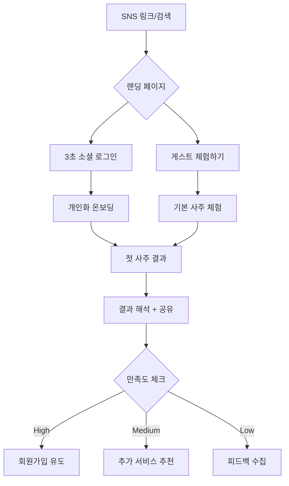
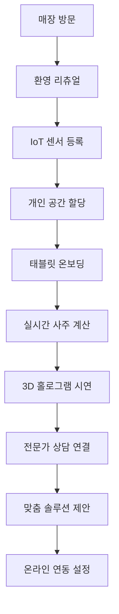

# 🎯 HEAL7 비즈니스 워크플로우 & 사용자 여정 설계 v1.0

> **프로젝트**: HEAL7 사주사이트 옴니버스 플랫폼 비즈니스 설계  
> **버전**: v1.0.0  
> **작성일**: 2025-08-18  
> **목적**: 온-오프라인 통합 사용자 여정과 비즈니스 프로세스 완전 설계  
> **범위**: 최초 접촉부터 평생 고객까지의 전체 라이프사이클

---

## 🌟 **핵심 설계 철학**

### **💎 옴니버스 통합 경험**
```yaml
core_philosophy:
  online_offline_seamless: "온라인과 오프라인의 경계 없는 연속적 경험"
  lifetime_journey: "일회성 서비스에서 평생 동반자로"
  community_driven: "개인 서비스에서 커뮤니티 생태계로"
  wisdom_evolution: "단순 점술에서 삶의 지혜 플랫폼으로"
```

### **🎭 사용자 페르소나 정의**

#### **🌱 탐험가 (Explorer) - 신규 사용자**
```yaml
profile:
  age: 20-35세
  motivation: "호기심, 재미, 일회성 경험"
  pain_points: ["복잡한 회원가입", "비싼 가격", "신뢰성 의문"]
  goals: ["간단한 재미", "친구와 공유", "무료 체험"]
  
journey_focus:
  - 무마찰 온보딩 (소셜 로그인 3초)
  - 즉시 만족 (첫 결과 30초 내)
  - 공유 유도 (바로 SNS 공유 가능)
```

#### **🎓 학습자 (Learner) - 관심 증가**
```yaml
profile:
  age: 25-45세
  motivation: "자기 이해, 개인 성장, 정기적 관심"
  pain_points: ["정보 과부하", "신뢰할 만한 가이드 부재"]
  goals: ["체계적 학습", "개인화된 조언", "실생활 적용"]

journey_focus:
  - 교육 콘텐츠 제공
  - 개인화 추천 시스템
  - 학습 진도 추적
```

#### **💎 애호가 (Enthusiast) - 적극적 참여**
```yaml
profile:
  age: 30-55세
  motivation: "깊은 이해, 커뮤니티 참여, 지식 공유"
  pain_points: ["표면적 서비스", "고급 기능 부족"]
  goals: ["전문성 향상", "커뮤니티 리더십", "수익 창출"]

journey_focus:
  - 고급 분석 도구
  - 커뮤니티 기여 보상
  - 크리에이터 프로그램
```

#### **🏆 마스터 (Master) - 전문가/사업자**
```yaml
profile:
  age: 35-65세
  motivation: "전문 사업, 고객 서비스, 수익 극대화"
  pain_points: ["제한된 도구", "B2B 기능 부족"]
  goals: ["사업 확장", "고객 관리", "브랜딩"]

journey_focus:
  - B2B 도구 제공
  - 화이트라벨 솔루션
  - 수익 분석 대시보드
```

---

## 🎯 **핵심 사용자 여정 맵**

### **🌱 1단계: 발견 & 첫 경험 (Discovery & First Touch)**

#### **온라인 진입점**


#### **오프라인 진입점 (체험 센터)**


### **🎓 2단계: 학습 & 탐색 (Learning & Exploration)**

#### **점진적 참여 유도**
```yaml
week_1_journey:
  day_1: "환영 메시지 + 첫 해석서 제공"
  day_3: "친구 초대 이벤트 (포인트 보상)"
  day_7: "주간 운세 + 타로카드 추천"
  
week_2_4_journey:
  learning_path: "사주 기초 과정 (7일 프로그램)"
  community_intro: "초보자 커뮤니티 참여 유도"
  premium_trial: "7일 프리미엄 체험"
  
month_2_3_journey:
  habit_formation: "매일 운세 확인 습관화"
  social_features: "친구와 궁합 보기"
  content_creation: "첫 리뷰 작성 이벤트"
```

#### **개인화 학습 경로**
```typescript
interface LearningPath {
  userId: string;
  currentLevel: 'beginner' | 'intermediate' | 'advanced';
  interests: Array<'saju' | 'tarot' | 'zodiac' | 'astrology'>;
  learningStyle: 'visual' | 'text' | 'interactive' | 'community';
  
  personalizedCurriculum: {
    week1: Course[];
    week2: Course[];
    // ... 맞춤형 12주 커리큘럼
  };
  
  progressTracking: {
    completedLessons: number;
    skillPoints: number;
    badges: Badge[];
    nextMilestone: string;
  };
}
```

### **💎 3단계: 몰입 & 커뮤니티 (Engagement & Community)**

#### **커뮤니티 참여 단계**
```yaml
participation_levels:
  observer: # 90% 사용자
    actions: ["읽기", "좋아요", "북마크"]
    rewards: ["포인트", "뱃지", "할인쿠폰"]
    
  contributor: # 9% 사용자  
    actions: ["댓글", "리뷰", "질문"]
    rewards: ["인지도", "전문가 태그", "수익 분배"]
    
  creator: # 0.9% 사용자
    actions: ["콘텐츠 생성", "라이브 상담", "강의"]
    rewards: ["수익 창출", "브랜딩", "팔로워"]
    
  leader: # 0.1% 사용자
    actions: ["커뮤니티 운영", "이벤트 기획", "멘토링"]
    rewards: ["플랫폼 파트너십", "사업 기회", "영향력"]
```

#### **게이미피케이션 시스템**
```typescript
interface GamificationEngine {
  pointSystems: {
    wisdom_points: number;    // 학습 활동
    community_points: number; // 커뮤니티 기여
    fortune_points: number;   // 점술 활동
    social_points: number;    // 소셜 활동
  };
  
  achievements: {
    daily_streaks: number;
    milestone_badges: Badge[];
    social_recognition: Recognition[];
    skill_certifications: Certification[];
  };
  
  competitions: {
    weekly_challenges: Challenge[];
    seasonal_events: Event[];
    community_contests: Contest[];
  };
}
```

### **🏆 4단계: 전문화 & 수익화 (Specialization & Monetization)**

#### **프로페셔널 경로**
```yaml
professional_journey:
  certification_track:
    beginner_cert: "HEAL7 기초 상담사 (40시간)"
    intermediate_cert: "HEAL7 전문 상담사 (120시간)" 
    advanced_cert: "HEAL7 마스터 상담사 (300시간)"
    
  business_tools:
    client_management: "고객 관리 CRM"
    appointment_system: "예약 및 일정 관리"
    payment_integration: "결제 및 정산 시스템"
    marketing_support: "마케팅 도구 및 템플릿"
    
  revenue_streams:
    consultation_fees: "1:1 상담 수수료 (70-90% 분배)"
    course_sales: "강의 판매 수익"
    content_monetization: "콘텐츠 구독 수익"
    affiliate_commission: "제휴 상품 커미션"
```

---

## 🔄 **핵심 비즈니스 워크플로우**

### **📊 고객 라이프사이클 관리 (CLM)**

#### **신규 고객 획득 프로세스**
```yaml
acquisition_funnel:
  awareness: # 인지 단계
    channels: ["SNS 마케팅", "인플루언서", "SEO", "오프라인 체험센터"]
    content: ["무료 운세", "친구 초대 이벤트", "바이럴 콘텐츠"]
    metrics: ["트래픽", "브랜드 인지도", "소셜 멘션"]
    
  interest: # 관심 단계
    touchpoints: ["랜딩 페이지", "체험 서비스", "커뮤니티 콘텐츠"]
    offers: ["첫 사주 무료", "7일 프리미엄 체험", "친구와 궁합보기"]
    metrics: ["회원가입률", "서비스 사용률", "페이지 체류시간"]
    
  consideration: # 고려 단계
    features: ["개인화 추천", "전문가 상담", "자세한 해석"]
    social_proof: ["리뷰", "평점", "커뮤니티 활동"]
    metrics: ["프리미엄 전환율", "상담 예약률", "결제 시도율"]
    
  purchase: # 구매 단계
    conversion_tools: ["한정 할인", "패키지 상품", "구독 플랜"]
    payment_flow: ["원클릭 결제", "다양한 PG", "분할 결제"]
    metrics: ["구매 완료율", "평균 주문가", "결제 이탈률"]
    
  retention: # 유지 단계
    engagement: ["매일 운세", "개인화 콘텐츠", "커뮤니티 활동"]
    loyalty_program: ["포인트 적립", "VIP 혜택", "독점 콘텐츠"]
    metrics: ["재구매율", "이용 빈도", "구독 유지율"]
    
  advocacy: # 추천 단계
    referral_program: ["친구 초대 보상", "리뷰 인센티브", "UGC 캠페인"]
    community_leadership: ["전문가 인증", "콘텐츠 크리에이터", "커뮤니티 리더"]
    metrics: ["추천 고객 수", "바이럴 계수", "브랜드 충성도"]
```

#### **고객 세그멘테이션 및 개인화**
```typescript
interface CustomerSegmentation {
  demographic: {
    age_group: '10s' | '20s' | '30s' | '40s' | '50s+';
    gender: 'male' | 'female' | 'non-binary';
    location: 'metro' | 'suburban' | 'rural';
    income_level: 'low' | 'middle' | 'high' | 'premium';
  };
  
  behavioral: {
    usage_frequency: 'daily' | 'weekly' | 'monthly' | 'occasional';
    service_preference: 'saju' | 'tarot' | 'zodiac' | 'comprehensive';
    interaction_style: 'self_service' | 'guided' | 'community' | 'expert';
    spending_pattern: 'free' | 'pay_per_use' | 'subscription' | 'premium';
  };
  
  psychographic: {
    motivation: 'entertainment' | 'self_improvement' | 'decision_making' | 'spiritual';
    personality: 'introvert' | 'extrovert' | 'analytical' | 'intuitive';
    risk_tolerance: 'conservative' | 'moderate' | 'aggressive';
  };
  
  lifecycle_stage: {
    onboarding: 'new' | 'exploring' | 'committed';
    engagement: 'passive' | 'active' | 'power_user';
    monetization: 'free' | 'basic' | 'premium' | 'enterprise';
  };
}
```

### **💰 수익 최적화 워크플로우**

#### **동적 가격 전략**
```yaml
pricing_strategy:
  freemium_model:
    free_tier:
      limits: ["월 3회 사주", "기본 해석", "커뮤니티 참여"]
      purpose: "사용자 유입 및 습관 형성"
      
    premium_conversion:
      triggers: ["한도 초과", "고급 기능 요청", "정확도 향상"]
      incentives: ["첫 달 50% 할인", "7일 무료 체험", "친구 초대 보너스"]
      
  value_based_pricing:
    basic_services: "표준 가격 (시장 기준)"
    premium_features: "가치 기반 프리미엄 (2-3배)"
    expert_consultation: "시간 기반 + 전문성 프리미엄"
    
  dynamic_adjustments:
    demand_surge: "인기 시간대 10-20% 할증"
    seasonal_events: "명절, 연말 특별 프로모션"
    user_lifetime_value: "고객별 맞춤 할인율"
```

#### **수익 다각화 전략**
```typescript
interface RevenueStreams {
  subscription_revenue: {
    monthly_plans: Plan[];
    annual_discounts: number;
    family_packages: Package[];
    corporate_plans: EnterprisePlan[];
  };
  
  transaction_revenue: {
    pay_per_consultation: ConsultationFee[];
    premium_reports: ReportPrice[];
    gift_services: GiftOption[];
  };
  
  marketplace_revenue: {
    expert_commission: number; // 20-30%
    product_sales: number;     // 10-15%
    affiliate_marketing: number; // 5-10%
  };
  
  advertising_revenue: {
    sponsored_content: AdRate[];
    banner_placements: AdSpace[];
    native_advertising: ContentAd[];
  };
  
  data_monetization: {
    anonymized_insights: DataProduct[];
    trend_reports: TrendAnalysis[];
    api_access: APITier[];
  };
}
```

### **🤝 파트너십 & 제휴 워크플로우**

#### **전략적 제휴 구조**
```yaml
partnership_ecosystem:
  content_partners:
    traditional_experts: "기존 사주명리 전문가"
    modern_coaches: "라이프 코치, 심리 상담사"
    wellness_brands: "요가, 명상, 건강식품"
    
  technology_partners:
    ai_platforms: "GPT, Claude 등 AI 모델 제휴"
    iot_vendors: "센서, 웨어러블 디바이스"
    ar_vr_solutions: "몰입형 체험 기술"
    
  distribution_partners:
    social_platforms: "카카오, 네이버, 인스타그램"
    ecommerce_sites: "쿠팡, 네이버쇼핑, 11번가"
    offline_venues: "카페, 문화센터, 백화점"
    
  financial_partners:
    payment_gateways: "토스, 카카오페이, 페이코"
    fintech_companies: "후불결제, 마이크로론"
    insurance_providers: "건강, 운세 보험 상품"
```

---

## 🎪 **오프라인 체험센터 운영 워크플로우**

### **🏛️ 물리적 공간 설계**

#### **500평 체험센터 구성**
```yaml
space_layout:
  entrance_hall: # 100평 - 환영 공간
    features: ["디지털 웰컴", "IoT 등록", "대기 라운지"]
    technology: ["안면인식", "QR 체크인", "실시간 대기열"]
    
  consultation_pods: # 200평 - 1:1 상담 공간
    private_rooms: "15개 독립 공간"
    features: ["방음", "조명 조절", "아로마 테라피"]
    technology: ["태블릿", "화상 통화", "결제 단말기"]
    
  interactive_experience: # 100평 - 체험 공간
    hologram_theater: "3D 사주 시각화"
    tarot_corner: "증강현실 타로카드"
    meditation_space: "명상 및 힐링"
    
  community_lounge: # 80평 - 커뮤니티 공간
    event_stage: "강의 및 워크샵"
    networking_area: "사용자 간 교류"
    cafe_corner: "차 및 간식 제공"
    
  retail_boutique: # 20평 - 상품 판매
    spiritual_items: "수정, 부적, 향"
    books_media: "관련 도서 및 미디어"
    personalized_goods: "맞춤 제작 상품"
```

#### **IoT 센서 네트워크**
```typescript
interface IoTSensorNetwork {
  environmental_sensors: {
    temperature: TemperatureSensor[];
    humidity: HumiditySensor[];
    air_quality: AirQualitySensor[];
    lighting: SmartLighting[];
    sound: AmbientSound[];
  };
  
  user_tracking: {
    movement_patterns: MotionSensor[];
    dwell_time: BeaconSensor[];
    interaction_points: TouchSensor[];
    biometric_data: BiometricSensor[]; // 선택적, 동의 시
  };
  
  experience_enhancement: {
    personalized_environment: AutomationRule[];
    real_time_adaptation: AdaptationEngine;
    predictive_comfort: PredictiveModel;
  };
  
  operational_intelligence: {
    space_utilization: UtilizationAnalytics;
    queue_management: QueueOptimization;
    energy_efficiency: EnergyManagement;
  };
}
```

### **🎭 체험 프로그램 운영**

#### **일일 운영 스케줄**
```yaml
daily_operations:
  opening_ritual: # 09:00-09:30
    space_blessing: "하루 시작 에너지 정화"
    staff_briefing: "일일 목표 및 특별 이벤트"
    system_check: "모든 기술 시스템 점검"
    
  morning_session: # 09:30-12:00
    target_audience: "직장인, 학생 (출근/등교 전)"
    popular_services: ["오늘의 운세", "면접 운", "시험 운"]
    special_offers: "아침 할인 (20% OFF)"
    
  lunch_session: # 12:00-14:00
    target_audience: "점심 시간 방문객"
    quick_services: ["15분 간편 상담", "타로 원카드"]
    lunch_package: "상담 + 점심 세트"
    
  afternoon_session: # 14:00-18:00
    target_audience: "주부, 연장자, 자영업자"
    premium_services: ["정통 사주", "풀 패키지 상담"]
    group_programs: "친구와 함께, 가족 상담"
    
  evening_session: # 18:00-22:00
    target_audience: "퇴근족, 데이트족"
    romantic_services: ["커플 궁합", "연애 운세"]
    social_events: "네트워킹 이벤트", "워크샵"
```

#### **계절별 특별 프로그램**
```yaml
seasonal_programs:
  spring: # 3-5월
    themes: ["새 시작", "취업 운세", "연애 운"]
    events: ["벚꽃 축제 특별 이벤트", "입학시즌 특가"]
    partnerships: ["결혼정보회사", "취업 플랫폼"]
    
  summer: # 6-8월
    themes: ["휴가 운세", "건강 관리", "여행 길흉"]
    events: ["여름 힐링 캠프", "야외 체험 프로그램"]
    partnerships: ["여행사", "휴양지"]
    
  autumn: # 9-11월
    themes: ["수확과 감사", "건강 점검", "가족 화합"]
    events: ["추석 가족 이벤트", "감사 캠페인"]
    partnerships: ["건강검진센터", "가족 레스토랑"]
    
  winter: # 12-2월
    themes: ["신년 운세", "연말 정산", "따뜻한 위로"]
    events: ["신년 특별 행사", "연말 감사제"]
    partnerships: ["카페", "온천/스파"]
```

---

## 📱 **온-오프라인 연동 시나리오**

### **🔄 Seamless Experience Flow**

#### **O2O (Online to Offline) 시나리오**
```yaml
o2o_journey:
  discovery_online:
    user_action: "온라인에서 사주 체험"
    system_response: "오프라인 체험센터 추천"
    incentive: "첫 방문 30% 할인 쿠폰"
    
  booking_integration:
    user_action: "온라인에서 오프라인 예약"
    system_features: ["실시간 예약", "전문가 선택", "위치 안내"]
    preparation: ["기본 정보 사전 입력", "맞춤 질문지 작성"]
    
  arrival_experience:
    check_in: "QR코드 자동 체크인"
    personalization: "온라인 데이터 기반 환경 설정"
    seamless_flow: "대기 없이 바로 상담 시작"
    
  enhanced_consultation:
    online_data: "기존 상담 이력 참조"
    expert_preparation: "사전 분석 자료 준비"
    deeper_insight: "오프라인 전용 고급 분석"
    
  follow_up:
    digital_record: "상담 내용 온라인 저장"
    continuous_care: "후속 관리 서비스"
    community_sharing: "허용 시 경험 공유"
```

#### **O2O (Offline to Online) 시나리오**
```yaml
o2o_journey:
  walk_in_experience:
    spontaneous_visit: "사전 예약 없는 방문"
    instant_onboarding: "현장에서 빠른 계정 생성"
    immediate_service: "대기 시간 최소화"
    
  data_capture:
    consultation_record: "상담 내용 디지털화"
    preference_learning: "사용자 선호도 파악"
    future_prediction: "향후 관심사 예측"
    
  online_extension:
    app_download: "전용 앱 설치 유도"
    account_connection: "오프라인 데이터 연동"
    continued_engagement: "온라인 서비스 이용 시작"
    
  long_term_relationship:
    regular_updates: "정기적인 온라인 업데이트"
    return_incentives: "재방문 유도 프로그램"
    referral_program: "지인 추천 시스템"
```

### **🎯 Cross-Channel Analytics**

#### **통합 고객 여정 추적**
```typescript
interface CrossChannelAnalytics {
  customer_journey_tracking: {
    touchpoint_sequence: TouchPoint[];
    channel_attribution: ChannelContribution[];
    conversion_path: ConversionStep[];
    drop_off_analysis: DropOffPoint[];
  };
  
  behavioral_synthesis: {
    online_behavior: OnlineBehavior;
    offline_behavior: OfflineBehavior;
    preference_correlation: PreferenceMap;
    satisfaction_scoring: SatisfactionScore;
  };
  
  predictive_insights: {
    next_best_action: NextAction;
    churn_probability: ChurnRisk;
    upsell_opportunity: UpsellChance;
    lifetime_value_prediction: LTVForecast;
  };
  
  personalization_engine: {
    real_time_adaptation: AdaptationRule[];
    content_recommendation: ContentRec[];
    service_suggestion: ServiceRec[];
    experience_optimization: ExperienceOpt[];
  };
}
```

---

## 🎪 **이벤트 및 마케팅 워크플로우**

### **📅 연간 마케팅 캘린더**

#### **분기별 주요 캠페인**
```yaml
annual_marketing_calendar:
  q1_new_beginnings: # 1-3월
    themes: ["새해 운세", "새 시작", "목표 설정"]
    campaigns:
      - "신년 대운세 무료 제공" (1월 1-15일)
      - "발렌타인 연애운 특집" (2월 1-14일)  
      - "취업시즌 성공운 패키지" (3월 1-31일)
    channels: ["TV 광고", "지하철 광고", "SNS 캠페인"]
    budget_allocation: "40% (최대 마케팅 시즌)"
    
  q2_growth_vitality: # 4-6월
    themes: ["성장과 발전", "건강과 활력", "인간관계"]
    campaigns:
      - "어린이날 가족운세 이벤트" (5월 1-5일)
      - "스승의날 감사 캠페인" (5월 15일)
      - "여름 휴가 길흉일 서비스" (6월)
    channels: ["인플루언서", "야외 광고", "제휴 마케팅"]
    budget_allocation: "20%"
    
  q3_harvest_reflection: # 7-9월
    themes: ["수확과 성과", "자기 반성", "균형"]
    campaigns:
      - "여름 피서 특별 할인" (7-8월)
      - "추석 가족 이벤트" (9월)
      - "새 학기 학업운 패키지" (9월)
    channels: ["여행지 제휴", "가족 타겟팅", "학부모 커뮤니티"]
    budget_allocation: "25%"
    
  q4_completion_preparation: # 10-12월
    themes: ["마무리", "감사", "내년 준비"]
    campaigns:
      - "수능 성공운 이벤트" (11월)
      - "연말 감사제" (12월 1-25일)
      - "신년 준비 대운세" (12월 26-31일)
    channels: ["교육 기관 제휴", "연말 행사", "가족 선물"]
    budget_allocation: "15%"
```

#### **실시간 마케팅 대응**
```typescript
interface RealTimeMarketing {
  trending_topics: {
    social_monitoring: SocialListening;
    news_integration: NewsEvent[];
    viral_opportunities: ViralMoment[];
  };
  
  event_marketing: {
    celebrity_news: CelebrityEvent[];
    sports_events: SportsSchedule[];
    natural_phenomena: AstronomicalEvent[];
    economic_events: EconomicIndicator[];
  };
  
  personalized_campaigns: {
    user_lifecycle_events: LifecycleEvent[];
    behavioral_triggers: BehaviorTrigger[];
    seasonal_preferences: SeasonalPreference[];
  };
  
  automated_responses: {
    content_generation: AutoContent[];
    campaign_adjustment: CampaignRule[];
    budget_reallocation: BudgetRule[];
  };
}
```

---

## 📊 **성과 측정 및 최적화**

### **🎯 핵심 성과 지표 (KPI)**

#### **비즈니스 메트릭**
```yaml
business_kpis:
  revenue_metrics:
    monthly_recurring_revenue: "목표: 전월 대비 15% 성장"
    average_revenue_per_user: "목표: 월 25,000원"
    customer_lifetime_value: "목표: 150,000원"
    gross_margin: "목표: 75% 이상"
    
  growth_metrics:
    new_user_acquisition: "목표: 월 10,000명"
    activation_rate: "목표: 첫 주 30% 활성 사용"
    retention_rate: "목표: 3개월 후 60% 유지"
    referral_rate: "목표: 사용자당 월 0.3명 추천"
    
  engagement_metrics:
    daily_active_users: "목표: 전체 사용자의 20%"
    session_duration: "목표: 평균 12분"
    feature_adoption: "목표: 신기능 30일 내 40% 사용"
    community_participation: "목표: 월 1회 이상 참여 25%"
    
  satisfaction_metrics:
    net_promoter_score: "목표: 70+ (업계 최고 수준)"
    customer_satisfaction: "목표: 4.5/5.0"
    app_store_rating: "목표: 4.7/5.0"
    support_resolution_time: "목표: 평균 2시간"
```

#### **운영 효율성 지표**
```yaml
operational_kpis:
  service_quality:
    consultation_accuracy: "목표: 90% 만족도"
    response_time: "목표: 평균 30초"
    system_uptime: "목표: 99.9%"
    error_rate: "목표: 0.1% 이하"
    
  cost_efficiency:
    customer_acquisition_cost: "목표: LTV의 1/5 이하"
    operational_cost_ratio: "목표: 매출의 25% 이하"
    automation_rate: "목표: 반복 업무 80% 자동화"
    expert_utilization: "목표: 전문가 시간 75% 활용"
    
  innovation_metrics:
    feature_release_frequency: "목표: 월 2회 업데이트"
    a_b_test_completion: "목표: 월 5개 테스트"
    user_feedback_implementation: "목표: 30일 내 70% 반영"
    technology_adoption: "목표: 신기술 분기별 1개 도입"
```

### **🔄 지속적 개선 프로세스**

#### **데이터 기반 의사결정**
```typescript
interface ContinuousImprovement {
  data_collection: {
    user_behavior: BehaviorAnalytics;
    business_metrics: BusinessMetrics;
    system_performance: SystemMetrics;
    market_intelligence: MarketData;
  };
  
  analysis_framework: {
    descriptive_analytics: "현재 상황 이해";
    diagnostic_analytics: "원인 분석";
    predictive_analytics: "미래 예측";
    prescriptive_analytics: "최적 행동 제안";
  };
  
  experimentation: {
    hypothesis_generation: HypothesisFramework;
    experiment_design: ExperimentDesign;
    statistical_analysis: StatisticalMethod[];
    result_interpretation: InsightExtraction;
  };
  
  implementation: {
    change_management: ChangeProcess;
    rollout_strategy: RolloutPlan;
    monitoring_system: MonitoringDashboard;
    feedback_loop: FeedbackMechanism;
  };
}
```

---

## 🎭 **리스크 관리 및 대응**

### **⚠️ 주요 리스크 시나리오**

#### **비즈니스 리스크**
```yaml
business_risks:
  market_risks:
    economic_downturn: 
      impact: "소비 감소, 구독 해지 증가"
      mitigation: "가격 할인, 가치 제공 강화"
      contingency: "프리미엄 → 기본 전환 옵션"
      
    competition_intensification:
      impact: "시장 점유율 감소, 가격 압박"
      mitigation: "차별화 강화, 고객 충성도 제고"
      contingency: "합병/제휴 전략 추진"
      
    regulatory_changes:
      impact: "점술업 규제, 개인정보 보호법 강화"
      mitigation: "법적 자문, 컴플라이언스 체계"
      contingency: "사업 모델 조정, 해외 진출"
      
  operational_risks:
    expert_shortage:
      impact: "서비스 품질 저하, 대기 시간 증가"
      mitigation: "전문가 육성 프로그램, 자동화 확대"
      contingency: "AI 상담 비중 확대"
      
    technology_failure:
      impact: "서비스 중단, 고객 이탈"
      mitigation: "이중화 시스템, 백업 체계"
      contingency: "수동 운영 전환 프로세스"
      
    data_breach:
      impact: "신뢰도 하락, 법적 책임"
      mitigation: "보안 강화, 암호화, 접근 제한"
      contingency: "사고 대응 프로세스, 배상 보험"
```

#### **대응 전략 프레임워크**
```typescript
interface RiskManagement {
  risk_identification: {
    internal_assessment: InternalRisk[];
    external_monitoring: ExternalRisk[];
    stakeholder_feedback: StakeholderConcern[];
    scenario_planning: ScenarioAnalysis[];
  };
  
  risk_assessment: {
    probability_analysis: ProbabilityMatrix;
    impact_evaluation: ImpactAssessment;
    risk_scoring: RiskScore;
    priority_ranking: RiskPriority[];
  };
  
  mitigation_strategies: {
    preventive_measures: PreventiveMeasure[];
    detective_controls: DetectiveControl[];
    corrective_actions: CorrectiveAction[];
    contingency_plans: ContingencyPlan[];
  };
  
  monitoring_system: {
    early_warning_indicators: EarlyWarning[];
    regular_assessment: AssessmentSchedule;
    reporting_mechanism: RiskReport[];
    escalation_procedures: EscalationPath[];
  };
}
```

---

## 🌟 **결론 및 다음 단계**

### **🏆 핵심 성과물 요약**

이 비즈니스 워크플로우 & 사용자 여정 설계를 통해 달성한 핵심 가치:

#### **✨ 사용자 중심 설계**
- **완전한 페르소나 정의**: 탐험가 → 학습자 → 애호가 → 마스터 단계별 여정
- **마찰 없는 온보딩**: 3초 소셜 로그인부터 30초 내 첫 결과까지
- **지속적 참여 유도**: 게이미피케이션과 커뮤니티 중심 경험

#### **💰 수익 극대화 구조**  
- **다각화된 수익원**: 구독 + 거래 + 마켓플레이스 + 광고 + 데이터
- **동적 가격 전략**: 사용자별, 시간별, 수요별 맞춤 가격
- **평생 고객 가치**: 150,000원 LTV 목표로 장기 관계 구축

#### **🔄 온-오프라인 통합**
- **seamless 경험**: O2O 양방향 완벽 연동
- **500평 체험센터**: IoT 센서 기반 개인화 공간
- **실시간 데이터 연동**: 온오프라인 행동 데이터 통합 분석

#### **📊 데이터 기반 운영**
- **핵심 KPI 체계**: 비즈니스/운영/혁신 전 영역 측정
- **지속적 개선**: 실험 기반 최적화 프로세스
- **리스크 관리**: 예방적 대응 체계 구축

### **🚀 즉시 실행 가능한 액션 아이템**

```yaml
immediate_actions:
  week_1:
    - 사용자 페르소나 기반 마케팅 메시지 제작
    - 온보딩 플로우 프로토타입 개발
    - 핵심 KPI 측정 시스템 구축
    
  week_2_4:
    - 게이미피케이션 시스템 MVP 구현
    - 오프라인 체험센터 부지 선정
    - 파트너십 협상 시작 (PG, 콘텐츠)
    
  month_2_3:
    - 전문가 육성 프로그램 론칭
    - IoT 센서 네트워크 파일럿 테스트
    - 크로스채널 분석 시스템 구축
```

### **🎯 성공 측정 지표**

**3개월 후 목표:**
- 신규 사용자 30,000명 확보
- 월 매출 1억원 달성
- 고객 만족도 4.5/5.0 달성
- 오프라인 체험센터 1호점 오픈

**1년 후 비전:**
- 옴니버스 플랫폼으로 국내 1위 달성
- 연 매출 100억원 돌파
- 전국 5개 도시 체험센터 운영
- 해외 진출 기반 마련

이제 이 워크플로우를 바탕으로 **통합 옴니버스 마스터 플랜**을 작성하여 전체 프로젝트를 완성하겠습니다! 🎪✨