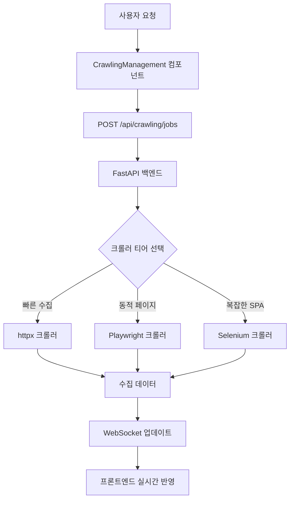
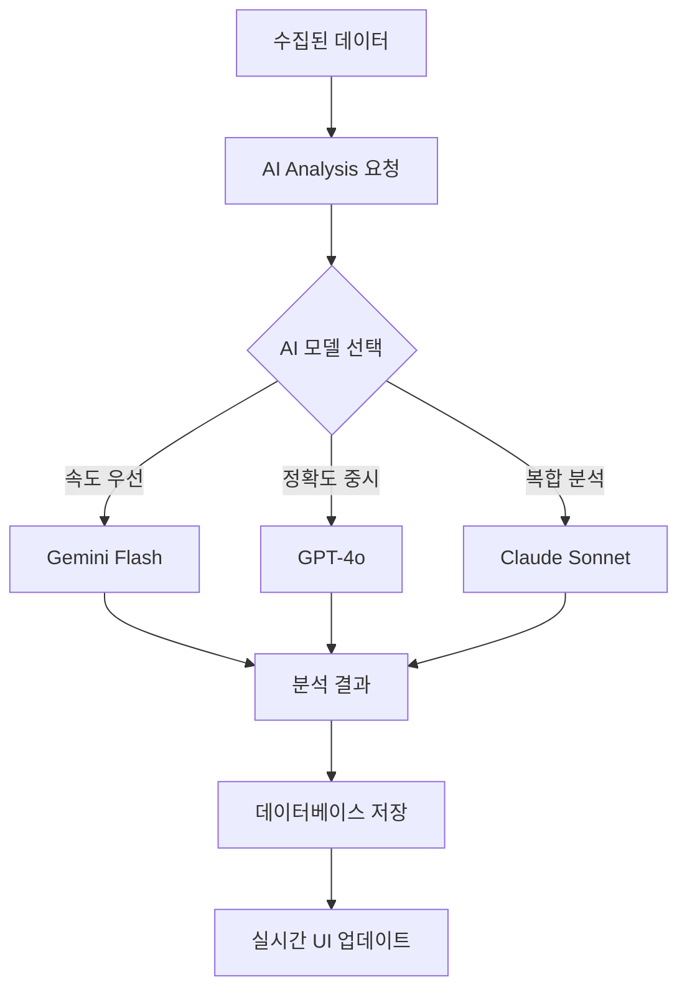
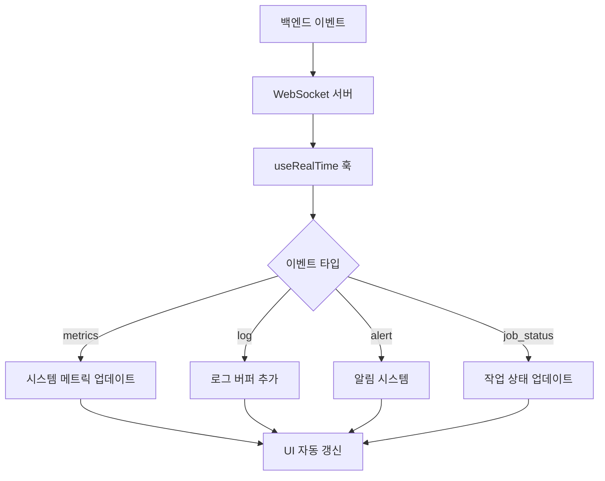

# 🔌 크롤링 시스템 API 명세서 v2.0

> **FastAPI 기반 3-Tier 크롤링 백엔드**  
> **포트**: 8003 | **문서**: `/docs` | **헬스체크**: `/health`

## 🎯 API 개요

### 기본 정보
- **Base URL**: `http://localhost:8003`
- **프로덕션**: `https://crawling.heal7.com/api`
- **인증**: Bearer Token (선택적)
- **응답 형식**: JSON
- **실시간**: WebSocket `/ws`

## 📋 엔드포인트 목록

### 1. **시스템 관리 API**

#### 🩺 헬스체크
```http
GET /health
```
**응답**:
```json
{
  "status": "healthy",
  "service": "crawling-service", 
  "port": 8003,
  "version": "2.0.0",
  "uptime": 3600,
  "active_crawlers": 8,
  "system_load": {
    "cpu": 67.2,
    "memory": 45.8,
    "disk": 23.1
  }
}
```

### 2. **크롤링 작업 관리 API**

#### 📝 작업 목록 조회
```http
GET /api/crawling/jobs
Query Parameters:
  - status: running|paused|completed|failed|queued
  - tier: httpx|playwright|selenium
  - limit: number (기본값: 50)
  - offset: number (기본값: 0)
```

**응답**:
```json
{
  "jobs": [
    {
      "id": "job_001",
      "name": "정부포털 일반공고",
      "tier": "httpx",
      "status": "running",
      "url": "https://www.gov.kr/portal/ntnadmNews",
      "schedule": "daily",
      "progress": 75,
      "items_collected": 1420,
      "last_run": "2025-08-30T14:30:00Z",
      "next_run": "2025-08-31T14:30:00Z",
      "duration": "45분",
      "created_at": "2025-08-30T10:00:00Z"
    }
  ],
  "total": 12,
  "page": 1,
  "limit": 50
}
```

#### ➕ 새 작업 생성
```http
POST /api/crawling/jobs
Content-Type: application/json
```

**요청 본문**:
```json
{
  "name": "새 크롤링 작업",
  "tier": "playwright",
  "url": "https://example.com",
  "schedule": "daily",
  "config": {
    "selectors": ".content, .title",
    "max_pages": 100,
    "delay": 2,
    "headers": {
      "User-Agent": "HEAL7-Crawler/2.0"
    }
  }
}
```

#### 🎮 작업 제어
```http
POST /api/crawling/jobs/{job_id}/start
POST /api/crawling/jobs/{job_id}/pause  
POST /api/crawling/jobs/{job_id}/stop
DELETE /api/crawling/jobs/{job_id}
```

### 3. **AI 분석 API**

#### 🧠 AI 모델 상태 조회
```http
GET /api/ai/models/status
```

**응답**:
```json
{
  "models": [
    {
      "id": "gemini",
      "name": "Gemini Flash",
      "status": "active",
      "stats": {
        "total_processed": 1247,
        "success_rate": 96.8,
        "avg_processing_time": 2.3,
        "cost_per_item": 0.0008,
        "total_cost": 1.25
      }
    },
    {
      "id": "gpt4o", 
      "name": "GPT-4o",
      "status": "active",
      "stats": {
        "total_processed": 856,
        "success_rate": 94.2,
        "avg_processing_time": 4.1,
        "cost_per_item": 0.005,
        "total_cost": 4.28
      }
    }
  ]
}
```

#### 🎯 AI 분석 요청
```http
POST /api/ai/analyze
Content-Type: application/json
```

**요청 본문**:
```json
{
  "model": "gemini",
  "type": "document|table|image|ocr",
  "content": "분석할 콘텐츠 또는 URL",
  "options": {
    "extract_tables": true,
    "extract_images": false,
    "language": "ko"
  }
}
```

### 4. **데이터 관리 API**

#### 📊 수집 데이터 조회
```http
GET /api/data/collections
Query Parameters:
  - job_id: string
  - date_from: ISO 날짜
  - date_to: ISO 날짜
  - format: json|csv|excel
```

#### 💾 데이터 내보내기
```http
POST /api/data/export
Content-Type: application/json
```

**요청 본문**:
```json
{
  "job_ids": ["job_001", "job_002"],
  "format": "csv",
  "filters": {
    "date_range": ["2025-08-01", "2025-08-31"],
    "status": "completed"
  }
}
```

## 🌐 WebSocket 실시간 API

### 연결 설정
```javascript
const ws = new WebSocket('ws://localhost:8003/ws');

ws.onopen = () => {
  console.log('크롤링 시스템 WebSocket 연결됨');
};
```

### 실시간 이벤트

#### 📈 시스템 메트릭 (2초 간격)
```json
{
  "type": "metrics",
  "data": {
    "timestamp": "2025-08-31T07:30:00Z",
    "cpu": 67.2,
    "memory": 45.8, 
    "network": 23.4,
    "active_crawlers": 8,
    "queue_size": 15,
    "error_rate": 2.1
  }
}
```

#### 📜 실시간 로그
```json
{
  "type": "log",
  "data": {
    "id": "log_001",
    "level": "info|warn|error|debug",
    "message": "httpx 크롤러 #12 완료: 156건 수집",
    "timestamp": "2025-08-31T07:30:15Z",
    "source": "httpx_crawler",
    "details": {
      "crawler_id": "httpx_12",
      "items_collected": 156,
      "duration": 45.3
    }
  }
}
```

#### 🚨 시스템 알림
```json
{
  "type": "alert",
  "data": {
    "id": "alert_001", 
    "type": "success|warning|error|info",
    "title": "크롤링 작업 완료",
    "message": "정부포털 일반공고 수집이 완료되었습니다.",
    "timestamp": "2025-08-31T07:30:00Z",
    "action": {
      "label": "결과 보기",
      "url": "/data/collections/job_001"
    }
  }
}
```

#### 🔄 작업 상태 변경
```json
{
  "type": "job_status",
  "data": {
    "job_id": "job_001",
    "status": "completed",
    "progress": 100,
    "items_collected": 1420,
    "duration": "45분",
    "next_run": "2025-09-01T14:30:00Z"
  }
}
```

## 📊 데이터 플로우 다이어그램

### 1. 크롤링 작업 플로우


### 2. AI 분석 플로우


### 3. 실시간 업데이트 플로우


## 🔗 프론트엔드-백엔드 연동

### API 클라이언트 설정
```typescript
// api/client.ts
const API_BASE_URL = import.meta.env.VITE_API_BASE_URL || '/api';

export class CrawlingAPI {
  private baseURL: string;

  constructor(baseURL = API_BASE_URL) {
    this.baseURL = baseURL;
  }

  // 헬스체크
  async getHealth() {
    const response = await fetch(`${this.baseURL}/health`);
    return response.json();
  }

  // 크롤링 작업
  async getJobs(params?: JobQueryParams) {
    const url = new URL(`${this.baseURL}/crawling/jobs`);
    if (params) {
      Object.entries(params).forEach(([key, value]) => {
        url.searchParams.append(key, String(value));
      });
    }
    const response = await fetch(url);
    return response.json();
  }

  // WebSocket 연결
  createWebSocket() {
    const wsURL = import.meta.env.VITE_WS_URL || 'ws://localhost:8003/ws';
    return new WebSocket(wsURL);
  }
}
```

### React Query 통합
```typescript
// hooks/useCrawlingJobs.ts
export const useCrawlingJobs = (params?: JobQueryParams) => {
  return useQuery({
    queryKey: ['crawling-jobs', params],
    queryFn: () => crawlingAPI.getJobs(params),
    staleTime: 1000 * 60 * 5, // 5분
    refetchInterval: 1000 * 30 // 30초
  });
};
```

## 🛡️ 에러 처리

### API 에러 응답
```json
{
  "error": {
    "code": "CRAWLER_ERROR", 
    "message": "크롤러 실행 중 오류가 발생했습니다",
    "details": {
      "crawler_id": "playwright_05",
      "error_type": "timeout",
      "retry_count": 3
    },
    "timestamp": "2025-08-31T07:30:00Z"
  }
}
```

### 프론트엔드 에러 핸들링
```typescript
// hooks/useRealTime.ts에서 구현
const handleWebSocketError = (error: Event) => {
  console.error('WebSocket 연결 오류:', error);
  
  // 재연결 로직
  setTimeout(() => {
    if (reconnectAttempts < 5) {
      setReconnectAttempts(prev => prev + 1);
      connectWebSocket();
    }
  }, Math.pow(2, reconnectAttempts) * 1000); // 지수 백오프
};
```

---

**🔄 실시간 성능**: 2초 간격 메트릭 업데이트, 즉시 로그 스트리밍  
**📡 WebSocket 안정성**: 자동 재연결, 지수 백오프, 최대 5회 재시도  
**⚡ API 응답시간**: 평균 200ms 이하, 헬스체크 50ms 이하

*이 명세서로 완전한 백엔드 연동 구현 가능*