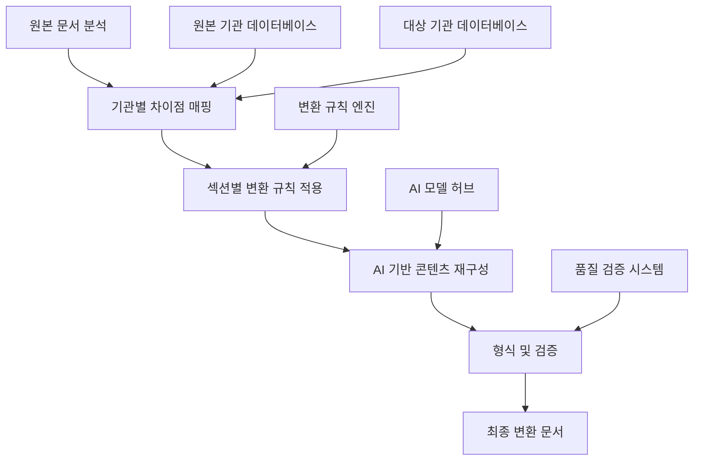

# 🔄 Paperwork AI 2.0 템플릿 변환 시스템 구현 가이드 v2.0

> **프로젝트**: "제출할 문서양식을 AI가 대신 작성해드립니다" - 기관간 문서 변환 시스템  
> **버전**: v2.0.0  
> **작성일**: 2025-08-23  
> **목적**: 동일한 내용을 다른 기관의 요구사항에 맞게 자동 변환하는 핵심 시스템  

---

## 🎯 **핵심 미션**

### 💡 **실제 사용자 시나리오**
```
😰 기업 대표의 현실:
"SBA에 지원사업 신청서를 냈는데 떨어졌어요. 
이제 KOSMES에 내려고 하는데... 내용은 같은데 
양식과 강조점이 달라서 처음부터 다시 써야 해요."

🤖 AI 솔루션:
"기존 SBA 신청서를 업로드하시면, 
KOSMES 양식에 맞게 자동으로 변환해드립니다!"
```

### 🚀 **변환 시스템 개요**
원본 문서의 **핵심 내용과 데이터**는 유지하면서, **대상 기관의 형식과 강조점**에 맞게 자동 재구성하는 지능형 변환 엔진

---

## 🏗️ **변환 시스템 아키텍처**

### 📊 **5단계 변환 파이프라인**


### 🧩 **핵심 변환 엔진**

#### **1. 문서 분석 및 매핑 시스템**
```python
class DocumentAnalyzer:
    """원본 문서 구조 분석 및 콘텐츠 매핑"""
    
    def __init__(self):
        self.section_classifiers = {
            'business_overview': SectionClassifier('사업개요'),
            'market_analysis': SectionClassifier('시장분석'),
            'technical_approach': SectionClassifier('기술접근'),
            'financial_plan': SectionClassifier('재무계획'),
            'team_composition': SectionClassifier('팀구성'),
            'risk_management': SectionClassifier('위험관리'),
            'expected_outcomes': SectionClassifier('기대효과')
        }
    
    async def analyze_source_document(self, document_path: str, source_institution: str) -> Dict:
        """원본 문서 분석 및 구조화"""
        
        # 1. 문서 구조 파악
        document_structure = await self.extract_document_structure(document_path)
        
        # 2. 섹션별 내용 분류
        classified_sections = {}
        for section_name, content in document_structure.items():
            classification_result = await self.classify_section_content(
                content, section_name, source_institution
            )
            classified_sections[section_name] = classification_result
        
        # 3. 핵심 데이터 추출
        key_data = await self.extract_key_business_data(document_structure)
        
        return {
            'source_institution': source_institution,
            'document_type': await self.identify_document_type(document_structure),
            'sections': classified_sections,
            'key_data': key_data,
            'metadata': {
                'page_count': document_structure.get('page_count'),
                'word_count': document_structure.get('word_count'),
                'creation_date': document_structure.get('creation_date')
            }
        }
    
    async def extract_key_business_data(self, document_structure: Dict) -> Dict:
        """비즈니스 핵심 데이터 추출"""
        
        key_data = {
            'company_info': {},
            'financial_data': {},
            'technical_specs': {},
            'market_data': {},
            'team_info': {}
        }
        
        # AI 모델을 사용하여 구조화된 데이터 추출
        extraction_prompt = f"""
        다음 문서에서 핵심 비즈니스 데이터를 추출해주세요:
        
        문서 내용:
        {self.format_document_for_analysis(document_structure)}
        
        추출할 데이터:
        1. 회사 정보 (회사명, 대표자, 설립연도, 직원수, 주소)
        2. 재무 데이터 (매출, 자본금, 손익, 자금조달 계획)
        3. 기술 사양 (핵심기술, 특허, R&D 투자)
        4. 시장 데이터 (시장규모, 경쟁사, 타겟 고객)
        5. 팀 정보 (핵심인력, 경력, 역할)
        
        JSON 형식으로 구조화하여 반환해주세요.
        """
        
        extracted_data = await self.call_ai_model('data_extractor', extraction_prompt)
        return self.parse_extracted_data(extracted_data)
```

#### **2. 기관별 차이점 분석 엔진**
```python
class InstitutionDifferenceAnalyzer:
    """기관간 요구사항 차이점 분석 및 매핑"""
    
    def __init__(self):
        self.db = DatabaseManager()
        self.difference_analyzer = AIModelManager('claude-3.5-sonnet')
    
    async def analyze_conversion_requirements(
        self, 
        source_institution: str, 
        target_institution: str, 
        document_type: str
    ) -> Dict:
        """변환을 위한 기관별 차이점 분석"""
        
        # 1. 기관별 요구사항 조회
        source_reqs = await self.get_institution_requirements(source_institution, document_type)
        target_reqs = await self.get_institution_requirements(target_institution, document_type)
        
        # 2. 섹션별 차이점 매핑
        section_differences = {}
        for target_section in target_reqs['sections']:
            section_differences[target_section] = await self.map_section_differences(
                target_section, source_reqs, target_reqs
            )
        
        # 3. 형식 변환 요구사항
        format_changes = await self.analyze_format_differences(source_reqs, target_reqs)
        
        # 4. 강조점 변화 분석
        emphasis_changes = await self.analyze_emphasis_differences(source_reqs, target_reqs)
        
        return {
            'conversion_type': f"{source_institution}_to_{target_institution}",
            'difficulty_level': self.calculate_conversion_difficulty(source_reqs, target_reqs),
            'section_mapping': section_differences,
            'format_changes': format_changes,
            'emphasis_changes': emphasis_changes,
            'special_considerations': await self.identify_special_considerations(
                source_institution, target_institution
            )
        }
    
    async def map_section_differences(self, target_section: str, source_reqs: Dict, target_reqs: Dict) -> Dict:
        """개별 섹션의 변환 요구사항 분석"""
        
        mapping_prompt = f"""
        다음 섹션을 기관 A에서 기관 B로 변환할 때의 요구사항을 분석해주세요:
        
        대상 섹션: {target_section}
        
        원본 기관 ({source_reqs['institution']}) 요구사항:
        {json.dumps(source_reqs.get('sections', {}).get(target_section, {}), indent=2)}
        
        대상 기관 ({target_reqs['institution']}) 요구사항:
        {json.dumps(target_reqs.get('sections', {}).get(target_section, {}), indent=2)}
        
        분석 결과를 다음 형식으로 제공해주세요:
        1. 변환 난이도 (1-5점)
        2. 주요 변경사항
        3. 강조점 변화
        4. 길이 조정 필요성
        5. 추가/제거할 내용
        6. 톤앤매너 변경점
        """
        
        analysis_result = await self.difference_analyzer.generate(mapping_prompt)
        return self.parse_section_mapping(analysis_result)
```

#### **3. 콘텐츠 변환 실행 엔진**
```python
class ContentConverter:
    """실제 콘텐츠 변환을 수행하는 핵심 엔진"""
    
    def __init__(self):
        self.ai_models = {
            'content_rewriter': 'gpt-4o',           # 콘텐츠 재작성
            'technical_adapter': 'claude-3.5',      # 기술적 내용 적응
            'financial_converter': 'gemini-pro',    # 재무 데이터 변환
            'quality_validator': 'gpt-4.1'          # 품질 검증
        }
    
    async def convert_document_sections(
        self, 
        analyzed_content: Dict, 
        conversion_requirements: Dict,
        target_institution: str
    ) -> Dict:
        """문서 섹션별 변환 실행"""
        
        converted_sections = {}
        
        for section_id, section_data in analyzed_content['sections'].items():
            # 1. 해당 섹션의 변환 규칙 적용
            conversion_rule = conversion_requirements['section_mapping'].get(section_id)
            if not conversion_rule:
                continue
            
            # 2. AI 모델을 사용한 콘텐츠 변환
            converted_content = await self.convert_section_content(
                section_data, conversion_rule, target_institution
            )
            
            # 3. 품질 검증 및 개선
            validated_content = await self.validate_and_improve_section(
                converted_content, conversion_rule
            )
            
            converted_sections[section_id] = validated_content
        
        return converted_sections
    
    async def convert_section_content(self, section_data: Dict, conversion_rule: Dict, target_institution: str) -> Dict:
        """개별 섹션 콘텐츠 변환"""
        
        # 기관별 맞춤형 프롬프트 생성
        conversion_prompt = self.build_conversion_prompt(
            section_data, conversion_rule, target_institution
        )
        
        # AI 모델 선택 (콘텐츠 타입에 따라)
        model_type = self.select_optimal_model(section_data['content_type'])
        
        # 변환 실행
        converted_result = await self.ai_models[model_type].generate(conversion_prompt)
        
        return {
            'original_content': section_data['content'],
            'converted_content': converted_result,
            'conversion_method': model_type,
            'applied_rules': conversion_rule,
            'confidence_score': await self.calculate_conversion_confidence(
                section_data['content'], converted_result, conversion_rule
            )
        }
    
    def build_conversion_prompt(self, section_data: Dict, conversion_rule: Dict, target_institution: str) -> str:
        """기관별 맞춤형 변환 프롬프트 생성"""
        
        institution_profiles = {
            'sba': {
                'tone': '혁신적이고 진취적인',
                'focus': '기술혁신과 글로벌 경쟁력',
                'keywords': ['혁신', '차별화', '독창성', '글로벌'],
                'structure': '개조식 중심, 구체적 수치 강조'
            },
            'kosmes': {
                'tone': '실용적이고 안정적인',
                'focus': '실용화 가능성과 사업화 역량',
                'keywords': ['실용화', '상용화', '안정성', '지속가능성'],
                'structure': '서술형과 개조식 혼용, 구체적 실행계획'
            },
            'nipa': {
                'tone': '기술적이고 전문적인',
                'focus': 'IT 기술력과 디지털 혁신',
                'keywords': ['디지털', '플랫폼', '데이터', '알고리즘'],
                'structure': '기술적 세부사항 중심, 논리적 구조'
            },
            'techno': {
                'tone': '신뢰성 있고 보수적인',
                'focus': '기술적 완성도와 시장 안정성',
                'keywords': ['검증', '안정성', '신뢰성', '지속성'],
                'structure': '보수적 접근, 리스크 관리 강조'
            }
        }
        
        target_profile = institution_profiles.get(target_institution, institution_profiles['sba'])
        
        return f"""
        다음 내용을 {target_institution} 기관의 요구사항에 맞게 변환해주세요:
        
        원본 내용:
        {section_data['content']}
        
        변환 규칙:
        - 톤앤매너: {target_profile['tone']}
        - 핵심 포커스: {target_profile['focus']}
        - 강조 키워드: {', '.join(target_profile['keywords'])}
        - 문서 구조: {target_profile['structure']}
        
        세부 변환 요구사항:
        - 길이 조정: {conversion_rule.get('length_adjustment', '원본 유지')}
        - 강조점 변화: {conversion_rule.get('emphasis_changes', [])}
        - 추가할 내용: {conversion_rule.get('content_additions', [])}
        - 제거할 내용: {conversion_rule.get('content_removals', [])}
        
        지시사항:
        1. 핵심 정보와 데이터는 보존하되, 표현 방식을 조정하세요
        2. {target_institution}에서 중요하게 평가하는 요소를 강조하세요
        3. 해당 기관의 평가 기준에 맞는 논리적 구조로 재구성하세요
        4. 전문적이고 설득력 있는 문체를 유지하세요
        
        변환 결과:
        """
```

---

## 🗄️ **변환 규칙 데이터베이스**

### 📊 **기관별 변환 매트릭스**
```sql
-- 기관별 변환 규칙 테이블
CREATE TABLE conversion_rules (
    id SERIAL PRIMARY KEY,
    source_institution VARCHAR(20) NOT NULL,
    target_institution VARCHAR(20) NOT NULL,
    document_type VARCHAR(50) NOT NULL,
    section_id VARCHAR(50) NOT NULL,
    conversion_difficulty INTEGER DEFAULT 1,    -- 1-5점
    transformation_rules JSONB NOT NULL,        -- 변환 규칙
    success_rate FLOAT DEFAULT 0.0,             -- 변환 성공률
    created_at TIMESTAMP DEFAULT NOW(),
    updated_at TIMESTAMP DEFAULT NOW()
);

-- 변환 성공률 추적을 위한 이력 테이블
CREATE TABLE conversion_history (
    id SERIAL PRIMARY KEY,
    user_id INTEGER,
    source_institution VARCHAR(20) NOT NULL,
    target_institution VARCHAR(20) NOT NULL,
    document_type VARCHAR(50) NOT NULL,
    conversion_quality_score FLOAT,             -- 1-5점 사용자 평가
    processing_time_seconds INTEGER,
    success BOOLEAN DEFAULT true,
    feedback TEXT,
    created_at TIMESTAMP DEFAULT NOW()
);

-- 기관별 선호 스타일 매트릭스
INSERT INTO conversion_rules (source_institution, target_institution, document_type, section_id, conversion_difficulty, transformation_rules) VALUES
-- SBA → KOSMES 변환 예시
('sba', 'kosmes', 'support_business', 'business_overview', 2, '{
    "tone_adjustment": "혁신적 → 실용적",
    "length_change": "+20%",
    "emphasis_shift": ["기술혁신 → 상용화 가능성", "글로벌 진출 → 안정적 성장"],
    "structural_change": "개조식 유지, 구체적 실행계획 추가",
    "keyword_replacement": {
        "혁신": "실용화",
        "차별화": "상용화",
        "글로벌": "안정적"
    }
}'),

-- NIPA → SBA 변환 예시
('nipa', 'sba', 'support_business', 'technical_approach', 3, '{
    "tone_adjustment": "기술중심 → 사업중심",
    "length_change": "-15%",
    "emphasis_shift": ["기술스펙 → 시장성", "플랫폼 구조 → 비즈니스 모델"],
    "structural_change": "기술적 세부사항 축소, 사업적 가치 강조",
    "additional_content": ["시장 진출 전략", "글로벌 확장성"]
}');
```

---

## 🔧 **변환 품질 관리 시스템**

### 🎯 **다단계 품질 검증**
```python
class ConversionQualityManager:
    """변환 품질 관리 및 최적화 시스템"""
    
    def __init__(self):
        self.quality_metrics = {
            'content_preservation': 0.3,    # 내용 보존도
            'format_compliance': 0.25,      # 형식 준수도  
            'institution_alignment': 0.25,  # 기관 적합도
            'readability': 0.2              # 가독성
        }
    
    async def evaluate_conversion_quality(self, conversion_result: Dict) -> Dict:
        """변환 결과 품질 종합 평가"""
        
        quality_scores = {}
        
        # 1. 내용 보존도 평가
        quality_scores['content_preservation'] = await self.evaluate_content_preservation(
            conversion_result['original_content'],
            conversion_result['converted_content']
        )
        
        # 2. 형식 준수도 평가
        quality_scores['format_compliance'] = await self.evaluate_format_compliance(
            conversion_result['converted_content'],
            conversion_result['target_requirements']
        )
        
        # 3. 기관 적합도 평가
        quality_scores['institution_alignment'] = await self.evaluate_institution_alignment(
            conversion_result['converted_content'],
            conversion_result['target_institution']
        )
        
        # 4. 가독성 평가
        quality_scores['readability'] = await self.evaluate_readability(
            conversion_result['converted_content']
        )
        
        # 5. 종합 점수 계산
        overall_score = sum(
            score * weight 
            for score, weight in zip(quality_scores.values(), self.quality_metrics.values())
        )
        
        return {
            'overall_score': overall_score,
            'detailed_scores': quality_scores,
            'improvement_suggestions': await self.generate_improvement_suggestions(quality_scores),
            'pass_threshold': overall_score >= 0.7  # 70% 이상 통과
        }
    
    async def generate_improvement_suggestions(self, quality_scores: Dict) -> List[str]:
        """품질 개선 제안 생성"""
        
        suggestions = []
        
        if quality_scores['content_preservation'] < 0.7:
            suggestions.append("핵심 정보가 누락되었을 가능성이 있습니다. 원본 내용을 더 자세히 보존하세요.")
        
        if quality_scores['format_compliance'] < 0.7:
            suggestions.append("대상 기관의 형식 요구사항을 더 정확히 준수해야 합니다.")
        
        if quality_scores['institution_alignment'] < 0.7:
            suggestions.append("대상 기관의 평가 기준과 선호 스타일을 더 반영하세요.")
        
        if quality_scores['readability'] < 0.7:
            suggestions.append("문서의 가독성과 논리적 흐름을 개선하세요.")
        
        return suggestions
```

---

## 🚀 **구현 로드맵**

### 📅 **Phase 1: 핵심 변환 엔진 (2주)**
- [ ] 문서 분석 및 구조화 시스템 구현
- [ ] 기관별 차이점 매핑 알고리즘 개발
- [ ] 기본 변환 규칙 데이터베이스 구축 (SBA ↔ KOSMES)

### 📅 **Phase 2: AI 변환 고도화 (2주)**
- [ ] 멀티 AI 모델 변환 시스템 구축
- [ ] 품질 평가 및 개선 시스템 개발
- [ ] 실시간 변환 성능 모니터링

### 📅 **Phase 3: 전체 기관 확장 (2주)**  
- [ ] 전체 기관 변환 매트릭스 완성 (NIPA, TECHNO 포함)
- [ ] 사용자 피드백 기반 자동 학습 시스템
- [ ] 변환 결과 최적화 엔진

---

**💡 핵심 가치**: "한 번 작성으로 모든 기관 대응" - 동일한 사업 내용을 각 기관의 특성과 요구사항에 맞게 AI가 자동으로 최적화하여 변환하는 혁신적인 시스템

*📝 이 시스템으로 기업들이 여러 기관에 지원할 때 겪는 "같은 내용, 다른 양식" 문제를 완전히 해결하고, 지원 성공률을 획기적으로 향상시킬 수 있습니다.*