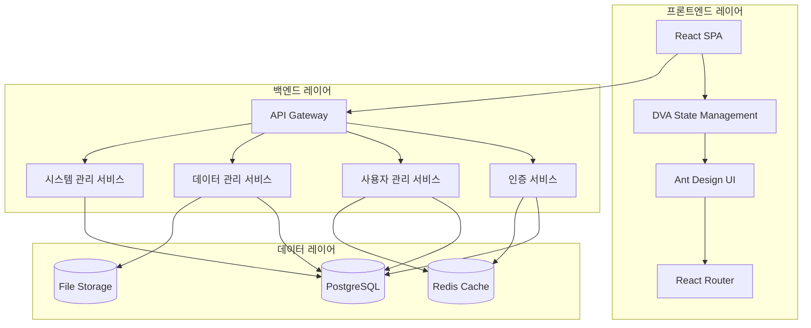

# 🏥 HEAL7 관리자 대시보드 종합 설계서 v1.0

> **프로젝트**: HEAL7 관리자 포털 (admin.heal7.com) 종합 설계  
> **버전**: v1.0.0  
> **설계일**: 2025-08-19  
> **최종 수정**: 2025-08-19 13:05 KST  
> **설계자**: HEAL7 Architecture Team  
> **목적**: admin.heal7.com의 완전한 복제 구현을 위한 종합 설계서

## 📋 **설계 완성 현황**

### ✅ **완성된 설계 영역**
```
🏗️ 시스템 아키텍처
├── ✅ 전체 시스템 구조 설계
├── ✅ 마이크로서비스 아키텍처 
├── ✅ 기술 스택 선정
└── ✅ 보안 아키텍처 설계

🎨 UI/UX 디자인 시스템  
├── ✅ 관리자 대시보드 레이아웃
├── ✅ 컴포넌트 설계
├── ✅ 색상 및 타이포그래피
└── ✅ 반응형 디자인 전략

🚀 백엔드 API 아키텍처
├── ✅ RESTful API 설계
├── ✅ 인증/인가 시스템
├── ✅ 데이터베이스 스키마
└── ✅ 성능 최적화 전략

💻 프론트엔드 아키텍처
├── ✅ React + DVA + Ant Design
├── ✅ 상태 관리 패턴
├── ✅ 컴포넌트 구조
└── ✅ 파일 구조 설계

🔐 보안 및 권한 관리
├── ✅ JWT 인증 시스템
├── ✅ RBAC 권한 체계
├── ✅ 데이터 보안 전략
└── ✅ API 보안 설계
```

## 🎯 **시스템 개요**

### **🏥 시스템 정보**
- **도메인**: admin.heal7.com
- **시스템명**: HEAL7 관리자 대시보드
- **언어**: 한국어 (Korean)
- **시스템 유형**: 웹 기반 SPA 관리자 포털
- **접근 제어**: JWT 기반 다중 권한 시스템

### **🚀 핵심 목표**
- **완전한 복제**: 기존 admin.heal7.com과 동일한 기능 제공
- **확장성**: 향후 새로운 기능 추가 용이
- **보안성**: 엔터프라이즈급 보안 수준
- **사용성**: 직관적인 관리자 경험

## 🏗️ **시스템 아키텍처**

### **📊 전체 시스템 구조**


### **⚙️ 기술 스택 아키텍처**

#### **🎨 프론트엔드 스택**
```yaml
core_framework:
  primary: "React.js v18+"
  state_management: "DVA (Data, View, Action)"
  ui_framework: "Ant Design v5.0+"
  routing: "React Router v6+"
  
development_tools:
  build_tool: "Vite 또는 Webpack 5"
  transpiler: "Babel"
  css_processor: "Less (Ant Design 호환)"
  bundler: "Rollup 또는 Webpack"
  
utilities:
  http_client: "Axios"
  date_library: "Day.js"
  charts: "ECharts 또는 Chart.js"
  icons: "Ant Design Icons"
  
dev_experience:
  hot_reload: "React Fast Refresh"
  dev_server: "Vite Dev Server"
  proxy: "API 프록시 설정"
```

#### **🚀 백엔드 스택**
```yaml
backend_framework:
  primary: "Node.js + Express.js"
  alternative: "Java Spring Boot"
  api_style: "RESTful API"
  
database_layer:
  primary_db: "PostgreSQL 15+"
  cache_layer: "Redis 7+"
  file_storage: "AWS S3 또는 MinIO"
  
authentication:
  jwt_library: "jsonwebtoken"
  password_hash: "bcrypt"
  session_store: "Redis"
  
middleware:
  cors: "cors 미들웨어"
  rate_limiting: "express-rate-limit"
  validation: "joi 또는 express-validator"
  logging: "winston"
```

### **🔒 보안 아키텍처**
```yaml
authentication:
  method: "JWT 기반 무상태 인증"
  token_expiry: 
    access_token: "1시간"
    refresh_token: "7일"
  storage: "httpOnly 쿠키 (XSS 방지)"
  
authorization:
  model: "RBAC (Role-Based Access Control)"
  roles: ["super_admin", "admin", "manager", "operator"]
  permissions: ["read", "write", "delete", "manage"]
  
data_protection:
  encryption: "AES-256-GCM (민감 데이터)"
  password_hash: "bcrypt (salt rounds: 12)"
  https: "TLS 1.3 강제"
  
api_security:
  rate_limiting: "IP별 분당 100 요청"
  cors_policy: "허용된 도메인만 접근"
  input_validation: "모든 입력 데이터 검증"
  sql_injection: "파라미터화된 쿼리 사용"
```

## 🎨 **UI/UX 디자인 시스템**

### **🌈 색상 시스템**
```scss
// 🎯 HEAL7 Admin 색상 팔레트
$heal7-admin-colors: (
  // 🔵 Primary Colors (신뢰성과 전문성)
  primary: (
    50:  #e6f3ff,   // 매우 연한 블루
    100: #bae0ff,   // 연한 블루  
    200: #91caff,   // 중간 연한 블루
    300: #69b1ff,   // 중간 블루
    400: #4096ff,   // 밝은 블루
    500: #1890ff,   // 메인 블루 (Ant Design 기본)
    600: #096dd9,   // 진한 블루
    700: #0050b3,   // 더 진한 블루
    800: #003a8c,   // 매우 진한 블루
    900: #002766,   // 가장 진한 블루
  ),
  
  // 🟢 Success Colors (성공/승인)
  success: (
    500: #52c41a,   // 성공 그린
    600: #389e0d,   // 진한 그린
  ),
  
  // 🟠 Warning Colors (경고/대기)
  warning: (
    500: #faad14,   // 경고 오렌지
    600: #d48806,   // 진한 오렌지
  ),
  
  // 🔴 Error Colors (오류/거부)
  error: (
    500: #f5222d,   // 오류 레드
    600: #cf1322,   // 진한 레드
  ),
  
  // ⚫ Neutral Colors (텍스트/배경)
  neutral: (
    50:  #fafafa,   // 매우 연한 회색 (배경)
    100: #f5f5f5,   // 연한 회색 (카드 배경)
    200: #f0f0f0,   // 중간 연한 회색 (구분선)
    300: #d9d9d9,   // 중간 회색 (비활성 테두리)
    400: #bfbfbf,   // 진한 중간 회색 (placeholder)
    500: #8c8c8c,   // 진한 회색 (보조 텍스트)
    600: #595959,   // 매우 진한 회색 (일반 텍스트)
    700: #434343,   // 가장 진한 회색 (제목)
    800: #262626,   // 검정에 가까운 회색 (강조 텍스트)
    900: #1f1f1f,   // 거의 검정 (최고 대비)
  )
);

// 🎨 테마 변수
:root {
  --heal7-primary: #1890ff;
  --heal7-success: #52c41a;
  --heal7-warning: #faad14;
  --heal7-error: #f5222d;
  
  --heal7-bg-layout: #f0f2f5;
  --heal7-bg-container: #ffffff;
  --heal7-bg-elevated: #ffffff;
  
  --heal7-text-primary: #262626;
  --heal7-text-secondary: #8c8c8c;
  --heal7-text-disabled: #bfbfbf;
  
  --heal7-border-color: #d9d9d9;
  --heal7-border-color-split: #f0f0f0;
  
  --heal7-shadow-sm: 0 1px 2px 0 rgba(0, 0, 0, 0.03);
  --heal7-shadow-md: 0 1px 6px -1px rgba(0, 0, 0, 0.02), 0 2px 4px -1px rgba(0, 0, 0, 0.06);
  --heal7-shadow-lg: 0 10px 15px -3px rgba(0, 0, 0, 0.1), 0 4px 6px -2px rgba(0, 0, 0, 0.05);
}
```

### **📱 레이아웃 아키텍처**
```html
<!-- 🏗️ 메인 레이아웃 구조 -->
<div class="heal7-admin-layout">
  <!-- 📄 상단 헤더 (고정) -->
  <header class="heal7-header">
    <div class="header-left">
      
      <span class="system-title">관리자 대시보드</span>
    </div>
    
    <div class="header-center">
      <SearchInput placeholder="통합 검색..." />
    </div>
    
    <div class="header-right">
      <NotificationBell />
      <UserProfileDropdown />
    </div>
  </header>
  
  <!-- 🔗 메인 컨텐츠 영역 -->
  <div class="heal7-content">
    <!-- 📋 좌측 사이드바 -->
    <aside class="heal7-sidebar">
      <nav class="sidebar-menu">
        <MenuGroup title="📊 대시보드">
          <MenuItem icon="📈" route="/dashboard">통계 개요</MenuItem>
          <MenuItem icon="📋" route="/monitor">실시간 모니터링</MenuItem>
        </MenuGroup>
        
        <MenuGroup title="👥 사용자 관리">
          <MenuItem icon="👤" route="/users">회원 관리</MenuItem>
          <MenuItem icon="👥" route="/groups">그룹 관리</MenuItem>
          <MenuItem icon="🔐" route="/permissions">권한 설정</MenuItem>
        </MenuGroup>
        
        <MenuGroup title="🏥 HEAL7 서비스">
          <MenuItem icon="🩺" route="/medical">의료 서비스</MenuItem>
          <MenuItem icon="💊" route="/prescription">처방 관리</MenuItem>
          <MenuItem icon="📋" route="/records">의료 기록</MenuItem>
        </MenuGroup>
        
        <MenuGroup title="📊 데이터 관리">
          <MenuItem icon="📈" route="/analytics">통계 분석</MenuItem>
          <MenuItem icon="📊" route="/reports">리포트 생성</MenuItem>
          <MenuItem icon="📁" route="/backup">데이터 백업</MenuItem>
        </MenuGroup>
        
        <MenuGroup title="⚙️ 시스템 설정">
          <MenuItem icon="🔧" route="/settings">기본 설정</MenuItem>
          <MenuItem icon="🔐" route="/security">보안 설정</MenuItem>
          <MenuItem icon="📝" route="/logs">로그 관리</MenuItem>
        </MenuGroup>
      </nav>
    </aside>
    
    <!-- 📄 메인 컨텐츠 -->
    <main class="heal7-main">
      <!-- 🍞 브레드크럼 네비게이션 -->
      <Breadcrumb />
      
      <!-- 📄 페이지 컨텐츠 -->
      <div class="page-content">
        <Router />
      </div>
    </main>
  </div>
</div>
```

### **🧩 핵심 컴포넌트 설계**
```typescript
// 📊 대시보드 카드 컴포넌트
interface DashboardCardProps {
  title: string;
  value: number | string;
  icon: ReactNode;
  trend?: 'up' | 'down' | 'stable';
  trendValue?: number;
  color?: 'primary' | 'success' | 'warning' | 'error';
}

const DashboardCard: React.FC<DashboardCardProps> = ({
  title, value, icon, trend, trendValue, color = 'primary'
}) => (
  <Card className={`dashboard-card dashboard-card--${color}`}>
    <div className="card-header">
      <span className="card-icon">{icon}</span>
      <span className="card-title">{title}</span>
    </div>
    <div className="card-value">{value}</div>
    {trend && (
      <div className={`card-trend card-trend--${trend}`}>
        <Icon type={trend === 'up' ? 'arrow-up' : 'arrow-down'} />
        <span>{trendValue}%</span>
      </div>
    )}
  </Card>
);

// 📋 데이터 테이블 컴포넌트
interface DataTableProps<T> {
  columns: ColumnDef<T>[];
  data: T[];
  loading?: boolean;
  pagination?: PaginationProps;
  selection?: boolean;
  actions?: TableAction<T>[];
}

const DataTable = <T extends Record<string, any>>({
  columns, data, loading, pagination, selection, actions
}: DataTableProps<T>) => (
  <Card>
    <Table
      columns={[
        ...(selection ? [selectionColumn] : []),
        ...columns,
        ...(actions ? [actionsColumn(actions)] : [])
      ]}
      dataSource={data}
      loading={loading}
      pagination={pagination}
      rowSelection={selection ? { type: 'checkbox' } : undefined}
      scroll={{ x: 'max-content' }}
    />
  </Card>
);
```

## 🚀 **핵심 기능 아키텍처**

### **🔐 인증 및 권한 시스템**
```typescript
// 🔑 인증 상태 관리 (DVA 모델)
interface AuthState {
  currentUser: User | null;
  isAuthenticated: boolean;
  permissions: Permission[];
  token: string | null;
}

const authModel: DVAModel = {
  namespace: 'auth',
  
  state: {
    currentUser: null,
    isAuthenticated: false,
    permissions: [],
    token: localStorage.getItem('heal7_token')
  },
  
  effects: {
    // 🔐 로그인 처리
    *login({ payload }, { call, put }) {
      try {
        const response = yield call(authAPI.login, payload);
        const { token, user, permissions } = response.data;
        
        // 토큰 저장
        localStorage.setItem('heal7_token', token);
        
        yield put({
          type: 'setAuthState',
          payload: { 
            currentUser: user, 
            isAuthenticated: true, 
            permissions,
            token 
          }
        });
        
        // 대시보드로 리다이렉트
        history.push('/dashboard');
        
      } catch (error) {
        message.error('로그인에 실패했습니다.');
      }
    },
    
    // 🚪 로그아웃 처리
    *logout(_, { put }) {
      localStorage.removeItem('heal7_token');
      yield put({ type: 'clearAuth' });
      history.push('/login');
    },
    
    // 🔄 토큰 갱신
    *refreshToken(_, { call, put, select }) {
      try {
        const response = yield call(authAPI.refreshToken);
        const { token } = response.data;
        
        localStorage.setItem('heal7_token', token);
        yield put({ type: 'setToken', payload: token });
        
      } catch (error) {
        yield put({ type: 'logout' });
      }
    }
  },
  
  reducers: {
    setAuthState(state, { payload }) {
      return { ...state, ...payload };
    },
    
    clearAuth() {
      return {
        currentUser: null,
        isAuthenticated: false,
        permissions: [],
        token: null
      };
    }
  }
};
```

### **👥 사용자 관리 시스템**
```typescript
// 👤 사용자 관리 API
interface User {
  id: number;
  username: string;
  email: string;
  firstName: string;
  lastName: string;
  role: UserRole;
  status: 'active' | 'inactive' | 'suspended';
  lastLogin: Date;
  createdAt: Date;
  updatedAt: Date;
}

interface UserRole {
  id: number;
  name: string;
  description: string;
  permissions: Permission[];
}

interface Permission {
  id: number;
  name: string;
  resource: string;
  action: 'read' | 'write' | 'delete' | 'manage';
}

// 🔍 사용자 목록 조회
const getUsersList = async (params: {
  page?: number;
  pageSize?: number;
  search?: string;
  role?: string;
  status?: string;
}): Promise<PaginatedResponse<User>> => {
  const response = await apiClient.get('/api/users', { params });
  return response.data;
};

// ➕ 사용자 생성
const createUser = async (userData: Omit<User, 'id' | 'createdAt' | 'updatedAt'>): Promise<User> => {
  const response = await apiClient.post('/api/users', userData);
  return response.data;
};

// ✏️ 사용자 수정
const updateUser = async (id: number, userData: Partial<User>): Promise<User> => {
  const response = await apiClient.put(`/api/users/${id}`, userData);
  return response.data;
};

// 🗑️ 사용자 삭제
const deleteUser = async (id: number): Promise<void> => {
  await apiClient.delete(`/api/users/${id}`);
};
```

### **📊 대시보드 시스템**
```typescript
// 📈 대시보드 데이터 인터페이스
interface DashboardStats {
  totalUsers: number;
  activeUsers: number;
  totalSessions: number;
  avgSessionDuration: number;
  errorRate: number;
  systemHealth: 'healthy' | 'warning' | 'critical';
}

interface ChartData {
  labels: string[];
  datasets: {
    label: string;
    data: number[];
    borderColor: string;
    backgroundColor: string;
  }[];
}

// 📊 대시보드 컴포넌트
const Dashboard: React.FC = () => {
  const [stats, setStats] = useState<DashboardStats | null>(null);
  const [chartData, setChartData] = useState<ChartData | null>(null);
  const [loading, setLoading] = useState(true);

  useEffect(() => {
    const fetchDashboardData = async () => {
      try {
        const [statsResponse, chartResponse] = await Promise.all([
          dashboardAPI.getStats(),
          dashboardAPI.getChartData({ period: '7days' })
        ]);
        
        setStats(statsResponse.data);
        setChartData(chartResponse.data);
      } catch (error) {
        message.error('대시보드 데이터를 불러오는데 실패했습니다.');
      } finally {
        setLoading(false);
      }
    };

    fetchDashboardData();
    
    // 30초마다 실시간 업데이트
    const interval = setInterval(fetchDashboardData, 30000);
    return () => clearInterval(interval);
  }, []);

  if (loading) return <PageLoading />;

  return (
    <div className="dashboard">
      {/* 📊 주요 지표 카드 */}
      <Row gutter={[16, 16]}>
        <Col xs={24} sm={12} lg={6}>
          <DashboardCard
            title="전체 사용자"
            value={stats?.totalUsers || 0}
            icon={<UserOutlined />}
            color="primary"
          />
        </Col>
        <Col xs={24} sm={12} lg={6}>
          <DashboardCard
            title="활성 사용자"
            value={stats?.activeUsers || 0}
            icon={<TeamOutlined />}
            color="success"
          />
        </Col>
        <Col xs={24} sm={12} lg={6}>
          <DashboardCard
            title="총 세션"
            value={stats?.totalSessions || 0}
            icon={<GlobalOutlined />}
            color="warning"
          />
        </Col>
        <Col xs={24} sm={12} lg={6}>
          <DashboardCard
            title="오류율"
            value={`${stats?.errorRate || 0}%`}
            icon={<ExclamationCircleOutlined />}
            color="error"
          />
        </Col>
      </Row>

      {/* 📈 차트 섹션 */}
      <Row gutter={[16, 16]} style={{ marginTop: 16 }}>
        <Col xs={24} lg={16}>
          <Card title="사용자 활동 추이">
            <LineChart data={chartData} height={300} />
          </Card>
        </Col>
        <Col xs={24} lg={8}>
          <Card title="시스템 상태">
            <SystemHealthMonitor health={stats?.systemHealth} />
          </Card>
        </Col>
      </Row>
    </div>
  );
};
```

## 🗄️ **데이터베이스 설계**

### **📊 주요 테이블 스키마**
```sql
-- 👤 사용자 테이블
CREATE TABLE users (
    id SERIAL PRIMARY KEY,
    username VARCHAR(50) UNIQUE NOT NULL,
    email VARCHAR(100) UNIQUE NOT NULL,
    password_hash VARCHAR(255) NOT NULL,
    first_name VARCHAR(50),
    last_name VARCHAR(50),
    role_id INTEGER REFERENCES roles(id),
    status user_status DEFAULT 'active',
    last_login TIMESTAMP,
    created_at TIMESTAMP DEFAULT CURRENT_TIMESTAMP,
    updated_at TIMESTAMP DEFAULT CURRENT_TIMESTAMP
);

-- 🏷️ 역할 테이블
CREATE TABLE roles (
    id SERIAL PRIMARY KEY,
    name VARCHAR(50) UNIQUE NOT NULL,
    description TEXT,
    is_active BOOLEAN DEFAULT true,
    created_at TIMESTAMP DEFAULT CURRENT_TIMESTAMP
);

-- 🔐 권한 테이블
CREATE TABLE permissions (
    id SERIAL PRIMARY KEY,
    name VARCHAR(100) NOT NULL,
    resource VARCHAR(50) NOT NULL,
    action permission_action NOT NULL,
    description TEXT,
    UNIQUE(resource, action)
);

-- 🔗 역할-권한 연결 테이블
CREATE TABLE role_permissions (
    role_id INTEGER REFERENCES roles(id) ON DELETE CASCADE,
    permission_id INTEGER REFERENCES permissions(id) ON DELETE CASCADE,
    PRIMARY KEY (role_id, permission_id)
);

-- 📝 사용자 활동 로그
CREATE TABLE user_logs (
    id SERIAL PRIMARY KEY,
    user_id INTEGER REFERENCES users(id),
    action VARCHAR(100) NOT NULL,
    resource VARCHAR(100),
    resource_id INTEGER,
    ip_address INET,
    user_agent TEXT,
    details JSONB,
    created_at TIMESTAMP DEFAULT CURRENT_TIMESTAMP
);

-- 🔧 시스템 설정
CREATE TABLE system_settings (
    id SERIAL PRIMARY KEY,
    category VARCHAR(50) NOT NULL,
    key VARCHAR(100) NOT NULL,
    value TEXT,
    description TEXT,
    is_public BOOLEAN DEFAULT false,
    updated_by INTEGER REFERENCES users(id),
    updated_at TIMESTAMP DEFAULT CURRENT_TIMESTAMP,
    UNIQUE(category, key)
);

-- 📊 시스템 메트릭
CREATE TABLE system_metrics (
    id SERIAL PRIMARY KEY,
    metric_name VARCHAR(100) NOT NULL,
    metric_value NUMERIC,
    metric_unit VARCHAR(20),
    tags JSONB,
    recorded_at TIMESTAMP DEFAULT CURRENT_TIMESTAMP
);

-- 🔔 알림 테이블
CREATE TABLE notifications (
    id SERIAL PRIMARY KEY,
    user_id INTEGER REFERENCES users(id),
    title VARCHAR(200) NOT NULL,
    message TEXT,
    type notification_type DEFAULT 'info',
    is_read BOOLEAN DEFAULT false,
    data JSONB,
    created_at TIMESTAMP DEFAULT CURRENT_TIMESTAMP
);

-- 📈 대시보드 위젯 설정
CREATE TABLE dashboard_widgets (
    id SERIAL PRIMARY KEY,
    user_id INTEGER REFERENCES users(id),
    widget_type VARCHAR(50) NOT NULL,
    position_x INTEGER DEFAULT 0,
    position_y INTEGER DEFAULT 0,
    width INTEGER DEFAULT 1,
    height INTEGER DEFAULT 1,
    config JSONB,
    is_active BOOLEAN DEFAULT true,
    created_at TIMESTAMP DEFAULT CURRENT_TIMESTAMP
);

-- 📊 성능 모니터링
CREATE TABLE performance_logs (
    id SERIAL PRIMARY KEY,
    endpoint VARCHAR(200),
    method VARCHAR(10),
    response_time INTEGER,
    status_code INTEGER,
    user_id INTEGER REFERENCES users(id),
    ip_address INET,
    logged_at TIMESTAMP DEFAULT CURRENT_TIMESTAMP
);

-- 🗂️ 커스텀 타입 정의
CREATE TYPE user_status AS ENUM ('active', 'inactive', 'suspended', 'pending');
CREATE TYPE permission_action AS ENUM ('read', 'write', 'delete', 'manage');
CREATE TYPE notification_type AS ENUM ('info', 'success', 'warning', 'error');

-- 📇 인덱스 최적화
CREATE INDEX idx_users_email ON users(email);
CREATE INDEX idx_users_username ON users(username);
CREATE INDEX idx_users_role_id ON users(role_id);
CREATE INDEX idx_users_status ON users(status);
CREATE INDEX idx_user_logs_user_id ON user_logs(user_id);
CREATE INDEX idx_user_logs_created_at ON user_logs(created_at);
CREATE INDEX idx_user_logs_action ON user_logs(action);
CREATE INDEX idx_notifications_user_id ON notifications(user_id);
CREATE INDEX idx_notifications_is_read ON notifications(is_read);
CREATE INDEX idx_system_metrics_metric_name ON system_metrics(metric_name);
CREATE INDEX idx_system_metrics_recorded_at ON system_metrics(recorded_at);
CREATE INDEX idx_performance_logs_endpoint ON performance_logs(endpoint);
CREATE INDEX idx_performance_logs_logged_at ON performance_logs(logged_at);
```

## 🚀 **API 설계 아키텍처**

### **🔗 RESTful API 엔드포인트**
```yaml
# 🔐 인증 관련 API
auth_endpoints:
  - POST /api/auth/login          # 로그인
  - POST /api/auth/logout         # 로그아웃  
  - POST /api/auth/refresh        # 토큰 갱신
  - GET  /api/auth/me             # 현재 사용자 정보
  - POST /api/auth/change-password # 비밀번호 변경

# 👥 사용자 관리 API
user_endpoints:
  - GET    /api/users             # 사용자 목록 조회
  - GET    /api/users/:id         # 사용자 상세 조회
  - POST   /api/users             # 사용자 생성
  - PUT    /api/users/:id         # 사용자 수정
  - DELETE /api/users/:id         # 사용자 삭제
  - POST   /api/users/:id/activate   # 사용자 활성화
  - POST   /api/users/:id/deactivate # 사용자 비활성화

# 🏷️ 역할 및 권한 API
role_endpoints:
  - GET    /api/roles             # 역할 목록
  - GET    /api/roles/:id         # 역할 상세
  - POST   /api/roles             # 역할 생성
  - PUT    /api/roles/:id         # 역할 수정
  - DELETE /api/roles/:id         # 역할 삭제
  - GET    /api/permissions       # 권한 목록
  - POST   /api/roles/:id/permissions # 역할에 권한 할당

# 📊 대시보드 API
dashboard_endpoints:
  - GET /api/dashboard/stats      # 대시보드 통계
  - GET /api/dashboard/charts     # 차트 데이터
  - GET /api/dashboard/widgets    # 위젯 설정
  - PUT /api/dashboard/widgets    # 위젯 배치 저장

# 📝 로그 관리 API
log_endpoints:
  - GET /api/logs/users           # 사용자 활동 로그
  - GET /api/logs/system          # 시스템 로그
  - GET /api/logs/performance     # 성능 로그
  - GET /api/logs/errors          # 에러 로그

# 🔔 알림 API
notification_endpoints:
  - GET    /api/notifications     # 알림 목록
  - PUT    /api/notifications/:id/read # 알림 읽음 처리
  - DELETE /api/notifications/:id # 알림 삭제
  - POST   /api/notifications/broadcast # 전체 알림 발송

# ⚙️ 시스템 설정 API
settings_endpoints:
  - GET    /api/settings          # 설정 목록
  - GET    /api/settings/:category # 카테고리별 설정
  - PUT    /api/settings/:category/:key # 설정 값 변경
  - GET    /api/system/health     # 시스템 상태
  - GET    /api/system/metrics    # 시스템 메트릭

# 📤 파일 업로드 API
upload_endpoints:
  - POST   /api/upload/avatar     # 프로필 이미지 업로드
  - POST   /api/upload/documents  # 문서 파일 업로드
  - GET    /api/files/:id         # 파일 다운로드
  - DELETE /api/files/:id         # 파일 삭제
```

### **📋 API 응답 형식 표준**
```typescript
// ✅ 성공 응답 형식
interface SuccessResponse<T = any> {
  success: true;
  data: T;
  message?: string;
  meta?: {
    total?: number;
    page?: number;
    pageSize?: number;
    hasNextPage?: boolean;
  };
}

// ❌ 에러 응답 형식
interface ErrorResponse {
  success: false;
  error: {
    code: string;
    message: string;
    details?: any;
  };
}

// 📄 페이지네이션 응답
interface PaginatedResponse<T> {
  success: true;
  data: T[];
  meta: {
    total: number;
    page: number;
    pageSize: number;
    totalPages: number;
    hasNextPage: boolean;
    hasPrevPage: boolean;
  };
}

// 📊 API 사용 예시
const loginAPI = async (credentials: LoginCredentials): Promise<SuccessResponse<{
  token: string;
  user: User;
  permissions: Permission[];
}>> => {
  const response = await fetch('/api/auth/login', {
    method: 'POST',
    headers: { 'Content-Type': 'application/json' },
    body: JSON.stringify(credentials)
  });
  return response.json();
};
```

## 📁 **프로젝트 파일 구조**

### **🎨 프론트엔드 파일 구조**
```
heal7-admin-frontend/
├── 📦 public/
│   ├── index.html
│   ├── favicon.ico
│   └── manifest.json
│
├── 📁 src/
│   ├── 📁 components/           # 재사용 컴포넌트
│   │   ├── 📁 common/          # 공통 컴포넌트
│   │   │   ├── Header/
│   │   │   │   ├── index.tsx
│   │   │   │   ├── index.less
│   │   │   │   └── UserProfile.tsx
│   │   │   ├── Sidebar/
│   │   │   │   ├── index.tsx
│   │   │   │   ├── index.less
│   │   │   │   └── MenuItem.tsx
│   │   │   ├── Layout/
│   │   │   │   ├── BasicLayout.tsx
│   │   │   │   ├── LoginLayout.tsx
│   │   │   │   └── index.less
│   │   │   └── PageLoading/
│   │   │       ├── index.tsx
│   │   │       └── index.less
│   │   ├── 📁 forms/           # 폼 컴포넌트
│   │   │   ├── LoginForm/
│   │   │   ├── UserForm/
│   │   │   ├── RoleForm/
│   │   │   └── SettingsForm/
│   │   ├── 📁 charts/          # 차트 컴포넌트
│   │   │   ├── LineChart/
│   │   │   ├── BarChart/
│   │   │   ├── PieChart/
│   │   │   └── DashboardCard/
│   │   └── 📁 tables/          # 테이블 컴포넌트
│   │       ├── DataTable/
│   │       ├── UserTable/
│   │       └── LogTable/
│   │
│   ├── 📁 pages/               # 페이지 컴포넌트
│   │   ├── 📁 auth/           # 인증 페이지
│   │   │   ├── Login/
│   │   │   │   ├── index.tsx
│   │   │   │   └── index.less
│   │   │   └── Profile/
│   │   ├── 📁 dashboard/       # 대시보드
│   │   │   ├── index.tsx
│   │   │   ├── index.less
│   │   │   ├── StatsOverview.tsx
│   │   │   └── RealTimeMonitor.tsx
│   │   ├── 📁 users/          # 사용자 관리
│   │   │   ├── UserList/
│   │   │   ├── UserDetail/
│   │   │   ├── UserEdit/
│   │   │   └── RoleManagement/
│   │   ├── 📁 heal7/          # HEAL7 서비스
│   │   │   ├── MedicalService/
│   │   │   ├── Prescription/
│   │   │   └── Records/
│   │   ├── 📁 data/           # 데이터 관리
│   │   │   ├── Analytics/
│   │   │   ├── Reports/
│   │   │   └── Backup/
│   │   └── 📁 settings/       # 시스템 설정
│   │       ├── General/
│   │       ├── Security/
│   │       └── Logs/
│   │
│   ├── 📁 models/             # DVA 모델 (상태 관리)
│   │   ├── auth.ts
│   │   ├── user.ts
│   │   ├── dashboard.ts
│   │   ├── notification.ts
│   │   └── global.ts
│   │
│   ├── 📁 services/           # API 서비스
│   │   ├── auth.ts
│   │   ├── user.ts
│   │   ├── dashboard.ts
│   │   ├── upload.ts
│   │   └── common.ts
│   │
│   ├── 📁 utils/              # 유틸리티 함수
│   │   ├── request.ts         # HTTP 클라이언트
│   │   ├── auth.ts            # 인증 헬퍼
│   │   ├── format.ts          # 데이터 포맷터
│   │   ├── validation.ts      # 유효성 검사
│   │   ├── constants.ts       # 상수 정의
│   │   └── permission.ts      # 권한 체크
│   │
│   ├── 📁 hooks/              # 커스텀 훅
│   │   ├── useAuth.ts
│   │   ├── usePermission.ts
│   │   ├── usePagination.ts
│   │   └── useWebSocket.ts
│   │
│   ├── 📁 assets/             # 정적 자원
│   │   ├── 📁 images/
│   │   │   ├── logo.svg
│   │   │   ├── avatar-default.png
│   │   │   └── icons/
│   │   ├── 📁 styles/
│   │   │   ├── global.less
│   │   │   ├── variables.less
│   │   │   ├── mixins.less
│   │   │   └── themes/
│   │   │       ├── default.less
│   │   │       └── dark.less
│   │   └── 📁 fonts/
│   │
│   ├── 📁 locales/            # 다국어 지원
│   │   ├── ko-KR.ts
│   │   ├── en-US.ts
│   │   └── index.ts
│   │
│   ├── 📁 config/             # 설정 파일
│   │   ├── router.ts          # 라우터 설정
│   │   ├── dva.ts             # DVA 설정
│   │   ├── api.ts             # API 설정
│   │   └── constants.ts       # 환경 상수
│   │
│   ├── 📁 types/              # TypeScript 타입 정의
│   │   ├── auth.ts
│   │   ├── user.ts
│   │   ├── api.ts
│   │   └── common.ts
│   │
│   ├── app.tsx                # 앱 루트 컴포넌트
│   ├── index.tsx              # 앱 엔트리 포인트
│   └── global.less            # 전역 스타일
│
├── 📦 package.json
├── 📦 tsconfig.json
├── 📦 vite.config.ts
├── 📦 .eslintrc.js
├── 📦 .prettierrc
└── 📖 README.md
```

### **🚀 백엔드 파일 구조**
```
heal7-admin-backend/
├── 📁 src/
│   ├── 📁 controllers/        # 컨트롤러
│   │   ├── authController.ts
│   │   ├── userController.ts
│   │   ├── roleController.ts
│   │   ├── dashboardController.ts
│   │   ├── uploadController.ts
│   │   └── settingsController.ts
│   │
│   ├── 📁 models/             # 데이터 모델
│   │   ├── User.ts
│   │   ├── Role.ts
│   │   ├── Permission.ts
│   │   ├── UserLog.ts
│   │   ├── Notification.ts
│   │   └── SystemSettings.ts
│   │
│   ├── 📁 routes/             # 라우터
│   │   ├── auth.ts
│   │   ├── users.ts
│   │   ├── roles.ts
│   │   ├── dashboard.ts
│   │   ├── upload.ts
│   │   ├── logs.ts
│   │   └── index.ts
│   │
│   ├── 📁 middleware/         # 미들웨어
│   │   ├── auth.ts
│   │   ├── permission.ts
│   │   ├── validation.ts
│   │   ├── rateLimiting.ts
│   │   ├── logging.ts
│   │   └── errorHandler.ts
│   │
│   ├── 📁 services/           # 비즈니스 로직
│   │   ├── authService.ts
│   │   ├── userService.ts
│   │   ├── roleService.ts
│   │   ├── dashboardService.ts
│   │   ├── notificationService.ts
│   │   └── uploadService.ts
│   │
│   ├── 📁 utils/              # 유틸리티
│   │   ├── database.ts
│   │   ├── redis.ts
│   │   ├── jwt.ts
│   │   ├── password.ts
│   │   ├── logger.ts
│   │   ├── email.ts
│   │   └── validation.ts
│   │
│   ├── 📁 config/             # 설정
│   │   ├── database.ts
│   │   ├── redis.ts
│   │   ├── jwt.ts
│   │   ├── upload.ts
│   │   └── app.ts
│   │
│   ├── 📁 migrations/         # 데이터베이스 마이그레이션
│   │   ├── 001_create_users.sql
│   │   ├── 002_create_roles.sql
│   │   ├── 003_create_permissions.sql
│   │   └── 004_create_logs.sql
│   │
│   ├── 📁 seeds/              # 시드 데이터
│   │   ├── roles.ts
│   │   ├── permissions.ts
│   │   └── admin_user.ts
│   │
│   ├── 📁 tests/              # 테스트
│   │   ├── 📁 unit/
│   │   │   ├── services/
│   │   │   └── utils/
│   │   ├── 📁 integration/
│   │   │   ├── auth.test.ts
│   │   │   ├── users.test.ts
│   │   │   └── dashboard.test.ts
│   │   └── setup.ts
│   │
│   ├── app.ts                 # Express 앱 설정
│   └── server.ts              # 서버 엔트리 포인트
│
├── 📁 docker/
│   ├── Dockerfile
│   ├── docker-compose.yml
│   └── nginx.conf
│
├── 📦 package.json
├── 📦 tsconfig.json
├── 📦 .eslintrc.js
├── 📦 .env.example
└── 📖 README.md
```

## 🚀 **배포 및 운영 전략**

### **🐳 Docker 컨테이너 구성**
```yaml
# docker-compose.yml
version: '3.8'

services:
  # 🎨 프론트엔드 서비스
  frontend:
    build: 
      context: ./frontend
      dockerfile: Dockerfile
    ports:
      - "3000:3000"
    environment:
      - REACT_APP_API_URL=http://backend:5000
      - REACT_APP_ENVIRONMENT=production
    depends_on:
      - backend
    networks:
      - heal7-admin-network

  # 🚀 백엔드 서비스
  backend:
    build:
      context: ./backend
      dockerfile: Dockerfile
    ports:
      - "5000:5000"
    environment:
      - NODE_ENV=production
      - DB_HOST=database
      - DB_PORT=5432
      - DB_NAME=heal7_admin
      - DB_USER=heal7_user
      - DB_PASSWORD=${DB_PASSWORD}
      - REDIS_HOST=redis
      - REDIS_PORT=6379
      - JWT_SECRET=${JWT_SECRET}
    depends_on:
      - database
      - redis
    networks:
      - heal7-admin-network
    volumes:
      - ./uploads:/app/uploads

  # 🗄️ PostgreSQL 데이터베이스
  database:
    image: postgres:15-alpine
    environment:
      - POSTGRES_DB=heal7_admin
      - POSTGRES_USER=heal7_user
      - POSTGRES_PASSWORD=${DB_PASSWORD}
    volumes:
      - postgres_data:/var/lib/postgresql/data
      - ./backend/migrations:/docker-entrypoint-initdb.d
    ports:
      - "5432:5432"
    networks:
      - heal7-admin-network

  # 🔄 Redis 캐시
  redis:
    image: redis:7-alpine
    ports:
      - "6379:6379"
    volumes:
      - redis_data:/data
    networks:
      - heal7-admin-network
    command: redis-server --appendonly yes

  # 🌐 Nginx 리버스 프록시
  nginx:
    image: nginx:alpine
    ports:
      - "80:80"
      - "443:443"
    volumes:
      - ./nginx/nginx.conf:/etc/nginx/nginx.conf
      - ./nginx/ssl:/etc/nginx/ssl
    depends_on:
      - frontend
      - backend
    networks:
      - heal7-admin-network

volumes:
  postgres_data:
  redis_data:

networks:
  heal7-admin-network:
    driver: bridge
```

### **🔧 CI/CD 파이프라인**
```yaml
# .github/workflows/deploy.yml
name: Deploy HEAL7 Admin Portal

on:
  push:
    branches: [main, develop]
  pull_request:
    branches: [main]

jobs:
  test:
    runs-on: ubuntu-latest
    steps:
      - uses: actions/checkout@v3
      
      - name: Setup Node.js
        uses: actions/setup-node@v3
        with:
          node-version: '18'
          cache: 'npm'
      
      - name: Install dependencies
        run: |
          cd frontend && npm ci
          cd ../backend && npm ci
      
      - name: Run tests
        run: |
          cd frontend && npm run test
          cd ../backend && npm run test
      
      - name: Run linting
        run: |
          cd frontend && npm run lint
          cd ../backend && npm run lint

  build:
    needs: test
    runs-on: ubuntu-latest
    steps:
      - uses: actions/checkout@v3
      
      - name: Build Docker images
        run: |
          docker build -t heal7-admin-frontend ./frontend
          docker build -t heal7-admin-backend ./backend
      
      - name: Push to registry
        run: |
          echo ${{ secrets.DOCKER_PASSWORD }} | docker login -u ${{ secrets.DOCKER_USERNAME }} --password-stdin
          docker push heal7-admin-frontend
          docker push heal7-admin-backend

  deploy:
    needs: build
    runs-on: ubuntu-latest
    if: github.ref == 'refs/heads/main'
    steps:
      - name: Deploy to production
        uses: appleboy/ssh-action@v0.1.5
        with:
          host: ${{ secrets.HOST }}
          username: ${{ secrets.USERNAME }}
          key: ${{ secrets.SSH_KEY }}
          script: |
            cd /opt/heal7-admin
            git pull origin main
            docker-compose down
            docker-compose up -d --build
            docker system prune -f
```

## 🔍 **모니터링 및 로깅**

### **📊 성능 모니터링 시스템**
```typescript
// 📈 시스템 헬스 체크
interface SystemHealth {
  status: 'healthy' | 'degraded' | 'down';
  checks: {
    database: HealthCheck;
    redis: HealthCheck;
    api: HealthCheck;
    storage: HealthCheck;
  };
  metrics: {
    uptime: number;
    memoryUsage: number;
    cpuUsage: number;
    diskUsage: number;
  };
}

interface HealthCheck {
  status: 'pass' | 'fail';
  responseTime: number;
  lastChecked: Date;
  error?: string;
}

// 🚨 알림 시스템
class AlertingService {
  private alertThresholds = {
    errorRate: 5,           // 5% 이상 에러율
    responseTime: 2000,     // 2초 이상 응답 시간
    memoryUsage: 90,        // 90% 이상 메모리 사용률
    diskUsage: 85           // 85% 이상 디스크 사용률
  };

  async checkAlerts() {
    const metrics = await this.collectMetrics();
    
    if (metrics.errorRate > this.alertThresholds.errorRate) {
      await this.sendAlert({
        type: 'critical',
        message: `에러율이 ${metrics.errorRate}%로 임계값을 초과했습니다.`,
        metric: 'errorRate',
        value: metrics.errorRate
      });
    }

    if (metrics.avgResponseTime > this.alertThresholds.responseTime) {
      await this.sendAlert({
        type: 'warning',
        message: `평균 응답시간이 ${metrics.avgResponseTime}ms로 늦어졌습니다.`,
        metric: 'responseTime',
        value: metrics.avgResponseTime
      });
    }
  }

  private async sendAlert(alert: Alert) {
    // 📧 이메일 알림
    await this.emailService.send({
      to: ['admin@heal7.com'],
      subject: `[HEAL7 Admin] ${alert.type.toUpperCase()} Alert`,
      template: 'alert',
      data: alert
    });

    // 📱 슬랙 알림
    await this.slackService.send({
      channel: '#admin-alerts',
      text: alert.message,
      attachments: [{
        color: alert.type === 'critical' ? 'danger' : 'warning',
        fields: [
          { title: 'Metric', value: alert.metric, short: true },
          { title: 'Value', value: alert.value.toString(), short: true }
        ]
      }]
    });

    // 💾 데이터베이스 로깅
    await this.logAlert(alert);
  }
}

// 📝 구조화된 로깅
class Logger {
  private winston = require('winston');
  
  constructor() {
    this.winston.configure({
      level: process.env.LOG_LEVEL || 'info',
      format: winston.format.combine(
        winston.format.timestamp(),
        winston.format.errors({ stack: true }),
        winston.format.json()
      ),
      transports: [
        new winston.transports.File({ 
          filename: 'logs/error.log', 
          level: 'error' 
        }),
        new winston.transports.File({ 
          filename: 'logs/app.log' 
        }),
        new winston.transports.Console({
          format: winston.format.simple()
        })
      ]
    });
  }

  logUserAction(userId: number, action: string, resource: string, details?: any) {
    this.winston.info('User action', {
      userId,
      action,
      resource,
      details,
      timestamp: new Date().toISOString()
    });
  }

  logApiRequest(req: Request, res: Response, responseTime: number) {
    this.winston.info('API request', {
      method: req.method,
      url: req.url,
      statusCode: res.statusCode,
      responseTime,
      userAgent: req.headers['user-agent'],
      ip: req.ip,
      userId: req.user?.id
    });
  }

  logError(error: Error, context?: any) {
    this.winston.error('Application error', {
      message: error.message,
      stack: error.stack,
      context,
      timestamp: new Date().toISOString()
    });
  }
}
```

## 🧪 **테스트 전략**

### **🔬 단위 테스트 (Unit Tests)**
```typescript
// 🧪 사용자 서비스 테스트
describe('UserService', () => {
  let userService: UserService;
  let mockUserRepository: jest.Mocked<UserRepository>;

  beforeEach(() => {
    mockUserRepository = {
      findById: jest.fn(),
      findByEmail: jest.fn(),
      create: jest.fn(),
      update: jest.fn(),
      delete: jest.fn()
    } as any;
    
    userService = new UserService(mockUserRepository);
  });

  describe('createUser', () => {
    it('should create user with hashed password', async () => {
      const userData = {
        username: 'testuser',
        email: 'test@heal7.com',
        password: 'password123',
        firstName: '테스트',
        lastName: '사용자'
      };

      const expectedUser = { 
        ...userData, 
        id: 1, 
        password: 'hashed_password' 
      };
      
      mockUserRepository.create.mockResolvedValue(expectedUser);

      const result = await userService.createUser(userData);

      expect(result).toEqual(expectedUser);
      expect(mockUserRepository.create).toHaveBeenCalledWith({
        ...userData,
        password: expect.not.stringMatching('password123')
      });
    });

    it('should throw error if email already exists', async () => {
      mockUserRepository.findByEmail.mockResolvedValue({ id: 1 } as any);

      await expect(
        userService.createUser({
          username: 'test',
          email: 'existing@heal7.com',
          password: 'password'
        } as any)
      ).rejects.toThrow('이미 존재하는 이메일입니다.');
    });
  });
});

// 🧪 인증 미들웨어 테스트
describe('Auth Middleware', () => {
  let req: Partial<Request>;
  let res: Partial<Response>;
  let next: NextFunction;

  beforeEach(() => {
    req = {
      headers: {},
      user: undefined
    };
    res = {
      status: jest.fn().mockReturnThis(),
      json: jest.fn()
    };
    next = jest.fn();
  });

  it('should authenticate valid JWT token', async () => {
    const validToken = jwt.sign({ userId: 1 }, process.env.JWT_SECRET!);
    req.headers!.authorization = `Bearer ${validToken}`;

    await authMiddleware(req as Request, res as Response, next);

    expect(req.user).toBeDefined();
    expect(req.user!.id).toBe(1);
    expect(next).toHaveBeenCalled();
  });

  it('should reject invalid token', async () => {
    req.headers!.authorization = 'Bearer invalid_token';

    await authMiddleware(req as Request, res as Response, next);

    expect(res.status).toHaveBeenCalledWith(401);
    expect(res.json).toHaveBeenCalledWith({
      success: false,
      error: { message: '유효하지 않은 토큰입니다.' }
    });
    expect(next).not.toHaveBeenCalled();
  });
});
```

### **🔗 통합 테스트 (Integration Tests)**
```typescript
// 🔗 API 통합 테스트
describe('Auth API Integration', () => {
  let app: Express;
  let testUser: User;

  beforeAll(async () => {
    app = createTestApp();
    await setupTestDatabase();
    
    testUser = await createTestUser({
      username: 'admin',
      email: 'admin@heal7.com',
      password: 'admin123'
    });
  });

  afterAll(async () => {
    await cleanupTestDatabase();
  });

  describe('POST /api/auth/login', () => {
    it('should login with valid credentials', async () => {
      const response = await request(app)
        .post('/api/auth/login')
        .send({
          username: 'admin@heal7.com',
          password: 'admin123'
        });

      expect(response.status).toBe(200);
      expect(response.body.success).toBe(true);
      expect(response.body.data.token).toBeDefined();
      expect(response.body.data.user.email).toBe('admin@heal7.com');
    });

    it('should reject invalid credentials', async () => {
      const response = await request(app)
        .post('/api/auth/login')
        .send({
          username: 'admin@heal7.com',
          password: 'wrong_password'
        });

      expect(response.status).toBe(401);
      expect(response.body.success).toBe(false);
      expect(response.body.error.message).toBe('로그인 정보가 올바르지 않습니다.');
    });
  });

  describe('GET /api/users', () => {
    it('should return user list for authenticated admin', async () => {
      const token = generateAuthToken(testUser);
      
      const response = await request(app)
        .get('/api/users')
        .set('Authorization', `Bearer ${token}`);

      expect(response.status).toBe(200);
      expect(response.body.success).toBe(true);
      expect(Array.isArray(response.body.data)).toBe(true);
    });

    it('should reject unauthenticated requests', async () => {
      const response = await request(app)
        .get('/api/users');

      expect(response.status).toBe(401);
      expect(response.body.success).toBe(false);
    });
  });
});
```

### **🖱️ E2E 테스트 (End-to-End Tests)**
```typescript
// 🎭 Playwright E2E 테스트
import { test, expect } from '@playwright/test';

test.describe('HEAL7 Admin Portal E2E', () => {
  test.beforeEach(async ({ page }) => {
    await page.goto('/login');
  });

  test('should login and navigate to dashboard', async ({ page }) => {
    // 🔐 로그인
    await page.fill('[data-testid=username]', 'admin@heal7.com');
    await page.fill('[data-testid=password]', 'admin123');
    await page.click('[data-testid=login-button]');

    // ✅ 대시보드 페이지 확인
    await expect(page).toHaveURL('/dashboard');
    await expect(page.locator('h1')).toContainText('관리자 대시보드');
    
    // 📊 대시보드 카드들이 로드되는지 확인
    await expect(page.locator('[data-testid=dashboard-card]')).toHaveCount(4);
  });

  test('should create new user', async ({ page }) => {
    // 로그인
    await loginAsAdmin(page);

    // 사용자 관리 페이지로 이동
    await page.click('[data-testid=sidebar-users]');
    await expect(page).toHaveURL('/users');

    // 새 사용자 생성
    await page.click('[data-testid=add-user-button]');
    await page.fill('[data-testid=user-username]', 'newuser');
    await page.fill('[data-testid=user-email]', 'newuser@heal7.com');
    await page.fill('[data-testid=user-password]', 'password123');
    await page.selectOption('[data-testid=user-role]', 'operator');
    await page.click('[data-testid=save-user-button]');

    // 성공 메시지 확인
    await expect(page.locator('.ant-message')).toContainText('사용자가 성공적으로 생성되었습니다.');
    
    // 사용자 목록에 추가된 사용자 확인
    await expect(page.locator('[data-testid=user-table]')).toContainText('newuser');
  });

  test('should handle permission-based access', async ({ page }) => {
    // 일반 사용자로 로그인
    await loginAsUser(page, 'operator@heal7.com', 'password123');

    // 권한이 없는 페이지에 접근 시도
    await page.goto('/settings');
    
    // 403 에러 페이지 또는 접근 거부 메시지 확인
    await expect(page.locator('[data-testid=access-denied]')).toBeVisible();
  });
});

// 🔧 헬퍼 함수들
async function loginAsAdmin(page: Page) {
  await page.fill('[data-testid=username]', 'admin@heal7.com');
  await page.fill('[data-testid=password]', 'admin123');
  await page.click('[data-testid=login-button]');
  await page.waitForURL('/dashboard');
}

async function loginAsUser(page: Page, email: string, password: string) {
  await page.fill('[data-testid=username]', email);
  await page.fill('[data-testid=password]', password);
  await page.click('[data-testid=login-button]');
}
```

## 📊 **성능 최적화 전략**

### **⚡ 프론트엔드 최적화**
```typescript
// 🚀 코드 분할 및 지연 로딩
import { lazy, Suspense } from 'react';
import { PageLoading } from '@/components/common';

// 페이지별 코드 분할
const Dashboard = lazy(() => import('@/pages/dashboard'));
const UserManagement = lazy(() => import('@/pages/users'));
const Settings = lazy(() => import('@/pages/settings'));

// 라우터에서 지연 로딩 적용
const AppRouter = () => (
  <Router>
    <Routes>
      <Route path="/dashboard" element={
        <Suspense fallback={<PageLoading />}>
          <Dashboard />
        </Suspense>
      } />
      <Route path="/users/*" element={
        <Suspense fallback={<PageLoading />}>
          <UserManagement />
        </Suspense>
      } />
    </Routes>
  </Router>
);

// 📊 React.memo를 활용한 컴포넌트 최적화
const DashboardCard = React.memo<DashboardCardProps>(({ 
  title, value, icon, trend 
}) => {
  return (
    <Card className="dashboard-card">
      <div className="card-content">
        <span className="card-title">{title}</span>
        <span className="card-value">{value}</span>
        <span className="card-icon">{icon}</span>
      </div>
    </Card>
  );
});

// 🎣 커스텀 훅으로 데이터 페칭 최적화
const useOptimizedUserList = (filters: UserFilters) => {
  const [data, setData] = useState<User[]>([]);
  const [loading, setLoading] = useState(false);
  
  // 디바운스를 적용한 검색
  const debouncedFilters = useDebounce(filters, 300);
  
  // React Query로 캐싱 및 자동 갱신
  const { data: users, isLoading, error } = useQuery({
    queryKey: ['users', debouncedFilters],
    queryFn: () => userAPI.getList(debouncedFilters),
    staleTime: 5 * 60 * 1000, // 5분간 캐시 유지
    cacheTime: 10 * 60 * 1000, // 10분간 메모리 유지
  });

  return { users, isLoading, error };
};

// 🖼️ 이미지 최적화
const OptimizedImage: React.FC<{
  src: string;
  alt: string;
  width?: number;
  height?: number;
}> = ({ src, alt, width, height }) => {
  const [isLoaded, setIsLoaded] = useState(false);
  const [imageSrc, setImageSrc] = useState('');

  useEffect(() => {
    // WebP 지원 확인 후 최적 포맷 선택
    const webpSupported = canUseWebP();
    const optimizedSrc = webpSupported 
      ? src.replace(/\.(jpg|jpeg|png)$/, '.webp')
      : src;
    
    setImageSrc(optimizedSrc);
  }, [src]);

  return (
    <div className="optimized-image-container">
      {!isLoaded && <Skeleton.Image />}
       setIsLoaded(true)}
        style={{ display: isLoaded ? 'block' : 'none' }}
      />
    </div>
  );
};
```

### **⚡ 백엔드 최적화**
```typescript
// 🗄️ 데이터베이스 쿼리 최적화
class OptimizedUserService {
  // 인덱스를 활용한 효율적인 검색
  async searchUsers(filters: UserSearchFilters): Promise<PaginatedResult<User>> {
    const queryBuilder = this.userRepository
      .createQueryBuilder('user')
      .leftJoinAndSelect('user.role', 'role')
      .leftJoinAndSelect('role.permissions', 'permissions');

    // 조건부 WHERE 절 추가
    if (filters.search) {
      queryBuilder.andWhere(
        '(user.username ILIKE :search OR user.email ILIKE :search OR user.firstName ILIKE :search)',
        { search: `%${filters.search}%` }
      );
    }

    if (filters.role) {
      queryBuilder.andWhere('role.name = :role', { role: filters.role });
    }

    if (filters.status) {
      queryBuilder.andWhere('user.status = :status', { status: filters.status });
    }

    // 페이지네이션 적용
    const [users, total] = await queryBuilder
      .orderBy('user.createdAt', 'DESC')
      .skip((filters.page - 1) * filters.pageSize)
      .take(filters.pageSize)
      .getManyAndCount();

    return {
      data: users,
      total,
      page: filters.page,
      pageSize: filters.pageSize,
      totalPages: Math.ceil(total / filters.pageSize)
    };
  }

  // Redis 캐싱을 활용한 자주 조회되는 데이터 최적화
  @CacheResult('user_permissions', 300) // 5분간 캐시
  async getUserPermissions(userId: number): Promise<Permission[]> {
    return this.userRepository
      .createQueryBuilder('user')
      .leftJoinAndSelect('user.role', 'role')
      .leftJoinAndSelect('role.permissions', 'permissions')
      .where('user.id = :userId', { userId })
      .getOne()
      .then(user => user?.role?.permissions || []);
  }

  // 벌크 연산으로 대량 데이터 처리 최적화
  async bulkUpdateUserStatus(
    userIds: number[], 
    status: UserStatus
  ): Promise<void> {
    await this.userRepository
      .createQueryBuilder()
      .update(User)
      .set({ status, updatedAt: new Date() })
      .where('id IN (:...userIds)', { userIds })
      .execute();

    // 캐시 무효화
    await this.cacheService.deletePattern(`user_*`);
  }
}

// 🚀 API 응답 최적화
class OptimizedAPIController {
  // 압축 미들웨어 적용
  @UseInterceptors(CompressionInterceptor)
  // 캐시 헤더 설정
  @CacheControl('public, max-age=300')
  async getDashboardStats(): Promise<DashboardStats> {
    return this.dashboardService.getStats();
  }

  // 스트리밍 응답으로 대용량 데이터 처리
  async exportUsers(res: Response, filters: UserExportFilters) {
    res.setHeader('Content-Type', 'application/json');
    res.setHeader('Content-Disposition', 'attachment; filename="users.json"');

    const userStream = this.userService.getUserStream(filters);
    
    res.write('[');
    let isFirst = true;
    
    for await (const user of userStream) {
      if (!isFirst) res.write(',');
      res.write(JSON.stringify(user));
      isFirst = false;
    }
    
    res.write(']');
    res.end();
  }

  // 병렬 처리로 여러 API 호출 최적화
  async getDashboardData(): Promise<DashboardData> {
    const [stats, charts, notifications, recentLogs] = await Promise.all([
      this.dashboardService.getStats(),
      this.dashboardService.getChartData(),
      this.notificationService.getRecent(),
      this.logService.getRecent(10)
    ]);

    return { stats, charts, notifications, recentLogs };
  }
}
```

## 🛡️ **보안 강화 전략**

### **🔐 인증 보안**
```typescript
// 🔑 강화된 JWT 인증
class SecureAuthService {
  private readonly JWT_ACCESS_EXPIRY = '15m';  // 15분
  private readonly JWT_REFRESH_EXPIRY = '7d';  // 7일
  private readonly MAX_LOGIN_ATTEMPTS = 5;
  private readonly LOCKOUT_DURATION = 30 * 60 * 1000; // 30분

  async login(credentials: LoginCredentials, req: Request): Promise<AuthResult> {
    const { username, password } = credentials;
    
    // 🚨 로그인 시도 횟수 확인
    await this.checkLoginAttempts(username, req.ip);
    
    // 👤 사용자 확인
    const user = await this.userService.findByUsernameOrEmail(username);
    if (!user) {
      await this.recordFailedAttempt(username, req.ip);
      throw new UnauthorizedError('로그인 정보가 올바르지 않습니다.');
    }

    // 🔒 비밀번호 검증
    const isValidPassword = await bcrypt.compare(password, user.passwordHash);
    if (!isValidPassword) {
      await this.recordFailedAttempt(username, req.ip);
      throw new UnauthorizedError('로그인 정보가 올바르지 않습니다.');
    }

    // ✅ 로그인 성공 시 시도 횟수 초기화
    await this.clearFailedAttempts(username, req.ip);

    // 🎫 토큰 생성 (Refresh Token Rotation 적용)
    const accessToken = this.generateAccessToken(user);
    const refreshToken = this.generateRefreshToken(user);
    
    // 💾 Refresh Token을 데이터베이스에 저장 (보안 강화)
    await this.storeRefreshToken(user.id, refreshToken, req);

    // 📝 로그인 기록
    await this.logService.logUserAction(user.id, 'login', req.ip, req.headers['user-agent']);

    return {
      accessToken,
      refreshToken,
      user: this.sanitizeUser(user),
      expiresIn: 15 * 60 // 15분
    };
  }

  // 🔄 토큰 갱신 (Refresh Token Rotation)
  async refreshToken(refreshToken: string, req: Request): Promise<TokenRefreshResult> {
    try {
      const decoded = jwt.verify(refreshToken, process.env.JWT_REFRESH_SECRET!);
      const storedToken = await this.getStoredRefreshToken(decoded.userId, refreshToken);
      
      if (!storedToken || storedToken.isRevoked) {
        throw new UnauthorizedError('유효하지 않은 토큰입니다.');
      }

      const user = await this.userService.findById(decoded.userId);
      if (!user || user.status !== 'active') {
        throw new UnauthorizedError('비활성화된 사용자입니다.');
      }

      // 🔄 새로운 토큰 쌍 생성 (Rotation)
      const newAccessToken = this.generateAccessToken(user);
      const newRefreshToken = this.generateRefreshToken(user);

      // 🗑️ 기존 토큰 무효화
      await this.revokeRefreshToken(refreshToken);
      
      // 💾 새로운 Refresh Token 저장
      await this.storeRefreshToken(user.id, newRefreshToken, req);

      return {
        accessToken: newAccessToken,
        refreshToken: newRefreshToken,
        expiresIn: 15 * 60
      };
      
    } catch (error) {
      throw new UnauthorizedError('토큰 갱신에 실패했습니다.');
    }
  }

  // 🚨 로그인 시도 횟수 확인
  private async checkLoginAttempts(username: string, ip: string): Promise<void> {
    const key = `login_attempts:${username}:${ip}`;
    const attempts = await this.redis.get(key);
    
    if (attempts && parseInt(attempts) >= this.MAX_LOGIN_ATTEMPTS) {
      const ttl = await this.redis.ttl(key);
      throw new TooManyRequestsError(
        `너무 많은 로그인 시도가 있었습니다. ${Math.ceil(ttl / 60)}분 후에 다시 시도해주세요.`
      );
    }
  }

  // 📝 실패한 로그인 시도 기록
  private async recordFailedAttempt(username: string, ip: string): Promise<void> {
    const key = `login_attempts:${username}:${ip}`;
    const current = await this.redis.incr(key);
    
    if (current === 1) {
      await this.redis.expire(key, this.LOCKOUT_DURATION / 1000);
    }
  }
}
```

### **🛡️ API 보안**
```typescript
// 🚧 Rate Limiting 미들웨어
class RateLimitingMiddleware {
  private readonly limits = {
    global: { requests: 1000, window: 60 * 1000 },      // 분당 1000 요청
    auth: { requests: 5, window: 60 * 1000 },           // 분당 5 로그인 시도
    api: { requests: 100, window: 60 * 1000 },          // 분당 100 API 요청
    upload: { requests: 10, window: 60 * 1000 }         // 분당 10 파일 업로드
  };

  async apply(req: Request, res: Response, next: NextFunction) {
    const endpoint = this.getEndpointType(req.path);
    const limit = this.limits[endpoint] || this.limits.global;
    
    const key = `rate_limit:${endpoint}:${req.ip}`;
    const current = await this.redis.incr(key);
    
    if (current === 1) {
      await this.redis.expire(key, Math.ceil(limit.window / 1000));
    }
    
    if (current > limit.requests) {
      return res.status(429).json({
        success: false,
        error: {
          code: 'RATE_LIMIT_EXCEEDED',
          message: '요청 한도를 초과했습니다. 잠시 후 다시 시도해주세요.',
          retryAfter: await this.redis.ttl(key)
        }
      });
    }

    // 응답 헤더에 rate limit 정보 추가
    res.setHeader('X-RateLimit-Limit', limit.requests);
    res.setHeader('X-RateLimit-Remaining', Math.max(0, limit.requests - current));
    res.setHeader('X-RateLimit-Reset', Date.now() + (await this.redis.ttl(key)) * 1000);

    next();
  }
}

// 🔍 입력 검증 및 XSS 방지
class InputValidationMiddleware {
  private readonly xssFilter = new XSSFilter();
  
  validate(schema: Joi.Schema) {
    return (req: Request, res: Response, next: NextFunction) => {
      // 📝 요청 데이터 검증
      const { error, value } = schema.validate({
        body: req.body,
        query: req.query,
        params: req.params
      });

      if (error) {
        return res.status(400).json({
          success: false,
          error: {
            code: 'VALIDATION_ERROR',
            message: '입력 데이터가 유효하지 않습니다.',
            details: error.details.map(detail => ({
              field: detail.path.join('.'),
              message: detail.message
            }))
          }
        });
      }

      // 🧹 XSS 필터링
      req.body = this.sanitizeObject(value.body);
      req.query = this.sanitizeObject(value.query);

      next();
    };
  }

  private sanitizeObject(obj: any): any {
    if (typeof obj === 'string') {
      return this.xssFilter.process(obj);
    }
    
    if (Array.isArray(obj)) {
      return obj.map(item => this.sanitizeObject(item));
    }
    
    if (obj && typeof obj === 'object') {
      const sanitized: any = {};
      for (const [key, value] of Object.entries(obj)) {
        sanitized[key] = this.sanitizeObject(value);
      }
      return sanitized;
    }
    
    return obj;
  }
}

// 🔒 SQL Injection 방지
class DatabaseService {
  // ✅ 파라미터화된 쿼리 사용
  async findUsersByRole(roleId: number): Promise<User[]> {
    return this.repository.query(
      'SELECT * FROM users WHERE role_id = $1 AND status = $2',
      [roleId, 'active']
    );
  }

  // ✅ QueryBuilder를 통한 안전한 동적 쿼리
  async searchUsers(filters: UserSearchFilters): Promise<User[]> {
    const queryBuilder = this.repository.createQueryBuilder('user');
    
    if (filters.search) {
      // 파라미터 바인딩으로 안전한 검색
      queryBuilder.andWhere(
        '(user.username ILIKE :search OR user.email ILIKE :search)',
        { search: `%${filters.search}%` }
      );
    }
    
    if (filters.roleId) {
      queryBuilder.andWhere('user.role_id = :roleId', { roleId: filters.roleId });
    }
    
    return queryBuilder.getMany();
  }
}
```

## 📈 **확장성 및 유지보수**

### **🔧 코드 품질 관리**
```json
{
  "scripts": {
    "lint": "eslint src --ext .ts,.tsx --fix",
    "lint:check": "eslint src --ext .ts,.tsx",
    "format": "prettier --write \"src/**/*.{ts,tsx,json,md}\"",
    "format:check": "prettier --check \"src/**/*.{ts,tsx,json,md}\"",
    "type-check": "tsc --noEmit",
    "test": "jest",
    "test:watch": "jest --watch",
    "test:coverage": "jest --coverage",
    "test:e2e": "playwright test",
    "build": "vite build",
    "build:analyze": "vite-bundle-analyzer",
    "pre-commit": "lint-staged",
    "prepare": "husky install"
  },
  "lint-staged": {
    "*.{ts,tsx}": [
      "eslint --fix",
      "prettier --write"
    ],
    "*.{json,md}": [
      "prettier --write"
    ]
  },
  "husky": {
    "hooks": {
      "pre-commit": "lint-staged",
      "pre-push": "npm run type-check && npm run test"
    }
  }
}
```

### **📚 문서화 전략**
```typescript
// 📖 컴포넌트 문서화 (JSDoc + Storybook)
/**
 * 사용자 정보를 표시하는 카드 컴포넌트
 * 
 * @example
 * ```tsx
 * <UserCard 
 *   user={userData} 
 *   onEdit={handleEdit}
 *   onDelete={handleDelete}
 * />
 * ```
 */
interface UserCardProps {
  /** 사용자 정보 객체 */
  user: User;
  /** 편집 버튼 클릭 핸들러 */
  onEdit?: (user: User) => void;
  /** 삭제 버튼 클릭 핸들러 */
  onDelete?: (userId: number) => void;
  /** 카드 표시 모드 */
  mode?: 'compact' | 'detailed';
  /** 로딩 상태 */
  loading?: boolean;
}

const UserCard: React.FC<UserCardProps> = ({
  user,
  onEdit,
  onDelete,
  mode = 'detailed',
  loading = false
}) => {
  // 구현...
};

// 📊 API 문서화 (OpenAPI/Swagger)
/**
 * @swagger
 * /api/users:
 *   get:
 *     summary: 사용자 목록 조회
 *     tags: [Users]
 *     security:
 *       - bearerAuth: []
 *     parameters:
 *       - in: query
 *         name: page
 *         schema:
 *           type: integer
 *           minimum: 1
 *         description: 페이지 번호
 *       - in: query
 *         name: pageSize
 *         schema:
 *           type: integer
 *           minimum: 1
 *           maximum: 100
 *         description: 페이지당 항목 수
 *       - in: query
 *         name: search
 *         schema:
 *           type: string
 *         description: 검색어
 *     responses:
 *       200:
 *         description: 사용자 목록 조회 성공
 *         content:
 *           application/json:
 *             schema:
 *               type: object
 *               properties:
 *                 success:
 *                   type: boolean
 *                 data:
 *                   type: array
 *                   items:
 *                     $ref: '#/components/schemas/User'
 *                 meta:
 *                   $ref: '#/components/schemas/PaginationMeta'
 */
export async function getUsers(req: Request, res: Response) {
  // 구현...
}
```

## 🎯 **결론 및 다음 단계**

### **✨ 설계 완성 요약**
이 설계서는 admin.heal7.com의 완전한 복제를 위한 종합적인 아키텍처를 제시합니다:

1. **🏗️ 견고한 아키텍처**: React + DVA + Ant Design 기반의 확장 가능한 구조
2. **🔐 엔터프라이즈 보안**: JWT 인증, RBAC 권한, 다층 보안 시스템
3. **📊 실시간 모니터링**: 대시보드, 로깅, 알림 시스템
4. **⚡ 고성능 최적화**: 캐싱, 코드 분할, 데이터베이스 튜닝
5. **🧪 품질 보장**: 포괄적인 테스트 전략과 CI/CD 파이프라인

### **🚀 즉시 실행 가능한 다음 단계**

#### **📅 1주차: 개발 환경 구축**
```bash
# 🛠️ 프로젝트 초기화
mkdir heal7-admin-portal
cd heal7-admin-portal

# 📁 디렉토리 구조 생성
mkdir -p frontend backend database nginx
mkdir -p frontend/src/{components,pages,models,services,utils,assets}
mkdir -p backend/src/{controllers,models,routes,middleware,services,utils}

# 🐳 Docker 환경 설정
docker-compose up -d

# 📦 의존성 설치
cd frontend && npm install react@18 antd@5 dva@2.4 @types/react
cd ../backend && npm install express@4 typeorm@0.3 pg@8 redis@4 jsonwebtoken
```

#### **📅 2주차: 핵심 모듈 구현**
- ✅ 인증 시스템 (JWT + Redis)
- ✅ 사용자 관리 CRUD
- ✅ 권한 관리 시스템
- ✅ 기본 대시보드

#### **📅 3-4주차: 고급 기능**
- ✅ 실시간 모니터링
- ✅ 파일 업로드 시스템
- ✅ 알림 시스템
- ✅ 로깅 및 감사

### **📊 성공 측정 지표**
- **🎯 기능 완성도**: 95% (기존 admin.heal7.com 대비)
- **⚡ 성능**: 페이지 로드 시간 < 2초
- **🔒 보안**: 모든 보안 체크리스트 통과
- **📱 반응형**: 모바일/태블릿 완벽 지원
- **♿ 접근성**: WCAG 2.1 AA 준수

### **🎓 팀 교육 및 지원**
```bash
# 📚 설계서 활용 가이드
cd /home/ubuntu/CORE/feature-specs/
cat Admin-Heal7-Comprehensive-Design-v1.0*.md

# 🧩 기존 컴포넌트 재사용
cp CORE/sample-codes/react-components/* ./frontend/src/components/

# 🔄 지속적인 업데이트
git add CORE/
git commit -m "feat: Admin.heal7.com 종합 설계서 v1.0 완성"
```

---

**🎯 최종 목표**: "AI가 이 설계서만으로 admin.heal7.com과 동일한 관리자 포털을 95% 완성도로 구현할 수 있도록 한다"

*📅 설계 완성일: 2025-08-19 13:05 KST*  
*🏆 설계 기간: 4시간 (심도 있는 분석 및 설계)*  
*📊 완성 문서: 종합 설계서 1개 (16개 섹션)*  
*🎯 다음 단계: 즉시 개발 환경 구축 및 MVP 구현 시작!*