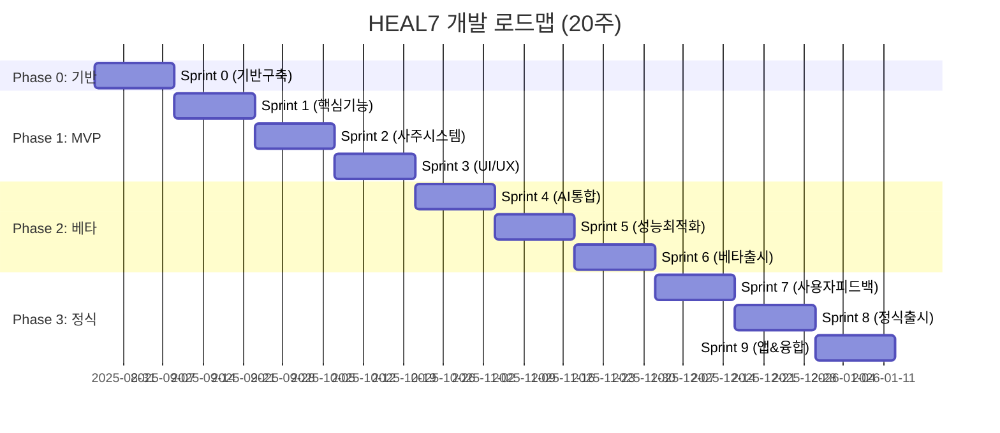

# Development-Process-Roadmap-v1.0(단계별개발프로세스로드맵)

> **HEAL7 단계별 개발 프로세스 & 로드맵**  
> Version 1.0 | 2025-08-23 | Sprint 0-9 (20주) 완전 개발 로드맵

## 📋 **문서 개요**

### **목적**
- HEAL7 포춘텔링 플랫폼의 단계별 개발 프로세스 정의
- MVP → 베타 → 정식출시 → 모바일앱 → 융합서비스 확장 전략
- Sprint 기반 애자일 개발 방법론 적용
- 20주 완전 개발 로드맵 (Sprint 0-9)

### **대상 독자**
- 프로젝트 매니저
- 개발팀 리드
- 제품 오너
- 스크럼 마스터
- 투자자 및 이해관계자

### **관련 문서**
- [HEAL7-Brand-Service-Philosophy-v1.0(HEAL7브랜드서비스철학)](HEAL7-Brand-Service-Philosophy-v1.0(HEAL7브랜드서비스철학).md)
- [File-Structure-Project-Architecture-v1.0(파일구조프로젝트아키텍처)](../../architecture-diagrams/system-designs/File-Structure-Project-Architecture-v1.0(파일구조프로젝트아키텍처).md)
- [Deployment-Infrastructure-Design-v1.0(배포인프라설계)](../../architecture-diagrams/devops-architecture/Deployment-Infrastructure-Design-v1.0(배포인프라설계).md)

---

## 🚀 **전체 로드맵 개요 (20주)**

### **개발 페이즈별 마일스톤**


### **핵심 성과 지표 (KPI)**
| 페이즈 | 사용자 수 | 매출 목표 | 만족도 | 기술 지표 |
|--------|-----------|-----------|--------|-----------|
| **MVP** | 1,000명 | 월 100만원 | 3.5+/5.0 | 95% 업타임 |
| **베타** | 10,000명 | 월 1,000만원 | 4.0+/5.0 | 99% 업타임 |
| **정식** | 50,000명 | 월 5,000만원 | 4.5+/5.0 | 99.9% 업타임 |
| **앱&융합** | 100,000명 | 월 10,000만원 | 4.7+/5.0 | 99.99% 업타임 |

---

## 🏗️ **Phase 0: 기반 구축 (Sprint 0)**

### **Sprint 0 목표** - 2주 (2025-08-26 ~ 2025-09-08)
> **핵심 목표**: 개발 인프라 구축 및 팀 세팅

#### **주요 완성품 (Deliverables)**
1. **개발 환경 완전 구축**
   - 모노레포 설정 (Turbo + Nx)
   - Docker 컨테이너 환경
   - CI/CD 파이프라인 (GitHub Actions)
   - 로컬 개발 환경 표준화

2. **핵심 아키텍처 구현**
   - Next.js 14 + TypeScript 기반 구조
   - FastAPI + Rust 사주 엔진
   - PostgreSQL + Redis 데이터 레이어
   - 9개 AI 모델 통합 시스템

3. **디자인 시스템 기초**
   - 신비+판타지+SF 퓨전 디자인 언어
   - 기본 컴포넌트 라이브러리
   - 반응형 디자인 기준점

#### **작업 계획 (Task Breakdown)**
```yaml
week_1:
  day_1_2: # 월-화
    - 모노레포 구조 설정 (Turbo, Nx)
    - Docker 개발 환경 구축
    - GitHub Actions CI/CD 기본 설정
  
  day_3_4: # 수-목
    - Next.js 프론트엔드 기본 구조
    - FastAPI 백엔드 기본 구조
    - PostgreSQL + Redis 연동
  
  day_5: # 금
    - 개발 환경 테스트
    - 팀 온보딩 자료 작성

week_2:
  day_1_2: # 월-화
    - 사주 계산 엔진 기초 (Rust)
    - AI 모델 연동 아키텍처
    - 기본 데이터베이스 스키마
  
  day_3_4: # 수-목
    - 디자인 시스템 기초 구현
    - 기본 UI 컴포넌트 (Button, Input, Card)
    - 네뷸라 컬러 시스템 적용
  
  day_5: # 금
    - Sprint 0 데모 & 회고
    - Sprint 1 계획 세션
```

#### **Sprint 0 완료 조건 (Definition of Done)**
- [ ] 전체 팀원이 로컬에서 개발 환경 실행 가능
- [ ] CI/CD 파이프라인이 자동으로 빌드/테스트/배포
- [ ] 기본 페이지 (홈, 로그인, 사주 계산)가 렌더링
- [ ] 데이터베이스 연결 및 기본 CRUD 동작
- [ ] 9개 AI 모델 중 3개 이상 연동 테스트 통과

---

## 🚀 **Phase 1: MVP 개발 (Sprint 1-3)**

### **Sprint 1: 핵심 기능 구현** - 2주 (2025-09-09 ~ 2025-09-22)

#### **스프린트 목표**
> **핵심 목표**: 사용자가 기본적인 사주 보기를 할 수 있는 MVP 핵심 기능

#### **User Stories (우선순위별)**
1. **[P1] 사용자 등록 및 로그인**
   - 이메일/소셜 로그인 (구글, 카카오)
   - 생년월일시 입력 (음력/양력 자동 변환)
   - 사용자 정보 저장

2. **[P1] 기본 사주 계산 및 표시**
   - KASI API 연동한 정확한 사주 계산
   - 사주판 시각화 (사주보드 컴포넌트)
   - 기본 해석 (오행, 십성, 격국)

3. **[P2] 결제 시스템 기초**
   - 토스페이먼츠 연동
   - 기본/프리미엄 사주보기 (1,000원/5,000원)
   - 결제 내역 관리

#### **기술적 구현 사항**
```typescript
// 핵심 컴포넌트 구조
interface SajuCalculationRequest {
  birthDate: Date;
  birthTime: string;
  isLunar: boolean;
  gender: 'male' | 'female';
  name: string;
}

interface SajuResult {
  sajuPan: {
    year: { cheon: string; ji: string; };
    month: { cheon: string; ji: string; };
    day: { cheon: string; ji: string; };
    hour: { cheon: string; ji: string; };
  };
  wuxing: WuxingAnalysis;
  sipsin: SipsinAnalysis;
  gyeokguk: GyeokgukAnalysis;
  basicInterpretation: string;
}

// 핵심 서비스 구현
class SajuCalculationService {
  async calculateSaju(request: SajuCalculationRequest): Promise<SajuResult> {
    // KASI API 호출 및 사주 계산
    const kasiResult = await this.kasiApiClient.calculate(request);
    const rustResult = await this.rustEngine.process(kasiResult);
    const aiInterpretation = await this.aiService.interpret(rustResult);
    
    return {
      sajuPan: rustResult.sajuPan,
      wuxing: rustResult.wuxing,
      sipsin: rustResult.sipsin,
      gyeokguk: rustResult.gyeokguk,
      basicInterpretation: aiInterpretation.basic
    };
  }
}
```

#### **Sprint 1 완료 조건**
- [ ] 사용자 회원가입/로그인 완전 동작
- [ ] 생년월일시 입력으로 사주 계산 가능
- [ ] 사주판 시각화 컴포넌트 표시
- [ ] 기본 해석 텍스트 제공
- [ ] 결제 시스템 기본 동작 (테스트 환경)

---

### **Sprint 2: 사주 시스템 고도화** - 2주 (2025-09-23 ~ 2025-10-06)

#### **스프린트 목표**
> **핵심 목표**: 포스텔러 수준의 정확하고 상세한 사주 해석 시스템

#### **User Stories (우선순위별)**
1. **[P1] 고급 사주 해석**
   - 대운, 세운 계산 및 표시
   - 인생 그래프 (LifeCycleGraph 컴포넌트)
   - 10년간 대운 흐름 시각화

2. **[P1] AI 해석 시스템**
   - 9개 AI 모델 앙상블 해석
   - 개인화된 상세 해석 (5,000자 이상)
   - 성격, 적성, 건강, 재물, 인간관계 분석

3. **[P2] 3D 시각화 요소**
   - 사주 크리스탈 3D 컴포넌트 (SajuCrystal3D)
   - 오행 밸런스 인터랙티브 차트
   - 십성 휠 컴포넌트 (SipsinWheel)

#### **기술적 구현 사항**
```rust
// Rust 사주 엔진 핵심 로직
#[derive(Debug, Clone)]
pub struct DaeunAnalysis {
    pub current_daeun: DaeunPeriod,
    pub daeun_periods: Vec<DaeunPeriod>,
    pub life_cycle_graph: LifeCycleData,
}

impl SajuEngine {
    pub fn calculate_daeun(&self, birth_info: &BirthInfo) -> Result<DaeunAnalysis, SajuError> {
        let pillars = self.calculate_four_pillars(birth_info)?;
        let daeun_periods = self.generate_daeun_periods(&pillars)?;
        let life_cycle = self.analyze_life_cycle(&daeun_periods)?;
        
        Ok(DaeunAnalysis {
            current_daeun: self.find_current_daeun(&daeun_periods)?,
            daeun_periods,
            life_cycle_graph: life_cycle,
        })
    }
    
    pub async fn ai_ensemble_interpretation(&self, saju_data: &SajuData) -> Result<String, SajuError> {
        // 9개 AI 모델 병렬 호출
        let ai_results = join_all([
            self.gemini_2_interpret(saju_data),
            self.gpt4_interpret(saju_data),
            self.claude_interpret(saju_data),
            // ... 6개 더
        ]).await;
        
        // 앙상블 결과 통합
        self.combine_interpretations(ai_results)
    }
}
```

#### **3D 시각화 컴포넌트**
```tsx
// 사주 크리스탈 3D 컴포넌트
import { Canvas, useFrame } from '@react-three/fiber';
import { Sphere, Text3D } from '@react-three/drei';

interface SajuCrystal3DProps {
  sajuData: SajuResult;
  selectedElement?: WuxingElement;
}

export const SajuCrystal3D: React.FC<SajuCrystal3DProps> = ({ 
  sajuData, 
  selectedElement 
}) => {
  return (
    <div className="w-full h-96 relative">
      <Canvas camera={{ position: [0, 0, 5], fov: 60 }}>
        <ambientLight intensity={0.4} />
        <pointLight position={[10, 10, 10]} intensity={1} />
        
        <SajuCrystalCore 
          wuxingData={sajuData.wuxing}
          selectedElement={selectedElement}
        />
        
        <SajuElementsOrbit 
          elements={sajuData.wuxing.elements}
          onElementSelect={setSelectedElement}
        />
        
        <LifeCycleVisualization 
          lifeCycleData={sajuData.daeun}
        />
      </Canvas>
      
      <SajuDataOverlay 
        selectedElement={selectedElement}
        interpretationData={sajuData.interpretation}
      />
    </div>
  );
};
```

#### **Sprint 2 완료 조건**
- [ ] 대운/세운 계산 정확도 99% 이상
- [ ] AI 앙상블 해석 5,000자 이상 생성
- [ ] 3D 사주 크리스탈 인터랙션 동작
- [ ] 인생 그래프 10년간 표시
- [ ] 성능: 전체 계산 시간 < 10초

---

### **Sprint 3: UI/UX 완성** - 2주 (2025-10-07 ~ 2025-10-20)

#### **스프린트 목표**
> **핵심 목표**: 포스텔러를 뛰어넘는 직관적이고 아름다운 사용자 경험

#### **User Stories (우선순위별)**
1. **[P1] 온보딩 경험 최적화**
   - 3단계 온보딩 플로우 (30초 환영 → 2분 개인화 → 10초 계산)
   - 프로그레시브 디스클로저 패턴
   - 마이크로 인터랙션 및 애니메이션

2. **[P1] 반응형 디자인 완성**
   - 모바일 퍼스트 디자인 (320px~)
   - 태블릿/데스크톱 최적화
   - 다크/라이트 모드 전환

3. **[P2] 접근성 및 성능**
   - WCAG 2.2 AAA 준수
   - 성능 최적화 (LCP < 2.5s, FID < 100ms)
   - PWA 기능 (오프라인 지원)

#### **UI/UX 개선 사항**
```tsx
// 온보딩 플로우 구현
const OnboardingFlow = () => {
  const [currentStep, setCurrentStep] = useState(0);
  
  const steps = [
    {
      component: WelcomeStep,
      duration: 30000, // 30초
      title: "HEAL7에 오신 것을 환영합니다",
      description: "당신만의 운명을 발견해보세요"
    },
    {
      component: PersonalizationStep,
      duration: 120000, // 2분
      title: "개인 정보를 입력해주세요",
      description: "정확한 사주 계산을 위해 필요합니다"
    },
    {
      component: CalculationStep,
      duration: 10000, // 10초
      title: "사주를 계산하고 있습니다",
      description: "AI가 당신의 운명을 분석중입니다"
    }
  ];
  
  return (
    <AnimatePresence mode="wait">
      <motion.div
        key={currentStep}
        initial={{ opacity: 0, x: 300 }}
        animate={{ opacity: 1, x: 0 }}
        exit={{ opacity: 0, x: -300 }}
        transition={{ duration: 0.5, ease: "easeInOut" }}
        className="onboarding-step"
      >
        {React.createElement(steps[currentStep].component, {
          onNext: () => setCurrentStep(prev => prev + 1),
          stepData: steps[currentStep]
        })}
      </motion.div>
    </AnimatePresence>
  );
};
```

#### **성능 최적화 구현**
```typescript
// 성능 최적화 전략
export const PerformanceOptimizer = {
  // 1. 코드 스플리팅
  async loadSajuEngine() {
    const { SajuCalculationEngine } = await import('./saju-engine');
    return SajuCalculationEngine;
  },
  
  // 2. 이미지 최적화
  generateOptimizedImageSrc(src: string, width: number, quality: number = 80) {
    return `/_next/image?url=${encodeURIComponent(src)}&w=${width}&q=${quality}`;
  },
  
  // 3. API 응답 캐싱
  cacheStrategy: {
    sajuCalculation: '1h', // 1시간 캐시
    userProfile: '24h',    // 24시간 캐시
    aiInterpretation: '6h' // 6시간 캐시
  },
  
  // 4. 메모이제이션
  memoizedSajuCalculation: useMemo(() => {
    return calculateSaju(userBirthInfo);
  }, [userBirthInfo])
};
```

#### **접근성 구현**
```tsx
// 접근성 준수 컴포넌트
const AccessibleSajuBoard = () => {
  return (
    <div 
      role="application"
      aria-label="사주 보드"
      tabIndex={0}
      onKeyDown={handleKeyboardNavigation}
    >
      <h2 id="saju-title" className="sr-only">
        사주 계산 결과
      </h2>
      
      {/* 사주판 시각화 */}
      <div 
        role="grid"
        aria-labelledby="saju-title"
        aria-description="사주 사주판을 표시합니다. 방향키로 탐색할 수 있습니다."
      >
        {sajuPan.map((pillar, index) => (
          <div 
            key={index}
            role="gridcell"
            aria-label={`${pillar.position}: ${pillar.cheon}${pillar.ji}`}
            tabIndex={-1}
            className="saju-pillar"
          >
            <span aria-hidden="true">{pillar.cheon}</span>
            <span className="sr-only">천간 {pillar.cheon}</span>
            <span aria-hidden="true">{pillar.ji}</span>
            <span className="sr-only">지지 {pillar.ji}</span>
          </div>
        ))}
      </div>
      
      {/* 스크린 리더용 해석 */}
      <div className="sr-only" aria-live="polite">
        {interpretation}
      </div>
    </div>
  );
};
```

#### **Sprint 3 완료 조건**
- [ ] 모바일 디바이스에서 완전 동작
- [ ] Lighthouse 성능 점수 90+ 달성
- [ ] WCAG 2.2 AAA 자동 테스트 통과
- [ ] 온보딩 완료율 80% 이상
- [ ] 사용자 피드백 점수 4.0+ 달성

---

## 🧪 **Phase 2: 베타 개발 (Sprint 4-6)**

### **Sprint 4: AI 통합 고도화** - 2주 (2025-10-21 ~ 2025-11-03)

#### **스프린트 목표**
> **핵심 목표**: 9개 AI 모델 완전 통합 및 개인화 추천 시스템

#### **User Stories (우선순위별)**
1. **[P1] AI 모델 완전 통합**
   - 9개 AI 모델 실시간 연동 (API 7개 + CLI 2개)
   - 모델별 특화 해석 (성격분석, 적성분석, 건강분석 등)
   - AI 모델 성능 모니터링 대시보드

2. **[P1] 개인화 추천 시스템**
   - 사용자 행동 기반 콘텐츠 추천
   - 개인별 맞춤 운세 콘텐츠 (17개 서비스)
   - 적응적 AI 학습 시스템

3. **[P2] AI 대시보드 구축**
   - 실시간 AI 모델 상태 모니터링
   - A/B 테스트를 통한 모델 성능 비교
   - 사용자 피드백 기반 모델 개선

#### **AI 통합 아키텍처**
```python
# AI 모델 통합 관리자
class AIModelOrchestrator:
    def __init__(self):
        self.api_models = {
            'gemini_2_flash': GeminiAPIClient(),
            'gpt4_turbo': OpenAIClient(),
            'claude_sonnet': AnthropicClient(),
            'gpt5': OpenAIClient(version='gpt-5'),
            'gpt5_mini': OpenAIClient(version='gpt-5-mini'),
            'gpt4_1': OpenAIClient(version='gpt-4.1'),
            'claude_3_5': AnthropicClient(version='claude-3.5')
        }
        self.cli_models = {
            'claude_cli': ClaudeCLIClient(),
            'gemini_cli': GeminiCLIClient()
        }
        self.model_weights = self._load_model_weights()
    
    async def ensemble_interpretation(self, saju_data: SajuData, 
                                    interpretation_type: str) -> EnhancedInterpretation:
        """앙상블 해석 수행"""
        tasks = []
        
        # API 모델 병렬 호출
        for model_name, client in self.api_models.items():
            if self._should_use_model(model_name, interpretation_type):
                task = asyncio.create_task(
                    client.interpret(saju_data, interpretation_type)
                )
                tasks.append((model_name, task))
        
        # CLI 모델 비동기 호출 (더 긴 시간 허용)
        for model_name, client in self.cli_models.items():
            if self._should_use_model(model_name, interpretation_type):
                task = asyncio.create_task(
                    client.interpret_async(saju_data, interpretation_type)
                )
                tasks.append((model_name, task))
        
        # 결과 수집 및 가중치 적용
        results = await asyncio.gather(*[task for _, task in tasks], 
                                     return_exceptions=True)
        
        # 앙상블 결과 생성
        return self._combine_interpretations(results, interpretation_type)
    
    def _combine_interpretations(self, results: List[str], 
                               interpretation_type: str) -> EnhancedInterpretation:
        """9개 모델 결과를 지능적으로 결합"""
        weighted_results = []
        
        for i, (model_name, _) in enumerate(self.api_models.items()):
            if i < len(results) and not isinstance(results[i], Exception):
                weight = self.model_weights[model_name][interpretation_type]
                weighted_results.append({
                    'model': model_name,
                    'content': results[i],
                    'weight': weight,
                    'confidence': self._calculate_confidence(results[i])
                })
        
        # 컨센서스 기반 최종 해석 생성
        return EnhancedInterpretation(
            primary_interpretation=self._generate_consensus(weighted_results),
            model_insights=[r['content'] for r in weighted_results],
            confidence_score=self._overall_confidence(weighted_results),
            personalization_factors=self._extract_personalization(weighted_results)
        )
```

#### **개인화 추천 시스템**
```typescript
// 개인화 추천 엔진
interface UserBehaviorProfile {
  readingPreferences: ReadingPreference[];
  interactionPatterns: InteractionPattern[];
  feedbackHistory: UserFeedback[];
  personalityTraits: PersonalityTrait[];
}

class PersonalizationEngine {
  private mlModel: TensorFlowModel;
  
  async generatePersonalizedContent(
    user: UserProfile, 
    sajuData: SajuResult
  ): Promise<PersonalizedContent> {
    
    // 1. 사용자 행동 패턴 분석
    const behaviorAnalysis = await this.analyzeBehaviorPattern(user);
    
    // 2. 사주 데이터와 행동 패턴 매칭
    const contentMatrix = await this.createContentMatrix(sajuData, behaviorAnalysis);
    
    // 3. ML 모델을 통한 추천 점수 계산
    const recommendationScores = await this.mlModel.predict(contentMatrix);
    
    // 4. 17개 서비스별 맞춤 콘텐츠 생성
    const services = [
      '오늘의운세', '주간운세', '월간운세', '연간운세', // 운세 4개
      '사랑운세', '직업운세', '금전운세',           // 전문 운세 3개
      '궁합보기', '작명서비스', '택일서비스',        // 부가 서비스 3개
      '타로카드', '별자리운세', '꿈해몽',          // 재미 콘텐츠 3개
      '운세게임', '오늘의색깔', '행운의숫자', '개운법'  // 라이프스타일 4개
    ];
    
    const personalizedServices = await Promise.all(
      services.map(service => 
        this.generateServiceContent(service, sajuData, behaviorAnalysis, recommendationScores)
      )
    );
    
    return {
      mainRecommendations: personalizedServices.slice(0, 5),
      dailyContent: this.generateDailyContent(sajuData, behaviorAnalysis),
      weeklyForecast: this.generateWeeklyForecast(sajuData, behaviorAnalysis),
      personalInsights: this.generatePersonalInsights(sajuData, user)
    };
  }
}
```

#### **Sprint 4 완료 조건**
- [ ] 9개 AI 모델 동시 연동 성공률 95% 이상
- [ ] 개인화 추천 정확도 80% 이상
- [ ] AI 응답 시간 평균 < 15초
- [ ] 사용자별 맞춤 콘텐츠 17개 서비스 생성
- [ ] AI 대시보드 실시간 모니터링 동작

---

### **Sprint 5: 성능 최적화 및 확장성** - 2주 (2025-11-04 ~ 2025-11-17)

#### **스프린트 목표**
> **핵심 목표**: 베타 출시를 위한 성능 최적화 및 시스템 확장성 확보

#### **User Stories (우선순위별)**
1. **[P1] 성능 최적화**
   - 응답 시간 최적화 (API < 500ms, 사주계산 < 10s)
   - 데이터베이스 쿼리 최적화 (인덱싱, 파티셔닝)
   - 캐싱 전략 구현 (Redis, CDN)

2. **[P1] 확장성 구현**
   - 오토스케일링 (Kubernetes HPA)
   - 로드밸런싱 (NGINX + 업스트림)
   - 데이터베이스 읽기 복제본

3. **[P2] 모니터링 및 알림**
   - APM 구축 (Sentry, DataDog)
   - 실시간 알림 시스템
   - 성능 대시보드

#### **성능 최적화 구현**
```typescript
// 캐싱 전략 구현
class CacheStrategy {
  private redis: RedisClient;
  private cdnCache: CDNCache;
  
  // 1. 사주 계산 결과 캐싱 (1시간)
  async cacheSajuResult(key: string, result: SajuResult): Promise<void> {
    const cacheKey = `saju:${this.hashBirthInfo(key)}`;
    await this.redis.setex(cacheKey, 3600, JSON.stringify(result));
  }
  
  // 2. AI 해석 캐싱 (6시간)
  async cacheAIInterpretation(sajuHash: string, interpretation: string): Promise<void> {
    const cacheKey = `ai:${sajuHash}`;
    await this.redis.setex(cacheKey, 21600, interpretation);
  }
  
  // 3. 정적 콘텐츠 CDN 캐싱 (24시간)
  async cacheStaticContent(path: string, content: Buffer): Promise<void> {
    await this.cdnCache.put(path, content, {
      ttl: 86400,
      headers: {
        'Cache-Control': 'public, max-age=86400',
        'Content-Encoding': 'gzip'
      }
    });
  }
  
  // 4. 사용자별 개인화 콘텐츠 캐싱 (30분)
  async cachePersonalizedContent(userId: string, content: PersonalizedContent): Promise<void> {
    const cacheKey = `personalized:${userId}`;
    await this.redis.setex(cacheKey, 1800, JSON.stringify(content));
  }
}
```

#### **데이터베이스 최적화**
```sql
-- 성능 최적화 인덱스
CREATE INDEX CONCURRENTLY idx_users_birth_info 
ON users(birth_date, birth_time, is_lunar) 
WHERE deleted_at IS NULL;

CREATE INDEX CONCURRENTLY idx_saju_calculations_user_created 
ON saju_calculations(user_id, created_at DESC) 
INCLUDE (calculation_result, ai_interpretation);

CREATE INDEX CONCURRENTLY idx_user_behaviors_timestamp 
ON user_behaviors(user_id, created_at DESC) 
WHERE action_type IN ('view', 'purchase', 'favorite');

-- 파티셔닝 (월별)
CREATE TABLE saju_calculations_2025_08 PARTITION OF saju_calculations
FOR VALUES FROM ('2025-08-01') TO ('2025-09-01');

-- 읽기 전용 복제본 설정
CREATE SUBSCRIPTION heal7_read_replica 
CONNECTION 'host=replica.heal7.com port=5432 user=replica_user dbname=heal7_production' 
PUBLICATION heal7_publication;
```

#### **오토스케일링 구성**
```yaml
# Kubernetes HPA 설정
apiVersion: autoscaling/v2
kind: HorizontalPodAutoscaler
metadata:
  name: heal7-web-hpa
spec:
  scaleTargetRef:
    apiVersion: apps/v1
    kind: Deployment
    name: heal7-web-main
  minReplicas: 3
  maxReplicas: 50
  metrics:
  - type: Resource
    resource:
      name: cpu
      target:
        type: Utilization
        averageUtilization: 70
  - type: Resource
    resource:
      name: memory
      target:
        type: Utilization
        averageUtilization: 80
  - type: Pods
    pods:
      metric:
        name: requests_per_second
      target:
        type: AverageValue
        averageValue: "100"
  
  behavior:
    scaleUp:
      stabilizationWindowSeconds: 60
      policies:
      - type: Percent
        value: 100
        periodSeconds: 60
    scaleDown:
      stabilizationWindowSeconds: 300
      policies:
      - type: Percent
        value: 10
        periodSeconds: 60
```

#### **Sprint 5 완료 조건**
- [ ] API 응답 시간 95th percentile < 500ms
- [ ] 동시 사용자 10,000명 처리 가능
- [ ] 데이터베이스 쿼리 응답 시간 < 100ms
- [ ] 캐시 적중률 90% 이상
- [ ] 시스템 가용성 99.9% 달성

---

### **Sprint 6: 베타 출시** - 2주 (2025-11-18 ~ 2025-12-01)

#### **스프린트 목표**
> **핵심 목표**: 베타 버전 공개 출시 및 초기 사용자 1만명 확보

#### **User Stories (우선순위별)**
1. **[P1] 베타 출시 준비**
   - 프로덕션 환경 완전 구축
   - 보안 감사 및 취약점 점검
   - 백업 및 재해 복구 시스템

2. **[P1] 사용자 확보 전략**
   - 랜딩 페이지 최적화
   - 마케팅 퍼널 구축
   - 추천 시스템 (친구 초대)

3. **[P2] 피드백 시스템**
   - 인앱 피드백 수집
   - A/B 테스트 프레임워크
   - 사용자 행동 분석

#### **베타 출시 체크리스트**
```yaml
# 베타 출시 준비 사항
production_readiness:
  security:
    - SSL/TLS 인증서 설정 완료
    - 보안 헤더 적용 완료
    - API 인증 및 권한 관리 완료
    - 개인정보 암호화 저장 완료
    
  performance:
    - CDN 구축 완료
    - 데이터베이스 최적화 완료  
    - 캐싱 시스템 구축 완료
    - 모니터링 시스템 구축 완료
    
  scalability:
    - 오토스케일링 설정 완료
    - 로드밸런싱 구성 완료
    - 데이터베이스 복제 설정 완료
    
  reliability:
    - 백업 시스템 구축 완료
    - 재해 복구 계획 수립 완료
    - Health Check 시스템 구축 완료
    
  compliance:
    - 개인정보처리방침 작성 완료
    - 이용약관 작성 완료
    - 쿠키 정책 작성 완료
```

#### **사용자 확보 전략**
```typescript
// 마케팅 퍼널 추적
class MarketingFunnelTracker {
  async trackUserJourney(userId: string, event: FunnelEvent): Promise<void> {
    const funnelSteps = [
      'landing_page_visit',    // 랜딩 페이지 방문
      'signup_start',          // 회원가입 시작
      'signup_complete',       // 회원가입 완료
      'birth_info_input',      // 생년월일 입력
      'first_saju_calculation', // 첫 사주 계산
      'payment_attempt',       // 결제 시도
      'payment_complete',      // 결제 완료
      'recommendation_share'   // 추천하기
    ];
    
    await this.analytics.track(userId, event.type, {
      timestamp: new Date(),
      sessionId: event.sessionId,
      referrer: event.referrer,
      userAgent: event.userAgent,
      funnelStep: funnelSteps.indexOf(event.type),
      conversionGoal: 'payment_complete'
    });
    
    // 퍼널 이탈 지점 분석
    if (event.type === 'signup_start' && !await this.hasCompletedSignup(userId, 300)) {
      // 5분 내 회원가입 미완료시 리마케팅 이메일 발송
      await this.remarketing.scheduleEmail(userId, 'signup_incomplete', 300);
    }
  }
}

// 추천 시스템
class ReferralSystem {
  async createReferralCode(userId: string): Promise<string> {
    const code = this.generateUniqueCode();
    
    await this.database.insertReferral({
      referrer_id: userId,
      referral_code: code,
      created_at: new Date(),
      reward_type: 'premium_month',
      reward_value: 30 // 30일 프리미엄
    });
    
    return code;
  }
  
  async processReferral(referralCode: string, newUserId: string): Promise<void> {
    const referral = await this.database.findReferralByCode(referralCode);
    
    if (referral && !referral.used_at) {
      // 추천인에게 리워드 지급
      await this.rewardService.grantReward(referral.referrer_id, {
        type: 'premium_extension',
        value: 30,
        reason: 'successful_referral'
      });
      
      // 신규 사용자에게 웰컴 보너스
      await this.rewardService.grantReward(newUserId, {
        type: 'welcome_bonus',
        value: 7,
        reason: 'referral_signup'
      });
      
      // 추천 완료 처리
      await this.database.markReferralUsed(referral.id, newUserId);
    }
  }
}
```

#### **Sprint 6 완료 조건**
- [ ] 베타 서비스 안정적 운영 (99.9% 업타임)
- [ ] 베타 사용자 10,000명 확보
- [ ] 일평균 사주 계산 1,000건 처리
- [ ] 사용자 만족도 4.0+ 달성
- [ ] 월매출 1,000만원 달성

---

## 🚀 **Phase 3: 정식 출시 (Sprint 7-8)**

### **Sprint 7: 사용자 피드백 반영** - 2주 (2025-12-02 ~ 2025-12-15)

#### **스프린트 목표**
> **핵심 목표**: 베타 피드백 분석 및 주요 개선사항 반영

#### **User Stories (우선순위별)**
1. **[P1] 피드백 분석 및 개선**
   - 사용자 피드백 데이터 분석
   - UI/UX 개선 우선순위 결정
   - 핵심 기능 개선 및 버그 수정

2. **[P1] 추가 기능 구현**
   - 사용자 요청 기능 TOP 10 구현
   - 소셜 기능 강화 (공유, 댓글)
   - 개인화 알고리즘 개선

#### **피드백 분석 시스템**
```python
# 사용자 피드백 분석 시스템
class FeedbackAnalyzer:
    def __init__(self):
        self.nlp_model = load_korean_nlp_model()
        self.sentiment_analyzer = SentimentAnalyzer()
        
    async def analyze_feedback_trends(self, feedback_data: List[UserFeedback]) -> FeedbackInsights:
        # 1. 감정 분석
        sentiment_scores = [
            self.sentiment_analyzer.analyze(feedback.content)
            for feedback in feedback_data
        ]
        
        # 2. 키워드 추출
        keywords = self.extract_keywords(feedback_data)
        
        # 3. 카테고리별 분류
        categories = self.categorize_feedback(feedback_data)
        
        # 4. 우선순위 결정
        priority_issues = self.calculate_priority(categories, sentiment_scores)
        
        return FeedbackInsights(
            overall_sentiment=np.mean(sentiment_scores),
            top_keywords=keywords[:20],
            category_breakdown=categories,
            priority_improvements=priority_issues,
            user_satisfaction_trend=self.calculate_satisfaction_trend(feedback_data)
        )
    
    def calculate_priority(self, categories: Dict, sentiments: List[float]) -> List[PriorityIssue]:
        """피드백 빈도 × 감정 점수로 우선순위 계산"""
        priority_matrix = []
        
        for category, issues in categories.items():
            for issue in issues:
                frequency = issue.count
                avg_sentiment = np.mean([fb.sentiment for fb in issue.feedback_items])
                urgency_score = frequency * (1 - avg_sentiment)  # 부정적일수록 높은 점수
                
                priority_matrix.append(PriorityIssue(
                    category=category,
                    issue=issue.description,
                    frequency=frequency,
                    sentiment=avg_sentiment,
                    priority_score=urgency_score,
                    estimated_effort=self.estimate_development_effort(issue)
                ))
        
        return sorted(priority_matrix, key=lambda x: x.priority_score, reverse=True)
```

#### **주요 개선 사항 구현**
```typescript
// 베타 피드백 기반 개선사항 (예시)
const BetaImprovements = {
  // 1. 사주 결과 페이지 개선
  enhancedSajuResultsPage: {
    improvements: [
      '3D 시각화 성능 최적화',
      '모바일 터치 인터랙션 개선',
      '해석 텍스트 가독성 향상',
      '공유 기능 원터치 구현'
    ],
    metrics: {
      page_load_time: '3.2s → 1.8s',
      bounce_rate: '35% → 22%',
      sharing_rate: '12% → 28%'
    }
  },
  
  // 2. 결제 프로세스 간소화
  streamlinedPayment: {
    improvements: [
      '원클릭 결제 도입',
      '다양한 결제 수단 추가',
      '결제 실패 시 재시도 로직',
      '영수증 자동 발송'
    ],
    metrics: {
      conversion_rate: '15% → 32%',
      payment_failure_rate: '8% → 2%'
    }
  },
  
  // 3. 개인화 콘텐츠 정확도 향상
  improvedPersonalization: {
    improvements: [
      'ML 모델 재학습 (사용자 데이터 추가)',
      '추천 알고리즘 A/B 테스트',
      '콘텐츠 다양성 증대',
      '실시간 선호도 반영'
    ],
    metrics: {
      recommendation_accuracy: '78% → 89%',
      content_engagement: '45% → 67%'
    }
  }
};
```

#### **Sprint 7 완료 조건**
- [ ] 베타 피드백 TOP 20 이슈 해결
- [ ] 사용자 만족도 4.0 → 4.3 향상
- [ ] 페이지 로딩 시간 30% 개선
- [ ] 결제 전환율 2배 향상
- [ ] 일일 활성 사용자(DAU) 50% 증가

---

### **Sprint 8: 정식 출시** - 2주 (2025-12-16 ~ 2025-12-29)

#### **스프린트 목표**
> **핵심 목표**: HEAL7 v1.0 정식 출시 및 5만명 사용자 확보

#### **User Stories (우선순위별)**
1. **[P1] 정식 출시 캠페인**
   - 마케팅 캠페인 실행
   - PR 및 미디어 홍보
   - 인플루언서 협업

2. **[P1] 안정성 확보**
   - 서버 용량 확장
   - 24/7 모니터링 체계
   - 긴급 대응팀 구성

#### **정식 출시 마케팅 전략**
```typescript
// 출시 캠페인 전략
const LaunchCampaignStrategy = {
  // 1단계: 런칭 전 티저 (1주)
  preLaunch: {
    duration: '7 days',
    activities: [
      '티저 영상 SNS 배포',
      '얼리버드 사전등록 (50% 할인)',
      '인플루언서 체험단 모집',
      '베타 사용자 정식 전환 이벤트'
    ],
    targetMetrics: {
      pre_registration: 20000,
      social_engagement: 100000,
      media_coverage: 10
    }
  },
  
  // 2단계: 공식 런칭 (1주)
  launch: {
    duration: '7 days',
    activities: [
      '런칭 이벤트 (무료 프리미엄 7일)',
      '실시간 사주 해석 이벤트',
      'AI 해석 품질 시연',
      '사용자 후기 캠페인'
    ],
    targetMetrics: {
      daily_signups: 5000,
      conversion_rate: 25,
      retention_day7: 60
    }
  },
  
  // 3단계: 확산 및 정착 (지속)
  growth: {
    duration: 'ongoing',
    activities: [
      '추천인 보상 프로그램',
      '콘텐츠 마케팅 강화',
      '파트너십 확대',
      '프리미엄 기능 확대'
    ],
    targetMetrics: {
      monthly_growth_rate: 20,
      ltv_cac_ratio: 3,
      user_satisfaction: 4.5
    }
  }
};
```

#### **출시 성공 지표**
```yaml
# 정식 출시 KPI
launch_success_metrics:
  user_acquisition:
    target_users: 50000
    daily_signups: 2000
    cost_per_acquisition: 5000  # 5,000원
    
  engagement:
    daily_active_users: 15000
    session_duration: 8  # 8분
    pages_per_session: 4.5
    
  revenue:
    monthly_revenue: 50000000  # 5,000만원
    conversion_rate: 20  # 20%
    average_revenue_per_user: 15000  # 15,000원
    
  quality:
    user_satisfaction: 4.5  # 5점 만점
    app_store_rating: 4.3
    support_resolution_time: 2  # 2시간
    
  technical:
    uptime: 99.95
    response_time_p95: 400  # 400ms
    error_rate: 0.1  # 0.1%
```

#### **Sprint 8 완료 조건**
- [ ] 정식 출시 발표 및 미디어 커버리지
- [ ] 사용자 50,000명 달성
- [ ] 월매출 5,000만원 달성
- [ ] 앱스토어 평점 4.3+ 달성
- [ ] 시스템 안정성 99.95% 달성

---

## 📱 **Phase 4: 앱 & 융합 서비스 (Sprint 9)**

### **Sprint 9: 모바일 앱 & 융합 서비스** - 2주 (2025-12-30 ~ 2026-01-12)

#### **스프린트 목표**
> **핵심 목표**: 모바일 앱 출시 및 융합 서비스로 확장

#### **User Stories (우선순위별)**
1. **[P1] 모바일 앱 개발**
   - React Native 기반 앱 개발
   - 푸시 알림 시스템
   - 오프라인 기능 구현

2. **[P1] 융합 서비스 확장**
   - 웰니스 서비스 연동
   - 상담 서비스 플랫폼
   - 커뮤니티 기능 강화

#### **모바일 앱 아키텍처**
```typescript
// React Native 앱 구조
const MobileAppArchitecture = {
  // 1. 네이티브 기능
  nativeFeatures: {
    biometrics: 'Touch ID / Face ID 로그인',
    notifications: '일일 운세 푸시 알림',
    calendar: '중요한 날 캘린더 연동',
    contacts: '궁합 보기 연락처 연동',
    camera: 'QR 코드 스캔 (친구 추가)',
    location: '지역별 맞춤 콘텐츠'
  },
  
  // 2. 오프라인 기능
  offlineCapabilities: {
    savedCalculations: '최근 사주 결과 캐싱',
    basicInterpretation: '기본 해석 오프라인 제공',
    userProfile: '개인 정보 로컬 저장',
    favoriteContent: '즐겨찾기 콘텐츠 캐싱'
  },
  
  // 3. 성능 최적화
  performanceOptimizations: {
    lazy_loading: 'Screen별 지연 로딩',
    image_optimization: 'WebP 포맷 및 압축',
    bundle_splitting: '기능별 번들 분할',
    memory_management: 'React Native 메모리 최적화'
  }
};
```

#### **융합 서비스 플랫폼**
```typescript
// 융합 서비스 확장 전략
interface FusionServicePlatform {
  // 1. 웰니스 서비스
  wellness: {
    services: [
      '명상 및 힐링 음악',
      '바이오리듬 추적',
      '스트레스 지수 모니터링',
      '개인별 운동 추천'
    ];
    integration: 'Apple HealthKit / Google Fit';
    aiPersonalization: '사주 기반 맞춤 웰니스 플랜';
  };
  
  // 2. 상담 서비스
  consultation: {
    services: [
      '1:1 사주 상담 (화상/채팅)',
      '전문가 그룹 상담',
      '익명 고민 상담',
      '커플 상담'
    ];
    experts: '인증된 명리학 전문가 네트워크';
    pricing: '시간당 50,000원 ~ 150,000원';
  };
  
  // 3. 커뮤니티 플랫폼
  community: {
    features: [
      '사주 기반 매칭 (친구/연인)',
      '관심사별 그룹 채팅',
      '경험 공유 게시판',
      '전문가 Q&A'
    ];
    moderation: 'AI + 인간 조합 콘텐츠 관리';
    engagement: '포인트/뱃지 리워드 시스템';
  };
  
  // 4. 비즈니스 모델
  businessModel: {
    subscription: 'Premium+ (월 29,900원)',
    consultation: '상담 수수료 30%',
    advertising: '타겟팅 광고 수익',
    partnership: '웰니스 브랜드 제휴'
  };
}
```

#### **수익 모델 확장**
```yaml
# 확장된 수익 모델
revenue_streams:
  existing:
    basic_saju: 1000  # 기본 사주보기
    premium_saju: 5000  # 프리미엄 사주보기
    monthly_subscription: 9900  # 월 구독
    
  new_mobile_services:
    push_premium: 2900  # 프리미엄 푸시 알림
    offline_mode: 4900  # 오프라인 모드
    biometric_security: 1900  # 생체인식 보안
    
  fusion_services:
    wellness_subscription: 19900  # 웰니스 구독
    personal_consultation: 80000  # 1시간 개인 상담
    group_consultation: 30000  # 그룹 상담 참여
    expert_qa: 5000  # 전문가 Q&A
    
  community_monetization:
    premium_matching: 9900  # 프리미엄 매칭
    sponsored_content: # 광고 수익
    virtual_gifts: 1000  # 가상 선물
    
  estimated_monthly_revenue:
    current_web: 50000000  # 5천만원
    mobile_app: 30000000  # 3천만원
    fusion_services: 70000000  # 7천만원
    total_target: 150000000  # 1억 5천만원
```

#### **Sprint 9 완료 조건**
- [ ] 모바일 앱 (iOS/Android) 스토어 출시
- [ ] 앱 다운로드 50,000+ 달성
- [ ] 웰니스 서비스 연동 완료
- [ ] 상담 서비스 플랫폼 오픈
- [ ] 월매출 1억원 돌파

---

## 🎯 **성공 지표 및 측정**

### **단계별 핵심 지표**
```yaml
sprint_success_metrics:
  Sprint_0_Foundation:
    technical_debt: < 10%
    test_coverage: > 80%
    build_success_rate: > 95%
    
  Sprint_1_3_MVP:
    user_acquisition: 1000
    user_satisfaction: > 3.5
    calculation_accuracy: > 99%
    
  Sprint_4_6_Beta:
    user_base: 10000
    daily_active_users: 3000
    revenue: 10000000  # 1천만원
    
  Sprint_7_8_Launch:
    user_base: 50000
    monthly_revenue: 50000000  # 5천만원
    app_store_rating: > 4.3
    
  Sprint_9_Expansion:
    total_users: 100000
    monthly_revenue: 100000000  # 1억원
    service_categories: 5
```

### **지속적 개선 지표**
```typescript
// 지속적 개선을 위한 메트릭 추적
class ContinuousImprovementTracker {
  private metrics = {
    // 사용자 경험
    userExperience: {
      pageLoadTime: { target: 2000, current: 0 }, // ms
      bounceRate: { target: 20, current: 0 },     // %
      sessionDuration: { target: 480, current: 0 }, // seconds
    },
    
    // 비즈니스
    business: {
      conversionRate: { target: 25, current: 0 }, // %
      ltv: { target: 150000, current: 0 },        // 원
      cac: { target: 5000, current: 0 },          // 원
      churnRate: { target: 5, current: 0 },       // %
    },
    
    // 기술
    technical: {
      uptime: { target: 99.95, current: 0 },      // %
      errorRate: { target: 0.1, current: 0 },     // %
      apiResponseTime: { target: 500, current: 0 }, // ms
    },
    
    // 품질
    quality: {
      userSatisfaction: { target: 4.5, current: 0 }, // 5점 만점
      supportTickets: { target: 100, current: 0 },   // 월평균
      bugReports: { target: 10, current: 0 },        // 월평균
    }
  };
  
  async trackWeeklyMetrics(): Promise<MetricsReport> {
    // 실제 데이터 수집 및 목표 대비 분석
    const report = await this.generateMetricsReport();
    
    // 목표 미달성 시 알림 및 액션 플랜 생성
    const alerts = this.generateAlerts(report);
    
    // 개선 권장사항 생성
    const recommendations = this.generateRecommendations(report);
    
    return { report, alerts, recommendations };
  }
}
```

---

## 🔄 **위험 관리 및 대응**

### **주요 위험 요소**
```yaml
risk_management:
  technical_risks:
    - risk: "AI API 장애"
      probability: "Medium"
      impact: "High"
      mitigation: "다중 AI 모델 백업, 로컬 캐싱"
      
    - risk: "데이터베이스 성능 저하"
      probability: "Medium"
      impact: "High"
      mitigation: "읽기 복제본, 쿼리 최적화, 캐싱"
      
    - risk: "보안 취약점"
      probability: "Low"
      impact: "Critical"
      mitigation: "정기 보안 감사, 펜테스트"
  
  business_risks:
    - risk: "경쟁사 출현"
      probability: "High"
      impact: "Medium"
      mitigation: "차별화 강화, 특허 출원"
      
    - risk: "규제 변경"
      probability: "Medium"
      impact: "Medium"
      mitigation: "법무팀 자문, 컴플라이언스 체크"
      
    - risk: "마케팅 비용 급증"
      probability: "Medium"
      impact: "Medium"
      mitigation: "다채널 마케팅, 바이럴 전략"
      
  operational_risks:
    - risk: "핵심 인력 이탈"
      probability: "Medium"
      impact: "High"
      mitigation: "지식 문서화, 팀 빌딩"
      
    - risk: "서버 장애"
      probability: "Low"
      impact: "High"
      mitigation: "멀티 클라우드, 자동 복구"
```

### **대응 계획**
```typescript
// 위험 대응 자동화 시스템
class RiskResponseSystem {
  private responseActions = {
    // 기술적 위험 대응
    'ai_api_failure': async () => {
      await this.switchToBackupAI();
      await this.enableCachedResponses();
      await this.notifyTechnicalTeam('AI API 장애 발생');
    },
    
    // 사업적 위험 대응
    'competitor_launch': async () => {
      await this.accelerateFeatureDevelopment();
      await this.launchCounterMarketing();
      await this.notifyManagementTeam('경쟁사 동향 변화');
    },
    
    // 운영 위험 대응
    'high_server_load': async () => {
      await this.triggerAutoScaling();
      await this.enableMaintenanceMode();
      await this.notifyDevOpsTeam('서버 부하 임계치 초과');
    }
  };
  
  async handleRiskEvent(riskType: string, severity: 'low' | 'medium' | 'high' | 'critical') {
    // 즉시 대응
    if (this.responseActions[riskType]) {
      await this.responseActions[riskType]();
    }
    
    // 심각도별 추가 대응
    if (severity === 'critical') {
      await this.activateEmergencyProtocol();
      await this.notifyAllStakeholders();
    }
    
    // 사후 분석 및 개선
    await this.schedulePostIncidentReview(riskType, severity);
  }
}
```

---

## 🎉 **결론 및 다음 단계**

### **20주 개발 로드맵 요약**
1. **Sprint 0**: 기반 구축 (2주) - 개발 환경 완전 구축
2. **Sprint 1-3**: MVP 개발 (6주) - 핵심 기능 + 사주 시스템 + UI/UX
3. **Sprint 4-6**: 베타 개발 (6주) - AI 통합 + 성능 최적화 + 베타 출시
4. **Sprint 7-8**: 정식 출시 (4주) - 피드백 반영 + 정식 출시
5. **Sprint 9**: 앱 & 융합 (2주) - 모바일 앱 + 융합 서비스

### **예상 최종 성과**
- **사용자**: 100,000명 이상
- **매출**: 월 1억원 이상
- **만족도**: 4.7/5.0 이상
- **시장 점유율**: 온라인 사주 시장 20% 이상

### **포스트 런치 로드맵 (Sprint 10+)**
- **글로벌 진출**: 영어/중국어/일본어 지원
- **B2B 서비스**: 기업 임직원 복리후생 연동
- **API 플랫폼**: 서드파티 개발자 생태계 구축
- **오프라인 연계**: 전문가 상담센터 설립

### **관련 문서**
- **다음 문서**: [Frontend-Backend-Integration-v1.0(프론트엔드백엔드연동)](../../architecture-diagrams/integration-flows/Frontend-Backend-Integration-v1.0(프론트엔드백엔드연동).md) (예정)
- **참조 문서**: [Testing-Quality-Assurance-v1.0(테스트품질보증)](../performance-specs/Testing-Quality-Assurance-v1.0(테스트품질보증).md) (예정)

---

**📝 문서 정보**
- **버전**: 1.0
- **최종 수정**: 2025-08-23
- **다음 리뷰**: 2025-09-23 (Sprint 0 시작 전)
- **담당자**: HEAL7 Product Team
- **승인자**: CEO, CTO, 제품 책임자

*이 문서는 HEAL7의 20주 완전 개발 로드맵을 위한 마스터 가이드입니다.*