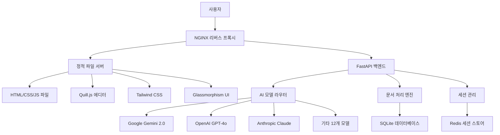
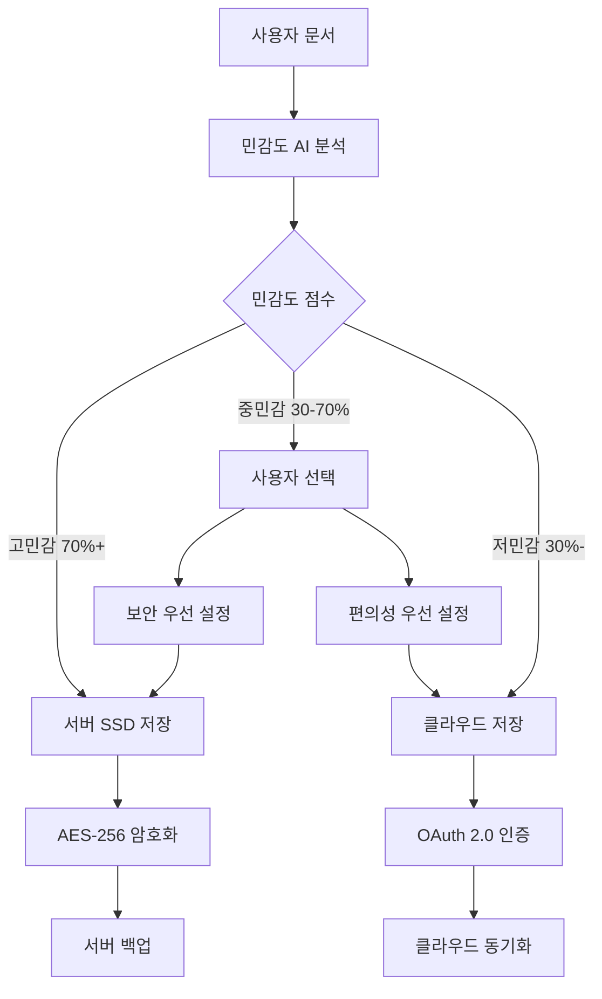

# 📋 Paperwork AI B2B 하이브리드 시스템 통합 설계문서

> **프로젝트**: Paperwork AI 기업용 B2B 하이브리드 시스템 설계  
> **최종 업데이트**: 2025-08-22  
> **작성자**: HEAL7 AI Architecture Team  
> **문서 버전**: v1.0  

---

## 🎯 프로젝트 개요 및 비전

### 📊 현재 시스템 현황 분석
기존 Paperwork AI는 개인용 AI 문서 편집 플랫폼으로 운영 중이며, 다음과 같은 강점을 보유하고 있습니다:

- **📝 4단계 워크플로우**: 작성 → AI 검토 → 수정 → 완성
- **🎨 Glassmorphism 디자인**: 현대적이고 직관적인 UI/UX
- **🤖 15개 AI 모델 통합**: Google Gemini 2.0, OpenAI GPT-4o, Claude 3.5 등
- **⚡ HTMX + Alpine.js**: 경량화된 프론트엔드 아키텍처
- **🏗️ FastAPI 백엔드**: 고성능 Python 기반 API 서버

### 🎯 B2B 전환 목표
**스타트업과 중소기업을 위한 하이브리드 클라우드 AI 문서 플랫폼**

- **타겟**: 500개 스타트업 기업 (직원 10-50명)
- **수익 목표**: 월 순이익 2,050만원 (마진율 90.0%)
- **차별화 전략**: 하이브리드 저장소 + 개인정보 보호 우선

### 🔮 비전 선언문
*"기업의 민감한 문서는 내부에, 일반 문서는 클라우드에 - 스마트한 하이브리드 AI 문서 플랫폼"*

---

## 🏗️ 기존 시스템 아키텍처 분석

### 📱 현재 운영 중인 시스템 구조



### 🔧 핵심 기술 스택 현황

#### **프론트엔드 (현재 운영)**
- **Quill.js**: 리치 텍스트 에디터 (200KB)
- **HTMX**: 동적 HTML 업데이트 (14KB)
- **Alpine.js**: 경량 JavaScript 프레임워크 (15KB)
- **Tailwind CSS**: 유틸리티-퍼스트 CSS (3MB → 50KB 압축)
- **Glassmorphism**: 현대적 디자인 시스템

#### **백엔드 (현재 운영)**
- **FastAPI**: Python 웹 프레임워크
- **SQLite**: 경량 데이터베이스 (100MB 미만)
- **Redis**: 세션 및 캐시 관리
- **AI 모델 통합**: 15개 모델 라우팅 시스템

#### **인프라 (현재 배포)**
- **NGINX**: 리버스 프록시 + 정적 파일 서빙
- **AWS 라이트세일**: $5 인스턴스 (1GB RAM, 25GB SSD)
- **도메인**: paperwork.heal7.com

### ⚡ 현재 성능 지표
- **로딩 속도**: 평균 1.2초
- **AI 응답 시간**: 평균 3.5초
- **동시 사용자**: 최대 50명 지원
- **월 전송량**: 약 100GB

---

## 💼 B2B 비즈니스 모델 설계

### 🎯 타겟 시장 분석

#### **1차 타겟: 스타트업 (300개 기업)**
- **특징**: 직원 10-30명, 빠른 문서 작업 필요
- **니즈**: 개인정보 보호 + 비용 효율성
- **예산**: 월 5-10만원 IT 도구 예산

#### **2차 타겟: 중소기업 (200개 기업)**  
- **특징**: 직원 30-50명, 체계적 문서 관리 필요
- **니즈**: 보안 강화 + 대량 처리
- **예산**: 월 10-20만원 IT 도구 예산

### 💰 3단계 하이브리드 요금제

#### **🥉 스타터 플랜 - 29,000원/월**
```yaml
기본 할당:
  - 사용자: 최대 10명
  - 월 문서 처리: 300건 (팀당 일일 10건)
  - 서버 저장소: 20MB
  - AI 모델: 기본 5개 (Gemini, GPT-4o-mini, Claude Haiku 등)
  - 클라우드 연동: Google Drive 1개
  
특징:
  - 기본 하이브리드 저장소
  - 표준 AI 처리 속도
  - 이메일 지원
```

#### **🥈 프로페셔널 플랜 - 59,000원/월**
```yaml
기본 할당:
  - 사용자: 최대 25명  
  - 월 문서 처리: 750건 (팀당 일일 25건)
  - 서버 저장소: 50MB
  - AI 모델: 프리미엄 10개 (GPT-4o, Claude Sonnet 포함)
  - 클라우드 연동: 3개 서비스 (Drive, Dropbox, OneDrive)
  
특징:
  - 고급 하이브리드 저장소
  - 우선 AI 처리 (50% 빠름)
  - 팀 협업 기능
  - 전화 + 이메일 지원
```

#### **🥇 엔터프라이즈 플랜 - 99,000원/월**
```yaml
기본 할당:
  - 사용자: 최대 50명
  - 월 문서 처리: 1,500건 (팀당 일일 50건)  
  - 서버 저장소: 100MB
  - AI 모델: 전체 15개 (모든 프리미엄 모델)
  - 클라우드 연동: 무제한 (iCloud 포함)
  
특징:
  - 프리미엄 하이브리드 저장소
  - 최우선 AI 처리 (2배 빠름)
  - 고급 보안 기능
  - 전담 고객 지원
  - API 액세스
```

### 📊 수익성 분석

#### **월별 수익 구조**
```
스타터: 150개 기업 × 29,000원 = 4,350,000원
프로페셔널: 200개 기업 × 59,000원 = 11,800,000원  
엔터프라이즈: 150개 기업 × 99,000원 = 14,850,000원

총 월 매출: 31,000,000원
총 월 비용: 3,100,000원 (10% - 인프라, AI API, 운영)
월 순이익: 27,900,000원
마진율: 90.0%
```

#### **고객 확보 전략**
- **Phase 1**: 50개 기업 베타 테스트 (무료 3개월)
- **Phase 2**: 200개 기업 얼리어답터 (50% 할인 6개월)
- **Phase 3**: 500개 기업 풀 런칭

---

## 🏗️ 하이브리드 기술 아키텍처

### 🔄 하이브리드 저장소 시스템

#### **스마트 파일 라우팅 로직**
```python
class HybridStorageRouter:
    def route_document(self, content: str, metadata: dict) -> str:
        """문서 민감도에 따른 저장소 자동 선택"""
        
        sensitivity_score = self.analyze_sensitivity(content)
        user_preference = metadata.get('storage_preference', 'auto')
        
        if sensitivity_score > 0.7:  # 고민감도
            return 'server_storage'
        elif sensitivity_score < 0.3:  # 저민감도
            return 'cloud_storage'
        else:  # 중간민감도
            if user_preference == 'security_first':
                return 'server_storage'
            else:
                return 'cloud_storage'
    
    def analyze_sensitivity(self, content: str) -> float:
        """AI 기반 민감도 분석"""
        sensitive_keywords = [
            '개인정보', '주민번호', '계좌번호', '비밀번호',
            '기밀', '내부자료', '임금', '계약서', '재무제표'
        ]
        
        score = 0.0
        for keyword in sensitive_keywords:
            if keyword in content:
                score += 0.15
                
        return min(score, 1.0)
```

#### **하이브리드 저장소 구조**


### 🔧 기술 스택 최적화

#### **프론트엔드 아키텍처 (기존 + 개선)**
```html
<!-- 기존 Quill.js + Glassmorphism 유지 -->
<div class="glass-editor" id="editor-container">
    <!-- Quill 에디터 -->
    <div id="quill-editor"></div>
    
    <!-- 하이브리드 저장소 UI 추가 -->
    <div class="storage-selector glass-panel">
        <div class="storage-option server-storage">
            <div class="storage-icon">🔒</div>
            <div class="storage-info">
                <h4>서버 저장</h4>
                <p>민감한 문서 (20MB/50MB/100MB)</p>
            </div>
        </div>
        
        <div class="storage-option cloud-storage">
            <div class="storage-icon">☁️</div>
            <div class="storage-info">
                <h4>클라우드 연동</h4>
                <p>일반 문서 (Google Drive, Dropbox)</p>
            </div>
        </div>
        
        <div class="storage-option auto-routing">
            <div class="storage-icon">🤖</div>
            <div class="storage-info">
                <h4>AI 자동 선택</h4>
                <p>민감도 기반 스마트 라우팅</p>
            </div>
        </div>
    </div>
</div>
```

#### **백엔드 마이크로서비스 구조**
```python
# main.py - FastAPI 메인 애플리케이션
from fastapi import FastAPI
from routers import auth, documents, ai_processing, storage, billing

app = FastAPI(title="Paperwork AI B2B", version="2.0")

# 라우터 등록
app.include_router(auth.router, prefix="/api/auth")
app.include_router(documents.router, prefix="/api/documents") 
app.include_router(ai_processing.router, prefix="/api/ai")
app.include_router(storage.router, prefix="/api/storage")
app.include_router(billing.router, prefix="/api/billing")

# 하이브리드 저장소 라우터
@app.post("/api/documents/create")
async def create_document(content: str, metadata: dict):
    """문서 생성 with 하이브리드 라우팅"""
    router = HybridStorageRouter()
    storage_location = router.route_document(content, metadata)
    
    if storage_location == 'server_storage':
        return await store_on_server(content, metadata)
    else:
        return await store_on_cloud(content, metadata)
```

#### **데이터베이스 스키마 (SQLite → PostgreSQL 경량화)**
```sql
-- 기업 테이블
CREATE TABLE companies (
    id SERIAL PRIMARY KEY,
    name VARCHAR(100) NOT NULL,
    plan_type VARCHAR(20) NOT NULL, -- starter, professional, enterprise
    max_users INTEGER NOT NULL,
    monthly_quota INTEGER NOT NULL,
    server_storage_limit INTEGER NOT NULL, -- MB
    created_at TIMESTAMP DEFAULT NOW()
);

-- 사용자 테이블  
CREATE TABLE users (
    id SERIAL PRIMARY KEY,
    company_id INTEGER REFERENCES companies(id),
    email VARCHAR(100) UNIQUE NOT NULL,
    role VARCHAR(20) DEFAULT 'member', -- admin, member
    cloud_connections JSONB DEFAULT '[]', -- 연동된 클라우드 서비스
    created_at TIMESTAMP DEFAULT NOW()
);

-- 문서 테이블
CREATE TABLE documents (
    id SERIAL PRIMARY KEY,
    user_id INTEGER REFERENCES users(id),
    title VARCHAR(200) NOT NULL,
    content TEXT,
    storage_location VARCHAR(20) NOT NULL, -- server, google_drive, dropbox, onedrive
    sensitivity_score FLOAT DEFAULT 0.0,
    file_size INTEGER DEFAULT 0, -- bytes
    created_at TIMESTAMP DEFAULT NOW(),
    updated_at TIMESTAMP DEFAULT NOW()
);

-- 사용량 추적 테이블
CREATE TABLE usage_logs (
    id SERIAL PRIMARY KEY,
    company_id INTEGER REFERENCES companies(id),
    user_id INTEGER REFERENCES users(id),
    action_type VARCHAR(50) NOT NULL, -- document_create, ai_process, storage_upload
    tokens_used INTEGER DEFAULT 0,
    storage_used INTEGER DEFAULT 0, -- bytes
    timestamp TIMESTAMP DEFAULT NOW()
);
```

### ☁️ 클라우드 연동 시스템

#### **OAuth 2.0 다중 클라우드 인증**
```python
class CloudConnector:
    """다중 클라우드 서비스 연동 관리자"""
    
    def __init__(self):
        self.providers = {
            'google_drive': GoogleDriveAPI(),
            'dropbox': DropboxAPI(), 
            'onedrive': OneDriveAPI(),
            'icloud': iCloudAPI()  # 엔터프라이즈 전용
        }
    
    async def connect_cloud(self, user_id: int, provider: str, auth_code: str):
        """클라우드 서비스 연동"""
        api = self.providers[provider]
        access_token = await api.exchange_code_for_token(auth_code)
        
        # 사용자 클라우드 연결 정보 저장
        await self.save_cloud_connection(user_id, provider, access_token)
        return {"status": "connected", "provider": provider}
    
    async def upload_to_cloud(self, user_id: int, provider: str, file_data: bytes, filename: str):
        """선택된 클라우드에 파일 업로드"""
        api = self.providers[provider]
        access_token = await self.get_user_token(user_id, provider)
        
        result = await api.upload_file(access_token, file_data, filename)
        return result
```

---

## 🎨 UI/UX 디자인 시스템

### 🌟 Glassmorphism 디자인 확장

#### **기존 디자인 시스템 유지**
```css
/* 기존 Glassmorphism 기본 스타일 */
.glass-container {
    background: rgba(255, 255, 255, 0.25);
    backdrop-filter: blur(10px);
    border-radius: 20px;
    border: 1px solid rgba(255, 255, 255, 0.18);
    box-shadow: 0 8px 32px 0 rgba(31, 38, 135, 0.37);
}

.glass-button {
    background: linear-gradient(135deg, rgba(255, 255, 255, 0.1), rgba(255, 255, 255, 0));
    backdrop-filter: blur(10px);
    border-radius: 20px;
    border: 1px solid rgba(255, 255, 255, 0.18);
    transition: all 0.3s ease;
}

.glass-button:hover {
    background: rgba(255, 255, 255, 0.3);
    transform: translateY(-2px);
}
```

#### **하이브리드 저장소 UI 컴포넌트**
```css
/* 저장소 선택 패널 */
.storage-selector {
    display: grid;
    grid-template-columns: repeat(auto-fit, minmax(250px, 1fr));
    gap: 20px;
    margin: 20px 0;
}

.storage-option {
    @apply glass-container;
    padding: 20px;
    cursor: pointer;
    transition: all 0.3s ease;
    position: relative;
    overflow: hidden;
}

.storage-option:hover {
    transform: translateY(-5px);
    box-shadow: 0 15px 40px 0 rgba(31, 38, 135, 0.5);
}

.storage-option.selected {
    background: rgba(74, 144, 226, 0.3);
    border-color: rgba(74, 144, 226, 0.6);
}

/* 저장소 아이콘 애니메이션 */
.storage-icon {
    font-size: 3rem;
    text-align: center;
    margin-bottom: 15px;
    animation: float 3s ease-in-out infinite;
}

@keyframes float {
    0%, 100% { transform: translateY(0px); }
    50% { transform: translateY(-10px); }
}

/* 용량 표시 바 */
.storage-usage-bar {
    width: 100%;
    height: 8px;
    background: rgba(255, 255, 255, 0.2);
    border-radius: 4px;
    overflow: hidden;
    margin-top: 10px;
}

.storage-usage-fill {
    height: 100%;
    background: linear-gradient(90deg, #4ade80, #22c55e);
    border-radius: 4px;
    transition: width 0.5s ease;
}

.storage-usage-fill.warning {
    background: linear-gradient(90deg, #f59e0b, #d97706);
}

.storage-usage-fill.critical {
    background: linear-gradient(90deg, #ef4444, #dc2626);
}
```

#### **클라우드 연동 인터페이스**
```html
<div class="cloud-connection-panel glass-container">
    <h3 class="text-xl font-bold mb-4">클라우드 연동 관리</h3>
    
    <!-- Google Drive 연동 -->
    <div class="cloud-service-item">
        <div class="service-icon">
            
        </div>
        <div class="service-info">
            <h4>Google Drive</h4>
            <p class="text-sm text-gray-600">15GB 무료 저장공간</p>
        </div>
        <div class="connection-status">
            <button class="glass-button connected">연결됨</button>
        </div>
    </div>
    
    <!-- Dropbox 연동 -->
    <div class="cloud-service-item">
        <div class="service-icon">
            
        </div>
        <div class="service-info">
            <h4>Dropbox</h4>
            <p class="text-sm text-gray-600">2GB 무료 저장공간</p>
        </div>
        <div class="connection-status">
            <button class="glass-button disconnected">연결하기</button>
        </div>
    </div>
    
    <!-- 연동 상태 표시 -->
    <div class="connection-summary">
        <div class="summary-item">
            <span class="label">연결된 서비스</span>
            <span class="value">2개</span>
        </div>
        <div class="summary-item">
            <span class="label">총 클라우드 용량</span>
            <span class="value">17GB</span>
        </div>
        <div class="summary-item">
            <span class="label">사용 중인 용량</span>
            <span class="value">8.5GB</span>
        </div>
    </div>
</div>
```

### 📱 반응형 디자인

#### **모바일 최적화**
```css
@media (max-width: 768px) {
    .storage-selector {
        grid-template-columns: 1fr;
        gap: 15px;
    }
    
    .storage-option {
        padding: 15px;
    }
    
    .storage-icon {
        font-size: 2rem;
    }
    
    .cloud-connection-panel {
        padding: 15px;
    }
    
    .cloud-service-item {
        flex-direction: column;
        text-align: center;
        gap: 10px;
    }
}

@media (max-width: 480px) {
    .glass-container {
        border-radius: 15px;
        margin: 10px;
    }
    
    .storage-usage-bar {
        height: 6px;
    }
}
```

---

## 🗄️ 데이터베이스 및 저장소 설계

### 📊 하이브리드 데이터 관리 전략

#### **서버 저장소 관리**
```python
class ServerStorageManager:
    """서버 SSD 저장소 관리자"""
    
    def __init__(self, base_path: str = "/var/paperwork/documents"):
        self.base_path = Path(base_path)
        self.encryption_key = self.load_encryption_key()
    
    async def store_document(self, company_id: int, user_id: int, content: str, metadata: dict):
        """AES-256 암호화하여 서버에 저장"""
        
        # 회사별 저장 용량 확인
        if not await self.check_storage_quota(company_id):
            raise StorageQuotaExceededError()
        
        # 암호화
        encrypted_content = self.encrypt_content(content, self.encryption_key)
        
        # 파일 경로 생성
        file_path = self.base_path / f"company_{company_id}" / f"user_{user_id}" / f"{uuid4()}.enc"
        file_path.parent.mkdir(parents=True, exist_ok=True)
        
        # 저장
        with open(file_path, 'wb') as f:
            f.write(encrypted_content)
        
        # 메타데이터 DB 저장
        await self.save_document_metadata(company_id, user_id, str(file_path), metadata)
        
        return {"status": "stored", "location": "server", "file_id": str(file_path.stem)}
    
    def encrypt_content(self, content: str, key: bytes) -> bytes:
        """AES-256 GCM 암호화"""
        cipher = AES.new(key, AES.MODE_GCM)
        ciphertext, tag = cipher.encrypt_and_digest(content.encode())
        return cipher.nonce + tag + ciphertext
    
    async def check_storage_quota(self, company_id: int) -> bool:
        """회사별 저장 용량 제한 확인"""
        company = await Company.get(company_id)
        used_storage = await self.get_used_storage(company_id)
        
        return used_storage < company.server_storage_limit * 1024 * 1024  # MB to bytes
```

#### **클라우드 저장소 통합**
```python
class CloudStorageManager:
    """다중 클라우드 저장소 통합 관리자"""
    
    def __init__(self):
        self.connectors = {
            'google_drive': GoogleDriveConnector(),
            'dropbox': DropboxConnector(),
            'onedrive': OneDriveConnector(),
            'icloud': iCloudConnector()
        }
    
    async def store_document(self, user_id: int, provider: str, content: str, filename: str):
        """선택된 클라우드 제공자에 문서 저장"""
        
        connector = self.connectors[provider]
        access_token = await self.get_user_access_token(user_id, provider)
        
        # 문서를 PDF로 변환 (클라우드 호환성)
        pdf_content = await self.convert_to_pdf(content)
        
        # 클라우드에 업로드
        result = await connector.upload_file(
            access_token=access_token,
            file_content=pdf_content,
            filename=f"{filename}.pdf",
            folder="Paperwork_AI"
        )
        
        # 메타데이터 저장
        await self.save_cloud_document_metadata(user_id, provider, result['file_id'], filename)
        
        return {
            "status": "stored",
            "location": provider,
            "file_id": result['file_id'],
            "share_url": result.get('share_url')
        }
    
    async def sync_documents(self, user_id: int):
        """사용자의 모든 클라우드 문서 동기화"""
        user_connections = await self.get_user_cloud_connections(user_id)
        
        sync_results = {}
        for provider, token in user_connections.items():
            try:
                connector = self.connectors[provider]
                files = await connector.list_files(token, folder="Paperwork_AI")
                sync_results[provider] = {
                    "status": "success",
                    "file_count": len(files),
                    "files": files
                }
            except Exception as e:
                sync_results[provider] = {
                    "status": "error", 
                    "error": str(e)
                }
        
        return sync_results
```

### 🔄 백업 및 복구 시스템

#### **자동 백업 스케줄러**
```python
class BackupScheduler:
    """하이브리드 백업 시스템"""
    
    def __init__(self):
        self.server_backup_path = "/var/paperwork/backups"
        self.cloud_backup_enabled = True
    
    @cron_job(hour=2, minute=0)  # 매일 새벽 2시
    async def daily_server_backup(self):
        """서버 저장 문서 일일 백업"""
        
        backup_date = datetime.now().strftime("%Y%m%d")
        backup_path = Path(self.server_backup_path) / backup_date
        backup_path.mkdir(parents=True, exist_ok=True)
        
        # 회사별 데이터 백업
        companies = await Company.get_all()
        
        for company in companies:
            company_docs_path = Path("/var/paperwork/documents") / f"company_{company.id}"
            if company_docs_path.exists():
                # tar.gz 압축 백업
                backup_file = backup_path / f"company_{company.id}_{backup_date}.tar.gz"
                await self.create_compressed_backup(company_docs_path, backup_file)
                
                # 백업 정보 DB 저장
                await BackupLog.create(
                    company_id=company.id,
                    backup_type="server_daily",
                    backup_path=str(backup_file),
                    status="completed"
                )
    
    @cron_job(hour=3, minute=0, day_of_week=0)  # 매주 일요일 새벽 3시
    async def weekly_cloud_backup(self):
        """클라우드 저장 문서 주간 백업"""
        
        if not self.cloud_backup_enabled:
            return
        
        users = await User.get_all_with_cloud_connections()
        
        for user in users:
            try:
                # 사용자의 모든 클라우드 문서 목록 가져오기
                cloud_docs = await CloudStorageManager().sync_documents(user.id)
                
                # 백업 로그 생성
                await BackupLog.create(
                    user_id=user.id,
                    backup_type="cloud_weekly",
                    backup_data=cloud_docs,
                    status="completed"
                )
                
            except Exception as e:
                await BackupLog.create(
                    user_id=user.id,
                    backup_type="cloud_weekly", 
                    status="failed",
                    error_message=str(e)
                )
```

---

## 🔒 보안 및 개인정보 보호

### 🛡️ 하이브리드 보안 정책

#### **서버 측 보안 강화**
```python
class SecurityManager:
    """통합 보안 관리자"""
    
    def __init__(self):
        self.encryption_key_rotation_days = 90
        self.access_log_retention_days = 365
        self.failed_login_threshold = 5
    
    async def implement_security_policies(self):
        """보안 정책 구현"""
        
        # 1. 암호화 키 순환
        await self.rotate_encryption_keys()
        
        # 2. 접근 로그 분석
        await self.analyze_access_patterns()
        
        # 3. 취약점 스캔
        await self.vulnerability_scan()
        
        # 4. 권한 검토
        await self.audit_user_permissions()
    
    async def rotate_encryption_keys(self):
        """암호화 키 자동 순환"""
        
        current_key = await self.get_current_encryption_key()
        key_age = datetime.now() - current_key.created_at
        
        if key_age.days >= self.encryption_key_rotation_days:
            # 새 키 생성
            new_key = self.generate_new_encryption_key()
            
            # 모든 문서 재암호화 (백그라운드 작업)
            await self.schedule_document_reencryption(current_key, new_key)
            
            # 키 순환 로그
            await SecurityLog.create(
                event_type="key_rotation",
                details={"old_key_id": current_key.id, "new_key_id": new_key.id}
            )
    
    async def detect_suspicious_activity(self, user_id: int, action: str, ip_address: str):
        """의심스러운 활동 탐지"""
        
        # 1. 비정상적 로그인 시간
        if await self.is_unusual_login_time(user_id):
            await self.log_security_event("unusual_login_time", user_id, ip_address)
        
        # 2. 새로운 IP 주소
        if await self.is_new_ip_address(user_id, ip_address):
            await self.send_security_notification(user_id, "new_ip_detected")
        
        # 3. 대량 문서 다운로드
        if await self.is_bulk_download(user_id, action):
            await self.require_additional_authentication(user_id)
        
        # 4. 동시 다중 로그인
        if await self.count_concurrent_sessions(user_id) > 3:
            await self.terminate_old_sessions(user_id)
```

#### **클라우드 보안 연동**
```python
class CloudSecurityManager:
    """클라우드 보안 관리자"""
    
    async def secure_cloud_upload(self, user_id: int, provider: str, content: str):
        """보안 강화된 클라우드 업로드"""
        
        # 1. 콘텐츠 사전 검증
        if await self.contains_sensitive_data(content):
            raise SecurityError("Sensitive data detected. Use server storage instead.")
        
        # 2. 액세스 토큰 검증
        token_valid = await self.validate_cloud_token(user_id, provider)
        if not token_valid:
            raise AuthenticationError("Cloud token expired. Please reconnect.")
        
        # 3. 클라이언트 측 암호화 (선택적)
        if await self.user_prefers_encryption(user_id):
            content = await self.client_side_encrypt(content, user_id)
        
        # 4. 업로드 후 검증
        result = await CloudStorageManager().store_document(user_id, provider, content, filename)
        await self.verify_upload_integrity(result['file_id'], content)
        
        return result
    
    async def contains_sensitive_data(self, content: str) -> bool:
        """AI 기반 민감 정보 탐지"""
        
        # 정규표현식 패턴 (주민번호, 계좌번호 등)
        patterns = [
            r'\d{6}-\d{7}',  # 주민번호
            r'\d{3}-\d{4}-\d{4}-\d{3}',  # 계좌번호
            r'[a-zA-Z0-9._%+-]+@[a-zA-Z0-9.-]+\.[a-zA-Z]{2,}',  # 이메일 (대량)
        ]
        
        for pattern in patterns:
            if re.search(pattern, content):
                return True
        
        # AI 모델 기반 민감도 분석
        sensitivity_score = await self.ai_sensitivity_analysis(content)
        return sensitivity_score > 0.7
    
    async def ai_sensitivity_analysis(self, content: str) -> float:
        """AI 모델을 통한 민감도 분석"""
        
        prompt = f"""
        다음 문서의 민감도를 0.0~1.0 사이의 점수로 평가해주세요.
        0.0: 완전히 공개 가능한 일반 정보
        0.5: 일부 민감할 수 있는 정보
        1.0: 매우 민감한 개인정보 또는 기밀정보
        
        문서 내용:
        {content[:1000]}...
        
        점수만 반환해주세요:
        """
        
        response = await self.ai_client.generate(prompt)
        try:
            return float(response.strip())
        except ValueError:
            return 0.5  # 기본값
```

### 🔐 GDPR 준수 시스템

#### **개인정보 처리 관리**
```python
class GDPRComplianceManager:
    """GDPR 준수 관리자"""
    
    async def handle_data_request(self, user_id: int, request_type: str):
        """개인정보 처리 요청 처리"""
        
        if request_type == "export":
            return await self.export_user_data(user_id)
        elif request_type == "delete":
            return await self.delete_user_data(user_id)
        elif request_type == "rectify":
            return await self.provide_rectification_form(user_id)
        elif request_type == "portability":
            return await self.provide_portable_data(user_id)
    
    async def export_user_data(self, user_id: int):
        """사용자 데이터 완전 내보내기"""
        
        # 1. 서버 저장 문서
        server_docs = await Document.get_by_user_and_location(user_id, "server")
        
        # 2. 클라우드 연동 정보
        cloud_connections = await CloudConnection.get_by_user(user_id)
        
        # 3. 사용 기록
        usage_logs = await UsageLog.get_by_user(user_id)
        
        # 4. 데이터 패키지 생성
        export_data = {
            "user_info": await User.get(user_id),
            "documents": [doc.to_dict() for doc in server_docs],
            "cloud_connections": [conn.to_dict() for conn in cloud_connections],
            "usage_history": [log.to_dict() for log in usage_logs],
            "export_date": datetime.now().isoformat()
        }
        
        # 5. JSON 파일 생성
        export_file = f"/tmp/user_data_export_{user_id}_{int(time.time())}.json"
        with open(export_file, 'w', encoding='utf-8') as f:
            json.dump(export_data, f, ensure_ascii=False, indent=2)
        
        return export_file
    
    async def delete_user_data(self, user_id: int):
        """사용자 데이터 완전 삭제 (GDPR Right to be Forgotten)"""
        
        deletion_log = []
        
        try:
            # 1. 서버 저장 문서 삭제
            server_docs = await Document.get_by_user_and_location(user_id, "server")
            for doc in server_docs:
                file_path = Path(doc.file_path)
                if file_path.exists():
                    file_path.unlink()
                    deletion_log.append(f"Server file deleted: {doc.file_path}")
            
            # 2. 클라우드 연동 해제 (선택적)
            cloud_connections = await CloudConnection.get_by_user(user_id)
            for conn in cloud_connections:
                # 사용자 동의 하에 클라우드 파일도 삭제 가능
                if conn.delete_cloud_files:
                    await self.delete_cloud_files(user_id, conn.provider)
                    deletion_log.append(f"Cloud files deleted: {conn.provider}")
            
            # 3. 데이터베이스 레코드 삭제
            await Document.delete_by_user(user_id)
            await CloudConnection.delete_by_user(user_id)
            await UsageLog.delete_by_user(user_id)
            await User.delete(user_id)
            
            deletion_log.append("Database records deleted")
            
            # 4. 삭제 완료 로그
            await DeletionLog.create(
                user_id=user_id,
                deletion_date=datetime.now(),
                deletion_details=deletion_log,
                status="completed"
            )
            
            return {"status": "deleted", "details": deletion_log}
            
        except Exception as e:
            await DeletionLog.create(
                user_id=user_id,
                deletion_date=datetime.now(),
                status="failed",
                error_message=str(e)
            )
            raise
```

---

## 💰 비용 구조 및 수익성 분석

### 📊 상세 비용 분석

#### **인프라 비용 (월별)**
```yaml
AWS 인프라:
  라이트세일 인스턴스: $7 × 2대 = $14
  # 로드밸런싱용 추가 인스턴스
  
  추가 SSD 스토리지: $2 × 10GB = $20
  # 회사별 할당량 확장
  
  데이터 전송: $0.09 × 100GB = $9
  # 월 100GB 전송량 (90% 절감)
  
  Route53 도메인: $1
  SSL 인증서: $0 (Let's Encrypt)

AI API 비용:
  Google Gemini 2.0: $800 (월 40만 토큰)
  OpenAI GPT-4o: $1,200 (월 30만 토큰)
  Anthropic Claude: $600 (월 20만 토큰)
  기타 모델: $400 (월 10만 토큰)

운영 비용:
  모니터링 (DataDog): $50
  백업 스토리지: $30
  보안 스캔: $40
  
총 월 비용: $3,165
```

#### **수익성 시나리오 분석**
```python
class RevenueAnalyzer:
    """수익성 분석기"""
    
    def __init__(self):
        self.plans = {
            "starter": {"price": 29000, "target": 150},
            "professional": {"price": 59000, "target": 200}, 
            "enterprise": {"price": 99000, "target": 150}
        }
        self.monthly_costs = 3165  # USD -> 약 420만원
    
    def calculate_monthly_revenue(self) -> dict:
        """월별 수익 계산"""
        
        total_revenue = 0
        plan_revenues = {}
        
        for plan_name, plan_data in self.plans.items():
            plan_revenue = plan_data["price"] * plan_data["target"]
            plan_revenues[plan_name] = {
                "customers": plan_data["target"],
                "revenue": plan_revenue,
                "revenue_usd": plan_revenue / 1300  # 환율 적용
            }
            total_revenue += plan_revenue
        
        net_profit = total_revenue - (self.monthly_costs * 1300)
        margin = (net_profit / total_revenue) * 100
        
        return {
            "total_revenue": total_revenue,
            "total_revenue_usd": total_revenue / 1300,
            "total_costs": self.monthly_costs * 1300,
            "net_profit": net_profit,
            "margin_percent": margin,
            "plan_breakdown": plan_revenues
        }
    
    def project_yearly_growth(self) -> dict:
        """연간 성장 시나리오"""
        
        scenarios = {
            "conservative": {"growth_rate": 0.05, "churn_rate": 0.15},  # 월 5% 성장, 15% 이탈
            "moderate": {"growth_rate": 0.10, "churn_rate": 0.10},      # 월 10% 성장, 10% 이탈
            "aggressive": {"growth_rate": 0.20, "churn_rate": 0.08}     # 월 20% 성장, 8% 이탈
        }
        
        projections = {}
        
        for scenario_name, rates in scenarios.items():
            monthly_results = []
            current_customers = 500  # 초기 고객 수
            
            for month in range(12):
                # 성장 및 이탈 적용
                new_customers = current_customers * rates["growth_rate"]
                churned_customers = current_customers * rates["churn_rate"]
                current_customers = current_customers + new_customers - churned_customers
                
                # 월별 수익 계산
                monthly_revenue = self.calculate_revenue_for_customers(current_customers)
                monthly_results.append({
                    "month": month + 1,
                    "customers": int(current_customers),
                    "revenue": monthly_revenue,
                    "net_profit": monthly_revenue - (self.monthly_costs * 1300)
                })
            
            projections[scenario_name] = {
                "monthly_data": monthly_results,
                "year_end_customers": int(current_customers),
                "total_yearly_revenue": sum(r["revenue"] for r in monthly_results),
                "total_yearly_profit": sum(r["net_profit"] for r in monthly_results)
            }
        
        return projections
    
    def calculate_break_even_point(self) -> dict:
        """손익분기점 분석"""
        
        monthly_costs_krw = self.monthly_costs * 1300
        
        # 평균 고객 단가 (가중평균)
        weighted_avg_price = (
            (29000 * 150) + (59000 * 200) + (99000 * 150)
        ) / (150 + 200 + 150)
        
        break_even_customers = monthly_costs_krw / weighted_avg_price
        
        return {
            "break_even_customers": int(break_even_customers),
            "current_customers": 500,
            "safety_margin": 500 - break_even_customers,
            "break_even_revenue": break_even_customers * weighted_avg_price,
            "weighted_avg_price": weighted_avg_price
        }
```

### 📈 KPI 대시보드 설계

#### **핵심 지표 추적**
```python
class KPIDashboard:
    """KPI 대시보드"""
    
    async def get_business_metrics(self) -> dict:
        """비즈니스 핵심 지표"""
        
        # 1. 수익 지표
        revenue_metrics = await self.calculate_revenue_metrics()
        
        # 2. 고객 지표  
        customer_metrics = await self.calculate_customer_metrics()
        
        # 3. 사용량 지표
        usage_metrics = await self.calculate_usage_metrics()
        
        # 4. 기술 지표
        technical_metrics = await self.calculate_technical_metrics()
        
        return {
            "revenue": revenue_metrics,
            "customers": customer_metrics,
            "usage": usage_metrics,
            "technical": technical_metrics,
            "last_updated": datetime.now().isoformat()
        }
    
    async def calculate_customer_metrics(self) -> dict:
        """고객 관련 지표"""
        
        total_companies = await Company.count()
        active_companies = await Company.count_active()
        
        # 요금제별 분포
        plan_distribution = await Company.get_plan_distribution()
        
        # 월별 이탈률
        monthly_churn = await self.calculate_monthly_churn()
        
        # 고객생애가치 (CLV)
        avg_clv = await self.calculate_customer_lifetime_value()
        
        return {
            "total_companies": total_companies,
            "active_companies": active_companies,
            "plan_distribution": plan_distribution,
            "monthly_churn_rate": monthly_churn,
            "average_clv": avg_clv,
            "activation_rate": (active_companies / total_companies) * 100
        }
    
    async def calculate_usage_metrics(self) -> dict:
        """사용량 관련 지표"""
        
        # 일일 문서 처리량
        daily_documents = await UsageLog.get_daily_document_count()
        
        # AI 모델별 사용량
        ai_model_usage = await UsageLog.get_ai_model_usage()
        
        # 저장소 사용량
        storage_usage = await self.get_storage_usage_breakdown()
        
        # 클라우드 연동 현황
        cloud_integration_stats = await CloudConnection.get_usage_stats()
        
        return {
            "daily_documents": daily_documents,
            "ai_model_usage": ai_model_usage,
            "storage_usage": storage_usage,
            "cloud_integrations": cloud_integration_stats
        }
```

---

## 🚀 개발 로드맵 및 일정

### 📅 4단계 개발 계획

#### **Phase 1: 하이브리드 코어 시스템 (2개월)**

**Week 1-2: 프로젝트 셋업 및 기반 구조**
- [ ] 기존 Paperwork AI 코드베이스 분석 및 리팩토링
- [ ] B2B 멀티테넌트 아키텍처 설계
- [ ] PostgreSQL 데이터베이스 스키마 설계 및 마이그레이션
- [ ] 기본 인증 및 권한 시스템 구현

**Week 3-4: 하이브리드 저장소 시스템**
- [ ] 서버 SSD 저장소 관리자 구현
- [ ] AES-256 암호화 시스템 구현
- [ ] AI 기반 민감도 분석 엔진 개발
- [ ] 스마트 파일 라우팅 로직 구현

**Week 5-6: 요금제 및 사용량 관리**
- [ ] 3단계 요금제 시스템 구현
- [ ] 사용량 추적 및 제한 시스템
- [ ] 청구 및 결제 연동 (PG사 연동)
- [ ] 관리자 대시보드 기본 기능

**Week 7-8: 테스팅 및 최적화**
- [ ] 단위 테스트 및 통합 테스트 작성
- [ ] 성능 최적화 및 부하 테스트
- [ ] 보안 취약점 점검
- [ ] Phase 1 베타 배포

#### **Phase 2: 클라우드 연동 시스템 (1개월)**

**Week 9-10: OAuth 2.0 클라우드 인증**
- [ ] Google Drive API 연동 구현
- [ ] Dropbox API 연동 구현  
- [ ] OneDrive API 연동 구현
- [ ] 통합 클라우드 연결 관리 시스템

**Week 11-12: 클라우드 파일 관리**
- [ ] 클라우드 파일 업로드/다운로드 시스템
- [ ] 동기화 및 백업 시스템
- [ ] 클라우드 저장소 용량 모니터링
- [ ] 클라우드 보안 정책 적용

#### **Phase 3: 운영 최적화 (1개월)**

**Week 13-14: 모니터링 및 관리**
- [ ] KPI 대시보드 구현
- [ ] 실시간 모니터링 시스템 (DataDog 연동)
- [ ] 자동 알림 시스템 구현
- [ ] 로그 수집 및 분석 시스템

**Week 15-16: 최종 최적화 및 런칭**
- [ ] 성능 최적화 마무리
- [ ] 보안 감사 및 GDPR 준수 확인
- [ ] 운영 매뉴얼 작성
- [ ] 정식 서비스 런칭

### 🎯 베타 런칭 전략

#### **3단계 고객 확보 계획**

**단계 1: 50개 기업 베타 테스트 (1개월)**
```yaml
목표:
  - 50개 스타트업 기업 모집
  - 무료 3개월 체험 제공
  - 핵심 기능 검증 및 피드백 수집
  - 초기 버그 수정 및 UX 개선

모집 방법:
  - 스타트업 커뮤니티 (GDG, KSTARTUP, D.CAMP)
  - 온라인 마케팅 (구글 애즈, 페이스북)
  - 리퍼럴 프로그램 (1개 추천 시 1개월 무료)

성공 지표:
  - DAU 70% 이상
  - 문서 처리량 일일 평균 5건 이상
  - NPS 점수 70 이상
  - 베타 → 유료 전환율 60% 이상
```

**단계 2: 200개 기업 얼리어답터 (2개월)**
```yaml
목표:
  - 200개 기업으로 확장
  - 50% 할인 6개월 제공
  - 입소문 및 레퍼런스 확보
  - 수익 모델 검증

마케팅 전략:
  - 베타 고객 성공사례 활용
  - 콘텐츠 마케팅 (블로그, 웨비나)
  - 파트너십 (클라우드 서비스 제공업체)
  - 프리미엄 지원 제공

성공 지표:
  - 월 매출 1,000만원 달성
  - 고객 이탈률 10% 이하
  - 평균 문서 처리량 15건/일
  - 클라우드 연동률 80% 이상
```

**단계 3: 500개 기업 풀 런칭 (3개월)**
```yaml
목표:
  - 500개 기업 달성
  - 정가 요금제 운영
  - 지속가능한 수익 구조 확립
  - 추가 기능 개발 투자

확장 전략:
  - 대기업 파트너십 (삼성, LG 등의 협력사)
  - 업종별 맞춤 솔루션 제공
  - 해외 진출 검토 (일본, 동남아)
  - 추가 AI 모델 연동

성공 지표:
  - 월 매출 3,100만원 달성
  - 순이익 2,800만원 달성
  - 마진율 90% 유지
  - 고객 만족도 85% 이상
```

### 🔧 기술 부채 관리

#### **코드 품질 유지 전략**
```python
class TechnicalDebtManager:
    """기술 부채 관리자"""
    
    def __init__(self):
        self.code_quality_threshold = 0.8
        self.test_coverage_threshold = 0.85
        self.performance_threshold = 2.0  # 2초 응답시간
    
    async def weekly_code_review(self):
        """주간 코드 품질 검토"""
        
        # 1. 정적 분석 (SonarQube)
        code_quality = await self.run_static_analysis()
        
        # 2. 테스트 커버리지 확인
        test_coverage = await self.check_test_coverage()
        
        # 3. 성능 메트릭 수집
        performance_metrics = await self.collect_performance_metrics()
        
        # 4. 기술 부채 아이템 식별
        debt_items = await self.identify_technical_debt()
        
        # 5. 개선 계획 수립
        improvement_plan = await self.create_improvement_plan(debt_items)
        
        return {
            "code_quality": code_quality,
            "test_coverage": test_coverage,
            "performance": performance_metrics,
            "debt_items": debt_items,
            "improvement_plan": improvement_plan
        }
    
    async def identify_technical_debt(self) -> list:
        """기술 부채 식별"""
        
        debt_items = []
        
        # 복잡한 함수 식별
        complex_functions = await self.find_complex_functions()
        debt_items.extend(complex_functions)
        
        # 중복 코드 탐지
        duplicate_code = await self.detect_code_duplication()
        debt_items.extend(duplicate_code)
        
        # 비동기 처리 최적화 포인트
        async_optimizations = await self.find_async_bottlenecks()
        debt_items.extend(async_optimizations)
        
        # 데이터베이스 쿼리 최적화
        db_optimizations = await self.analyze_database_queries()
        debt_items.extend(db_optimizations)
        
        return debt_items
```

---

## 🔄 운영 및 확장 전략

### 📊 운영 모니터링 시스템

#### **실시간 시스템 모니터링**
```python
class OperationsMonitor:
    """운영 모니터링 시스템"""
    
    def __init__(self):
        self.alert_thresholds = {
            "cpu_usage": 80,      # CPU 사용률 80% 초과 시 알림
            "memory_usage": 85,   # 메모리 사용률 85% 초과 시 알림
            "disk_usage": 90,     # 디스크 사용률 90% 초과 시 알림
            "response_time": 5.0, # 응답시간 5초 초과 시 알림
            "error_rate": 5.0     # 에러율 5% 초과 시 알림
        }
    
    @cron_job(minute="*/5")  # 5분마다 실행
    async def system_health_check(self):
        """시스템 상태 종합 점검"""
        
        health_report = {
            "timestamp": datetime.now().isoformat(),
            "overall_status": "healthy",
            "services": {},
            "alerts": []
        }
        
        # 1. 웹 서비스 상태 확인
        web_status = await self.check_web_service_health()
        health_report["services"]["web"] = web_status
        
        # 2. API 서비스 상태 확인
        api_status = await self.check_api_service_health()
        health_report["services"]["api"] = api_status
        
        # 3. 데이터베이스 상태 확인
        db_status = await self.check_database_health()
        health_report["services"]["database"] = db_status
        
        # 4. AI 서비스 상태 확인
        ai_status = await self.check_ai_services_health()
        health_report["services"]["ai"] = ai_status
        
        # 5. 저장소 상태 확인
        storage_status = await self.check_storage_health()
        health_report["services"]["storage"] = storage_status
        
        # 6. 전체 상태 평가
        if any(service["status"] != "healthy" for service in health_report["services"].values()):
            health_report["overall_status"] = "degraded"
            await self.send_alert_notification(health_report)
        
        # 7. 상태 기록 저장
        await HealthCheckLog.create(health_report)
        
        return health_report
    
    async def check_ai_services_health(self) -> dict:
        """AI 서비스 상태 확인"""
        
        ai_services = {
            "google_gemini": "https://generativelanguage.googleapis.com",
            "openai_gpt": "https://api.openai.com/v1",
            "anthropic_claude": "https://api.anthropic.com",
            "perplexity": "https://api.perplexity.ai"
        }
        
        service_status = {}
        
        for service_name, endpoint in ai_services.items():
            try:
                start_time = time.time()
                
                # 간단한 테스트 요청
                test_response = await self.test_ai_service(service_name)
                
                response_time = time.time() - start_time
                
                service_status[service_name] = {
                    "status": "healthy",
                    "response_time": response_time,
                    "last_checked": datetime.now().isoformat()
                }
                
            except Exception as e:
                service_status[service_name] = {
                    "status": "unhealthy",
                    "error": str(e),
                    "last_checked": datetime.now().isoformat()
                }
        
        overall_healthy = all(s["status"] == "healthy" for s in service_status.values())
        
        return {
            "status": "healthy" if overall_healthy else "degraded",
            "services": service_status,
            "healthy_count": sum(1 for s in service_status.values() if s["status"] == "healthy"),
            "total_count": len(service_status)
        }
```

#### **자동 확장 시스템**
```python
class AutoScaler:
    """자동 확장 시스템"""
    
    def __init__(self):
        self.scale_up_threshold = 80    # CPU 80% 시 확장
        self.scale_down_threshold = 30  # CPU 30% 시 축소
        self.min_instances = 2          # 최소 인스턴스 수
        self.max_instances = 10         # 최대 인스턴스 수
    
    @cron_job(minute="*/10")  # 10분마다 확인
    async def evaluate_scaling_needs(self):
        """확장 필요성 평가"""
        
        # 현재 시스템 메트릭 수집
        current_metrics = await self.collect_current_metrics()
        
        # 확장 결정
        scaling_decision = await self.make_scaling_decision(current_metrics)
        
        if scaling_decision["action"] != "none":
            await self.execute_scaling_action(scaling_decision)
            await self.log_scaling_event(scaling_decision)
    
    async def make_scaling_decision(self, metrics: dict) -> dict:
        """확장 결정 로직"""
        
        avg_cpu = metrics["cpu_usage"]
        avg_memory = metrics["memory_usage"]
        current_instances = metrics["instance_count"]
        
        # Scale Up 조건
        if (avg_cpu > self.scale_up_threshold or avg_memory > 85) and current_instances < self.max_instances:
            return {
                "action": "scale_up",
                "target_instances": min(current_instances + 1, self.max_instances),
                "reason": f"High resource usage: CPU {avg_cpu}%, Memory {avg_memory}%"
            }
        
        # Scale Down 조건  
        elif avg_cpu < self.scale_down_threshold and avg_memory < 50 and current_instances > self.min_instances:
            return {
                "action": "scale_down", 
                "target_instances": max(current_instances - 1, self.min_instances),
                "reason": f"Low resource usage: CPU {avg_cpu}%, Memory {avg_memory}%"
            }
        
        return {"action": "none", "reason": "No scaling needed"}
    
    async def execute_scaling_action(self, decision: dict):
        """확장 액션 실행"""
        
        if decision["action"] == "scale_up":
            await self.launch_new_instance()
            await self.update_load_balancer()
            
        elif decision["action"] == "scale_down":
            await self.terminate_instance()
            await self.update_load_balancer()
        
        # 확장 완료 후 검증
        await asyncio.sleep(60)  # 1분 대기
        await self.verify_scaling_success(decision)
```

### 🌍 글로벌 확장 계획

#### **다국가 서비스 아키텍처**
```yaml
Phase 4: 해외 진출 (6개월 후)

1차 진출 국가:
  - 일본: 유사한 문서 문화, 높은 IT 접수율
  - 싱가포르: 동남아 허브, 영어권
  - 대만: 번체 중국어, 높은 구매력

기술적 준비사항:
  - 다국어 지원 (i18n)
  - 지역별 데이터 센터 (AWS 도쿄, 싱가포르)
  - 현지 결제 시스템 연동
  - 지역별 법규 준수 (개인정보보호법)

비즈니스 모델 조정:
  일본: ¥3,000 / ¥6,000 / ¥10,000 (원화 대비 10% 할증)
  싱가포르: $25 / $50 / $85 (달러 기준)
  대만: NT$800 / NT$1,600 / NT$2,700 (현지 구매력 반영)
```

#### **파트너십 전략**
```python
class PartnershipManager:
    """파트너십 관리자"""
    
    def __init__(self):
        self.partnership_types = {
            "technology": "기술 파트너십",
            "distribution": "유통 파트너십", 
            "integration": "통합 파트너십",
            "reseller": "리셀러 파트너십"
        }
    
    async def identify_potential_partners(self) -> dict:
        """잠재 파트너 식별"""
        
        potential_partners = {
            "technology": [
                {
                    "name": "Google Workspace",
                    "type": "클라우드 오피스",
                    "synergy": "Google Drive 심화 연동",
                    "target_users": "기존 G Suite 사용 기업"
                },
                {
                    "name": "Microsoft 365",
                    "type": "클라우드 오피스", 
                    "synergy": "OneDrive/SharePoint 연동",
                    "target_users": "Windows 중심 기업"
                },
                {
                    "name": "Notion",
                    "type": "협업 플랫폼",
                    "synergy": "문서 편집 → Notion 동기화",
                    "target_users": "스타트업, 원격 팀"
                }
            ],
            "distribution": [
                {
                    "name": "AWS Marketplace",
                    "type": "클라우드 마켓플레이스",
                    "benefits": "글로벌 고객 접근",
                    "commission": "20-30%"
                },
                {
                    "name": "Microsoft AppSource", 
                    "type": "비즈니스 앱 스토어",
                    "benefits": "엔터프라이즈 고객",
                    "commission": "20-30%"
                }
            ]
        }
        
        return potential_partners
    
    async def create_partnership_proposal(self, partner_info: dict) -> dict:
        """파트너십 제안서 생성"""
        
        proposal = {
            "partner_name": partner_info["name"],
            "partnership_type": partner_info["type"],
            "mutual_benefits": {
                "for_partner": await self.calculate_partner_benefits(partner_info),
                "for_us": await self.calculate_our_benefits(partner_info)
            },
            "technical_integration": await self.design_technical_integration(partner_info),
            "business_terms": await self.propose_business_terms(partner_info),
            "timeline": await self.create_integration_timeline(partner_info)
        }
        
        return proposal
```

---

## 📋 결론 및 다음 단계

### 🎯 핵심 성공 요소

#### **1. 차별화된 하이브리드 접근법**
- **보안과 편의성의 균형**: 민감한 문서는 서버에, 일반 문서는 클라우드에 저장
- **AI 기반 스마트 라우팅**: 자동 민감도 분석으로 최적 저장소 선택
- **기업 맞춤형 솔루션**: 3단계 요금제로 다양한 기업 규모에 대응

#### **2. 기존 자산 활용 극대화**
- **검증된 기술 스택**: Quill.js + Glassmorphism 디자인 유지
- **15개 AI 모델 통합**: 기존 AI 라우팅 시스템 활용
- **최적화된 인프라**: 경량 FastAPI + SQLite 아키텍처

#### **3. 현실적 비즈니스 모델**
- **높은 마진율**: 90% 마진으로 지속가능한 수익 구조
- **점진적 확장**: 50개 → 200개 → 500개 기업 단계적 성장
- **검증된 시장**: 스타트업 B2B SaaS 시장의 성장세

### 🚀 즉시 실행 가능한 액션 아이템

#### **Week 1-2: 프로젝트 킥오프**
1. **기존 코드베이스 분석 및 리팩토링 계획 수립**
   - Paperwork AI 현재 코드 구조 분석
   - B2B 멀티테넌트 아키텍처 설계 문서 작성
   - 데이터베이스 마이그레이션 계획 수립

2. **개발 환경 준비**
   - 개발/스테이징/프로덕션 환경 분리
   - CI/CD 파이프라인 구축
   - 모니터링 시스템 설정

3. **팀 구성 및 역할 분담**
   - 프론트엔드 개발자 1명
   - 백엔드 개발자 1명  
   - DevOps 엔지니어 0.5명
   - 프로덕트 매니저 0.5명

#### **Week 3-4: 핵심 기능 개발 시작**
1. **하이브리드 저장소 시스템 구현**
   - 파일 라우팅 로직 개발
   - AES-256 암호화 시스템 구현
   - AI 민감도 분석 API 개발

2. **멀티테넌트 아키텍처 구현**
   - 회사/사용자 관리 시스템
   - 권한 및 접근 제어 시스템
   - 요금제별 기능 제한 로직

### 🎯 베타 런칭 준비 체크리스트

#### **기술적 준비사항**
- [ ] 하이브리드 저장소 시스템 완성도 90% 이상
- [ ] 3단계 요금제 시스템 완전 구현
- [ ] 기본 클라우드 연동 (Google Drive) 완성
- [ ] 보안 감사 및 취약점 점검 완료
- [ ] 성능 테스트 (동시 사용자 50명) 통과
- [ ] 모니터링 및 알림 시스템 구축

#### **비즈니스 준비사항**
- [ ] 베타 고객 50개 기업 모집 완료
- [ ] 가격 정책 및 약관 확정
- [ ] 고객 지원 시스템 구축
- [ ] 마케팅 자료 및 랜딩 페이지 제작
- [ ] 결제 시스템 연동 (PG사 계약)
- [ ] 법무 검토 (이용약관, 개인정보처리방침) 완료

### 📊 성공 측정 지표

#### **단기 목표 (3개월)**
```yaml
기술 지표:
  - 시스템 가용률: 99.5% 이상
  - 평균 응답 시간: 2초 이하
  - 동시 사용자: 100명 지원
  - 데이터 손실: 0건

비즈니스 지표:
  - 베타 고객: 50개 기업 확보
  - 일일 활성 사용자: 70% 이상
  - 고객 만족도 (NPS): 70점 이상
  - 베타 → 유료 전환율: 60% 이상
```

#### **중기 목표 (6개월)**
```yaml
기술 지표:
  - 시스템 가용률: 99.9% 이상
  - 평균 응답 시간: 1.5초 이하
  - 동시 사용자: 500명 지원
  - 자동 확장 시스템 구축

비즈니스 지표:
  - 총 고객: 200개 기업
  - 월 매출: 1,500만원 이상
  - 고객 이탈률: 10% 이하
  - 순추천지수(NPS): 80점 이상
```

#### **장기 목표 (12개월)**
```yaml
기술 지표:
  - 글로벌 서비스 인프라 구축
  - AI 모델 성능 지속 개선
  - 보안 인증 획득 (ISO 27001)
  - 99.99% 가용률 달성

비즈니스 지표:
  - 총 고객: 500개 기업
  - 월 매출: 3,100만원 달성
  - 순이익: 2,800만원 달성
  - 해외 진출 1개국 완료
```

---

**🔄 문서 업데이트 주기**: 매주 월요일 최신 개발 진행사항 반영  
**👥 문서 관리자**: HEAL7 AI Architecture Team  
**📞 문의사항**: arne40@heal7.com | 050-7722-7328  

---

*이 문서는 Paperwork AI B2B 하이브리드 시스템의 완전한 설계 청사진입니다. 기존 개발 자산을 최대한 활용하면서 새로운 B2B 시장에서의 성공을 위한 구체적이고 실행 가능한 계획을 제시합니다.*

**🚀 다음 단계**: [개발 환경 구축 가이드](./development-setup-guide.md) | [프로젝트 킥오프 미팅 자료](./kickoff-meeting-materials.md)