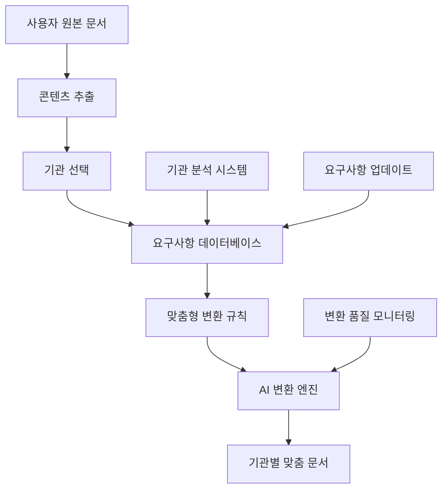

# 🏛️ 기관별 맞춤 요구사항 데이터베이스 설계서 v2.0

> **프로젝트**: 정부지원사업 기관별 서류양식 자동 변환 시스템  
> **버전**: v2.0.0  
> **작성일**: 2025-08-23  
> **목적**: 각 기관의 고유한 서류 요구사항을 AI가 자동으로 적용하는 시스템  

---

## 🎯 **핵심 문제 해결**

### 💡 **현실적 문제**
```
😰 스타트업 대표의 고충:
"SBA에 냈던 사업계획서를 KOSMES에도 내려고 하는데,
양식이 완전히 달라서 처음부터 다시 써야 해요..."

😩 또 다른 기업의 사례:
"NIPA는 기술설명을 3페이지로 요구하는데,
기보에서는 5페이지를 원해요. 내용은 같은데..."
```

### 🚀 **솔루션 개요**
AI가 **동일한 내용**을 각 기관의 **고유한 양식과 요구사항**에 맞게 자동 변환하는 지능형 시스템

---

## 🏗️ **시스템 아키텍처**

### 📊 **전체 구조**


### 🗄️ **데이터베이스 구조**

#### **1. 기관 정보 마스터 테이블**
```sql
CREATE TABLE institutions (
    id SERIAL PRIMARY KEY,
    code VARCHAR(20) UNIQUE NOT NULL,          -- 'sba', 'kosmes', 'nipa', 'techno'
    name VARCHAR(100) NOT NULL,                -- '중소벤처기업부', '중소기업진흥공단'
    full_name VARCHAR(200),                    -- 정식 기관명
    category VARCHAR(30) NOT NULL,             -- 'government', 'public_agency', 'bank'
    parent_ministry VARCHAR(100),              -- 소속 부처
    contact_info JSONB,                        -- 연락처 정보
    website VARCHAR(200),                      -- 공식 웹사이트
    established_date DATE,                     -- 설립일
    description TEXT,                          -- 기관 설명
    status VARCHAR(20) DEFAULT 'active',       -- 'active', 'inactive'
    created_at TIMESTAMP DEFAULT NOW(),
    updated_at TIMESTAMP DEFAULT NOW()
);

-- 샘플 데이터 삽입
INSERT INTO institutions (code, name, full_name, category, parent_ministry) VALUES
('sba', '중소벤처기업부', '중소벤처기업부', 'government', '중소벤처기업부'),
('kosmes', '중소기업진흥공단', '중소기업진흥공단', 'public_agency', '중소벤처기업부'),
('nipa', 'NIPA', '정보통신산업진흥원', 'public_agency', '과학기술정보통신부'),
('techno', '기술보증기금', '기술보증기금', 'public_agency', '중소벤처기업부'),
('kibo', '기업은행', '중소기업은행', 'bank', '기획재정부'),
('kotra', 'KOTRA', '대한무역투자진흥공사', 'public_agency', '산업통상자원부');
```

#### **2. 문서 유형별 기관 요구사항**
```sql
CREATE TABLE document_requirements (
    id SERIAL PRIMARY KEY,
    institution_id INTEGER REFERENCES institutions(id),
    document_type VARCHAR(50) NOT NULL,        -- 'support_business', 'contest_proposal'
    requirement_category VARCHAR(30) NOT NULL, -- 'format', 'content', 'structure'
    priority INTEGER DEFAULT 1,               -- 1=필수, 2=권장, 3=선택
    requirement_data JSONB NOT NULL,          -- 상세 요구사항
    validation_rules JSONB,                   -- 검증 규칙
    examples JSONB,                          -- 예시 및 참고자료
    last_updated DATE DEFAULT CURRENT_DATE,
    version VARCHAR(10) DEFAULT '1.0',
    created_at TIMESTAMP DEFAULT NOW()
);

-- 중소벤처기업부(SBA) 지원사업 신청서 요구사항 예시
INSERT INTO document_requirements (institution_id, document_type, requirement_category, priority, requirement_data) VALUES
(1, 'support_business', 'format', 1, '{
    "page_limit": 20,
    "font_family": "맑은고딕",
    "font_size": "11pt",
    "line_spacing": 1.5,
    "margin": {"top": "20mm", "bottom": "20mm", "left": "20mm", "right": "20mm"},
    "page_numbering": true,
    "header_footer": true,
    "table_border": "1pt solid black"
}'),

(1, 'support_business', 'content', 1, '{
    "business_overview": {
        "max_pages": 3,
        "required_elements": ["사업목표", "추진배경", "기대효과"],
        "key_focus": ["혁신성", "시장성", "기술성"],
        "writing_style": "개조식",
        "include_diagrams": true
    },
    "market_analysis": {
        "max_pages": 2,
        "required_elements": ["시장규모", "경쟁현황", "고객분석"],
        "data_requirements": "최근 3년 통계자료",
        "citation_format": "각주 표기"
    },
    "financial_plan": {
        "required_tables": ["3개년 손익계획", "자금조달계획", "매출계획"],
        "currency_unit": "천원",
        "projection_period": "3년",
        "include_assumptions": true
    }
}');
```

---

## 🤖 **AI 변환 시스템**

### 🧠 **변환 엔진 클래스**
```python
class InstitutionRequirementEngine:
    """기관별 요구사항 처리 엔진"""
    
    def __init__(self):
        self.db = DatabaseManager()
        self.ai_models = {
            'converter': 'gpt-4o',
            'validator': 'claude-3.5-sonnet',
            'optimizer': 'gemini-pro'
        }
    
    async def get_institution_requirements(self, institution_code: str, document_type: str) -> Dict:
        """기관별 문서 요구사항 조회"""
        
        query = """
        SELECT 
            i.name as institution_name,
            dr.requirement_category,
            dr.priority,
            dr.requirement_data,
            dr.validation_rules
        FROM institutions i
        JOIN document_requirements dr ON i.id = dr.institution_id
        WHERE i.code = %s AND dr.document_type = %s
        ORDER BY dr.priority
        """
        
        requirements = await self.db.fetch_all(query, institution_code, document_type)
        
        return {
            'institution': institution_code,
            'document_type': document_type,
            'requirements': self.organize_requirements(requirements),
            'validation_rules': self.extract_validation_rules(requirements)
        }
    
    async def convert_document_between_institutions(
        self,
        source_document: str,
        source_institution: str,
        target_institution: str,
        document_type: str
    ) -> ConvertedDocument:
        """기관간 문서 변환"""
        
        # 1. 소스 기관과 타겟 기관의 요구사항 조회
        source_reqs = await self.get_institution_requirements(source_institution, document_type)
        target_reqs = await self.get_institution_requirements(target_institution, document_type)
        
        # 2. 차이점 분석
        differences = await self.analyze_requirements_differences(
            source_reqs, target_reqs, document_type
        )
        
        # 3. 섹션별 변환 수행
        converted_sections = {}
        for section_name in target_reqs['requirements']['content']:
            converted_sections[section_name] = await self.convert_section(
                source_document, section_name, differences[section_name]
            )
        
        # 4. 형식 변환 적용
        formatted_document = await self.apply_format_requirements(
            converted_sections, target_reqs['requirements']['format']
        )
        
        # 5. 품질 검증
        quality_report = await self.validate_converted_document(
            formatted_document, target_reqs
        )
        
        return ConvertedDocument(
            content=formatted_document,
            source_institution=source_institution,
            target_institution=target_institution,
            conversion_metadata=differences,
            quality_score=quality_report['score'],
            validation_issues=quality_report['issues'],
            suggestions=quality_report['suggestions']
        )
```

---

## 📋 **기관별 특성 프로파일**

### 🏛️ **주요 기관별 특징**

#### **중소벤처기업부 (SBA)**
```yaml
특징:
  - 혁신성과 기술성을 가장 중요시
  - 일자리 창출 효과를 중요하게 평가
  - 글로벌 진출 가능성 관심 높음
  
문체 특성:
  - 개조식 선호
  - 구체적 수치와 목표 명시 요구
  - "혁신", "차별화", "독창성" 키워드 중시
  
평가 포인트:
  - 기술의 참신함: 30%
  - 시장성 및 사업성: 25%
  - 고용창출 가능성: 25%
  - 정책 부합성: 20%
```

#### **중소기업진흥공단 (KOSMES)**
```yaml
특징:
  - 실용성과 상용화 가능성 중시
  - 기술사업화 역량 평가 중요
  - 안정적 성장 가능성에 관심
  
문체 특성:
  - 서술형 + 개조식 혼용
  - 구체적 실행계획 요구
  - "실용화", "상용화", "기술사업화" 키워드 중시
  
평가 포인트:
  - 기술의 완성도: 35%
  - 사업화 계획의 구체성: 30%
  - 팀의 실행력: 20%
  - 시장 진입 전략: 15%
```

---

## 🚀 **구현 로드맵**

### 📅 **Phase 1: 핵심 기관 3곳 (2주)**
- [ ] SBA, KOSMES, NIPA 요구사항 데이터 구축
- [ ] 기본 변환 엔진 개발
- [ ] 섹션별 차이점 매핑 테이블 구축

### 📅 **Phase 2: AI 변환 고도화 (2주)**
- [ ] 기관별 특화 프롬프트 시스템
- [ ] 품질 검증 및 피드백 시스템
- [ ] 실시간 요구사항 업데이트 기능

---

**💡 핵심 가치**: "한 번 작성으로 모든 기관 대응" - AI가 자동으로 각 기관의 요구사항에 맞춰 문서를 변환하여 기업의 서류 작성 부담을 획기적으로 줄이는 혁신적인 시스템

*📝 이 시스템으로 기업들이 정부지원사업 지원 시 겪는 가장 큰 고충 중 하나인 "같은 내용, 다른 양식" 문제를 완전히 해결할 수 있습니다.*