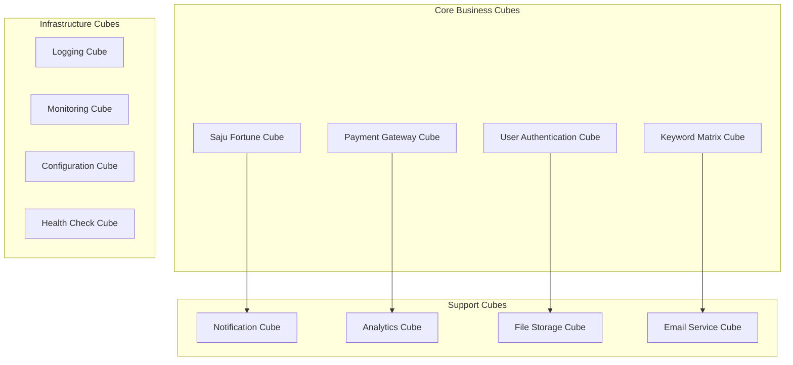

# 🎲 큐브 모델 통합 운영 프로토콜

## 📋 **목적 및 범위**
- **목적**: HEAL7 프로젝트의 큐브 모델 아키텍처와 AI 에이전트 팀의 완전 통합 운영
- **범위**: 큐브 설계, 개발, 배포, 운영, 모니터링의 전 생명주기
- **원칙**: 레고블럭 조립 방식 + 치어떼 유기적 협력

## 🏗️ **큐브 모델 아키텍처 개요**

### **큐브 정의**
```yaml
cube_definition:
  concept: "완전한 기능을 포함하는 독립적 모듈"
  structure:
    frontend: "React/TypeScript UI 레이어"
    backend: "Python/FastAPI 로직 레이어" 
    data: "PostgreSQL/Redis 데이터 레이어"
    api: "RESTful/GraphQL 인터페이스"
    tests: "완전한 테스트 스위트"
    docs: "자체 문서화"
  
  characteristics:
    independence: "다른 큐브 없이도 완전 동작"
    composability: "다른 큐브와 조합 가능"
    deployability: "독립적 배포 가능"
    scalability: "개별 확장 가능"
    maintainability: "독립적 유지보수"
```

### **현재 큐브 인벤토리**


## 👥 **에이전트별 큐브 역할 매핑**

### **🎭 오케스트레이터 (Orchestrator)**
```yaml
responsibilities:
  cube_lifecycle_management:
    - "큐브 간 의존성 검증"
    - "큐브 버전 호환성 확인"
    - "큐브 배포 순서 결정"
    - "큐브 품질 게이트 관리"
  
  integration_oversight:
    - "큐브 간 인터페이스 검증"
    - "데이터 일관성 보장"
    - "트랜잭션 무결성 확인"
    - "성능 임계값 모니터링"
  
  daily_tasks:
    - "큐브 헬스 체크 실행"
    - "큐브 간 통신 상태 확인"
    - "큐브 성능 메트릭 리뷰"
    - "큐브 배포 승인/거부"
```

### **💻 엔지니어 (Engineer)**
```yaml
responsibilities:
  cube_development:
    - "큐브 내부 로직 구현"
    - "큐브 API 설계 및 구현"
    - "큐브 테스트 코드 작성"
    - "큐브 성능 최적화"
  
  cube_quality:
    - "코드 품질 표준 준수"
    - "보안 취약점 제거"
    - "메모리 누수 방지"
    - "API 스펙 문서화"
  
  daily_tasks:
    - "큐브 코드 리뷰"
    - "큐브 단위 테스트 실행"
    - "큐브 통합 테스트"
    - "큐브 리팩토링"
```

### **🎨 디자이너 (Designer)**
```yaml
responsibilities:
  cube_ux_design:
    - "큐브 UI 컴포넌트 설계"
    - "큐브 간 일관된 UX 패턴"
    - "큐브 상호작용 설계"
    - "큐브 접근성 보장"
  
  user_experience:
    - "큐브 사용성 테스트"
    - "큐브 UI 성능 최적화"
    - "큐브 반응형 디자인"
    - "큐브 브랜드 일관성"
  
  daily_tasks:
    - "큐브 UI 컴포넌트 검토"
    - "큐브 디자인 시스템 업데이트"
    - "큐브 사용자 피드백 분석"
    - "큐브 프로토타입 제작"
```

### **🔧 데브옵스 (DevOps)**
```yaml
responsibilities:
  cube_infrastructure:
    - "큐브 컨테이너화"
    - "큐브 오케스트레이션"
    - "큐브 모니터링 설정"
    - "큐브 백업 전략"
  
  cube_deployment:
    - "큐브 CI/CD 파이프라인"
    - "큐브 블루/그린 배포"
    - "큐브 롤백 전략"
    - "큐브 보안 스캔"
  
  daily_tasks:
    - "큐브 인프라 상태 점검"
    - "큐브 배포 모니터링"
    - "큐브 로그 분석"
    - "큐브 보안 업데이트"
```

### **📊 오너 (Owner)**
```yaml
responsibilities:
  cube_strategy:
    - "큐브 로드맵 수립"
    - "큐브 우선순위 결정"
    - "큐브 비즈니스 가치 평가"
    - "큐브 리소스 할당"
  
  stakeholder_management:
    - "큐브 요구사항 수집"
    - "큐브 사용자 피드백 관리"
    - "큐브 성과 리포팅"
    - "큐브 의사결정"
  
  daily_tasks:
    - "큐브 KPI 리뷰"
    - "큐브 사용 현황 분석"
    - "큐브 개선 계획 수립"
    - "큐브 팀 조율"
```

### **🏗️ 아키텍트 (Architect)**
```yaml
responsibilities:
  cube_architecture:
    - "큐브 설계 표준 정의"
    - "큐브 간 통신 프로토콜"
    - "큐브 데이터 아키텍처"
    - "큐브 확장성 설계"
  
  system_evolution:
    - "큐브 모델 진화 방향"
    - "큐브 기술 스택 평가"
    - "큐브 패턴 정의"
    - "큐브 마이그레이션 전략"
  
  daily_tasks:
    - "큐브 아키텍처 리뷰"
    - "큐브 설계 패턴 업데이트"
    - "큐브 기술 연구"
    - "큐브 표준 개선"
```

## 🔄 **큐브 생명주기 관리**

### **Phase 1: 큐브 설계 (Design)**
```python
class CubeDesignPhase:
    def design_new_cube(self, requirements):
        """새로운 큐브 설계 프로세스"""
        
        design_steps = {
            # Step 1: 요구사항 분석 (Owner + Orchestrator)
            'requirements_analysis': {
                'business_requirements': self.analyze_business_needs(requirements),
                'technical_requirements': self.define_technical_specs(requirements),
                'user_stories': self.create_user_stories(requirements),
                'acceptance_criteria': self.define_acceptance_criteria(requirements)
            },
            
            # Step 2: 아키텍처 설계 (Architect + Engineer)
            'architecture_design': {
                'cube_boundaries': self.define_cube_boundaries(requirements),
                'api_interfaces': self.design_api_contracts(requirements),
                'data_model': self.design_data_schema(requirements),
                'integration_points': self.identify_integration_needs(requirements)
            },
            
            # Step 3: UX 설계 (Designer)
            'ux_design': {
                'user_flows': self.design_user_journeys(requirements),
                'ui_mockups': self.create_interface_designs(requirements),
                'interaction_patterns': self.define_interactions(requirements),
                'accessibility_specs': self.ensure_accessibility(requirements)
            },
            
            # Step 4: 기술 스펙 (DevOps + Engineer)
            'technical_specs': {
                'deployment_strategy': self.plan_deployment(requirements),
                'monitoring_specs': self.define_monitoring(requirements),
                'security_requirements': self.specify_security(requirements),
                'performance_targets': self.set_performance_goals(requirements)
            }
        }
        
        # 설계 검증 (All Agents)
        validation_result = self.validate_cube_design(design_steps)
        
        return self.finalize_cube_blueprint(design_steps, validation_result)
```

### **Phase 2: 큐브 개발 (Development)**
```python
class CubeDevelopmentPhase:
    def develop_cube(self, cube_blueprint):
        """큐브 개발 프로세스"""
        
        development_workflow = {
            # 병렬 개발 (팀 협업)
            'parallel_development': {
                'frontend_development': {
                    'owner': 'Designer + Engineer',
                    'tasks': [
                        "UI 컴포넌트 구현",
                        "상태 관리 설정", 
                        "API 클라이언트 구현",
                        "반응형 디자인 적용"
                    ],
                    'review_gates': ['UI/UX 검토', '코드 리뷰', '접근성 검증']
                },
                
                'backend_development': {
                    'owner': 'Engineer + Architect',
                    'tasks': [
                        "API 엔드포인트 구현",
                        "비즈니스 로직 개발",
                        "데이터베이스 설계",
                        "보안 구현"
                    ],
                    'review_gates': ['아키텍처 검토', '코드 리뷰', '보안 검토']
                },
                
                'infrastructure_setup': {
                    'owner': 'DevOps + Engineer',
                    'tasks': [
                        "컨테이너 이미지 구성",
                        "CI/CD 파이프라인 설정",
                        "모니터링 설정",
                        "백업 전략 구현"
                    ],
                    'review_gates': ['인프라 검토', '보안 스캔', '성능 테스트']
                }
            },
            
            # 통합 및 테스트
            'integration_testing': {
                'unit_tests': 'Engineer 담당',
                'integration_tests': 'Engineer + DevOps 담당',
                'e2e_tests': 'Designer + Engineer 담당',
                'performance_tests': 'DevOps + Architect 담당',
                'security_tests': 'DevOps + Engineer 담당'
            },
            
            # 품질 게이트
            'quality_gates': {
                'code_coverage': '> 90%',
                'performance_benchmarks': 'Lighthouse Score > 95',
                'security_scan': '취약점 0개',
                'accessibility': 'WCAG 2.1 AA 준수',
                'documentation': '완성도 100%'
            }
        }
        
        return self.execute_development_workflow(development_workflow)
```

### **Phase 3: 큐브 배포 (Deployment)**
```python
class CubeDeploymentPhase:
    def deploy_cube(self, developed_cube):
        """큐브 배포 프로세스"""
        
        deployment_pipeline = {
            # Pre-deployment 검증
            'pre_deployment': {
                'final_review': {
                    'orchestrator': "전체 품질 최종 검증",
                    'owner': "비즈니스 가치 재확인",
                    'devops': "인프라 준비 상태 확인",
                    'architect': "아키텍처 일관성 검증"
                },
                'deployment_readiness': [
                    "모든 테스트 통과",
                    "문서화 완료",
                    "모니터링 설정 완료",
                    "롤백 계획 수립"
                ]
            },
            
            # 배포 실행
            'deployment_execution': {
                'blue_green_deployment': {
                    'green_environment': "새 큐브 버전 배포",
                    'health_checks': "상태 점검 및 검증",
                    'traffic_shifting': "점진적 트래픽 이동",
                    'monitoring': "실시간 메트릭 모니터링"
                },
                'rollback_readiness': {
                    'trigger_conditions': "에러율 > 1% OR 응답시간 > 1초",
                    'rollback_time': "< 30초",
                    'notification': "전체 팀 즉시 알림"
                }
            },
            
            # Post-deployment 검증
            'post_deployment': {
                'verification_tests': [
                    "기능 동작 확인",
                    "성능 지표 확인", 
                    "보안 상태 확인",
                    "사용자 피드백 수집"
                ],
                'success_criteria': [
                    "에러율 < 0.1%",
                    "응답시간 < 200ms",
                    "사용자 만족도 > 4.5/5"
                ]
            }
        }
        
        return self.execute_deployment_pipeline(deployment_pipeline)
```

### **Phase 4: 큐브 운영 (Operations)**
```python
class CubeOperationsPhase:
    def operate_cube(self, deployed_cube):
        """큐브 운영 프로세스"""
        
        operations_framework = {
            # 일일 운영
            'daily_operations': {
                'health_monitoring': {
                    'devops': "시스템 메트릭 모니터링",
                    'engineer': "애플리케이션 로그 분석",
                    'orchestrator': "전체 큐브 상태 점검"
                },
                'performance_tracking': {
                    'metrics': [
                        "응답 시간", "처리량", "에러율",
                        "CPU 사용률", "메모리 사용률", "디스크 I/O"
                    ],
                    'alerts': "임계값 초과 시 자동 알림",
                    'escalation': "5분 내 대응 시작"
                },
                'user_feedback': {
                    'designer': "사용자 경험 모니터링",
                    'owner': "비즈니스 메트릭 추적",
                    'orchestrator': "피드백 우선순위 분류"
                }
            },
            
            # 주간 운영
            'weekly_operations': {
                'performance_review': "전체 팀 참여",
                'capacity_planning': "DevOps + Architect",
                'security_audit': "DevOps + Engineer",
                'user_satisfaction_survey': "Designer + Owner"
            },
            
            # 월간 운영
            'monthly_operations': {
                'cube_optimization': "성능 및 비용 최적화",
                'feature_roadmap_review': "기능 로드맵 검토",
                'technical_debt_assessment': "기술 부채 평가",
                'team_retrospective': "팀 프로세스 개선"
            }
        }
        
        return self.implement_operations_framework(operations_framework)
```

## 🔗 **큐브 간 통신 프로토콜**

### **동기 통신 (Synchronous Communication)**
```yaml
sync_communication:
  rest_api:
    protocol: "HTTP/HTTPS"
    format: "JSON"
    authentication: "JWT Token"
    rate_limiting: "100 req/min per client"
    timeout: "5 seconds"
    
  graphql:
    protocol: "HTTP/HTTPS"
    format: "GraphQL"
    authentication: "JWT Token"
    query_complexity: "< 1000 points"
    timeout: "10 seconds"
    
  service_mesh:
    discovery: "Consul / Eureka"
    load_balancing: "Round Robin"
    circuit_breaker: "Hystrix Pattern"
    retry_policy: "Exponential Backoff"
```

### **비동기 통신 (Asynchronous Communication)**
```yaml
async_communication:
  event_driven:
    message_broker: "Redis Pub/Sub"
    event_format: "CloudEvents Specification"
    delivery_guarantee: "At-least-once"
    ordering: "Partition-based Ordering"
    
  saga_pattern:
    orchestration: "Centralized Orchestrator"
    compensation: "Automatic Rollback"
    timeout: "30 seconds per step"
    monitoring: "Saga State Tracking"
    
  stream_processing:
    platform: "Apache Kafka"
    partitioning: "User ID based"
    retention: "7 days"
    compression: "GZIP"
```

## 📊 **큐브 모니터링 및 메트릭**

### **큐브별 핵심 메트릭**
```yaml
cube_metrics:
  business_metrics:
    - "사용자 활성도 (DAU/MAU)"
    - "기능 사용률 (%)"
    - "사용자 만족도 (1-5점)"
    - "비즈니스 전환율 (%)"
    
  technical_metrics:
    - "응답 시간 (ms)"
    - "처리량 (RPS)"
    - "에러율 (%)"
    - "가용성 (%)"
    
  operational_metrics:
    - "배포 빈도 (per week)"
    - "배포 성공률 (%)"
    - "평균 복구 시간 (MTTR)"
    - "평균 장애 간격 (MTBF)"
    
  quality_metrics:
    - "코드 커버리지 (%)"
    - "기술 부채 비율 (%)"
    - "보안 취약점 수"
    - "문서화 완성도 (%)"
```

### **통합 대시보드**
```python
class CubeMonitoringDashboard:
    def create_integrated_dashboard(self):
        """통합 큐브 모니터링 대시보드"""
        
        dashboard_components = {
            'cube_overview': {
                'cube_count': "활성 큐브 수",
                'health_status': "전체 큐브 헬스 상태",
                'alert_summary': "활성 알림 요약",
                'performance_trends': "성능 트렌드 차트"
            },
            
            'cube_details': {
                'individual_metrics': "큐브별 상세 메트릭",
                'dependency_map': "큐브 간 의존성 맵",
                'communication_flow': "큐브 간 통신 흐름",
                'resource_utilization': "리소스 사용 현황"
            },
            
            'operational_insights': {
                'deployment_timeline': "배포 이력 타임라인",
                'incident_tracking': "장애 추적 및 분석",
                'capacity_planning': "용량 계획 정보",
                'cost_analysis': "비용 분석 차트"
            },
            
            'business_intelligence': {
                'user_journey_analytics': "사용자 여정 분석",
                'feature_adoption_rates': "기능 채택률",
                'revenue_attribution': "수익 기여도 분석",
                'customer_satisfaction': "고객 만족도 추이"
            }
        }
        
        return self.build_dashboard(dashboard_components)
```

## 🚨 **큐브 장애 대응 프로토콜**

### **장애 등급 및 대응**
```yaml
incident_levels:
  P0_critical:
    description: "서비스 완전 중단"
    response_time: "15분 이내"
    escalation: "모든 에이전트 즉시 소집"
    communication: "사용자 공지 + 실시간 업데이트"
    
  P1_major:
    description: "핵심 기능 중단"
    response_time: "30분 이내"
    escalation: "해당 큐브 팀 + 오케스트레이터"
    communication: "내부 알림 + 사용자 공지"
    
  P2_minor:
    description: "일부 기능 성능 저하"
    response_time: "1시간 이내"
    escalation: "해당 큐브 담당자"
    communication: "내부 알림만"
    
  P3_low:
    description: "미미한 영향"
    response_time: "24시간 이내"
    escalation: "정기 회의에서 논의"
    communication: "로그 기록만"
```

### **자동 복구 메커니즘**
```python
class AutoRecoverySystem:
    def implement_auto_recovery(self):
        """자동 복구 시스템 구현"""
        
        recovery_mechanisms = {
            'health_check_based': {
                'interval': "30초마다 헬스 체크",
                'failure_threshold': "3회 연속 실패",
                'recovery_action': "인스턴스 재시작",
                'notification': "팀 슬랙 채널 알림"
            },
            
            'circuit_breaker': {
                'error_threshold': "에러율 5% 초과",
                'timeout_period': "10초 차단",
                'recovery_test': "1분마다 재시도",
                'fallback_response': "캐시된 응답 반환"
            },
            
            'auto_scaling': {
                'scale_up_trigger': "CPU 70% OR 메모리 80%",
                'scale_down_trigger': "CPU 30% AND 메모리 50%",
                'scale_interval': "5분 간격",
                'max_instances': "큐브당 10개"
            },
            
            'data_recovery': {
                'backup_frequency': "1시간마다",
                'recovery_point': "최대 1시간 데이터 손실",
                'recovery_time': "15분 내 복구",
                'validation': "자동 무결성 검증"
            }
        }
        
        return self.setup_recovery_system(recovery_mechanisms)
```

## 📈 **큐브 성능 최적화**

### **성능 최적화 전략**
```python
class CubePerformanceOptimizer:
    def optimize_cube_performance(self, cube):
        """큐브 성능 최적화"""
        
        optimization_strategies = {
            'frontend_optimization': {
                'code_splitting': "라우트별 코드 분할",
                'lazy_loading': "컴포넌트 지연 로딩",
                'caching_strategy': "브라우저 캐시 + CDN",
                'bundle_optimization': "Tree shaking + Minification"
            },
            
            'backend_optimization': {
                'database_optimization': [
                    "쿼리 최적화 및 인덱싱",
                    "연결 풀링",
                    "읽기 전용 복제본 활용",
                    "캐시 레이어 구축"
                ],
                'api_optimization': [
                    "GraphQL 쿼리 최적화",
                    "응답 압축",
                    "페이지네이션",
                    "비동기 처리"
                ],
                'resource_optimization': [
                    "메모리 사용량 최적화",
                    "CPU 효율성 개선",
                    "I/O 최적화",
                    "가비지 컬렉션 튜닝"
                ]
            },
            
            'infrastructure_optimization': {
                'containerization': [
                    "멀티 스테이지 빌드",
                    "이미지 크기 최소화",
                    "리소스 제한 설정",
                    "헬스 체크 최적화"
                ],
                'networking': [
                    "로드 밸런서 최적화",
                    "CDN 설정",
                    "압축 설정",
                    "Keep-alive 연결"
                ]
            }
        }
        
        return self.apply_optimizations(cube, optimization_strategies)
```

## 🔐 **큐브 보안 프로토콜**

### **보안 계층별 접근**
```yaml
security_layers:
  infrastructure_security:
    - "컨테이너 이미지 보안 스캔"
    - "네트워크 분할 및 방화벽"
    - "TLS/SSL 암호화"
    - "시크릿 관리 (Vault/K8s Secrets)"
    
  application_security:
    - "입력 검증 및 새니타이제이션"
    - "SQL 인젝션 방지"
    - "XSS/CSRF 방어"
    - "인증/인가 구현"
    
  data_security:
    - "데이터 암호화 (rest/transit)"
    - "개인정보 보호 (GDPR 준수)"
    - "백업 데이터 보안"
    - "접근 로그 및 감사"
    
  operational_security:
    - "보안 패치 관리"
    - "취약점 스캔"
    - "침입 탐지 시스템"
    - "보안 사고 대응"
```

---

## 📋 **일일 큐브 운영 체크리스트**

### **🌅 아침 (09:00-10:00)**
```markdown
## 큐브 시스템 일일 시작 체크

### 🎭 오케스트레이터
- [ ] 전체 큐브 헬스 상태 확인
- [ ] 야간 배포 결과 검증
- [ ] 큐브 간 통신 상태 점검
- [ ] 성능 임계값 초과 사항 확인

### 🔧 데브옵스
- [ ] 인프라 메트릭 검토
- [ ] 보안 알림 확인
- [ ] 백업 상태 검증
- [ ] 로그 분석 요약

### 💻 엔지니어
- [ ] 애플리케이션 에러 로그 확인
- [ ] 큐브별 성능 지표 검토
- [ ] 기술 부채 이슈 파악
- [ ] 코드 품질 메트릭 확인

### 🎨 디자이너
- [ ] 사용자 경험 메트릭 확인
- [ ] UI 성능 지표 검토
- [ ] 사용자 피드백 분석
- [ ] A/B 테스트 결과 확인

### 📊 오너
- [ ] 비즈니스 KPI 검토
- [ ] 사용자 활성도 분석
- [ ] 수익 메트릭 확인
- [ ] 고객 만족도 체크

### 🏗️ 아키텍트
- [ ] 시스템 아키텍처 이슈 검토
- [ ] 큐브 간 의존성 분석
- [ ] 확장성 메트릭 모니터링
- [ ] 기술 트렌드 리서치
```

### **🌆 저녁 (18:00-19:00)**
```markdown
## 큐브 시스템 일일 마무리 체크

### 전체 팀 공동 작업
- [ ] 일일 큐브 성과 리뷰
- [ ] 내일 우선순위 큐브 선정
- [ ] 큐브 위험 요소 식별
- [ ] 개선 사항 백로그 업데이트
- [ ] 큐브 문서 최신화 확인
```

---

**🎯 목표**: 큐브 모델과 AI 에이전트 팀이 완벽하게 통합되어 치어떼처럼 유기적으로 협력하는 시스템 구축

*마지막 업데이트: 2025-08-20*