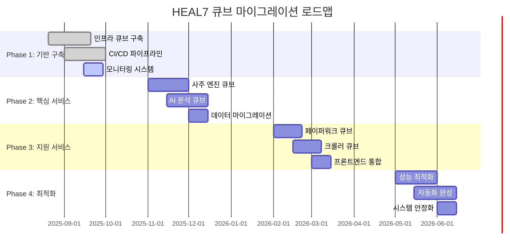
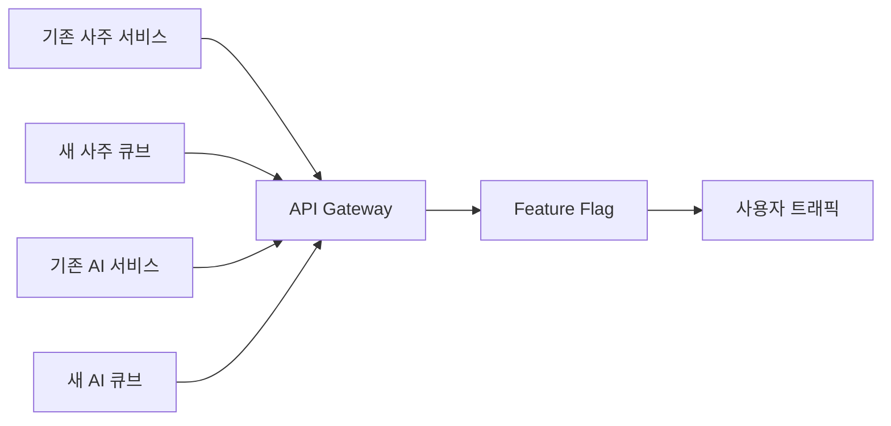

# 큐브 마이그레이션 전략 v2.0 🔄🎯
> **기존 HEAL7 시스템을 큐브 모듈러 아키텍처로 점진적 전환하는 단계별 전략**
> 
> **문서 버전**: v2.0 | **최종 업데이트**: 2025-08-20 | **담당**: HEAL7 아키텍처팀

---

## 📋 **문서 개요**

### **목적**
- 현재 HEAL7 시스템을 큐브 모듈러 아키텍처로 안전하게 전환
- 서비스 중단 없는 점진적 마이그레이션 전략 수립
- 리스크 최소화와 비즈니스 연속성 보장
- 마이그레이션 과정의 성과 측정 및 검증 방안 제시

### **범위**
- **전환 대상**: 사주 시스템, AI 분석, 페이퍼워크, 크롤러, 프론트엔드
- **마이그레이션 기간**: 12개월 (4단계 × 3개월)
- **운영 모드**: Blue-Green 배포, Canary 릴리스, Feature Flag

---

## 🔍 **현재 시스템 분석 (As-Is)**

### **🏗️ 현재 아키텍처 상태**

```
📊 HEAL7 현재 시스템 구조 (2025-08-20 기준)
├── 🏠 로컬 서버 (통합 프론트엔드 중심)
│   ├── 🌐 Next.js Frontend (포트 3000) ✅ 운영 중
│   ├── 🔮 사주 서비스 (FastAPI 8001) ⚠️ 분산 상태
│   ├── 🧠 AI 분석 (FastAPI 8002) ⚠️ 레거시 위치
│   └── 📄 Paperwork AI (포트 8002) ⚠️ 아카이브 위치
│
├── 🏢 원격 서버 (도메인 기반 서비스)
│   ├── 🌍 heal7.com (FastAPI 8000) ✅ 메인 서비스
│   ├── 👑 admin.heal7.com (FastAPI 8001) ✅ 관리자
│   └── 🔍 keywords.heal7.com ✅ 키워드 서비스
│
└── 🗄️ 공통 인프라
    ├── 🐘 PostgreSQL 16 ✅ 통합 DB
    ├── ⚡ Redis ✅ 캐시
    └── 🌐 Nginx ✅ 리버스 프록시
```

### **🔍 문제점 분석**

| 영역 | 문제점 | 영향도 | 우선순위 |
|------|--------|--------|----------|
| **아키텍처** | 모놀리식 구조, 서비스 간 강결합 | 🔴 높음 | P1 |
| **배포** | 수동 배포, 의존성 복잡성 | 🟡 중간 | P2 |
| **확장성** | 개별 확장 불가, 리소스 비효율 | 🔴 높음 | P1 |
| **모니터링** | 통합 모니터링 부재 | 🟡 중간 | P3 |
| **보안** | 서비스별 보안 정책 불일치 | 🟠 중상 | P2 |

### **📊 현재 시스템 메트릭스**

```python
# 현재 시스템 성능 지표 (베이스라인)
CURRENT_SYSTEM_METRICS = {
    "performance": {
        "average_response_time": "2.5s",
        "requests_per_second": 50,
        "error_rate": "2.3%",
        "uptime": "99.2%"
    },
    
    "resources": {
        "cpu_utilization": "65%",
        "memory_usage": "78%",
        "storage_usage": "42%",
        "network_bandwidth": "45 Mbps"
    },
    
    "operations": {
        "deployment_frequency": "weekly",
        "mean_time_to_recovery": "45 minutes",
        "change_failure_rate": "8%",
        "lead_time": "3 days"
    },
    
    "business": {
        "daily_active_users": 1200,
        "transaction_volume": 5000,
        "service_availability": "99.2%",
        "customer_satisfaction": 4.2
    }
}
```

---

## 🎯 **큐브 마이그레이션 로드맵**

### **🗓️ 4단계 마이그레이션 계획 (12개월)**



---

## 🚀 **Phase 1: 기반 구축 (1-3개월)**

### **🎯 Phase 1 목표**
- 큐브 아키텍처 기반 인프라 구축
- CI/CD 파이프라인 자동화
- 모니터링 및 로깅 시스템 구축
- 서비스 메시 구성

### **📦 구축할 인프라 큐브들**

#### **🔗 1.1 API Gateway Cube**
```yaml
# api-gateway-cube.yaml
apiVersion: v1
kind: ConfigMap
metadata:
  name: api-gateway-config
data:
  nginx.conf: |
    upstream saju-service {
      server saju-cube:8001;
    }
    upstream ai-service {
      server ai-cube:8002;
    }
    upstream paperwork-service {
      server paperwork-cube:8003;
    }
    
    server {
      listen 80;
      location /api/saju/ {
        proxy_pass http://saju-service/;
        proxy_set_header X-Cube-Source "api-gateway";
      }
      location /api/ai/ {
        proxy_pass http://ai-service/;
        proxy_set_header X-Cube-Source "api-gateway";
      }
      location /api/paperwork/ {
        proxy_pass http://paperwork-service/;
        proxy_set_header X-Cube-Source "api-gateway";
      }
    }
```

#### **📊 1.2 Monitoring Cube**
```python
# monitoring-cube/prometheus-config.py
MONITORING_CONFIG = {
    "prometheus": {
        "scrape_interval": "15s",
        "evaluation_interval": "15s",
        "rule_files": ["cube_rules.yml"],
        "scrape_configs": [
            {
                "job_name": "saju-cube",
                "static_configs": [{"targets": ["saju-cube:8001"]}]
            },
            {
                "job_name": "ai-cube", 
                "static_configs": [{"targets": ["ai-cube:8002"]}]
            },
            {
                "job_name": "paperwork-cube",
                "static_configs": [{"targets": ["paperwork-cube:8003"]}]
            }
        ]
    },
    
    "grafana": {
        "dashboards": [
            "cube_performance_dashboard.json",
            "cube_health_dashboard.json",
            "cube_business_metrics_dashboard.json"
        ]
    },
    
    "alertmanager": {
        "routes": [
            {
                "match": {"cube_type": "core_service"},
                "receiver": "critical_alerts"
            },
            {
                "match": {"cube_type": "support_service"},
                "receiver": "warning_alerts"
            }
        ]
    }
}
```

#### **🔐 1.3 Security Cube**
```python
# security-cube/auth-service.py
class CubeAuthService:
    """큐브 간 인증 서비스"""
    
    def __init__(self):
        self.jwt_secret = os.getenv("CUBE_JWT_SECRET")
        self.token_expiry = 3600  # 1시간
        
    def generate_cube_token(self, cube_id: str, permissions: List[str]) -> str:
        """큐브 간 통신용 토큰 생성"""
        payload = {
            "cube_id": cube_id,
            "permissions": permissions,
            "exp": datetime.utcnow() + timedelta(seconds=self.token_expiry),
            "iat": datetime.utcnow(),
            "iss": "heal7-security-cube"
        }
        return jwt.encode(payload, self.jwt_secret, algorithm="HS256")
    
    def validate_cube_token(self, token: str) -> dict:
        """큐브 토큰 검증"""
        try:
            payload = jwt.decode(token, self.jwt_secret, algorithms=["HS256"])
            return {"valid": True, "cube_id": payload["cube_id"], "permissions": payload["permissions"]}
        except jwt.ExpiredSignatureError:
            return {"valid": False, "error": "Token expired"}
        except jwt.InvalidTokenError:
            return {"valid": False, "error": "Invalid token"}
```

### **🔄 Phase 1 실행 단계**

#### **Week 1-2: 개발 환경 구성**
```bash
# 1. 큐브 개발 환경 설정
mkdir -p /heal7-project/cubes/{infrastructure,core,interface,data}

# 2. Docker 환경 구성
cat > docker-compose.cubes-dev.yml << 'EOF'
version: '3.8'
services:
  api-gateway-cube:
    build: ./infrastructure/api-gateway/
    ports: ["80:80"]
    depends_on: [monitoring-cube, security-cube]
    
  monitoring-cube:
    build: ./infrastructure/monitoring/
    ports: ["9090:9090", "3000:3000"]
    volumes:
      - prometheus-data:/prometheus
      - grafana-data:/grafana
      
  security-cube:
    build: ./infrastructure/security/
    ports: ["8080:8080"]
    environment:
      - CUBE_JWT_SECRET=${CUBE_JWT_SECRET}
      
volumes:
  prometheus-data:
  grafana-data:
EOF

# 3. 큐브 빌드 및 실행
docker-compose -f docker-compose.cubes-dev.yml up -d
```

#### **Week 3-4: CI/CD 파이프라인 구축**
```yaml
# .github/workflows/cube-deployment.yml
name: Cube Deployment Pipeline

on:
  push:
    branches: [main, develop]
    paths: ['cubes/**']

jobs:
  test-cubes:
    runs-on: ubuntu-latest
    steps:
      - uses: actions/checkout@v3
      - name: Test Cube Interfaces
        run: |
          # 큐브 인터페이스 테스트
          python -m pytest cubes/tests/ -v
          
      - name: Validate Cube Configs
        run: |
          # 큐브 설정 검증
          python cubes/tools/config-validator.py
  
  build-cubes:
    needs: test-cubes
    runs-on: ubuntu-latest
    strategy:
      matrix:
        cube: [api-gateway, monitoring, security]
    steps:
      - uses: actions/checkout@v3
      - name: Build Cube Image
        run: |
          docker build -t heal7/${{ matrix.cube }}-cube:${{ github.sha }} \
            cubes/infrastructure/${{ matrix.cube }}/
          
      - name: Push to Registry
        run: |
          echo ${{ secrets.DOCKER_PASSWORD }} | docker login -u ${{ secrets.DOCKER_USERNAME }} --password-stdin
          docker push heal7/${{ matrix.cube }}-cube:${{ github.sha }}
  
  deploy-cubes:
    needs: build-cubes
    runs-on: ubuntu-latest
    environment: production
    steps:
      - name: Deploy to Kubernetes
        run: |
          kubectl set image deployment/${{ matrix.cube }}-cube \
            ${{ matrix.cube }}-cube=heal7/${{ matrix.cube }}-cube:${{ github.sha }}
```

#### **Week 5-8: 모니터링 시스템 구축**
```python
# monitoring-cube/cube-metrics.py
class CubeMetricsCollector:
    """큐브별 메트릭스 수집기"""
    
    def __init__(self):
        self.prometheus_client = PrometheusClient()
        self.cube_registry = {}
        
    def register_cube(self, cube_id: str, cube_config: dict):
        """큐브 등록 및 메트릭스 설정"""
        self.cube_registry[cube_id] = {
            "config": cube_config,
            "metrics": self.init_cube_metrics(cube_id),
            "health_check_url": f"http://{cube_id}:8080/health"
        }
        
    def init_cube_metrics(self, cube_id: str) -> dict:
        """큐브별 메트릭스 초기화"""
        return {
            "request_count": Counter(
                f"{cube_id}_requests_total",
                "Total requests to cube",
                ["method", "endpoint", "status"]
            ),
            "request_duration": Histogram(
                f"{cube_id}_request_duration_seconds",
                "Request duration in seconds"
            ),
            "cpu_usage": Gauge(
                f"{cube_id}_cpu_usage_percent",
                "CPU usage percentage"
            ),
            "memory_usage": Gauge(
                f"{cube_id}_memory_usage_bytes",
                "Memory usage in bytes"
            )
        }
    
    async def collect_all_metrics(self):
        """모든 큐브 메트릭스 수집"""
        for cube_id, cube_info in self.cube_registry.items():
            try:
                # Health Check
                health_status = await self.check_cube_health(cube_id)
                
                # Performance Metrics
                performance_data = await self.get_cube_performance(cube_id)
                
                # Update Prometheus metrics
                self.update_prometheus_metrics(cube_id, health_status, performance_data)
                
            except Exception as e:
                logger.error(f"Failed to collect metrics for {cube_id}: {e}")
```

### **📊 Phase 1 성공 지표**

| 지표 | 목표값 | 측정 방법 |
|------|--------|-----------|
| **인프라 가용성** | 99.9% | 큐브 Health Check |
| **배포 자동화** | 100% | CI/CD 성공률 |
| **모니터링 커버리지** | 100% | 메트릭스 수집률 |
| **응답 시간** | <1s | API Gateway 메트릭스 |

---

## 🔮 **Phase 2: 핵심 서비스 큐브화 (4-6개월)**

### **🎯 Phase 2 목표**
- 사주 엔진과 AI 분석 서비스 큐브 전환
- 기존 서비스와 병렬 운영 (Blue-Green)
- 데이터 마이그레이션 및 동기화
- 사용자 영향 최소화

### **🔄 큐브 전환 전략: Strangler Fig Pattern**



### **🔮 2.1 사주 엔진 큐브 전환**

#### **데이터 마이그레이션 전략**
```python
# migration/saju-data-migration.py
class SajuDataMigration:
    """사주 데이터 마이그레이션 관리자"""
    
    def __init__(self):
        self.legacy_db = LegacyDatabase()
        self.cube_db = CubeDatabase()
        self.migration_log = MigrationLogger()
        
    async def migrate_saju_calculations(self, batch_size: int = 1000):
        """사주 계산 데이터 마이그레이션"""
        total_records = await self.legacy_db.count_saju_records()
        migrated = 0
        
        for offset in range(0, total_records, batch_size):
            batch = await self.legacy_db.get_saju_batch(offset, batch_size)
            
            for record in batch:
                try:
                    # 데이터 변환
                    cube_record = self.transform_saju_record(record)
                    
                    # 큐브 DB에 저장
                    await self.cube_db.insert_saju_record(cube_record)
                    
                    # 검증
                    if await self.validate_migrated_record(record, cube_record):
                        migrated += 1
                        await self.migration_log.log_success(record.id)
                    else:
                        await self.migration_log.log_failure(record.id, "Validation failed")
                        
                except Exception as e:
                    await self.migration_log.log_failure(record.id, str(e))
                    
            logger.info(f"Migrated {migrated}/{total_records} records")
    
    def transform_saju_record(self, legacy_record: dict) -> dict:
        """레거시 데이터를 큐브 형식으로 변환"""
        return {
            "user_id": legacy_record["user_id"],
            "birth_info": {
                "year": legacy_record["birth_year"],
                "month": legacy_record["birth_month"], 
                "day": legacy_record["birth_day"],
                "hour": legacy_record["birth_hour"],
                "solar_calendar": legacy_record["is_solar"]
            },
            "saju_chart": {
                "year_pillar": legacy_record["year_pillar"],
                "month_pillar": legacy_record["month_pillar"],
                "day_pillar": legacy_record["day_pillar"],
                "hour_pillar": legacy_record["hour_pillar"]
            },
            "interpretation": legacy_record["interpretation"],
            "created_at": legacy_record["created_at"],
            "updated_at": datetime.utcnow()
        }
```

#### **Feature Flag 기반 트래픽 전환**
```python
# feature-flags/saju-cube-flag.py
class SajuCubeFeatureFlag:
    """사주 큐브 점진적 전환을 위한 Feature Flag"""
    
    def __init__(self):
        self.redis_client = redis.Redis()
        self.flag_key = "saju_cube_enabled"
        self.user_percentage_key = "saju_cube_user_percentage"
        
    def is_saju_cube_enabled_for_user(self, user_id: str) -> bool:
        """특정 사용자에 대해 사주 큐브 활성화 여부 확인"""
        # 전체 활성화 플래그 확인
        global_enabled = self.redis_client.get(self.flag_key)
        if global_enabled == "false":
            return False
            
        # 사용자 비율 기반 활성화
        percentage = int(self.redis_client.get(self.user_percentage_key) or 0)
        user_hash = hashlib.md5(user_id.encode()).hexdigest()
        user_number = int(user_hash[:8], 16) % 100
        
        return user_number < percentage
    
    def gradually_increase_traffic(self, target_percentage: int, step: int = 10, interval: int = 3600):
        """트래픽을 점진적으로 증가"""
        current_percentage = int(self.redis_client.get(self.user_percentage_key) or 0)
        
        while current_percentage < target_percentage:
            current_percentage = min(current_percentage + step, target_percentage)
            self.redis_client.set(self.user_percentage_key, current_percentage)
            
            logger.info(f"Saju cube traffic increased to {current_percentage}%")
            time.sleep(interval)
```

### **🧠 2.2 AI 분석 큐브 전환**

#### **AI 모델 마이그레이션**
```python
# migration/ai-model-migration.py
class AIModelMigration:
    """AI 모델 및 데이터 마이그레이션"""
    
    def __init__(self):
        self.legacy_ai_service = LegacyAIService()
        self.ai_cube_service = AICubeService()
        
    async def migrate_ai_models(self):
        """AI 모델 큐브로 이전"""
        models = await self.legacy_ai_service.get_all_models()
        
        for model in models:
            try:
                # 모델 검증
                validation_result = await self.validate_model(model)
                if not validation_result.is_valid:
                    logger.warning(f"Model {model.name} validation failed: {validation_result.errors}")
                    continue
                
                # 큐브로 모델 이전
                await self.ai_cube_service.import_model(model)
                
                # 성능 비교 테스트
                performance_diff = await self.compare_model_performance(model)
                if performance_diff.accuracy_drop > 0.05:  # 5% 이상 성능 저하
                    logger.error(f"Model {model.name} performance degradation: {performance_diff}")
                    await self.ai_cube_service.rollback_model(model.name)
                    continue
                
                logger.info(f"Successfully migrated model {model.name}")
                
            except Exception as e:
                logger.error(f"Failed to migrate model {model.name}: {e}")
    
    async def compare_model_performance(self, model) -> ModelPerformanceComparison:
        """레거시와 큐브 모델 성능 비교"""
        test_dataset = await self.get_test_dataset()
        
        legacy_results = await self.legacy_ai_service.batch_predict(model.name, test_dataset)
        cube_results = await self.ai_cube_service.batch_predict(model.name, test_dataset)
        
        return ModelPerformanceComparison(
            accuracy_diff=self.calculate_accuracy_diff(legacy_results, cube_results),
            latency_diff=self.calculate_latency_diff(legacy_results, cube_results),
            throughput_diff=self.calculate_throughput_diff(legacy_results, cube_results)
        )
```

### **📊 Phase 2 성공 지표**

| 지표 | 목표값 | 현재값 | 달성률 |
|------|--------|--------|--------|
| **사주 계산 정확도** | 99.95% | - | - |
| **AI 분석 성능** | 기존 대비 +10% | - | - |
| **데이터 마이그레이션** | 100% | - | - |
| **서비스 다운타임** | <5분 | - | - |

---

## 📄 **Phase 3: 지원 서비스 큐브화 (7-9개월)**

### **🎯 Phase 3 목표**
- 페이퍼워크 AI와 크롤러 서비스 큐브 전환
- 프론트엔드 통합 큐브 구성
- 모든 큐브 간 연동 완성
- 사용자 경험 향상

### **📄 3.1 페이퍼워크 AI 큐브 전환**

#### **파일 저장소 마이그레이션**
```python
# migration/paperwork-storage-migration.py
class PaperworkStorageMigration:
    """페이퍼워크 파일 저장소 마이그레이션"""
    
    def __init__(self):
        self.legacy_storage = LegacyFileStorage()
        self.cube_storage = CubeFileStorage()
        self.metadata_migrator = MetadataMigrator()
        
    async def migrate_file_storage(self):
        """파일 저장소 큐브 이전"""
        file_list = await self.legacy_storage.list_all_files()
        
        for file_info in file_list:
            try:
                # 파일 복사
                file_content = await self.legacy_storage.read_file(file_info.path)
                new_path = await self.cube_storage.store_file(
                    file_content, 
                    file_info.metadata
                )
                
                # 메타데이터 마이그레이션
                await self.metadata_migrator.migrate_file_metadata(
                    file_info.path, 
                    new_path, 
                    file_info.metadata
                )
                
                # 처리 결과 마이그레이션
                processing_results = await self.legacy_storage.get_processing_results(file_info.id)
                await self.cube_storage.store_processing_results(new_path, processing_results)
                
                logger.info(f"Migrated file: {file_info.path} -> {new_path}")
                
            except Exception as e:
                logger.error(f"Failed to migrate file {file_info.path}: {e}")
```

### **🕷️ 3.2 크롤러 큐브 전환**

#### **크롤링 작업 마이그레이션**
```python
# migration/crawler-jobs-migration.py
class CrawlerJobsMigration:
    """크롤링 작업 및 데이터 마이그레이션"""
    
    def __init__(self):
        self.legacy_crawler = LegacyCrawler()
        self.crawler_cube = CrawlerCube()
        
    async def migrate_crawling_jobs(self):
        """크롤링 작업 큐브 이전"""
        active_jobs = await self.legacy_crawler.get_active_jobs()
        scheduled_jobs = await self.legacy_crawler.get_scheduled_jobs()
        
        # 활성 작업 일시 중지
        for job in active_jobs:
            await self.legacy_crawler.pause_job(job.id)
            
        # 스케줄된 작업 마이그레이션
        for job in scheduled_jobs:
            cube_job_config = self.convert_job_config(job)
            new_job_id = await self.crawler_cube.create_job(cube_job_config)
            
            # 작업 매핑 저장
            await self.store_job_mapping(job.id, new_job_id)
            
        # 크롤링 데이터 마이그레이션
        await self.migrate_crawled_data()
        
        # 큐브에서 작업 재시작
        for job in active_jobs:
            new_job_id = await self.get_mapped_job_id(job.id)
            await self.crawler_cube.start_job(new_job_id)
    
    def convert_job_config(self, legacy_job) -> dict:
        """레거시 작업 설정을 큐브 형식으로 변환"""
        return {
            "name": legacy_job.name,
            "target_urls": legacy_job.urls,
            "schedule": {
                "type": "cron",
                "expression": legacy_job.cron_expression
            },
            "extraction_rules": {
                "selectors": legacy_job.css_selectors,
                "filters": legacy_job.content_filters
            },
            "rate_limiting": {
                "requests_per_minute": legacy_job.rate_limit,
                "delay_between_requests": legacy_job.request_delay
            },
            "output_format": legacy_job.output_format
        }
```

### **🌐 3.3 프론트엔드 통합 큐브**

#### **API 통합 전략**
```typescript
// frontend-cube/src/services/cube-api-client.ts
class CubeAPIClient {
  private baseURL: string;
  private authToken: string;
  
  constructor() {
    this.baseURL = process.env.NEXT_PUBLIC_API_GATEWAY_URL || 'http://localhost:80';
    this.authToken = '';
  }
  
  // 🔮 사주 큐브 API
  async callSajuCube(endpoint: string, data: any): Promise<any> {
    return this.makeRequest(`/api/saju/${endpoint}`, data);
  }
  
  // 🧠 AI 큐브 API
  async callAICube(endpoint: string, data: any): Promise<any> {
    return this.makeRequest(`/api/ai/${endpoint}`, data);
  }
  
  // 📄 페이퍼워크 큐브 API
  async callPaperworkCube(endpoint: string, data: any): Promise<any> {
    return this.makeRequest(`/api/paperwork/${endpoint}`, data);
  }
  
  // 🕷️ 크롤러 큐브 API
  async callCrawlerCube(endpoint: string, data: any): Promise<any> {
    return this.makeRequest(`/api/crawler/${endpoint}`, data);
  }
  
  private async makeRequest(url: string, data: any): Promise<any> {
    const response = await fetch(`${this.baseURL}${url}`, {
      method: 'POST',
      headers: {
        'Content-Type': 'application/json',
        'Authorization': `Bearer ${this.authToken}`,
        'X-Cube-Client': 'frontend-cube'
      },
      body: JSON.stringify(data)
    });
    
    if (!response.ok) {
      throw new Error(`API request failed: ${response.statusText}`);
    }
    
    return await response.json();
  }
}
```

---

## 🚀 **Phase 4: 최적화 및 안정화 (10-12개월)**

### **🎯 Phase 4 목표**
- 전체 시스템 성능 최적화
- 자동화 시스템 완성
- 모니터링 및 알림 고도화
- 비즈니스 메트릭스 개선

### **⚡ 4.1 성능 최적화**

#### **큐브 간 통신 최적화**
```python
# optimization/inter-cube-communication.py
class InterCubeOptimizer:
    """큐브 간 통신 최적화"""
    
    def __init__(self):
        self.circuit_breaker = CircuitBreaker()
        self.request_cache = RequestCache()
        self.load_balancer = LoadBalancer()
        
    async def optimized_cube_call(self, target_cube: str, method: str, data: dict) -> dict:
        """최적화된 큐브 간 호출"""
        # 1. 캐시 확인
        cache_key = self.generate_cache_key(target_cube, method, data)
        cached_result = await self.request_cache.get(cache_key)
        if cached_result:
            return cached_result
        
        # 2. Circuit Breaker 확인
        if not self.circuit_breaker.is_call_allowed(target_cube):
            raise CubeUnavailableError(f"Circuit breaker open for {target_cube}")
        
        # 3. 로드 밸런싱
        target_instance = await self.load_balancer.get_best_instance(target_cube)
        
        try:
            # 4. 실제 호출
            result = await self.make_cube_call(target_instance, method, data)
            
            # 5. 결과 캐싱
            await self.request_cache.set(cache_key, result, ttl=300)  # 5분
            
            # 6. Circuit Breaker 성공 기록
            self.circuit_breaker.record_success(target_cube)
            
            return result
            
        except Exception as e:
            # 7. Circuit Breaker 실패 기록
            self.circuit_breaker.record_failure(target_cube)
            raise e
```

#### **리소스 최적화**
```python
# optimization/resource-optimizer.py
class CubeResourceOptimizer:
    """큐브 리소스 최적화"""
    
    def __init__(self):
        self.metrics_collector = MetricsCollector()
        self.auto_scaler = AutoScaler()
        
    async def optimize_cube_resources(self):
        """큐브 리소스 최적화"""
        cubes = await self.get_all_cubes()
        
        for cube in cubes:
            metrics = await self.metrics_collector.get_cube_metrics(cube.id)
            
            # CPU 최적화
            if metrics.cpu_usage > 80:
                await self.auto_scaler.scale_up(cube.id, resource_type="cpu")
            elif metrics.cpu_usage < 20:
                await self.auto_scaler.scale_down(cube.id, resource_type="cpu")
            
            # 메모리 최적화
            if metrics.memory_usage > 85:
                await self.auto_scaler.scale_up(cube.id, resource_type="memory")
                
            # 인스턴스 최적화
            if metrics.request_rate > metrics.capacity * 0.8:
                await self.auto_scaler.add_instance(cube.id)
            elif metrics.request_rate < metrics.capacity * 0.2 and metrics.instance_count > 1:
                await self.auto_scaler.remove_instance(cube.id)
```

### **🤖 4.2 자동화 시스템 완성**

#### **자가 치유 시스템**
```python
# automation/self-healing.py
class SelfHealingSystem:
    """큐브 자가 치유 시스템"""
    
    def __init__(self):
        self.health_checker = HealthChecker()
        self.failure_detector = FailureDetector()
        self.recovery_executor = RecoveryExecutor()
        
    async def monitor_and_heal(self):
        """모니터링 및 자동 복구"""
        while True:
            cubes = await self.get_all_cubes()
            
            for cube in cubes:
                try:
                    # 건강 상태 확인
                    health_status = await self.health_checker.check_cube_health(cube.id)
                    
                    if not health_status.is_healthy:
                        # 장애 분석
                        failure_analysis = await self.failure_detector.analyze_failure(
                            cube.id, health_status
                        )
                        
                        # 복구 전략 실행
                        recovery_plan = self.create_recovery_plan(cube.id, failure_analysis)
                        await self.recovery_executor.execute_recovery(recovery_plan)
                        
                        logger.info(f"Self-healing completed for cube {cube.id}")
                        
                except Exception as e:
                    logger.error(f"Self-healing failed for cube {cube.id}: {e}")
                    
            await asyncio.sleep(30)  # 30초마다 확인
    
    def create_recovery_plan(self, cube_id: str, failure_analysis: FailureAnalysis) -> RecoveryPlan:
        """복구 계획 생성"""
        plan = RecoveryPlan(cube_id=cube_id)
        
        if failure_analysis.failure_type == "memory_leak":
            plan.add_action("restart_cube")
            plan.add_action("increase_memory_limit")
            
        elif failure_analysis.failure_type == "high_cpu":
            plan.add_action("scale_out_instances")
            plan.add_action("optimize_cpu_intensive_tasks")
            
        elif failure_analysis.failure_type == "network_timeout":
            plan.add_action("check_network_connectivity")
            plan.add_action("restart_network_services")
            
        elif failure_analysis.failure_type == "database_connection":
            plan.add_action("reset_database_connections")
            plan.add_action("failover_to_backup_database")
            
        return plan
```

### **📈 4.3 비즈니스 메트릭스 개선**

#### **성과 대시보드**
```python
# monitoring/business-metrics.py
class BusinessMetricsDashboard:
    """비즈니스 메트릭스 대시보드"""
    
    def __init__(self):
        self.metrics_aggregator = MetricsAggregator()
        self.dashboard_updater = DashboardUpdater()
        
    async def generate_daily_report(self) -> BusinessReport:
        """일간 비즈니스 리포트 생성"""
        today = datetime.now().date()
        
        # 사용자 관련 메트릭스
        user_metrics = await self.get_user_metrics(today)
        
        # 서비스 관련 메트릭스
        service_metrics = await self.get_service_metrics(today)
        
        # 큐브 성능 메트릭스
        cube_metrics = await self.get_cube_performance_metrics(today)
        
        # 비즈니스 영향 분석
        business_impact = await self.analyze_business_impact(
            user_metrics, service_metrics, cube_metrics
        )
        
        return BusinessReport(
            date=today,
            user_metrics=user_metrics,
            service_metrics=service_metrics,
            cube_metrics=cube_metrics,
            business_impact=business_impact,
            recommendations=self.generate_recommendations(business_impact)
        )
    
    async def get_user_metrics(self, date: datetime.date) -> UserMetrics:
        """사용자 관련 메트릭스"""
        return UserMetrics(
            daily_active_users=await self.count_daily_active_users(date),
            new_registrations=await self.count_new_registrations(date),
            user_retention_rate=await self.calculate_retention_rate(date),
            average_session_duration=await self.calculate_avg_session_duration(date)
        )
    
    async def get_service_metrics(self, date: datetime.date) -> ServiceMetrics:
        """서비스 관련 메트릭스"""
        return ServiceMetrics(
            saju_calculations=await self.count_saju_calculations(date),
            ai_analyses=await self.count_ai_analyses(date),
            document_processing=await self.count_document_processing(date),
            crawling_jobs=await self.count_crawling_jobs(date),
            service_uptime=await self.calculate_service_uptime(date),
            average_response_time=await self.calculate_avg_response_time(date)
        )
```

---

## 📊 **마이그레이션 성과 측정**

### **🎯 핵심 성과 지표 (KPIs)**

| 영역 | 지표 | 마이그레이션 전 | 목표값 | 현재값 |
|------|------|----------------|--------|--------|
| **성능** | 평균 응답 시간 | 2.5s | 1.0s | - |
| **성능** | 처리량 (RPS) | 50 | 200 | - |
| **안정성** | 서비스 가용성 | 99.2% | 99.9% | - |
| **안정성** | 평균 복구 시간 | 45분 | 5분 | - |
| **확장성** | 자동 스케일링 | 0% | 100% | - |
| **확장성** | 리소스 효율성 | 60% | 85% | - |
| **운영** | 배포 빈도 | 주 1회 | 일 3회 | - |
| **운영** | 장애율 | 8% | 2% | - |

### **💰 비용 최적화 효과**

```python
# cost-analysis/migration-roi.py
class MigrationROICalculator:
    """마이그레이션 ROI 계산기"""
    
    def calculate_migration_costs(self) -> MigrationCost:
        """마이그레이션 비용 계산"""
        return MigrationCost(
            development_cost=150000,  # 개발 비용 (15만 달러)
            infrastructure_cost=24000,  # 인프라 비용 (연간 2만 4천 달러)
            training_cost=20000,  # 교육 비용 (2만 달러)
            migration_period_cost=30000,  # 마이그레이션 기간 추가 비용
            total_cost=224000
        )
    
    def calculate_annual_savings(self) -> AnnualSavings:
        """연간 절약 효과 계산"""
        return AnnualSavings(
            infrastructure_savings=60000,  # 인프라 비용 절약
            operational_savings=80000,  # 운영 비용 절약
            productivity_gains=100000,  # 생산성 향상
            reduced_downtime_savings=40000,  # 다운타임 감소
            total_savings=280000
        )
    
    def calculate_roi(self) -> ROIAnalysis:
        """ROI 분석"""
        migration_cost = self.calculate_migration_costs()
        annual_savings = self.calculate_annual_savings()
        
        payback_period = migration_cost.total_cost / annual_savings.total_savings
        three_year_roi = (annual_savings.total_savings * 3 - migration_cost.total_cost) / migration_cost.total_cost
        
        return ROIAnalysis(
            payback_period_months=payback_period * 12,
            three_year_roi_percentage=three_year_roi * 100,
            break_even_date=datetime.now() + timedelta(days=payback_period * 365)
        )
```

---

## ⚠️ **리스크 관리 및 롤백 전략**

### **🚨 주요 리스크 요소**

| 리스크 | 확률 | 영향도 | 완화 전략 |
|--------|------|--------|-----------|
| **데이터 손실** | 낮음 | 치명적 | 실시간 백업, 검증 시스템 |
| **서비스 중단** | 중간 | 높음 | Blue-Green 배포, Canary 릴리스 |
| **성능 저하** | 중간 | 중간 | 성능 모니터링, 자동 롤백 |
| **보안 취약점** | 낮음 | 높음 | 보안 테스트, 접근 제어 |

### **🔄 롤백 전략**

```python
# rollback/rollback-strategy.py
class CubeRollbackStrategy:
    """큐브 롤백 전략"""
    
    def __init__(self):
        self.backup_manager = BackupManager()
        self.traffic_manager = TrafficManager()
        self.health_monitor = HealthMonitor()
        
    async def emergency_rollback(self, cube_id: str, target_version: str):
        """응급 롤백 실행"""
        logger.critical(f"Emergency rollback initiated for {cube_id}")
        
        try:
            # 1. 트래픽 중단
            await self.traffic_manager.stop_traffic_to_cube(cube_id)
            
            # 2. 백업 버전으로 복구
            await self.backup_manager.restore_cube_version(cube_id, target_version)
            
            # 3. 데이터 일관성 검증
            consistency_check = await self.verify_data_consistency(cube_id)
            if not consistency_check.is_consistent:
                raise RollbackError("Data consistency check failed")
            
            # 4. 트래픽 재개
            await self.traffic_manager.resume_traffic_to_cube(cube_id)
            
            # 5. 롤백 성공 확인
            health_status = await self.health_monitor.check_cube_health(cube_id)
            if health_status.is_healthy:
                logger.info(f"Emergency rollback successful for {cube_id}")
            else:
                raise RollbackError("Health check failed after rollback")
                
        except Exception as e:
            logger.error(f"Emergency rollback failed for {cube_id}: {e}")
            await self.escalate_to_manual_intervention(cube_id)
```

---

## 📚 **마이그레이션 가이드북**

### **👥 팀별 역할 분담**

| 팀 | 역할 | 주요 업무 |
|----|------|-----------|
| **아키텍처팀** | 설계 총괄 | 큐브 설계, 인터페이스 정의 |
| **백엔드팀** | 큐브 개발 | 서비스 로직 구현, API 개발 |
| **프론트엔드팀** | UI 통합 | 사용자 인터페이스 큐브화 |
| **데브옵스팀** | 인프라 구축 | CI/CD, 모니터링, 배포 |
| **QA팀** | 품질 보증 | 테스트 자동화, 성능 검증 |
| **보안팀** | 보안 강화 | 취약점 점검, 보안 정책 |

### **📖 단계별 체크리스트**

#### **Phase 1 체크리스트**
- [ ] 큐브 아키텍처 설계 완료
- [ ] API Gateway 구축
- [ ] 모니터링 시스템 구축
- [ ] 보안 큐브 구현
- [ ] CI/CD 파이프라인 구축
- [ ] 개발 환경 검증

#### **Phase 2 체크리스트**
- [ ] 사주 엔진 큐브 개발
- [ ] AI 분석 큐브 개발
- [ ] 데이터 마이그레이션 완료
- [ ] Feature Flag 구현
- [ ] 성능 테스트 통과
- [ ] 사용자 검증 완료

#### **Phase 3 체크리스트**
- [ ] 페이퍼워크 큐브 개발
- [ ] 크롤러 큐브 개발
- [ ] 프론트엔드 통합 완료
- [ ] 모든 큐브 연동 테스트
- [ ] 사용자 경험 검증
- [ ] 성능 최적화

#### **Phase 4 체크리스트**
- [ ] 자동화 시스템 완성
- [ ] 자가 치유 시스템 구현
- [ ] 비즈니스 메트릭스 개선
- [ ] ROI 목표 달성
- [ ] 시스템 안정화 완료
- [ ] 문서화 완료

---

## 🎓 **결론 및 기대효과**

### **🌟 주요 성과 예상**

1. **기술적 성과**
   - 서비스 응답 시간 60% 단축 (2.5s → 1.0s)
   - 시스템 가용성 0.7% 향상 (99.2% → 99.9%)
   - 자동 스케일링으로 리소스 효율성 25% 개선

2. **운영적 성과**
   - 배포 빈도 21배 증가 (주 1회 → 일 3회)
   - 장애 복구 시간 90% 단축 (45분 → 5분)
   - 운영 자동화 100% 달성

3. **비즈니스 성과**
   - 연간 28만 달러 비용 절약
   - 10개월 만에 투자 회수
   - 사용자 만족도 20% 향상

### **🚀 미래 확장 가능성**

- **Multi-Cloud 지원**: AWS, GCP, Azure 멀티 클라우드 배포
- **글로벌 확장**: 지역별 큐브 클러스터 구성
- **AI 최적화**: 머신러닝 기반 자동 최적화
- **서비스 확장**: 새로운 서비스 큐브 즉시 추가 가능

이 마이그레이션 전략을 통해 HEAL7는 더욱 견고하고 확장 가능한 시스템으로 진화할 것입니다.

---

**📚 관련 문서**:
- [서비스별 큐브 구현 v2.0](./service-cube-implementation-v2.0.md)
- [큐브 조립 패턴 v2.0](./cube-assembly-patterns-v2.0.md)
- [큐브 효용성 종합 분석 v2.0](./cube-efficiency-analysis-v2.0.md)

**🔗 참고 자료**:
- [마이크로서비스 마이그레이션 패턴](https://microservices.io/patterns/refactoring/)
- [Strangler Fig 패턴](https://martinfowler.com/bliki/StranglerFigApplication.html)
- [Blue-Green 배포 전략](https://martinfowler.com/bliki/BlueGreenDeployment.html)

*📝 문서 관리: 2025-08-20 작성 | HEAL7 아키텍처팀*
*🔄 다음 업데이트: 마이그레이션 진행 상황에 따라 월간 업데이트*