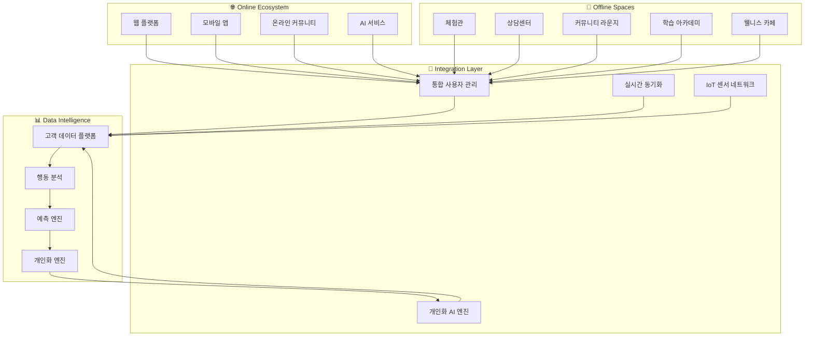

# 🌐 HEAL7 옴니채널 경험 아키텍처 v2.0

> **프로젝트**: HEAL7 온-오프라인 통합 옴니버스 경험 설계  
> **버전**: v2.0.0  
> **설계일**: 2025-08-18  
> **최종 수정**: 2025-08-18 18:00 KST  
> **설계자**: HEAL7 Omnichannel Experience Team  
> **목적**: 온라인과 오프라인의 완벽한 융합을 통한 혁신적 커뮤니티 플랫폼 구축

## 🎯 **옴니채널 철학 및 비전**

### **🌟 핵심 경험 철학**
```yaml
# 🎭 Omnichannel Philosophy
experience_principles:
  seamless_continuity: "온-오프라인 경계 없는 연속적 경험"
  contextual_intelligence: "상황과 맥락을 이해하는 지능적 서비스"
  community_convergence: "개인과 커뮤니티가 자연스럽게 만나는 공간"
  wisdom_amplification: "전통 지혜와 현대 기술의 시너지"
  holistic_wellness: "몸, 마음, 영혼의 통합적 케어"

omnichannel_vision:
  "사용자가 어디서나, 언제나, 어떤 방식으로든 
   일관되고 개인화된 영적 성장 여정을 경험할 수 있는 
   세계 최초의 옴니버스 웰니스 생태계 구축"
```

### **🏗️ 옴니채널 구조도**


## 🏢 **오프라인 공간 설계**

### **🔮 HEAL7 Experience Center (체험관)**
```typescript
// 🏛️ Physical Space Architecture
interface ExperienceCenterLayout {
  totalArea: "500평 (1,650㎡)";
  zones: {
    // 🌅 입구 & 리셉션 (50평)
    entrance: {
      area: "50평";
      features: [
        "스마트 체크인 키오스크",
        "개인화 환영 메시지 디스플레이",
        "오늘의 운세 대형 스크린",
        "AR 포토존"
      ];
      technology: {
        faceRecognition: "방문자 자동 인식",
        personalizedGreeting: "개인 맞춤 환영",
        digitalConcierge: "AI 안내 서비스",
        moodDetection: "감정 상태 분석"
      };
    };
    
    // 🎭 몰입 체험존 (150평)
    immersionZone: {
      area: "150평";
      features: [
        "360도 VR 사주 체험실",
        "홀로그램 타로 리딩",
        "인터랙티브 12지신 벽면",
        "오행 에너지 체험 공간"
      ];
      technology: {
        vrHeadsets: "최신 VR 장비 20대",
        hologramProjectors: "3D 홀로그램 시스템",
        gestureRecognition: "제스처 인식 기술",
        hapticFeedback: "촉각 피드백 시스템"
      };
    };
    
    // 🏺 전통 문화존 (100평)
    traditionalZone: {
      area: "100평";
      features: [
        "한국 전통 사주 체험실",
        "다도 명상 공간",
        "전통 악기 체험",
        "서예 & 캘리그래피"
      ];
      ambiance: {
        lighting: "따뜻한 전통 조명",
        materials: "자연 소재 (목재, 돌, 한지)",
        fragrance: "전통 향 디퓨저",
        soundscape: "자연음과 국악 선택"
      };
    };
    
    // 🤝 상담 & 힐링존 (120평)
    consultationZone: {
      area: "120평";
      features: [
        "프라이빗 상담실 8개",
        "그룹 상담실 2개", 
        "명상 치유실",
        "에너지 힐링 공간"
      ];
      privacy: {
        soundProofing: "완벽한 방음 처리",
        ambientControl: "개인 맞춤 환경 제어",
        recordingOptional: "선택적 상담 기록",
        biometricSecurity: "생체 인식 보안"
      };
    };
    
    // 👥 커뮤니티 라운지 (80평)
    communityLounge: {
      area: "80평";
      features: [
        "오픈 토론 공간",
        "북카페 & 명상 도서관",
        "워크숍 & 세미나실",
        "네트워킹 공간"
      ];
      flexibility: {
        modularFurniture: "조립식 가구 시스템",
        adaptableLayout: "상황별 공간 변경",
        smartWalls: "이동 가능한 스마트 벽",
        collaborationTools: "협업 도구 완비"
      };
    };
  };
}

// 🎨 스마트 환경 제어
class SmartEnvironmentController {
  // 🌡️ 개인화된 환경 설정
  async personalizeEnvironment(
    userId: string, 
    spaceId: string
  ): Promise<EnvironmentSettings> {
    const userProfile = await this.getUserProfile(userId);
    const preferences = await this.getEnvironmentalPreferences(userId);
    const currentMood = await this.detectCurrentMood(userId);
    
    return {
      lighting: {
        brightness: this.calculateOptimalBrightness(userProfile, currentMood),
        colorTemperature: this.getPreferredColorTemperature(preferences),
        dynamicLighting: this.createMoodLighting(currentMood)
      },
      
      climate: {
        temperature: this.getOptimalTemperature(userProfile),
        humidity: this.getOptimalHumidity(userProfile),
        airFlow: this.calculateAirFlow(spaceId)
      },
      
      audio: {
        backgroundMusic: this.selectBackgroundMusic(preferences, currentMood),
        volume: this.calculateOptimalVolume(spaceId),
        spatialAudio: this.configureSpatialAudio(spaceId)
      },
      
      aroma: {
        scentType: this.selectAromatherapy(userProfile, currentMood),
        intensity: this.calculateScentIntensity(preferences)
      }
    };
  }
  
  // 🔄 실시간 환경 적응
  async adaptEnvironmentRealTime(
    spaceId: string,
    occupants: UserProfile[]
  ): Promise<void> {
    const aggregatedPreferences = this.aggregatePreferences(occupants);
    const currentActivity = await this.detectCurrentActivity(spaceId);
    const externalConditions = await this.getExternalConditions();
    
    const optimalSettings = this.calculateOptimalGroupSettings({
      aggregatedPreferences,
      currentActivity,
      externalConditions,
      spaceCharacteristics: this.getSpaceCharacteristics(spaceId)
    });
    
    await this.applyEnvironmentSettings(spaceId, optimalSettings);
  }
}
```

### **📱 모바일 앱 - 오프라인 연동 기능**
```typescript
// 📲 Mobile App - Offline Integration
class OfflineIntegrationApp {
  // 🎯 실시간 위치 기반 서비스
  async enableLocationBasedServices(): Promise<LocationServices> {
    return {
      // 📍 실내 내비게이션
      indoorNavigation: {
        entrance: await this.getOptimalPath('entrance'),
        zones: await this.getZoneRecommendations(),
        facilities: await this.findNearbyFacilities(),
        accessibility: await this.getAccessibilityInfo()
      },
      
      // 🔔 맥락 기반 알림
      contextualNotifications: {
        zoneEntry: this.setupZoneEntryNotifications(),
        serviceRecommendations: this.setupServiceRecommendations(),
        scheduleReminders: this.setupScheduleReminders(),
        socialConnections: this.setupSocialNotifications()
      },
      
      // 🎮 AR 체험 기능
      augmentedReality: {
        informationOverlay: this.enableARInformation(),
        interactiveContent: this.enableARInteraction(),
        virtualGuide: this.enableVirtualGuide(),
        socialSharing: this.enableARSharing()
      }
    };
  }
  
  // 🎫 스마트 체크인 & 예약
  async enableSmartBooking(): Promise<SmartBookingFeatures> {
    return {
      // ⚡ 즉석 체크인
      instantCheckin: {
        qrCodeScan: this.enableQRCheckin(),
        nfcTap: this.enableNFCCheckin(),
        faceRecognition: this.enableFaceCheckin(),
        voiceActivation: this.enableVoiceCheckin()
      },
      
      // 📅 실시간 예약
      realTimeBooking: {
        consultationBooking: this.enableConsultationBooking(),
        experienceReservation: this.enableExperienceReservation(),
        communityEventJoin: this.enableEventJoining(),
        workshopRegistration: this.enableWorkshopRegistration()
      },
      
      // 🎯 개인화된 추천
      personalizedRecommendations: {
        serviceRecommendations: this.getServiceRecommendations(),
        expertMatching: this.getExpertMatching(),
        timeSlotOptimization: this.getOptimalTimeSlots(),
        groupActivitySuggestions: this.getGroupSuggestions()
      }
    };
  }
  
  // 💫 온-오프라인 연속성
  async enableContinuity(): Promise<ContinuityFeatures> {
    return {
      // 🔄 세션 연속성
      sessionContinuity: {
        onlineToOffline: this.enableOnlineToOfflineTransition(),
        offlineToOnline: this.enableOfflineToOnlineTransition(),
        crossDeviceSync: this.enableCrossDeviceSync(),
        pauseAndResume: this.enablePauseResume()
      },
      
      // 📊 경험 통합
      experienceIntegration: {
        unifiedProfile: this.maintainUnifiedProfile(),
        combinedInsights: this.generateCombinedInsights(),
        holisticProgress: this.trackHolisticProgress(),
        contextualMemory: this.maintainContextualMemory()
      },
      
      // 🎁 혜택 연동
      benefitIntegration: {
        pointsSync: this.syncPointsRealTime(),
        membershipBenefits: this.applyMembershipBenefits(),
        loyaltyRewards: this.enableLoyaltyRewards(),
        exclusiveAccess: this.provideExclusiveAccess()
      }
    };
  }
}
```

## 🤖 **IoT 센서 네트워크 아키텍처**

### **📡 스마트 센서 생태계**
```typescript
// 🌐 IoT Sensor Network Architecture
interface SmartSensorEcosystem {
  // 👥 사람 감지 센서
  peopleDetection: {
    heatMapSensors: {
      location: "천장 전체",
      capability: "실시간 인원 밀도 분석",
      privacy: "개인 식별 불가, 익명 데이터만"
    },
    
    footTrafficAnalytics: {
      location: "출입구 및 주요 동선",
      capability: "이동 패턴 및 체류 시간 분석",
      insights: "공간 활용도 최적화"
    },
    
    queueManagement: {
      location: "대기 공간",
      capability: "대기열 길이 및 대기 시간 예측",
      notification: "앱으로 실시간 대기 시간 알림"
    }
  };
  
  // 🌡️ 환경 모니터링 센서
  environmentalSensors: {
    airQuality: {
      sensors: ["CO2", "PM2.5", "VOC", "습도", "온도"],
      frequency: "실시간 연속 모니터링",
      action: "자동 환기 시스템 제어"
    },
    
    lightingSensors: {
      capability: "자연광 및 인공광 최적화",
      adaptation: "시간대 및 활동별 조명 자동 조절",
      energyEfficiency: "에너지 소비 최적화"
    },
    
    acousticSensors: {
      noiseLevel: "소음 수준 실시간 모니터링",
      soundscape: "최적 음향 환경 자동 조성",
      privacy: "대화 내용 감지 없이 음량만 측정"
    }
  };
  
  // 🔄 상호작용 센서
  interactionSensors: {
    gestureRecognition: {
      technology: "컴퓨터 비전 + 라이다",
      capability: "제스처 기반 인터페이스 제어",
      applications: "전시물 조작, 정보 탐색"
    },
    
    proximityDetection: {
      technology: "비콘 + BLE",
      capability: "개인 맞춤 콘텐츠 자동 표시",
      privacy: "사용자 동의 기반 개인화"
    },
    
    emotionSensing: {
      technology: "안면 표정 분석 (선택적)",
      capability: "감정 상태 기반 서비스 추천",
      ethics: "완전 익명화, 개인 동의 필수"
    }
  };
}

// 🧠 센서 데이터 통합 분석
class SensorDataIntelligence {
  // 📊 실시간 공간 분석
  async analyzeSpaceUtilization(): Promise<SpaceAnalytics> {
    const sensorData = await this.aggregateSensorData();
    
    return {
      // 👥 인원 분석
      occupancyAnalysis: {
        currentOccupancy: this.calculateCurrentOccupancy(sensorData),
        peakHours: this.identifyPeakHours(sensorData),
        capacityUtilization: this.calculateCapacityUtilization(sensorData),
        flowPatterns: this.analyzeFlowPatterns(sensorData)
      },
      
      // 🎯 행동 패턴 분석
      behaviorAnalysis: {
        dwellTime: this.analyzeDwellTime(sensorData),
        popularZones: this.identifyPopularZones(sensorData),
        interactionPatterns: this.analyzeInteractionPatterns(sensorData),
        journeyPaths: this.mapJourneyPaths(sensorData)
      },
      
      // 🌟 경험 품질 분석
      experienceQuality: {
        environmentalComfort: this.assessEnvironmentalComfort(sensorData),
        serviceWaitTimes: this.calculateWaitTimes(sensorData),
        satisfactionIndicators: this.deriveSatisfactionIndicators(sensorData),
        improvementOpportunities: this.identifyImprovements(sensorData)
      }
    };
  }
  
  // 🔮 예측적 공간 관리
  async predictiveSpaceManagement(): Promise<SpacePredictions> {
    const historicalData = await this.getHistoricalSpaceData();
    const externalFactors = await this.getExternalFactors();
    const currentTrends = await this.getCurrentTrends();
    
    return {
      // 📈 수요 예측
      demandForecasting: {
        hourlyDemand: this.predictHourlyDemand(historicalData),
        serviceDemand: this.predictServiceDemand(currentTrends),
        seasonalPatterns: this.predictSeasonalPatterns(externalFactors),
        eventImpact: this.predictEventImpact(externalFactors)
      },
      
      // ⚡ 자원 최적화
      resourceOptimization: {
        staffingRecommendations: this.optimizeStaffing(),
        energyOptimization: this.optimizeEnergyUsage(),
        facilityMaintenance: this.scheduleMaintenance(),
        capacityManagement: this.optimizeCapacity()
      },
      
      // 🎯 개인화 예측
      personalizationPredictions: {
        individualPreferences: this.predictIndividualPreferences(),
        serviceRecommendations: this.predictServiceNeeds(),
        optimalVisitTimes: this.predictOptimalVisitTimes(),
        communityConnections: this.predictCommunityMatches()
      }
    };
  }
}
```

## 🔗 **데이터 통합 및 동기화**

### **📊 통합 고객 데이터 플랫폼 (CDP)**
```typescript
// 🏗️ Customer Data Platform Architecture
class UnifiedCustomerDataPlatform {
  // 🔄 실시간 데이터 동기화
  async synchronizeCustomerData(): Promise<DataSyncStatus> {
    const dataSources = [
      'web_platform',
      'mobile_app', 
      'offline_interactions',
      'iot_sensors',
      'consultation_records',
      'community_activities',
      'purchase_history',
      'support_interactions'
    ];
    
    const syncResults = await Promise.all(
      dataSources.map(source => this.syncDataSource(source))
    );
    
    return {
      overallStatus: this.calculateOverallStatus(syncResults),
      sourceStatuses: Object.fromEntries(
        dataSources.map((source, i) => [source, syncResults[i]])
      ),
      lastSyncTime: new Date(),
      dataQualityScore: await this.assessDataQuality(),
      conflictResolutions: await this.resolveDataConflicts()
    };
  }
  
  // 🎯 360도 고객 프로필 생성
  async create360CustomerProfile(userId: string): Promise<Customer360Profile> {
    const [
      basicProfile,
      behaviorProfile,
      preferenceProfile,
      interactionHistory,
      predictiveInsights
    ] = await Promise.all([
      this.getBasicProfile(userId),
      this.getBehaviorProfile(userId),
      this.getPreferenceProfile(userId),
      this.getInteractionHistory(userId),
      this.getPredictiveInsights(userId)
    ]);
    
    return {
      // 👤 기본 정보
      basic: {
        demographics: basicProfile.demographics,
        contactInfo: basicProfile.contactInfo,
        membershipStatus: basicProfile.membershipStatus,
        joinDate: basicProfile.joinDate
      },
      
      // 🎭 행동 특성
      behavior: {
        onlineActivities: behaviorProfile.onlineActivities,
        offlineVisits: behaviorProfile.offlineVisits,
        serviceUsagePatterns: behaviorProfile.serviceUsagePatterns,
        engagementLevel: behaviorProfile.engagementLevel
      },
      
      // ❤️ 선호도 & 관심사
      preferences: {
        servicePreferences: preferenceProfile.servicePreferences,
        communicationPreferences: preferenceProfile.communicationPreferences,
        privacySettings: preferenceProfile.privacySettings,
        personalityInsights: preferenceProfile.personalityInsights
      },
      
      // 📚 상호작용 이력
      interactions: {
        consultationHistory: interactionHistory.consultations,
        communityParticipation: interactionHistory.communityActivities,
        supportInteractions: interactionHistory.supportTickets,
        feedbackHistory: interactionHistory.feedback
      },
      
      // 🔮 예측적 통찰
      insights: {
        lifetimeValue: predictiveInsights.lifetimeValue,
        churnRisk: predictiveInsights.churnRisk,
        nextBestAction: predictiveInsights.nextBestAction,
        personalizedRecommendations: predictiveInsights.recommendations
      }
    };
  }
  
  // 🤖 실시간 개인화 엔진
  async generateRealTimePersonalization(
    userId: string,
    context: UserContext
  ): Promise<PersonalizationResult> {
    const customerProfile = await this.create360CustomerProfile(userId);
    const currentContext = await this.enrichContext(context);
    const realTimeSignals = await this.getRealTimeSignals(userId);
    
    return {
      // 🎯 즉시 개인화
      immediatePersonalization: {
        interfaceAdaptation: this.adaptInterface(customerProfile, currentContext),
        contentPersonalization: this.personalizeContent(customerProfile, realTimeSignals),
        serviceRecommendations: this.recommendServices(customerProfile, currentContext),
        experienceOptimization: this.optimizeExperience(customerProfile, realTimeSignals)
      },
      
      // 🔄 적응적 학습
      adaptiveLearning: {
        preferenceUpdates: this.updatePreferences(realTimeSignals),
        behaviorModeling: this.updateBehaviorModel(realTimeSignals),
        predictionRefinement: this.refinePredictions(realTimeSignals),
        feedbackIncorporation: this.incorporateFeedback(realTimeSignals)
      },
      
      // 🎮 경험 최적화
      experienceOptimization: {
        journeyPersonalization: this.personalizeJourney(customerProfile),
        timingOptimization: this.optimizeTiming(customerProfile, currentContext),
        channelOptimization: this.optimizeChannels(customerProfile),
        contentOptimization: this.optimizeContent(customerProfile, realTimeSignals)
      }
    };
  }
}

// 🔄 Cross-Channel 연속성 관리
class CrossChannelContinuityManager {
  // 🌉 채널 간 연결 관리
  async manageCrossChannelTransition(
    userId: string,
    fromChannel: string,
    toChannel: string,
    transitionContext: TransitionContext
  ): Promise<TransitionResult> {
    // 1️⃣ 현재 상태 캡처
    const currentState = await this.captureCurrentState(userId, fromChannel);
    
    // 2️⃣ 대상 채널 준비
    const targetChannelPreparation = await this.prepareTargetChannel(
      userId, 
      toChannel, 
      currentState
    );
    
    // 3️⃣ 상태 전이 실행
    const transitionExecution = await this.executeTransition(
      currentState,
      targetChannelPreparation,
      transitionContext
    );
    
    // 4️⃣ 연속성 검증
    const continuityVerification = await this.verifyContinuity(
      userId,
      toChannel,
      transitionExecution
    );
    
    return {
      transitionSuccess: continuityVerification.success,
      preservedContext: continuityVerification.preservedContext,
      enhancedExperience: continuityVerification.enhancements,
      nextSteps: this.suggestNextSteps(userId, toChannel),
      qualityScore: continuityVerification.qualityScore
    };
  }
  
  // 📱➡️🏢 온라인→오프라인 전환
  async onlineToOfflineTransition(
    userId: string,
    onlineSession: OnlineSession,
    offlineDestination: OfflineLocation
  ): Promise<OfflineTransitionResult> {
    return {
      // 🎯 준비된 오프라인 경험
      preparedExperience: {
        personalizedEnvironment: await this.preparePersonalizedEnvironment(
          userId, 
          offlineDestination
        ),
        continuedServices: await this.prepareServiceContinuation(
          onlineSession.activeServices
        ),
        socialConnections: await this.facilitateSocialConnections(
          userId, 
          offlineDestination
        ),
        contextualContent: await this.prepareContextualContent(
          onlineSession.interests,
          offlineDestination
        )
      },
      
      // 🔄 동기화된 데이터
      synchronizedData: {
        userProgress: this.syncUserProgress(onlineSession),
        preferences: this.syncPreferences(onlineSession),
        currentGoals: this.syncCurrentGoals(onlineSession),
        socialGraph: this.syncSocialConnections(onlineSession)
      },
      
      // 🎁 특별 혜택
      transitionBenefits: {
        welcomeGesture: this.createWelcomeGesture(userId),
        exclusiveOffers: this.generateExclusiveOffers(userId),
        priorityAccess: this.enablePriorityAccess(userId),
        personalizedGuide: this.assignPersonalizedGuide(userId)
      }
    };
  }
  
  // 🏢➡️📱 오프라인→온라인 전환
  async offlineToOnlineTransition(
    userId: string,
    offlineExperience: OfflineExperience,
    onlineDestination: OnlineChannel
  ): Promise<OnlineTransitionResult> {
    return {
      // 📊 오프라인 경험 디지털화
      digitalizedExperience: {
        experienceSummary: await this.digitizeExperienceSummary(offlineExperience),
        insights: await this.extractInsights(offlineExperience),
        achievements: await this.recordAchievements(offlineExperience),
        connections: await this.digitalizeConnections(offlineExperience.socialInteractions)
      },
      
      // 🎯 강화된 온라인 경험
      enhancedOnlineExperience: {
        deeperPersonalization: await this.enhancePersonalization(
          userId,
          offlineExperience.insights
        ),
        expandedContent: await this.expandContent(offlineExperience.interests),
        communityIntegration: await this.integrateWithCommunity(
          offlineExperience.socialConnections
        ),
        followUpActions: await this.suggestFollowUpActions(offlineExperience)
      },
      
      // 🌱 성장 및 발전
      growthOpportunities: {
        skillDevelopment: this.identifySkillGrowth(offlineExperience),
        communityContribution: this.suggestCommunityContribution(offlineExperience),
        mentorshipOpportunities: this.identifyMentorshipOpportunities(offlineExperience),
        nextMilestones: this.setNextMilestones(offlineExperience)
      }
    };
  }
}
```

## 🎭 **체험 설계 및 여정 관리**

### **🌟 몰입형 체험 디자인**
```typescript
// 🎨 Immersive Experience Design
class ImmersiveExperienceOrchestrator {
  // 🎯 개인화된 체험 여정 생성
  async createPersonalizedJourney(
    userId: string,
    visitPurpose: string,
    timeAvailable: number
  ): Promise<PersonalizedJourney> {
    const userProfile = await this.getUserProfile(userId);
    const preferences = await this.getPreferences(userId);
    const currentMood = await this.assessCurrentMood(userId);
    
    return {
      // 🗺️ 여정 구조
      journeyStructure: {
        welcomePhase: this.designWelcomePhase(userProfile, currentMood),
        explorationPhase: this.designExplorationPhase(preferences, timeAvailable),
        deepDivePhase: this.designDeepDivePhase(visitPurpose, userProfile),
        integrationPhase: this.designIntegrationPhase(userProfile),
        farewellPhase: this.designFarewellPhase(userProfile)
      },
      
      // ⏰ 시간 관리
      timeManagement: {
        totalDuration: timeAvailable,
        phaseAllocations: this.allocateTimeAcrossPhases(timeAvailable),
        flexibilityBuffer: this.calculateFlexibilityBuffer(timeAvailable),
        adaptiveScheduling: this.enableAdaptiveScheduling()
      },
      
      // 🎭 체험 요소
      experienceElements: {
        sensoryExperiences: this.selectSensoryExperiences(preferences),
        interactiveElements: this.selectInteractiveElements(userProfile),
        socialOpportunities: this.identifySocialOpportunities(userId),
        reflectiveSpaces: this.allocateReflectiveSpaces(currentMood)
      },
      
      // 📊 성과 측정
      successMetrics: {
        satisfactionTargets: this.setSatisfactionTargets(userProfile),
        learningObjectives: this.setLearningObjectives(visitPurpose),
        connectionGoals: this.setConnectionGoals(userProfile),
        insightGeneration: this.setInsightTargets(userProfile)
      }
    };
  }
  
  // 🎮 실시간 체험 적응
  async adaptExperienceRealTime(
    userId: string,
    currentJourney: PersonalizedJourney,
    realTimeData: RealTimeData
  ): Promise<JourneyAdaptation> {
    const currentEngagement = await this.measureCurrentEngagement(realTimeData);
    const contextChanges = await this.detectContextChanges(realTimeData);
    const opportunityMoments = await this.identifyOpportunityMoments(realTimeData);
    
    return {
      // 🔄 적응 조치
      adaptations: {
        paceAdjustment: this.adjustPace(currentEngagement),
        contentModification: this.modifyContent(contextChanges),
        environmentalTuning: this.tuneEnvironment(realTimeData),
        socialFacilitation: this.facilitateSocialConnections(opportunityMoments)
      },
      
      // 🎯 기회 포착
      opportunities: {
        spontaneousLearning: this.enableSpontaneousLearning(opportunityMoments),
        serendipitousConnections: this.facilitateSerendipity(realTimeData),
        deeperExploration: this.offerDeeperExploration(currentEngagement),
        creativePossibilities: this.unlockCreativePossibilities(contextChanges)
      },
      
      // 📈 개선 제안
      improvements: {
        journeyOptimization: this.optimizeJourney(realTimeData),
        experienceEnhancement: this.enhanceExperience(currentEngagement),
        personalizedUpgrades: this.suggestUpgrades(userId, realTimeData),
        futurePreparation: this.prepareFutureVisits(realTimeData)
      }
    };
  }
}

// 🌈 Multi-Sensory Experience Engine
class MultiSensoryExperienceEngine {
  // 🎨 감각적 경험 조합
  async orchestrateSensoryExperience(
    experienceType: string,
    userPreferences: UserPreferences,
    environmentalContext: EnvironmentalContext
  ): Promise<SensoryOrchestration> {
    return {
      // 👁️ 시각적 경험
      visual: {
        lightingDesign: await this.designLighting(experienceType, userPreferences),
        colorPalette: await this.selectColorPalette(userPreferences),
        visualEffects: await this.orchestrateVisualEffects(experienceType),
        spatialDesign: await this.optimizeSpatialDesign(environmentalContext)
      },
      
      // 👂 청각적 경험
      auditory: {
        soundscape: await this.createSoundscape(experienceType, userPreferences),
        spatialAudio: await this.configureSpatialAudio(environmentalContext),
        rhythmicElements: await this.addRhythmicElements(experienceType),
        silenceManagement: await this.manageSilence(userPreferences)
      },
      
      // 👃 후각적 경험
      olfactory: {
        aromatherapy: await this.selectAromatherapy(experienceType, userPreferences),
        naturalScents: await this.incorporateNaturalScents(environmentalContext),
        intensityControl: await this.controlScentIntensity(userPreferences),
        zonalVariation: await this.createZonalVariation(environmentalContext)
      },
      
      // ✋ 촉각적 경험
      tactile: {
        textureExperiences: await this.designTextureExperiences(experienceType),
        temperatureControl: await this.optimizeTemperature(userPreferences),
        hapticFeedback: await this.integrateHapticFeedback(experienceType),
        physicalInteraction: await this.enablePhysicalInteraction(experienceType)
      },
      
      // 🧘 직감적 경험
      intuitive: {
        energeticAtmosphere: await this.createEnergeticAtmosphere(experienceType),
        rhythmicFlow: await this.establishRhythmicFlow(userPreferences),
        emotionalResonance: await this.enhanceEmotionalResonance(experienceType),
        spiritualConnection: await this.facilitateSpiritual Connection(userPreferences)
      }
    };
  }
}
```

## 🤝 **커뮤니티 융합 시스템**

### **👥 온-오프라인 커뮤니티 통합**
```typescript
// 🌐 Community Fusion Platform
class CommunityFusionPlatform {
  // 🌉 하이브리드 커뮤니티 활동
  async enableHybridCommunityActivities(): Promise<HybridCommunityFeatures> {
    return {
      // 🎭 하이브리드 이벤트
      hybridEvents: {
        virtualOfflineSimultaneous: await this.enableSimultaneousEvents(),
        crossChannelParticipation: await this.enableCrossChannelParticipation(),
        seamlessTransition: await this.enableSeamlessTransition(),
        unifiedExperience: await this.createUnifiedExperience()
      },
      
      // 🗣️ 하이브리드 토론
      hybridDiscussions: {
        onlineOfflineDiscussion: await this.linkOnlineOfflineDiscussions(),
        realTimeTranscription: await this.enableRealTimeTranscription(),
        multilayerInteraction: await this.enableMultilayerInteraction(),
        persistentContext: await this.maintainPersistentContext()
      },
      
      // 🤝 하이브리드 네트워킹
      hybridNetworking: {
        smartIntroductions: await this.enableSmartIntroductions(),
        interestBasedMatching: await this.enableInterestMatching(),
        proximityConnections: await this.enableProximityConnections(),
        followUpFacilitation: await this.facilitateFollowUps()
      },
      
      // 🎓 하이브리드 학습
      hybridLearning: {
        blendedWorkshops: await this.createBlendedWorkshops(),
        peer2peerLearning: await this.enablePeer2PeerLearning(),
        mentoringPrograms: await this.createMentoringPrograms(),
        knowledgeSharing: await this.facilitateKnowledgeSharing()
      }
    };
  }
  
  // 🎯 커뮤니티 매칭 엔진
  async intelligentCommunityMatching(
    userId: string,
    context: CommunityContext
  ): Promise<CommunityMatchingResult> {
    const userProfile = await this.getUserCommunityProfile(userId);
    const availableConnections = await this.getAvailableConnections(context);
    const affinityScores = await this.calculateAffinityScores(userProfile, availableConnections);
    
    return {
      // 🎯 즉시 매칭
      immediateMatches: {
        highAffinityUsers: this.selectHighAffinityUsers(affinityScores),
        complementaryUsers: this.selectComplementaryUsers(affinityScores),
        mentorMatches: this.identifyMentorMatches(userProfile, availableConnections),
        interestGroups: this.suggestInterestGroups(userProfile, context)
      },
      
      // 🌱 성장 기회
      growthOpportunities: {
        learningPartners: this.identifyLearningPartners(userProfile, availableConnections),
        challengePartners: this.identifyChallengePartners(userProfile),
        skillExchangePartners: this.identifySkillExchangePartners(userProfile),
        projectCollaborators: this.identifyProjectCollaborators(userProfile)
      },
      
      // 🎭 활동 제안
      activitySuggestions: {
        groupActivities: this.suggestGroupActivities(affinityScores, context),
        workshops: this.suggestWorkshops(userProfile, context),
        discussions: this.suggestDiscussions(userProfile, context),
        collaborativeProjects: this.suggestCollaborativeProjects(userProfile)
      },
      
      // 🔄 지속적 연결
      sustainedConnections: {
        followUpActivities: this.planFollowUpActivities(affinityScores),
        relationshipBuilding: this.facilitateRelationshipBuilding(affinityScores),
        communityRoles: this.suggestCommunityRoles(userProfile),
        leadershipOpportunities: this.identifyLeadershipOpportunities(userProfile)
      }
    };
  }
}

// 🎪 이벤트 & 워크숍 관리
class EventWorkshopManager {
  // 🎭 하이브리드 이벤트 생성
  async createHybridEvent(
    eventRequest: EventRequest,
    audienceProfile: AudienceProfile
  ): Promise<HybridEventPlan> {
    return {
      // 🏗️ 이벤트 구조
      eventStructure: {
        onlineComponents: this.designOnlineComponents(eventRequest, audienceProfile),
        offlineComponents: this.designOfflineComponents(eventRequest, audienceProfile),
        hybridInteractions: this.designHybridInteractions(eventRequest),
        transitionPoints: this.designTransitionPoints(eventRequest)
      },
      
      // 🎯 참여 최적화
      participationOptimization: {
        onlineEngagement: this.optimizeOnlineEngagement(audienceProfile),
        offlineEngagement: this.optimizeOfflineEngagement(audienceProfile),
        crossChannelSynergy: this.createCrossChannelSynergy(eventRequest),
        inclusiveDesign: this.ensureInclusiveDesign(audienceProfile)
      },
      
      // 🛠️ 기술 통합
      technologyIntegration: {
        streamingSetup: this.setupStreaming(eventRequest),
        interactionTools: this.integrateInteractionTools(eventRequest),
        realTimePolling: this.enableRealTimePolling(eventRequest),
        contentSharing: this.facilitateContentSharing(eventRequest)
      },
      
      // 📊 성과 측정
      successMeasurement: {
        engagementMetrics: this.defineEngagementMetrics(eventRequest),
        learningOutcomes: this.defineLearningOutcomes(eventRequest),
        networkingSuccess: this.defineNetworkingMetrics(eventRequest),
        satisfactionTargets: this.setSatisfactionTargets(audienceProfile)
      }
    };
  }
}
```

---

## 🎯 **구현 우선순위 및 로드맵**

### **📅 Phase 1: 기반 인프라 (8주)**
- [ ] 통합 고객 데이터 플랫폼 구축
- [ ] 기본 IoT 센서 네트워크 설치
- [ ] 모바일 앱 오프라인 연동 기능
- [ ] 데이터 동기화 시스템

### **📅 Phase 2: 체험 공간 구축 (12주)**
- [ ] HEAL7 Experience Center 설계 및 구축
- [ ] 스마트 환경 제어 시스템
- [ ] AR/VR 체험 시설 구축
- [ ] 개인화된 공간 서비스

### **📅 Phase 3: 커뮤니티 융합 (6주)**
- [ ] 하이브리드 커뮤니티 플랫폼
- [ ] 온-오프라인 이벤트 시스템
- [ ] 커뮤니티 매칭 엔진
- [ ] 협업 도구 통합

### **📅 Phase 4: 고도화 (4주)**
- [ ] 멀티센서리 경험 엔진
- [ ] 예측적 개인화 시스템
- [ ] 고급 분석 및 인사이트
- [ ] 글로벌 확장 준비

### **📅 Phase 5: 최적화 (4주)**
- [ ] 전체 시스템 통합 테스트
- [ ] 사용자 피드백 반영
- [ ] 성능 최적화
- [ ] 정식 오픈

---

*📅 설계 완료일: 2025-08-18*  
*🌐 설계자: HEAL7 Omnichannel Experience Team*  
*📝 문서 위치: `/home/ubuntu/CORE/architecture-diagrams/integration-flows/`*  
*🔄 다음 버전: v2.1 (체험 공간 구축 후 업데이트)*