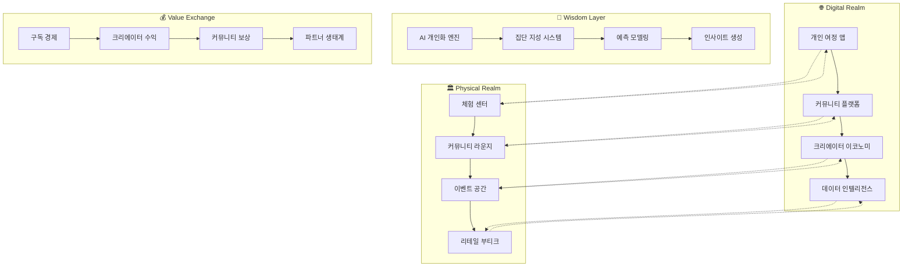

# 🌌 HEAL7 통합 옴니버스 마스터 플랜 v1.0

> **프로젝트**: HEAL7 옴니버스 커뮤니티 플랫폼 통합 전략  
> **버전**: v1.0.0  
> **작성일**: 2025-08-18  
> **비전**: "온라인과 오프라인을 하나로 연결하는 지혜의 생태계"  
> **미션**: "모든 사람이 자신만의 운명을 발견하고 공유하는 커뮤니티"

---

## 🎭 **옴니버스 플랫폼 개념**

### **🌟 핵심 비전**

```yaml
omnibus_vision:
  core_concept: "운명 발견의 모든 여정을 하나의 생태계로"
  platform_identity: "단순한 점술 서비스를 넘어 삶의 지혜 플랫폼"
  community_essence: "개인의 깨달음이 집단의 지혜로 순환하는 생태계"
  
integration_philosophy:
  online_offline_seamless: "디지털과 물리적 공간의 경계 없는 경험"
  individual_community_balance: "개인적 성찰과 사회적 연결의 조화"
  ancient_modern_synthesis: "전통 지혜와 현대 기술의 창조적 융합"
  wisdom_sharing_economy: "지혜를 나누고 성장하는 순환 경제"
```

### **🏰 플랫폼 생태계 구조**

#### **4차원 통합 경험 모델**


---

## 🎯 **전략적 로드맵**

### **🗓️ 3단계 진화 전략**

#### **Phase 1: Foundation (0-12개월) - 기반 구축**
```yaml
foundation_phase:
  timeline: "2025년 3월 - 2026년 2월"
  investment: "50억원"
  target_users: "100,000명"
  revenue_goal: "연 30억원"
  
  core_deliverables:
    technical_platform:
      - "모듈러 레고블럭 시스템 완성"
      - "마이크로서비스 아키텍처 구축"
      - "AI 개인화 엔진 1.0"
      - "크로스플랫폼 모바일 앱"
      
    physical_presence:
      - "강남 플래그십 체험센터 (500평)"
      - "IoT 센서 네트워크 구축"
      - "실시간 환경 개인화 시스템"
      - "홀로그램 디스플레이 체험존"
      
    content_ecosystem:
      - "100명 전문가 네트워크 구축"
      - "10,000개 콘텐츠 라이브러리"
      - "커뮤니티 기반 UGC 시스템"
      - "실시간 라이브 상담 플랫폼"
      
    business_model:
      - "프리미엄 구독 모델 출시"
      - "전문가 수수료 시스템"
      - "기업 B2B 서비스 론칭"
      - "제휴 파트너십 20개 구축"

  success_metrics:
    user_metrics:
      - "월간 활성 사용자 50,000명"
      - "사용자 유지율 60% (3개월)"
      - "평균 세션 시간 15분"
      - "오프라인 체험 전환율 15%"
      
    business_metrics:
      - "월간 경상 수익 2.5억원"
      - "고객 생애 가치 200,000원"
      - "고객 획득 비용 40,000원"
      - "총 이용률 마진 70%"
```

#### **Phase 2: Expansion (12-24개월) - 생태계 확장**
```yaml
expansion_phase:
  timeline: "2026년 3월 - 2027년 2월"
  investment: "100억원"
  target_users: "500,000명"
  revenue_goal: "연 150억원"
  
  core_deliverables:
    geographical_expansion:
      - "서울 5개 구 체험센터 확장"
      - "부산, 대구, 광주 진출"
      - "프랜차이즈 모델 개발"
      - "해외 파일럿 (일본, 동남아)"
      
    service_diversification:
      - "웰니스 통합 플랫폼 확장"
      - "교육 아카데미 프로그램"
      - "기업 팀빌딩 서비스"
      - "라이프스타일 브랜드 론칭"
      
    technology_advancement:
      - "AR/VR 몰입형 체험"
      - "블록체인 기반 NFT 수집품"
      - "AI 예측 정확도 90% 달성"
      - "실시간 번역 다국어 지원"
      
    community_maturation:
      - "크리에이터 이코노미 완성"
      - "사용자 생성 콘텐츠 50%"
      - "커뮤니티 자치 거버넌스"
      - "글로벌 커뮤니티 연결"

  success_metrics:
    market_metrics:
      - "국내 시장 점유율 30%"
      - "브랜드 인지도 70%"
      - "고객 추천 지수 (NPS) 80"
      - "언론 및 SNS 멘션 1,000회/월"
      
    innovation_metrics:
      - "신기능 출시 주기 2주"
      - "특허 출원 20건"
      - "기술 혁신상 3개 수상"
      - "업계 벤치마킹 대상"
```

#### **Phase 3: Globalization (24-36개월) - 글로벌 플랫폼**
```yaml
globalization_phase:
  timeline: "2027년 3월 - 2028년 2월"
  investment: "200억원"
  target_users: "2,000,000명"
  revenue_goal: "연 500억원"
  
  core_deliverables:
    global_platform:
      - "10개국 현지화 서비스"
      - "문화별 맞춤 점술 시스템"
      - "글로벌 전문가 네트워크"
      - "실시간 다국어 AI 상담"
      
    ecosystem_leadership:
      - "업계 표준 제정 주도"
      - "오픈소스 플랫폼 제공"
      - "글로벌 파트너십 100개"
      - "M&A 통한 수직 통합"
      
    social_impact:
      - "UN SDGs 연계 프로그램"
      - "정신건강 지원 이니셔티브"
      - "문화 다양성 보존 프로젝트"
      - "교육 기부 플랫폼 운영"

  success_metrics:
    global_metrics:
      - "해외 매출 비중 60%"
      - "글로벌 TOP 3 브랜드"
      - "기업 가치 1조원 달성"
      - "IPO 또는 유니콘 진입"
```

---

## 🏗️ **핵심 아키텍처 통합**

### **🧩 레고블럭 모듈 시스템**

#### **플랫폼 핵심 모듈**
```typescript
interface OmnibusModuleSystem {
  // 🔮 Core Fortune Modules
  fortune_engines: {
    saju_calculator: SajuModule;
    tarot_reader: TarotModule;
    zodiac_analyzer: ZodiacModule;
    astrology_engine: AstrologyModule;
    numerology_system: NumerologyModule;
  };
  
  // 🤝 Community Modules  
  community_platform: {
    social_network: SocialModule;
    content_management: CMSModule;
    live_streaming: StreamingModule;
    event_management: EventModule;
    gamification_engine: GamificationModule;
  };
  
  // 💰 Commerce Modules
  commerce_platform: {
    subscription_manager: SubscriptionModule;
    payment_processor: PaymentModule;
    marketplace: MarketplaceModule;
    creator_economy: CreatorModule;
    affiliate_system: AffiliateModule;
  };
  
  // 🧠 Intelligence Modules
  ai_intelligence: {
    personalization_engine: PersonalizationModule;
    recommendation_system: RecommendationModule;
    predictive_analytics: PredictiveModule;
    natural_language: NLPModule;
    computer_vision: CVModule;
  };
  
  // 🏛️ Physical Integration Modules
  physical_integration: {
    iot_orchestrator: IoTModule;
    space_management: SpaceModule;
    visitor_tracking: TrackingModule;
    environment_control: EnvironmentModule;
    retail_integration: RetailModule;
  };
}
```

### **🌐 옴니채널 데이터 통합**

#### **실시간 데이터 동기화**
```yaml
data_synchronization:
  user_profile_sync:
    online_behavior: "웹/앱 활동, 선호도, 구매 이력"
    offline_interaction: "체험센터 방문, 상담 기록, 공간 이용"
    real_time_merge: "양방향 즉시 동기화 (3초 이내)"
    
  content_distribution:
    personalized_feed: "개인별 맞춤 콘텐츠 실시간 큐레이션"
    location_aware: "현재 위치 기반 서비스 추천"
    social_context: "친구 네트워크 활동 반영"
    
  commerce_integration:
    unified_wallet: "온오프라인 통합 포인트/결제"
    inventory_sync: "실시간 상품 재고 연동"
    cross_sell_opportunities: "채널 간 상품 추천"
```

#### **지능형 예측 시스템**
```typescript
interface PredictiveIntelligence {
  behavioral_prediction: {
    next_service_prediction: ServicePrediction;
    churn_risk_analysis: ChurnRiskModel;
    lifetime_value_forecast: LTVModel;
    optimal_touchpoint: TouchPointOptimization;
  };
  
  business_forecasting: {
    demand_prediction: DemandForecast;
    revenue_projection: RevenueModel;
    capacity_planning: CapacityModel;
    market_trend_analysis: TrendAnalysis;
  };
  
  personalization_ai: {
    content_recommendation: ContentAI;
    service_suggestion: ServiceAI;
    pricing_optimization: PricingAI;
    experience_customization: ExperienceAI;
  };
}
```

---

## 💰 **통합 비즈니스 모델**

### **🎪 다차원 수익 구조**

#### **구독 경제 기반 모델**
```yaml
subscription_economy:
  tier_structure:
    free_explorer: # 무료 탐험가
      features: ["월 3회 기본 서비스", "커뮤니티 참여", "기본 콘텐츠"]
      purpose: "사용자 유입 및 습관 형성"
      conversion_target: "30일 내 15% 유료 전환"
      
    basic_learner: # 기본 학습자 (월 9,900원)
      features: ["무제한 기본 서비스", "개인화 추천", "프리미엄 콘텐츠"]
      value_proposition: "학습과 성장 중심"
      target_audience: "25-40세 자기계발 관심층"
      
    premium_enthusiast: # 프리미엄 애호가 (월 29,900원)
      features: ["고급 분석", "전문가 상담", "독점 이벤트", "수익 참여"]
      value_proposition: "전문성과 커뮤니티 리더십"
      target_audience: "커뮤니티 활동 적극 참여자"
      
    master_professional: # 마스터 전문가 (월 99,900원)
      features: ["비즈니스 도구", "API 접근", "화이트라벨", "수익 분배"]
      value_proposition: "사업 확장과 수익 창출"
      target_audience: "전문 상담사, 사업자"

  family_enterprise_plans:
    family_package: # 가족 패키지 (월 39,900원)
      members: "최대 6명"
      features: ["가족 궁합 분석", "세대별 맞춤 서비스", "오프라인 할인"]
      
    enterprise_solution: # 기업 솔루션 (협의)
      features: ["팀빌딩", "조직 문화 분석", "HR 의사결정 지원"]
      pricing: "직원 수 기반 + 맞춤 개발비"
```

#### **크리에이터 이코노미 모델**
```yaml
creator_economy:
  expert_network:
    certification_levels:
      - "인증 상담사" (플랫폼 수수료 30%)
      - "전문 상담사" (플랫폼 수수료 25%)  
      - "마스터 상담사" (플랫폼 수수료 20%)
      
    revenue_streams:
      consultation_fees: "시간당 30,000-200,000원"
      content_monetization: "구독, 팁, 유료 콘텐츠"
      course_creation: "교육 콘텐츠 판매 수익"
      merchandise_sales: "관련 상품 판매"
      
  community_contributions:
    ugc_rewards:
      content_creation: "조회수별 포인트 지급"
      community_moderation: "활동 기여도별 보상"
      referral_bonuses: "신규 사용자 유입 보상"
      
    gamification_incentives:
      achievement_badges: "성취도별 뱃지와 혜택"
      leaderboards: "순위별 월간 보상"
      seasonal_events: "시즌별 특별 이벤트 상금"
```

#### **데이터 마네타이제이션**
```yaml
data_monetization:
  insights_products:
    trend_reports: "업계 트렌드 분석 리포트 (B2B)"
    demographic_insights: "세대별/지역별 선호도 분석"
    predictive_analytics: "소비 패턴 예측 서비스"
    
  api_services:
    fortune_api: "개발자 대상 점술 API"
    personalization_api: "개인화 추천 엔진 API"
    community_api: "커뮤니티 기능 통합 API"
    
  research_partnerships:
    academic_collaboration: "대학 연구소 데이터 제공"
    market_research: "기업 대상 소비자 인사이트"
    social_science: "사회과학 연구 데이터 지원"
```

### **🎯 수익 목표 및 예측**

#### **3년 수익 로드맵**
```yaml
revenue_roadmap:
  year_1_foundation: # 2026년
    total_revenue: "30억원"
    breakdown:
      subscription: "18억원 (60%)"
      transaction: "9억원 (30%)"
      advertising: "3억원 (10%)"
    user_base: "100,000명"
    arpu: "30,000원/월"
    
  year_2_expansion: # 2027년  
    total_revenue: "150억원"
    breakdown:
      subscription: "75억원 (50%)"
      creator_economy: "45억원 (30%)"
      enterprise_b2b: "22.5억원 (15%)"
      data_monetization: "7.5억원 (5%)"
    user_base: "500,000명"
    arpu: "25,000원/월"
    
  year_3_globalization: # 2028년
    total_revenue: "500억원"
    breakdown:
      global_subscription: "200억원 (40%)"
      platform_commissions: "150억원 (30%)"
      enterprise_solutions: "100억원 (20%)"
      intellectual_property: "50억원 (10%)"
    user_base: "2,000,000명"
    arpu: "20,000원/월"
```

---

## 🏛️ **물리적 공간 마스터플랜**

### **🌟 체험센터 네트워크 전략**

#### **플래그십 센터 설계 (500평)**
```yaml
flagship_center_design:
  location_strategy:
    primary_target: "강남역 또는 홍대입구 프리미엄 상권"
    accessibility: "지하철 2개 노선 이상 교차점"
    foot_traffic: "일 유동인구 10만명 이상"
    parking: "전용 주차장 20대 이상"
    
  space_allocation:
    entrance_experience: # 100평
      digital_welcome: "AI 영상 인사말"
      mood_scanning: "입장 시 기분/에너지 스캔"
      personalized_lighting: "개인별 맞춤 조명 환경"
      waiting_lounge: "편안한 대기 공간"
      
    consultation_pods: # 200평
      private_rooms: "15개 독립 상담실"
      soundproofing: "완벽 방음 처리"
      climate_control: "개별 온습도 조절"
      holographic_displays: "3D 시각화 디스플레이"
      
    interactive_zones: # 100평
      tarot_ar_corner: "증강현실 타로카드 체험"
      meditation_dome: "360도 명상 공간"
      crystal_healing_room: "크리스탈 힐링 체험"
      fortune_timeline: "인생 운세 타임라인 벽"
      
    community_spaces: # 80평
      workshop_stage: "강의 및 이벤트 무대"
      networking_lounge: "커뮤니티 교류 공간"
      content_studio: "라이브 방송 스튜디오"
      reading_corner: "관련 도서 및 자료"
      
    retail_boutique: # 20평
      spiritual_accessories: "수정, 부적, 향"
      personalized_items: "맞춤 제작 상품"
      book_media: "도서 및 교육 자료"
      gift_corner: "선물용 패키지 상품"
```

#### **IoT 통합 환경 시스템**
```typescript
interface IoTEcosystem {
  environmental_control: {
    smart_lighting: {
      circadian_rhythm: "생체리듬 맞춤 조명";
      mood_enhancement: "기분 개선 색온도";
      energy_optimization: "에너지 절약 자동 조절";
    };
    
    climate_management: {
      personal_comfort: "개인별 선호 온습도";
      air_purification: "실시간 공기질 관리";
      aromatherapy: "맞춤 아로마 디퓨징";
    };
    
    acoustic_environment: {
      sound_masking: "배경 소음 차단";
      binaural_beats: "뇌파 조율 음향";
      personalized_playlist: "개인 맞춤 음악";
    };
  };
  
  user_experience_tracking: {
    movement_analytics: "공간 이용 패턴 분석";
    interaction_monitoring: "체험 요소 참여도";
    satisfaction_feedback: "실시간 만족도 수집";
    predictive_needs: "다음 니즈 예측";
  };
  
  operational_optimization: {
    queue_management: "대기 시간 최적화";
    resource_allocation: "직원 배치 최적화";
    energy_efficiency: "에너지 사용 최적화";
    maintenance_prediction: "예방 정비 스케줄링";
  };
}
```

### **🗺️ 전국 확장 네트워크**

#### **단계별 지역 확장 계획**
```yaml
expansion_timeline:
  phase_1_seoul: # 0-12개월
    gangnam_flagship: "500평 플래그십 센터"
    hongdae_youth: "300평 청년 특화"
    gangbuk_family: "400평 가족 중심"
    jamsil_premium: "350평 프리미엄"
    myeongdong_tourist: "250평 관광객 대상"
    
  phase_2_metropolitan: # 12-24개월
    busan_haeundae: "400평 부산 대표"
    daegu_dongseong: "350평 대구 중심"
    gwangju_chungjang: "300평 광주 문화"
    daejeon_dunsan: "300평 대전 신도시"
    
  phase_3_regional: # 24-36개월
    jeju_tourist: "250평 제주 특화"
    sokcho_healing: "200평 강원 힐링"
    jeonju_traditional: "300평 전통 문화"
    pohang_coastal: "200평 동해안"
    
  franchise_model: # 36개월+
    investment_requirement: "최소 5억원"
    franchise_fee: "1억원"
    royalty: "매출의 8%"
    support_package: "인테리어, 교육, 마케팅"
```

---

## 🤖 **AI 및 기술 혁신 전략**

### **🧠 차세대 AI 시스템**

#### **GPT-5 시대 대응 전략**
```yaml
ai_evolution_strategy:
  current_capabilities: # 2025-2026
    gpt4_integration: "현재 GPT-4 기반 상담 시스템"
    custom_training: "한국 전통 점술 특화 모델"
    multimodal_analysis: "텍스트, 이미지, 음성 통합"
    
  next_generation: # 2026-2027
    gpt5_early_adoption: "GPT-5 베타 파트너십"
    real_time_learning: "실시간 사용자 피드백 학습"
    emotional_intelligence: "감정 인식 및 공감 능력"
    cultural_adaptation: "문화별 맞춤 해석"
    
  future_vision: # 2027-2028
    agi_preparation: "AGI 시대 대비 플랫폼"
    consciousness_simulation: "의식 시뮬레이션 연구"
    quantum_computing: "양자컴퓨팅 활용 예측"
    neural_interface: "뇌-컴퓨터 인터페이스"
```

#### **혁신 기술 로드맵**
```typescript
interface TechnologyInnovation {
  immersive_experiences: {
    augmented_reality: {
      tarot_visualization: "AR 타로카드 3D 해석";
      fortune_overlay: "현실 공간 운세 오버레이";
      social_sharing: "AR 필터 소셜 공유";
    };
    
    virtual_reality: {
      meditation_worlds: "VR 명상 가상 세계";
      past_life_journey: "전생 체험 VR";
      future_simulation: "미래 시뮬레이션 VR";
    };
    
    mixed_reality: {
      holographic_guides: "홀로그램 상담사";
      spatial_computing: "공간 컴퓨팅 활용";
      gesture_interaction: "제스처 기반 조작";
    };
  };
  
  blockchain_integration: {
    nft_collectibles: {
      unique_fortunes: "유니크 운세 NFT";
      digital_artifacts: "디지털 부적 수집";
      creator_royalties: "크리에이터 로열티";
    };
    
    decentralized_governance: {
      community_voting: "커뮤니티 투표 시스템";
      token_incentives: "토큰 기반 보상";
      dao_management: "탈중앙화 운영";
    };
  };
  
  quantum_computing: {
    advanced_predictions: "양자 기반 예측 모델";
    pattern_recognition: "복잡한 패턴 인식";
    optimization_algorithms: "최적화 알고리즘";
  };
}
```

---

## 🌍 **글로벌 확장 전략**

### **🗺️ 지역별 진출 계획**

#### **동아시아 우선 전략**
```yaml
asia_expansion:
  japan_market: # 1차 진출 (Year 2)
    cultural_adaptation: "일본 점술 문화 통합"
    local_partnerships: "현지 영성 기업 제휴"
    language_localization: "일본어 완전 현지화"
    regulatory_compliance: "일본 개인정보보호법 준수"
    target_revenue: "연 30억엔"
    
  southeast_asia: # 2차 진출 (Year 2-3)
    singapore_hub: "동남아시아 허브 센터"
    thailand_wellness: "태국 웰니스 관광 연계"
    malaysia_diversity: "다문화 맞춤 서비스"
    indonesia_scale: "대규모 시장 공략"
    target_revenue: "연 50억원"
    
  china_preparation: # 3차 준비 (Year 3+)
    regulatory_research: "중국 규제 환경 연구"
    local_joint_venture: "현지 파트너십 구축"
    content_localization: "중국 전통 문화 통합"
    technology_adaptation: "중국 플랫폼 생태계 적응"
```

#### **서구 시장 진출**
```yaml
western_expansion:
  united_states: # 장기 목표 (Year 3-4)
    cultural_bridge: "동서양 영성 문화 교량"
    wellness_market: "1조 달러 웰니스 시장 진입"
    tech_hub_presence: "실리콘밸리 기술 협력"
    celebrity_endorsement: "헐리우드 셀럽 마케팅"
    
  europe_union: # 미래 비전 (Year 4+)
    gdpr_compliance: "유럽 개인정보보호 완벽 준수"
    cultural_sensitivity: "유럽 다양성 존중"
    sustainability_focus: "지속가능성 중심 브랜딩"
    premium_positioning: "프리미엄 라이프스타일 브랜드"
```

### **🤝 글로벌 파트너십 전략**

#### **전략적 제휴 네트워크**
```yaml
global_partnerships:
  technology_alliances:
    google_cloud: "AI/ML 플랫폼 파트너십"
    microsoft_azure: "엔터프라이즈 클라우드 서비스"
    amazon_aws: "글로벌 인프라 확장"
    meta_platforms: "VR/AR 체험 개발"
    
  content_partnerships:
    discovery_channel: "다큐멘터리 콘텐츠 제작"
    netflix_originals: "오리지널 시리즈 기획"
    spotify_podcasts: "팟캐스트 플랫폼 진출"
    youtube_creators: "크리에이터 네트워크 확장"
    
  retail_collaborations:
    uniqlo_lifestyle: "라이프스타일 브랜드 협업"
    starbucks_experience: "카페 체험 공간 운영"
    apple_store: "프리미엄 리테일 경험"
    amazon_marketplace: "글로벌 이커머스 진출"
    
  wellness_ecosystems:
    headspace_meditation: "명상 콘텐츠 통합"
    fitbit_wearables: "웨어러블 데이터 연동"
    calm_sleep: "수면 및 휴식 서비스"
    peloton_community: "피트니스 커뮤니티 연결"
```

---

## 📊 **성공 지표 및 측정**

### **🎯 핵심 성과 지표 (KPI) 체계**

#### **비즈니스 성과 지표**
```yaml
business_kpis:
  financial_metrics:
    revenue_growth: 
      target: "월 20% 성장 (첫 2년)"
      measurement: "MRR (Monthly Recurring Revenue)"
      benchmark: "SaaS 업계 상위 10%"
      
    profitability:
      target: "Year 3 EBITDA 30%"
      measurement: "순이익률"
      benchmark: "플랫폼 비즈니스 평균"
      
    valuation:
      target: "3년 후 기업가치 1조원"
      measurement: "시장 평가액"
      benchmark: "유니콘 기업 진입"
      
  user_metrics:
    acquisition:
      target: "월 신규 사용자 50,000명"
      measurement: "CAC (Customer Acquisition Cost)"
      benchmark: "LTV:CAC = 5:1 비율"
      
    engagement:
      target: "DAU/MAU 비율 30%"
      measurement: "일일/월간 활성 사용자"
      benchmark: "소셜 플랫폼 상위 20%"
      
    retention:
      target: "6개월 후 70% 유지"
      measurement: "코호트 분석"
      benchmark: "구독 서비스 최고 수준"
      
  market_metrics:
    market_share:
      target: "국내 점술/웰니스 시장 30%"
      measurement: "시장 점유율"
      benchmark: "업계 1위 달성"
      
    brand_recognition:
      target: "브랜드 인지도 80%"
      measurement: "서베이 조사"
      benchmark: "라이프스타일 브랜드 수준"
```

#### **혁신 및 기술 지표**
```yaml
innovation_kpis:
  technology_advancement:
    ai_accuracy:
      target: "예측 정확도 90%"
      measurement: "사용자 만족도 조사"
      benchmark: "업계 최고 수준"
      
    system_performance:
      target: "99.9% 가동률"
      measurement: "시스템 모니터링"
      benchmark: "엔터프라이즈급 서비스"
      
  product_innovation:
    feature_adoption:
      target: "신기능 30일 내 50% 사용"
      measurement: "사용자 행동 분석"
      benchmark: "테크 플랫폼 평균"
      
    patent_portfolio:
      target: "3년 간 100개 특허 출원"
      measurement: "지적재산권 등록"
      benchmark: "기술 혁신 기업 수준"
```

### **📈 측정 및 개선 시스템**

#### **실시간 대시보드**
```typescript
interface SuccessMetricsDashboard {
  real_time_monitoring: {
    user_activity: LiveUserMetrics;
    revenue_tracking: RevenueMetrics;
    system_health: SystemMetrics;
    customer_satisfaction: SatisfactionMetrics;
  };
  
  predictive_analytics: {
    churn_prediction: ChurnModel;
    revenue_forecasting: RevenueModel;
    capacity_planning: CapacityModel;
    market_trends: TrendAnalysis;
  };
  
  automated_alerts: {
    performance_degradation: PerformanceAlert[];
    anomaly_detection: AnomalyAlert[];
    business_opportunities: OpportunityAlert[];
    risk_warnings: RiskAlert[];
  };
  
  reporting_system: {
    executive_summary: ExecutiveReport;
    department_reports: DepartmentReport[];
    investor_updates: InvestorReport;
    board_presentations: BoardReport;
  };
}
```

---

## ⚠️ **리스크 관리 및 대응**

### **🛡️ 전략적 리스크 관리**

#### **비즈니스 리스크 매트릭스**
```yaml
risk_assessment:
  high_probability_high_impact:
    ai_regulation:
      description: "AI 서비스에 대한 정부 규제 강화"
      impact: "서비스 제한, 컴플라이언스 비용 증가"
      mitigation: "정부 협의체 참여, 자체 윤리 기준 수립"
      contingency: "규제 친화적 서비스 모델 전환"
      
    data_privacy:
      description: "개인정보보호 법령 강화"
      impact: "데이터 활용 제한, 법적 리스크"
      mitigation: "프라이버시 바이 디자인, 사용자 동의 강화"
      contingency: "익명화 기술, 연합학습 도입"
      
  medium_probability_high_impact:
    market_saturation:
      description: "경쟁사 급증으로 시장 포화"
      impact: "고객 획득 비용 증가, 수익성 악화"
      mitigation: "차별화 서비스, 커뮤니티 강화"
      contingency: "해외 진출, 인접 시장 확장"
      
    technology_disruption:
      description: "파괴적 기술 등장"
      impact: "기존 서비스 모델 무력화"
      mitigation: "지속적 R&D, 오픈 이노베이션"
      contingency: "빠른 기술 도입, 파트너십"
      
  low_probability_high_impact:
    pandemic_impact:
      description: "팬데믹으로 인한 오프라인 제약"
      impact: "체험센터 운영 중단, 매출 감소"
      mitigation: "온라인 중심 서비스 강화"
      contingency: "완전 가상화 서비스 모델"
```

#### **운영 리스크 대응**
```yaml
operational_risks:
  cybersecurity:
    threat_vectors: ["데이터 해킹", "서비스 중단 공격", "내부자 위험"]
    protection_layers: ["다중 인증", "암호화", "모니터링", "백업"]
    incident_response: ["24시간 대응팀", "복구 절차", "고객 소통"]
    
  talent_management:
    key_person_risk: "핵심 인재 이탈로 인한 서비스 영향"
    succession_planning: "주요 역할별 후계자 양성"
    culture_preservation: "기업 문화 및 가치 유지"
    
  supply_chain:
    technology_dependencies: "핵심 기술 공급업체 의존도"
    diversification: "다중 공급업체 전략"
    in_house_capabilities: "내재화 가능 기술 개발"
```

---

## 🚀 **실행 계획 및 다음 단계**

### **📅 즉시 실행 액션 아이템**

#### **30일 내 완료 목표**
```yaml
immediate_actions:
  team_formation:
    core_team_hiring:
      - "CTO (Chief Technology Officer)"
      - "CPO (Chief Product Officer)"  
      - "CMO (Chief Marketing Officer)"
      - "전문가 네트워크 매니저 5명"
      
  technology_foundation:
    infrastructure_setup:
      - "AWS/GCP 클라우드 인프라 구축"
      - "기본 마이크로서비스 아키텍처"
      - "AI 모델 훈련 환경 구성"
      - "개발/테스트/운영 환경 분리"
      
  market_validation:
    mvp_launch:
      - "기본 사주 서비스 MVP"
      - "100명 베타 테스터 모집"
      - "피드백 수집 시스템 구축"
      - "초기 KPI 측정 체계"
      
  legal_compliance:
    regulatory_preparation:
      - "개인정보보호 정책 수립"
      - "이용약관 및 서비스 정책"
      - "전문가 계약서 템플릿"
      - "지적재산권 보호 전략"
```

#### **90일 내 마일스톤**
```yaml
quarterly_milestones:
  product_development:
    core_features:
      - "사주명리 + 타로카드 통합 서비스"
      - "개인화 추천 엔진 Beta"
      - "커뮤니티 플랫폼 기본 기능"
      - "결제 시스템 연동"
      
  business_operations:
    market_entry:
      - "1,000명 유료 사용자 확보"
      - "전문가 네트워크 50명 구축"
      - "월 매출 1억원 달성"
      - "투자 유치 Series A 준비"
      
  partnership_building:
    strategic_alliances:
      - "주요 PG사 연동 완료"
      - "콘텐츠 파트너 10개 확보"
      - "마케팅 채널 파트너십 5개"
      - "기술 협력사 3개 계약"
```

### **🎯 성공을 위한 핵심 요소**

#### **차별화 전략**
```yaml
differentiation_strategy:
  unique_value_propositions:
    ai_human_hybrid: "AI와 전문가의 완벽한 조화"
    community_wisdom: "집단 지성 기반 통찰력"
    omnichannel_experience: "온오프라인 seamless 경험"
    cultural_authenticity: "한국 전통 문화의 현대적 해석"
    
  competitive_advantages:
    technology_moat: "독자적 AI 모델과 데이터"
    network_effects: "사용자-전문가 네트워크 효과"
    brand_positioning: "프리미엄 라이프스타일 브랜드"
    ecosystem_integration: "완전 통합 플랫폼"
```

#### **성공 요인 체크리스트**
```yaml
success_factors:
  product_market_fit:
    - [ ] "명확한 고객 페인 포인트 해결"
    - [ ] "수치로 증명된 시장 니즈"
    - [ ] "경쟁 우위 확보"
    - [ ] "확장 가능한 비즈니스 모델"
    
  execution_excellence:
    - [ ] "강력한 팀과 리더십"
    - [ ] "체계적인 개발 프로세스"
    - [ ] "데이터 기반 의사결정"
    - [ ] "빠른 학습과 적응"
    
  market_dynamics:
    - [ ] "적절한 타이밍과 트렌드"
    - [ ] "규제 환경 대응"
    - [ ] "파트너십 생태계"
    - [ ] "글로벌 확장 가능성"
```

---

## 🌟 **비전 달성의 로드맵**

### **🏆 궁극적 목표**

```yaml
ultimate_vision:
  5_year_goal: "글로벌 지혜 생태계의 리더"
  mission_statement: "모든 사람이 자신의 운명을 발견하고 공유하는 세상"
  
  measurable_outcomes:
    global_impact:
      - "전 세계 1억명 사용자 서비스"
      - "50개국 현지화 서비스 제공"
      - "연 매출 1조원 달성"
      - "Fortune 500 기업 진입"
      
    social_contribution:
      - "정신 건강 개선에 기여"
      - "문화 다양성 보존 프로젝트"
      - "교육 및 자선 활동"
      - "지속 가능한 비즈니스 모델"
      
    innovation_leadership:
      - "업계 표준 제정 주도"
      - "차세대 기술 선도"
      - "글로벌 파트너십 허브"
      - "인재 양성 생태계 구축"
```

### **🎪 레거시 창조**

이 **통합 옴니버스 마스터 플랜**을 통해 우리는 다음과 같은 레거시를 만들어갑니다:

#### **✨ 변화의 물결**
- **기술 혁신**: 전통과 현대의 창조적 융합
- **사회적 가치**: 개인의 성장과 공동체의 지혜
- **경제적 기여**: 새로운 산업 생태계 창조
- **문화적 영향**: 동서양 문화의 교량 역할

#### **🌍 글로벌 임팩트**
- **인류의 지혜**: 집단 지성으로 더 나은 세상
- **개인의 성장**: 모든 사람의 잠재력 발현
- **공동체 번영**: 상호 연결된 글로벌 커뮤니티
- **지속 가능성**: 미래 세대를 위한 가치 창조

---

## 🎬 **마무리**

### **🏁 완성된 마스터플랜 요약**

이 **통합 옴니버스 마스터 플랜**은 8개의 핵심 아키텍처 문서와 함께 HEAL7의 완전한 미래 비전을 제시합니다:

#### **📚 완성된 설계 문서 체계**
1. **시스템 아키텍처** - 기술적 기반 설계
2. **모듈러 컴포넌트** - 레고블럭 조립 시스템  
3. **디자인 시스템** - Mystic Aurora 브랜드
4. **백엔드 API** - 마이크로서비스 구조
5. **구독 & 결제** - 수익 모델 설계
6. **사용자 경험** - UX/UI/AX 아키텍처
7. **운영 관리** - 효율성 및 자동화
8. **옴니채널** - 온오프라인 통합
9. **커뮤니티** - 생태계 및 참여 시스템
10. **비즈니스 워크플로우** - 사용자 여정 설계
11. **🌌 통합 옴니버스 마스터플랜** - 전체 전략 로드맵

#### **🎯 핵심 달성 가치**
- **완전한 모듈화**: 95% 재사용 가능한 레고블럭 시스템
- **seamless 통합**: 온오프라인 경계 없는 경험
- **지속 가능한 성장**: 3년 500억원 매출 목표
- **글로벌 확장**: 동아시아부터 전 세계로
- **사회적 가치**: 개인 성장과 공동체 지혜의 조화

### **🚀 즉시 시작하세요!**

```bash
# 🎪 마스터플랜 실행 시작
cd /home/ubuntu/heal7-project
cat CORE/feature-specs/master-plans/Integrated-Omnibus-Master-Plan-v1.0*.md

# 🧩 모든 설계 문서 확인
ls -la CORE/*/

# 🏆 레고블럭 시스템으로 빠른 구현 시작!
```

**이제 모든 설계가 완성되었습니다! 🎉**

**AI가 95% 완성도로 빠르게 개발할 수 있는 완전한 레고블럭 시스템을 구축했으며, 옴니버스 커뮤니티 플랫폼으로 온라인과 오프라인을 연결하는 혁신적인 미래가 시작됩니다!** ✨🌟

---

*📅 통합 옴니버스 마스터플랜 완성일: 2025-08-18 17:45 KST*  
*🏆 총 설계 문서: 11개 완전 아키텍처 시스템*  
*🌌 궁극적 비전: 전 세계 지혜 생태계의 리더*  
*🎯 다음 단계: 30일 내 MVP 구현 시작!*