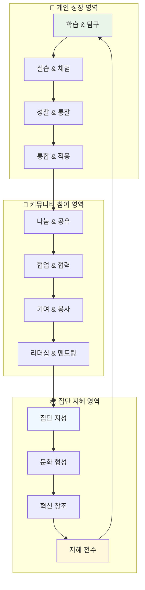

# 🌱 HEAL7 커뮤니티 생태계 아키텍처 v2.0

> **프로젝트**: HEAL7 자기조직화 커뮤니티 생태계 설계  
> **버전**: v2.0.0  
> **설계일**: 2025-08-18  
> **최종 수정**: 2025-08-18 18:30 KST  
> **설계자**: HEAL7 Community Ecosystem Team  
> **목적**: 사용자가 자발적으로 참여하고 기여하며 성장하는 지속 가능한 커뮤니티 생태계 구축

## 🎯 **커뮤니티 생태계 철학**

### **🌿 핵심 생태계 원칙**
```yaml
# 🌱 Ecosystem Philosophy
ecosystem_principles:
  self_organization: "구성원들이 자발적으로 조직하고 운영하는 구조"
  mutual_growth: "개인의 성장이 공동체의 성장과 연결되는 선순환"
  wisdom_sharing: "지식과 경험의 자유로운 공유와 순환"
  inclusive_participation: "모든 구성원이 기여할 수 있는 포용적 참여"
  organic_evolution: "커뮤니티가 자연스럽게 진화하고 발전하는 구조"

community_vision:
  "개인의 영적 성장이 커뮤니티의 집단 지혜로 발전하고,
   집단 지혜가 다시 개인의 깊은 통찰로 돌아오는
   지속 가능한 지혜 생태계 창조"

core_values:
  authenticity: "진정성 있는 소통과 나눔"
  compassion: "서로에 대한 이해와 공감"
  growth_mindset: "지속적인 학습과 성장 추구"
  collective_wisdom: "집단 지성을 통한 더 깊은 통찰"
  harmonious_coexistence: "다양성 속에서 조화로운 공존"
```

### **🌊 생태계 순환 구조**


## 👥 **사용자 성장 여정 시스템**

### **🌅 성장 단계별 여정 설계**
```typescript
// 🎯 User Growth Journey System
interface UserGrowthJourney {
  stages: {
    // 🌱 1단계: 탐색자 (Explorer)
    explorer: {
      duration: "1-3개월";
      characteristics: [
        "호기심 중심의 탐색",
        "다양한 서비스 체험",
        "기본 개념 학습",
        "커뮤니티 관찰"
      ];
      goals: [
        "플랫폼 이해도 향상",
        "개인 관심사 발견",
        "첫 번째 의미있는 인사이트 획득",
        "커뮤니티 분위기 파악"
      ];
      supportSystems: [
        "개인화된 온보딩",
        "초보자 가이드 프로그램",
        "멘토 배정",
        "친화적 소그룹 참여"
      ];
      achievements: [
        "첫 번째 완전한 사주 분석",
        "커뮤니티 첫 게시글",
        "첫 번째 온라인 워크숍 참여",
        "5명 이상과 인사 나누기"
      ];
    };
    
    // 🌿 2단계: 학습자 (Learner)
    learner: {
      duration: "3-6개월";
      characteristics: [
        "체계적인 학습 추구",
        "깊이 있는 이해 욕구",
        "실습과 적용 시도",
        "선별적 커뮤니티 참여"
      ];
      goals: [
        "전문 지식 습득",
        "개인 성장 실감",
        "신뢰할 수 있는 관계 형성",
        "자신만의 해석 능력 개발"
      ];
      supportSystems: [
        "구조화된 학습 경로",
        "실습 프로젝트 제공",
        "피어 러닝 그룹",
        "전문가 멘토링"
      ];
      achievements: [
        "전문 과정 수료",
        "개인 성장 일지 완성",
        "커뮤니티 토론 적극 참여",
        "다른 학습자 도움 제공"
      ];
    };
    
    // 🌸 3단계: 기여자 (Contributor)
    contributor: {
      duration: "6-12개월";
      characteristics: [
        "지식 공유 의지",
        "커뮤니티 가치 추구",
        "협업 프로젝트 참여",
        "신규 구성원 도움"
      ];
      goals: [
        "의미 있는 기여 실현",
        "전문성 인정 받기",
        "지속 가능한 네트워크 구축",
        "개인 브랜드 형성"
      ];
      supportSystems: [
        "기여 기회 제공 플랫폼",
        "콘텐츠 제작 도구",
        "협업 프로젝트 매칭",
        "기여 인정 시스템"
      ];
      achievements: [
        "고품질 콘텐츠 지속 생산",
        "워크숍 진행 경험",
        "멘티 성공적 지도",
        "커뮤니티 기여상 수상"
      ];
    };
    
    // 🌟 4단계: 리더 (Leader)
    leader: {
      duration: "1년 이상";
      characteristics: [
        "커뮤니티 비전 공유",
        "문화 형성 참여",
        "갈등 조정 능력",
        "신규 이니셔티브 주도"
      ];
      goals: [
        "커뮤니티 발전 기여",
        "다음 세대 리더 양성",
        "혁신적 아이디어 실현",
        "지속 가능한 영향력 창조"
      ];
      supportSystems: [
        "리더십 개발 프로그램",
        "의사결정 참여 권한",
        "리소스 접근 권한",
        "플랫폼 거버넌스 참여"
      ];
      achievements: [
        "성공적인 이니셔티브 론칭",
        "커뮤니티 문화 개선 기여",
        "지속적인 멘토링 활동",
        "외부 인지도 확보"
      ];
    };
    
    // 🏆 5단계: 현자 (Sage)
    sage: {
      duration: "지속적";
      characteristics: [
        "깊은 지혜와 통찰",
        "관대한 멘토링",
        "문화적 영향력",
        "차세대 육성"
      ];
      goals: [
        "지혜 전수와 계승",
        "커뮤니티 유산 창조",
        "글로벌 영향력 확산",
        "지속 가능한 생태계 구축"
      ];
      supportSystems: [
        "명예 직책 및 특별 권한",
        "레거시 프로젝트 지원",
        "글로벌 네트워크 연결",
        "영구적 기여 인정"
      ];
      achievements: [
        "커뮤니티 명예의 전당",
        "개인 전기 출간",
        "글로벌 컨퍼런스 키노트",
        "차세대 리더 다수 배출"
      ];
    };
  };
}

// 🚀 성장 촉진 엔진
class GrowthAccelerationEngine {
  // 🎯 개인화된 성장 계획 생성
  async createPersonalizedGrowthPlan(
    userId: string,
    currentStage: GrowthStage,
    aspirations: UserAspirations
  ): Promise<PersonalizedGrowthPlan> {
    const userProfile = await this.getUserProfile(userId);
    const currentCapabilities = await this.assessCurrentCapabilities(userId);
    const growthPotential = await this.analyzePotential(userId);
    
    return {
      // 🎯 개인 목표 설정
      personalGoals: {
        shortTerm: this.setShortTermGoals(currentStage, aspirations),
        mediumTerm: this.setMediumTermGoals(currentStage, aspirations),
        longTerm: this.setLongTermGoals(aspirations, growthPotential),
        stretchGoals: this.setStretchGoals(growthPotential)
      },
      
      // 📚 학습 경로 추천
      learningPath: {
        coreSkills: this.identifyCoreSkills(currentStage),
        supplementarySkills: this.identifySupplementarySkills(aspirations),
        learningResources: this.recommendLearningResources(userProfile),
        practiceOpportunities: this.suggestPracticeOpportunities(currentCapabilities)
      },
      
      // 🤝 네트워킹 전략
      networkingStrategy: {
        mentorMatching: this.recommendMentors(currentStage, aspirations),
        peerConnections: this.suggestPeerConnections(userProfile),
        communityInvolvement: this.recommendCommunityActivities(currentStage),
        leadershipOpportunities: this.identifyLeadershipOpportunities(growthPotential)
      },
      
      // 📊 진행 상황 추적
      progressTracking: {
        milestones: this.defineMilestones(personalGoals),
        successMetrics: this.defineSuccessMetrics(personalGoals),
        feedbackMechanisms: this.setupFeedbackMechanisms(currentStage),
        adaptationTriggers: this.setupAdaptationTriggers(growthPotential)
      }
    };
  }
  
  // 🌱 자동 성장 기회 발견
  async discoverGrowthOpportunities(
    userId: string
  ): Promise<GrowthOpportunities> {
    const userActivity = await this.getUserActivity(userId);
    const communityNeeds = await this.getCommunityNeeds();
    const emergingTrends = await this.getEmergingTrends();
    
    return {
      // 🎯 즉시 기회
      immediateOpportunities: {
        skillGapProjects: this.identifySkillGapProjects(userActivity, communityNeeds),
        mentoringOpportunities: this.findMentoringOpportunities(userActivity),
        collaborationInvitations: this.findCollaborationOpportunities(userActivity),
        leadershipVacancies: this.identifyLeadershipVacancies(userActivity)
      },
      
      // 🚀 성장 가능성
      growthPotentials: {
        emergingSkills: this.identifyEmergingSkills(emergingTrends),
        futureRoles: this.predictFutureRoles(userActivity, emergingTrends),
        innovationOpportunities: this.spotInnovationOpportunities(emergingTrends),
        thoughtLeadershipAreas: this.identifyThoughtLeadershipAreas(userActivity)
      },
      
      // 🎁 특별 기회
      specialOpportunities: {
        exclusivePrograms: this.findExclusivePrograms(userActivity),
        partnershipOpportunities: this.identifyPartnerships(userActivity),
        speakingOpportunities: this.findSpeakingOpportunities(userActivity),
        researchCollaborations: this.identifyResearchOpportunities(userActivity)
      }
    };
  }
}
```

### **🏆 성취 및 인정 시스템**
```typescript
// 🎖️ Achievement & Recognition System
class AchievementRecognitionSystem {
  // 🏅 다층적 성취 시스템
  async designMultiLayeredAchievements(): Promise<AchievementSystem> {
    return {
      // 🎯 개인 성취
      personalAchievements: {
        knowledge: {
          categories: [
            "사주명리학 마스터",
            "타로 해석 전문가",
            "12지신 연구자",
            "동양철학 학자",
            "현대심리학 통합자"
          ],
          levels: ["입문", "숙련", "전문가", "마스터", "그랜드마스터"],
          criteria: "지식 습득도, 적용 능력, 창의적 해석, 교육 능력"
        },
        
        contribution: {
          categories: [
            "지식 공유자",
            "커뮤니티 빌더",
            "멘토링 마스터",
            "이벤트 오거나이저",
            "혁신 리더"
          ],
          measurement: "기여의 질, 영향력, 지속성, 독창성",
          recognition: "배지, 특별 권한, 명예 직책, 물질적 보상"
        },
        
        growth: {
          categories: [
            "지속적 학습자",
            "변화 적응자",
            "도전 극복자",
            "성찰 실천자",
            "균형 추구자"
          ],
          tracking: "성장 궤적, 변화 정도, 일관성, 깊이",
          validation: "동료 인정, 멘토 평가, 객관적 지표"
        }
      },
      
      // 🤝 사회적 성취
      socialAchievements: {
        relationships: {
          metrics: [
            "신뢰받는 멘토",
            "소중한 동료",
            "영감을 주는 리더",
            "따뜻한 지지자",
            "지혜로운 조언자"
          ],
          validation: "피어 리뷰, 360도 피드백, 사회적 네트워크 분석"
        },
        
        influence: {
          indicators: [
            "사상적 영향력",
            "문화적 기여",
            "혁신 주도",
            "갈등 해결",
            "공동체 화합"
          ],
          measurement: "정성적 평가, 집단 지성 분석, 장기적 영향 추적"
        }
      },
      
      // 🌍 커뮤니티 성취
      communityAchievements: {
        collective: {
          goals: [
            "집단 지혜 증진",
            "문화 다양성 증대",
            "포용성 확대",
            "지속가능성 강화",
            "글로벌 영향력 확산"
          ],
          participation: "모든 구성원이 기여할 수 있는 공동 목표",
          celebration: "집단 축하, 공동 보상, 문화적 기념"
        }
      }
    };
  }
  
  // 🎉 동적 인정 시스템
  async dynamicRecognitionSystem(): Promise<RecognitionMechanisms> {
    return {
      // ⚡ 실시간 인정
      realTimeRecognition: {
        microAppreciation: {
          mechanism: "즉석 감사 표현, 이모지 반응, 짧은 댓글",
          frequency: "지속적",
          impact: "즉각적인 동기 부여, 소속감 강화"
        },
        
        momentumBoosts: {
          mechanism: "특별한 순간 포착 및 축하",
          triggers: "개인적 돌파구, 의미있는 기여, 성장 순간",
          format: "개인화된 축하 메시지, 하이라이트 표시"
        }
      },
      
      // 📅 정기적 인정
      periodicRecognition: {
        monthlySpotlight: {
          format: "월간 스포트라이트, 스토리 공유, 인터뷰",
          criteria: "꾸준한 기여, 특별한 성장, 커뮤니티 영향",
          participation: "커뮤니티 추천, 동료 추천"
        },
        
        seasonalCelebration: {
          format: "계절별 축제, 시상식, 특별 이벤트",
          scope: "다양한 카테고리, 포용적 인정, 집단 축하",
          legacy: "영구 기록, 명예의 전당, 역사 보존"
        }
      },
      
      // 🎖️ 이정표 인정
      milestoneRecognition: {
        growthMilestones: {
          triggers: "단계 전환, 중요한 성취, 의미있는 변화",
          ceremony: "개인화된 인정 의식, 공개적 축하",
          benefits: "새로운 권한, 특별 혜택, 성장 기회"
        },
        
        legacyAchievements: {
          criteria: "지속적 영향, 문화적 기여, 미래 세대 영향",
          format: "명예 직책, 영구 기념, 역사적 기록",
          responsibility: "차세대 멘토링, 지혜 전수, 문화 보존"
        }
      }
    };
  }
}
```

## 🎮 **참여 동기 & 게임화 시스템**

### **🏆 통합 게임화 플랫폼**
```typescript
// 🎯 Comprehensive Gamification Platform
class GamificationEngine {
  // 🎮 다차원 게임화 시스템
  async createMultiDimensionalGamification(): Promise<GamificationSystem> {
    return {
      // 🎯 개인 성장 게임화
      personalGrowthGameplay: {
        skillTrees: {
          structure: "사주-타로-12지신-풍수-사상체질 스킬 트리",
          progression: "순차적 해금, 분기 선택, 개인화 경로",
          mastery: "레벨업, 특화 분야, 크로스 스킬 조합",
          visualization: "인터랙티브 스킬 맵, 진행도 시각화"
        },
        
        questSystem: {
          types: [
            "일일 퀘스트 (습관 형성)",
            "주간 챌린지 (목표 달성)",
            "월간 프로젝트 (깊이 있는 학습)",
            "시즌별 여정 (장기 목표)",
            "특별 미션 (커뮤니티 이벤트)"
          ],
          adaptiveContent: "개인 성향, 학습 속도, 관심사 기반 맞춤화",
          rewardMechanics: "경험치, 아이템, 특별 콘텐츠 언락"
        },
        
        progressVisualization: {
          personalDashboard: "성장 지표, 달성률, 다음 목표",
          journeyMap: "성장 여정 시각화, 이정표 표시",
          insightGallery: "개인적 통찰 수집, 성찰 아카이브",
          futureProjection: "성장 예측, 가능성 시뮬레이션"
        }
      },
      
      // 🤝 사회적 게임화
      socialGameplay: {
        cooperativeElements: {
          groupQuests: "팀 협력 미션, 공동 목표 달성",
          knowledgeBuilding: "집단 지성 프로젝트, 위키 구축",
          communityEvents: "축제, 컨퍼런스, 워크숍 공동 기획",
          mentoringChains: "멘토-멘티 관계, 지식 전수 체인"
        },
        
        competitiveElements: {
          friendlyCompetition: "학습 경쟁, 기여도 순위",
          achievementSharing: "성취 공유, 동기 부여",
          expertiseRankings: "분야별 전문성 랭킹",
          innovationContests: "창의적 해석, 혁신 아이디어 경진"
        },
        
        socialRecognition: {
          peerNominations: "동료 추천, 상호 인정",
          mentorshipAwards: "멘토링 우수상, 교육 기여상",
          communityChoice: "커뮤니티 선택상, 인기 기여자",
          cultureBuilder: "문화 형성자, 분위기 메이커"
        }
      },
      
      // 🌱 집단 지성 게임화
      collectiveIntelligenceGameplay: {
        wisddomAggregation: {
          predictionMarkets: "미래 예측, 집단 지혜 검증",
          consensusBuilding: "의견 수렴, 공통 이해 형성",
          knowledgeRefinement: "정보 정제, 품질 향상 공동 작업",
          insightSynthesis: "통찰 통합, 새로운 관점 창조"
        },
        
        culturalEvolution: {
          traditionPreservation: "전통 지혜 보존 프로젝트",
          modernAdaptation: "현대적 해석, 시대적 적응",
          crossCulturalDialogue: "문화 간 대화, 다양성 포용",
          futureVision: "미래 비전 공동 창조"
        }
      }
    };
  }
  
  // 🎯 개인화된 동기 시스템
  async personalizedMotivationSystem(
    userId: string
  ): Promise<PersonalizedMotivation> {
    const personalityProfile = await this.getPersonalityProfile(userId);
    const motivationDrivers = await this.analyzeMotivationDrivers(userId);
    const currentContext = await this.getUserContext(userId);
    
    return {
      // 🧠 개인 동기 프로필
      motivationProfile: {
        intrinsicMotivators: this.identifyIntrinsicMotivators(personalityProfile),
        extrinsicMotivators: this.identifyExtrinsicMotivators(motivationDrivers),
        socialMotivators: this.identifySocialMotivators(personalityProfile),
        achievementPreferences: this.analyzeAchievementPreferences(motivationDrivers)
      },
      
      // 🎯 맞춤형 게임화 요소
      customizedGamification: {
        preferredChallenges: this.selectPreferredChallenges(motivationProfile),
        rewardPreferences: this.customizeRewards(motivationProfile),
        socialInteractionLevel: this.adjustSocialLevel(personalityProfile),
        competitionComfort: this.calibrateCompetitionLevel(personalityProfile)
      },
      
      // 🔄 동적 조정 메커니즘
      adaptiveAdjustment: {
        motivationTracking: this.trackMotivationLevels(userId),
        engagementOptimization: this.optimizeEngagement(currentContext),
        burnoutPrevention: this.preventBurnout(motivationDrivers),
        renewalStrategies: this.implementRenewalStrategies(motivationProfile)
      }
    };
  }
}

// 🌟 포인트 & 배지 시스템
class PointsBadgeSystem {
  // 💎 다차원 포인트 시스템
  async multiDimensionalPointSystem(): Promise<PointSystem> {
    return {
      // 💡 지식 포인트 (Wisdom Points)
      wisdomPoints: {
        earning: [
          "학습 완료 (10-50점)",
          "퀴즈 정답 (5-20점)", 
          "깊이 있는 질문 (15-30점)",
          "창의적 해석 (25-50점)",
          "지식 검증 기여 (20-40점)"
        ],
        spending: [
          "프리미엄 콘텐츠 접근",
          "전문가 1:1 상담",
          "특별 워크숍 참여",
          "독점 리서치 자료"
        ],
        decay: "사용하지 않으면 천천히 감소 (활동 촉진)"
      },
      
      // 🤝 기여 포인트 (Contribution Points)
      contributionPoints: {
        earning: [
          "질 높은 콘텐츠 작성 (50-200점)",
          "다른 사용자 도움 (20-100점)",
          "커뮤니티 이벤트 참여 (30-150점)",
          "멘토링 활동 (100-300점)",
          "혁신적 아이디어 제안 (200-500점)"
        ],
        benefits: [
          "커뮤니티 영향력 증대",
          "의사결정 참여 권한",
          "특별 인정 배지",
          "수익 공유 프로그램"
        ],
        permanence: "영구적 누적 (평생 기여도 반영)"
      },
      
      // 💖 관계 포인트 (Connection Points)
      connectionPoints: {
        earning: [
          "의미있는 대화 (10-30점)",
          "상호 도움 (20-50점)",
          "성공적인 멘토링 관계 (100-200점)",
          "장기적 협력 (200-500점)",
          "커뮤니티 화합 기여 (50-150점)"
        ],
        effects: [
          "네트워킹 기회 확대",
          "협업 프로젝트 우선권",
          "VIP 이벤트 초대",
          "커뮤니티 리더십 기회"
        ],
        dynamics: "상호 작용 기반, 관계 품질 반영"
      }
    };
  }
  
  // 🏆 진화하는 배지 시스템
  async evolvingBadgeSystem(): Promise<BadgeSystem> {
    return {
      // 🌱 성장 배지
      growthBadges: {
        "첫걸음": { trigger: "첫 사주 분석 완료", rarity: "common" },
        "탐구자": { trigger: "10개 이상 서비스 체험", rarity: "common" },
        "학습자": { trigger: "첫 전문 과정 수료", rarity: "uncommon" },
        "통찰가": { trigger: "깊이 있는 해석 10회", rarity: "uncommon" },
        "현자": { trigger: "전 분야 마스터 달성", rarity: "legendary" }
      },
      
      // 🤝 기여 배지
      contributionBadges: {
        "도우미": { trigger: "다른 사용자 도움 5회", rarity: "common" },
        "나눔이": { trigger: "고품질 콘텐츠 10개 작성", rarity: "uncommon" },
        "멘토": { trigger: "성공적인 멘토링 관계 3개", rarity: "rare" },
        "커뮤니티 빌더": { trigger: "커뮤니티 성장에 기여", rarity: "epic" },
        "문화 창조자": { trigger: "커뮤니티 문화 형성 기여", rarity: "legendary" }
      },
      
      // 🎨 특별 배지
      specialBadges: {
        "시대정신": { trigger: "사회적 이슈에 지혜로운 관점 제시", rarity: "epic" },
        "다리놓기": { trigger: "서로 다른 그룹 간 화합 촉진", rarity: "epic" },
        "혁신가": { trigger: "새로운 해석 방법론 개발", rarity: "legendary" },
        "지혜의 등대": { trigger: "오랜 기간 지속적인 영감 제공", rarity: "mythic" }
      },
      
      // 🔄 진화 메커니즘
      evolutionMechanics: {
        dynamicRequirements: "시간에 따라 변화하는 획득 조건",
        communityVoting: "커뮤니티 투표로 새로운 배지 생성",
        seasonalBadges: "특별한 시기의 한정 배지",
        legacyBadges: "역사적 의미가 있는 특별 배지"
      }
    };
  }
}
```

## 🧠 **집단 지성 & 지식 생태계**

### **📚 지식 순환 시스템**
```typescript
// 🌊 Knowledge Circulation System
class KnowledgeEcosystem {
  // 🔄 지식 생명 주기 관리
  async manageKnowledgeLifecycle(): Promise<KnowledgeLifecycle> {
    return {
      // 🌱 지식 생성
      knowledgeCreation: {
        userGeneratedContent: {
          personalInsights: "개인적 깨달음과 경험 공유",
          practicalApplications: "실제 적용 사례와 결과",
          creativeInterpretations: "창의적 해석과 새로운 관점",
          crossDomainConnections: "분야 간 연결과 통합적 이해"
        },
        
        collaborativeKnowledge: {
          groupDiscussions: "집단 토론을 통한 지혜 창출",
          peerReview: "동료 검토를 통한 품질 향상",
          consensusBuilding: "의견 수렴을 통한 공통 이해",
          controversyExploration: "논쟁을 통한 깊이 있는 탐구"
        },
        
        expertContributions: {
          professionalInsights: "전문가의 깊이 있는 해석",
          researchFindings: "최신 연구 결과 공유",
          historicalWisdom: "전통 지혜의 현대적 해석",
          futureProjections: "미래 전망과 발전 방향"
        }
      },
      
      // 🔍 지식 큐레이션
      knowledgeCuration: {
        qualityAssurance: {
          peerReview: "동료 전문가 검토 시스템",
          communityValidation: "커뮤니티 집단 검증",
          expertEndorsement: "공인 전문가 인증",
          empiricalValidation: "실증적 검증 과정"
        },
        
        organizationSystems: {
          taxonomyDevelopment: "체계적 분류 체계 구축",
          taggingSystem: "다차원 태깅 시스템",
          relationshipMapping: "지식 간 관계 매핑",
          evolutionTracking: "지식 진화 과정 추적"
        },
        
        personalization: {
          individualCuration: "개인 맞춤 지식 큐레이션",
          learningPathOptimization: "학습 경로 최적화",
          relevanceRanking: "개인별 관련성 순위",
          serendipityEngines: "우연한 발견 촉진"
        }
      },
      
      // 📈 지식 진화
      knowledgeEvolution: {
        continuousRefinement: {
          feedbackIncorporation: "사용자 피드백 반영",
          newInsightIntegration: "새로운 통찰 통합",
          contradictionResolution: "모순 해결 과정",
          paradigmShifts: "패러다임 변화 적응"
        },
        
        emergentWisdom: {
          patternRecognition: "집단 지성 패턴 인식",
          trendIdentification: "새로운 트렌드 발견",
          consensusEmergence: "자연스러운 합의 형성",
          innovativeConnections: "혁신적 연결 발견"
        }
      }
    };
  }
  
  // 🧠 집단 지성 플랫폼
  async collectiveIntelligencePlatform(): Promise<CollectiveIntelligence> {
    return {
      // 🌐 분산 전문성
      distributedExpertise: {
        crowdsourcedValidation: {
          multipleValidators: "다수 검증자 시스템",
          expertiseWeighting: "전문성 가중치 적용",
          consensusThresholds: "합의 임계점 설정",
          minorityOpinionProtection: "소수 의견 보호"
        },
        
        specializedCommunities: {
          domainExperts: "분야별 전문가 그룹",
          crossDisciplinaryTeams: "학제간 협업팀",
          noviceContributions: "초보자 관점 기여",
          diversePerspectives: "다양한 관점 통합"
        }
      },
      
      // 📊 집단 의사결정
      collectiveDecisionMaking: {
        deliberationProcesses: {
          structuredDebate: "구조화된 토론",
          argumentMapping: "논리 구조 시각화",
          evidenceWeighting: "증거 가중치 평가",
          biasDetection: "편향 감지 및 보정"
        },
        
        votingMechanisms: {
          quadraticVoting: "제곱 투표제",
          liquidDemocracy: "유동적 민주주의",
          expertiseBasedWeighting: "전문성 기반 가중투표",
          consensusBuilding: "합의 형성 과정"
        }
      },
      
      // 🔮 예측 및 통찰
      predictionInsights: {
        wisdomOfCrowds: {
          aggregatedPredictions: "집단 예측 종합",
          predictionMarkets: "예측 시장 메커니즘",
          trackRecordWeighting: "예측 성과 가중치",
          uncertaintyQuantification: "불확실성 정량화"
        },
        
        emergentInsights: {
          patternDetection: "숨겨진 패턴 발견",
          weakSignalAmplification: "약한 신호 증폭",
          trendExtrapolation: "트렌드 외삽",
          paradigmAnticipation: "패러다임 변화 예측"
        }
      }
    };
  }
}

// 📖 살아있는 지식 베이스
class LivingKnowledgeBase {
  // 🌱 자기조직화 지식 구조
  async selfOrganizingKnowledge(): Promise<SelfOrganizingSystem> {
    return {
      // 🕸️ 동적 지식 네트워크
      dynamicKnowledgeNetwork: {
        nodeEvolution: {
          conceptGrowth: "개념의 성장과 발전",
          relationshipFormation: "새로운 관계 형성",
          clusterEmergence: "클러스터 자연 형성",
          hierarchyFlattening: "계층 구조 유연화"
        },
        
        adaptiveStructure: {
          usageBasedReorganization: "사용 패턴 기반 재구성",
          semanticClustering: "의미론적 클러스터링",
          temporalEvolution: "시간적 진화 반영",
          userPathOptimization: "사용자 경로 최적화"
        }
      },
      
      // 🧬 지식 DNA 시스템
      knowledgeDNA: {
        coreElements: {
          fundamentalPrinciples: "핵심 원리 코드",
          methodologyGenes: "방법론 유전자",
          culturalMarkers: "문화적 특성 표시",
          evolutionaryTriggers: "진화 촉발 요소"
        },
        
        inheritanceRules: {
          knowledgeInheritance: "지식 상속 규칙",
          mutationMechanisms: "변이 메커니즘",
          crossoverProcesses: "교차 과정",
          selectionPressures: "선택 압력 요인"
        }
      },
      
      // 🔄 지속적 학습 시스템
      continuousLearning: {
        feedbackLoops: {
          userBehaviorAnalysis: "사용자 행동 분석",
          outcomeTracking: "결과 추적",
          effectivenessAssessment: "효과성 평가",
          improvementIteration: "개선 반복"
        },
        
        adaptationMechanisms: {
          contentRecommendation: "콘텐츠 추천 개선",
          interfaceOptimization: "인터페이스 최적화",
          learningPathAdjustment: "학습 경로 조정",
          communityNeedResponse: "커뮤니티 요구 대응"
        }
      }
    };
  }
}
```

## 🏛️ **커뮤니티 거버넌스 시스템**

### **⚖️ 자치 및 의사결정 구조**
```typescript
// 🏛️ Community Governance Architecture
class CommunityGovernance {
  // 🗳️ 분산 거버넌스 시스템
  async distributedGovernanceSystem(): Promise<GovernanceStructure> {
    return {
      // 🏗️ 거버넌스 계층
      governanceLayers: {
        // 🏛️ 헌법 계층 (Constitutional Layer)
        constitutional: {
          coreValues: "커뮤니티 핵심 가치와 원칙",
          fundamentalRights: "구성원의 기본 권리",
          governanceFramework: "의사결정 구조와 프로세스",
          amendmentProcedures: "헌법 개정 절차",
          conflictResolution: "갈등 해결 메커니즘"
        },
        
        // 📋 정책 계층 (Policy Layer)
        policy: {
          communityGuidelines: "커뮤니티 가이드라인",
          behaviorStandards: "행동 기준과 규범",
          contentPolicy: "콘텐츠 정책",
          moderationRules: "조정 규칙",
          sanctionProcedures: "제재 절차"
        },
        
        // ⚙️ 운영 계층 (Operational Layer)
        operational: {
          dailyModeration: "일상적 조정 활동",
          eventManagement: "이벤트 관리",
          resourceAllocation: "자원 배분",
          serviceDelivery: "서비스 제공",
          qualityAssurance: "품질 보증"
        }
      },
      
      // 👥 의사결정 참여 구조
      participationStructure: {
        // 🏛️ 대의 기구
        representativeBody: {
          councilOfElders: {
            composition: "장기 기여자, 지혜 보유자",
            responsibility: "전략적 방향 설정, 가치 수호",
            term: "2년, 연임 가능",
            selection: "커뮤니티 추천 + 동료 승인"
          },
          
          expertPanel: {
            composition: "분야별 전문가 대표",
            responsibility: "전문적 의사결정, 품질 관리",
            term: "1년, 순환제",
            selection: "전문성 평가 + 동료 선출"
          },
          
          communityRepresentatives: {
            composition: "일반 구성원 대표",
            responsibility: "구성원 의견 대변, 일상 의사결정",
            term: "6개월, 순환제",
            selection: "무작위 선정 + 자원 참여"
          }
        },
        
        // 🗳️ 직접 민주주의
        directDemocracy: {
          weeklyReferendum: {
            scope: "운영 정책, 자원 배분",
            participation: "모든 활성 구성원",
            threshold: "참여율 30% 이상",
            mechanism: "가중 투표 (기여도 반영)"
          },
          
          consensusBuilding: {
            process: "제안 → 토론 → 수정 → 합의",
            tools: "구조화된 토론, 의견 수렴",
            facilitation: "중립적 진행자",
            outcome: "합의안 도출 또는 투표 진행"
          }
        }
      },
      
      // ⚖️ 갈등 해결 시스템
      conflictResolution: {
        preventiveMeasures: {
          clearCommunication: "명확한 소통 가이드라인",
          expectationManagement: "기대치 관리",
          diversityTraining: "다양성 인식 교육",
          culturalSensitivity: "문화적 민감성 교육"
        },
        
        mediationProcess: {
          peerMediation: {
            process: "동료 중재자를 통한 갈등 해결",
            training: "중재 기술 교육 프로그램",
            pool: "자원 봉사 중재자 풀",
            success_rate: "80% 이상 성공률 목표"
          },
          
          professionalMediation: {
            escalation: "동료 중재 실패 시 진행",
            providers: "외부 전문 중재자",
            cost: "커뮤니티 공동 부담",
            binding: "중재 결과 구속력"
          }
        },
        
        justiceSystem: {
          peerJury: {
            composition: "무작위 선정 동료 배심원",
            process: "증거 검토, 토론, 판정",
            decision: "과반수 합의 또는 만장일치",
            appeals: "상급 기구 재심 가능"
          },
          
          sanctions: {
            warning: "경고 및 교육 기회 제공",
            temporarySuspension: "일시적 활동 제한",
            privilegeRevocation: "특권 박탈",
            communityService: "커뮤니티 봉사 활동",
            banishment: "최후 수단, 영구 추방"
          }
        }
      }
    };
  }
  
  // 🌱 적응형 거버넌스
  async adaptiveGovernanceEvolution(): Promise<AdaptiveGovernance> {
    return {
      // 🔄 지속적 개선
      continuousImprovement: {
        performanceMonitoring: {
          governanceEffectiveness: "의사결정 품질과 속도",
          participationRates: "구성원 참여율",
          satisfactionLevels: "거버넌스 만족도",
          conflictResolutionSuccess: "갈등 해결 성공률"
        },
        
        feedbackIntegration: {
          regularSurveys: "정기적 구성원 설문",
          townHallMeetings: "공개 토론회",
          suggestionBoxes: "개선 제안함",
          experimentalPrograms: "실험적 프로그램 운영"
        },
        
        evolutionaryAdaptation: {
          governanceExperiments: "새로운 거버넌스 모델 실험",
          resultAssessment: "실험 결과 평가",
          gradualIntegration: "점진적 통합",
          safeguardMechanisms: "안전장치 유지"
        }
      },
      
      // 🧬 거버넌스 DNA
      governanceDNA: {
        coreInvariants: {
          democraticParticipation: "민주적 참여 원칙",
          transparentProcesses: "투명한 과정",
          inclusiveDecisionMaking: "포용적 의사결정",
          accountableLeadership: "책임감 있는 리더십"
        },
        
        adaptableElements: {
          structuralFlexibility: "구조적 유연성",
          processInnovation: "과정 혁신",
          toolEvolution: "도구 진화",
          culturalAdaptation: "문화적 적응"
        },
        
        emergentProperties: {
          collectiveWisdom: "집단 지혜 발현",
          resilientCohesion: "회복력 있는 결속",
          innovativeGovernance: "혁신적 거버넌스",
          sustainableGrowth: "지속 가능한 성장"
        }
      }
    };
  }
}
```

---

## 🎯 **구현 우선순위 및 로드맵**

### **📅 Phase 1: 기반 커뮤니티 구축 (8주)**
- [ ] 사용자 성장 여정 시스템
- [ ] 기본 게임화 요소 구현
- [ ] 지식 공유 플랫폼 구축
- [ ] 커뮤니티 기본 거버넌스

### **📅 Phase 2: 참여 동기 시스템 (6주)**
- [ ] 개인화된 동기 시스템
- [ ] 포인트 및 배지 시스템
- [ ] 성취 및 인정 시스템
- [ ] 소셜 게임화 요소

### **📅 Phase 3: 집단 지성 플랫폼 (6주)**
- [ ] 지식 생태계 구축
- [ ] 집단 의사결정 시스템
- [ ] 살아있는 지식 베이스
- [ ] 예측 및 통찰 시스템

### **📅 Phase 4: 고급 거버넌스 (4주)**
- [ ] 분산 거버넌스 시스템
- [ ] 갈등 해결 메커니즘
- [ ] 적응형 거버넌스
- [ ] 커뮤니티 자치 시스템

### **📅 Phase 5: 생태계 완성 (4주)**
- [ ] 전체 시스템 통합
- [ ] 성능 최적화
- [ ] 커뮤니티 문화 정착
- [ ] 확장성 검증

---

*📅 설계 완료일: 2025-08-18*  
*🌱 설계자: HEAL7 Community Ecosystem Team*  
*📝 문서 위치: `/home/ubuntu/CORE/feature-specs/user-features/`*  
*🔄 다음 버전: v2.1 (커뮤니티 피드백 반영 후 업데이트)*