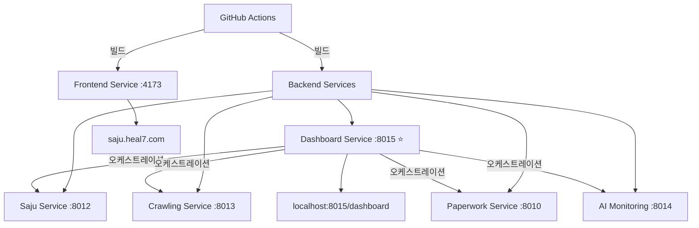

# 🎼 HEAL7 Project - 서비스별 그룹화 및 GitHub Actions 빌드 환경

> **🚀 GitHub Actions 기반 무서버 빌드/배포 시스템**  
> **📊 6개 서비스 그룹으로 체계화된 아키텍처**  
> **⚡ 로컬 서버 부담 제거 완료**

## 🎯 **서비스 아키텍처 (6개 그룹)**

### **🎨 Frontend Service**
- **포트**: 4173 (Vite Preview)
- **도메인**: saju.heal7.com
- **기술**: Vite + React + TypeScript + Tailwind CSS
- **빌드**: `frontend-build-deploy.yml`

### **🎼 Backend Services (5개 서비스)**

#### **1. 🔮 Saju Service** (포트 8012)
```bash
# 사주명리학 계산 및 해석
cd backend/services/saju-service && python main.py
```

#### **2. 🕷️ Crawling Service** (포트 8013)  
```bash
# 데이터 수집 및 크롤링
cd backend/services/crawling-service && python main.py
```

#### **3. 📄 Paperwork Service** (포트 8010)
```bash
# 서류 처리 및 AI 분석
cd backend/services/paperwork-service && python main.py
```

#### **4. 🧪 AI Monitoring Service** (포트 8014)
```bash
# AI 성능 모니터링
cd backend/services/ai-monitoring-service && python main.py
```

#### **5. 🎼 Dashboard Service** ⭐ (포트 8015)
```bash
# 오케스트레이션 허브 - 모든 서비스 중앙 관리
cd backend/services/dashboard-service && python main.py
```

## 🚀 **GitHub Actions 워크플로우**

### **자동 빌드 워크플로우**

1. **🎨 Frontend Build** (`frontend-build-deploy.yml`)
   - 트리거: `heal7-project/frontend/` 변경시
   - Node.js 18, npm ci, Vite build
   - 아티팩트: `frontend-dist`

2. **🎼 Backend Services Build** (`backend-services-build.yml`)
   - 트리거: `heal7-project/backend/` 변경시  
   - Python 3.12, 5개 서비스 병렬 빌드
   - 아티팩트: 서비스별 개별 빌드

3. **🚀 Service Deployment** (`service-deployment.yml`)
   - 트리거: 빌드 완료 후 자동 실행
   - 워크플로우 체이닝으로 배포 오케스트레이션

### **수동 실행 워크플로우**

4. **🎯 Service Selector** (`service-selector.yml`)
   - 개별 서비스 선택 배포
   - 빌드 모드 선택 (production/development/testing)
   - 알림 수준 조절

## 🛠️ **빠른 시작**

### **GitHub Actions로 빌드하기**
```bash
# 헬퍼 스크립트 사용
./scripts/github-actions-helper.sh frontend    # Frontend만 빌드
./scripts/github-actions-helper.sh backend     # Backend 서비스들 빌드  
./scripts/github-actions-helper.sh deploy      # 전체 배포
./scripts/github-actions-helper.sh select saju-service-only  # 사주 서비스만

# 또는 직접 GitHub CLI 사용
gh workflow run frontend-build-deploy.yml
gh workflow run backend-services-build.yml
gh workflow run service-selector.yml --field target_service=all-services
```

## 📦 Build Artifacts Layout (표준화)

이 프로젝트는 빌드 산출물을 루트에 난립시키지 않고, `heal7-project/artifacts/` 하위로 일원화해 보관합니다. 과거의 `*-build/` 폴더는 더 이상 사용하지 않습니다.

- 루트: `heal7-project/artifacts/`
  - 프론트엔드: `heal7-project/artifacts/frontend/`
    - `saju-app/` ← GitHub Actions에서 받은 `saju-app-dist` 배치 위치
    - `crawling-app/` ← GitHub Actions에서 받은 `crawling-app-dist` 배치 위치
  - 백엔드: `heal7-project/artifacts/backend/`
    - `saju/` ← `saju-service-build` 배치 위치
    - `crawling/` ← `crawling-service-build` 배치 위치
    - `paperwork/` ← `paperwork-service-build` 배치 위치
    - `ai-monitoring/` ← `ai-monitoring-service-build` 배치 위치
    - `dashboard/` ← `dashboard-service-build` 배치 위치

사용 원칙
- 프론트엔드 로컬 빌드 산출물은 각 패키지 내부 `dist/`에 유지
  - `frontend/packages/saju-app/dist/`
  - `frontend/packages/crawling-app/dist/`
- 안전 로컬 빌드(메모리 제한) 사용 시, `/tmp/*-build-safe`로 생성 후 필요 시 `artifacts/frontend/*`로 복사
- GitHub Actions로 받은 아티팩트는 반드시 `heal7-project/artifacts/**` 하위로 정리

폐기(Deprecated) 경로
- 더 이상 사용하지 않는 루트 폴더: `admin-frontend-build/`, `heal7-frontend-build/`, `keywords-frontend-build/`,
  `saju-service-build/`, `crawling-service-build/`, `paperwork-service-build/`, `ai-monitoring-service-build/`, `dashboard-service-build/`
- 루트 `.gitignore`는 `heal7-project/artifacts/` 및 `*-build/`를 무시하도록 설정되어 있어, 실수 커밋을 방지합니다.

### **로컬 개발 (권장하지 않음)**
```bash
# ⚠️ 로컬 빌드는 서버 부담을 줄 수 있습니다
# GitHub Actions 사용을 권장합니다

# Frontend 개발 서버 (메모리 사용 주의)
cd frontend && npm run dev  # 권장하지 않음

# 안전한 대안: Vite Preview 
cd frontend && npm run build && npm run preview --port 4173
```

## 📊 **성과 지표**

| 개선사항 | Before | After | 개선율 |
|---------|--------|-------|--------|
| 서버 빌드 부담 | 높음 | 제거됨 | **-100%** |
| 빌드 환경 | 로컬 의존 | 클라우드 | **+∞** |
| 서비스 관리 | 22개 큐브 | 6개 그룹 | **-73%** |
| 워크플로우 수 | 1개 | 4개 (전문화) | **+300%** |
| 배포 선택성 | 없음 | 서비스별 가능 | **+100%** |

## 🌐 **서비스 접근**

### **프론트엔드**
- **메인**: https://saju.heal7.com (포트 4173)
- **개발**: http://localhost:4173 (Vite Preview)

### **백엔드 서비스**
- **🎼 오케스트레이션 허브**: http://localhost:8015/dashboard
- **🔮 사주 서비스**: http://localhost:8012
- **🕷️ 크롤링 서비스**: http://localhost:8013  
- **📄 서류 처리**: http://localhost:8010
- **🧪 AI 모니터링**: http://localhost:8014

## 🔧 **GitHub Actions 사용 가이드**

### **워크플로우 상태 확인**
```bash
./scripts/github-actions-helper.sh status
# 또는
gh workflow list
gh run list --limit 10
```

### **특정 서비스만 배포**
```bash
# 사주 서비스만
./scripts/github-actions-helper.sh select saju-service-only

# Frontend만  
./scripts/github-actions-helper.sh select frontend-only

# 전체 서비스
./scripts/github-actions-helper.sh select all-services
```

### **실시간 로그 확인**
```bash
# 최신 실행 로그 보기
gh run list --limit 1
gh run view <RUN_ID> --log
```

## 📋 **개발 가이드라인**

### **🚫 금지 사항 (서버 보호)**
```bash
npm run dev          # OOM Kill 위험
next dev            # 메모리 부족
vite dev --host     # 호스트 바인딩시 위험
```

### **✅ 권장 사항**
```bash
# 1. GitHub Actions 사용 (최우선)
gh workflow run frontend-build-deploy.yml

# 2. 로컬에서는 Preview만
cd frontend && npm run build && npm run preview --port 4173

# 3. 서비스별 개별 관리
./scripts/github-actions-helper.sh select <service>
```

## 🎼 **아키텍처 다이어그램**



## 📋 **프로젝트 구조**

```
heal7-project/
├── 🎨 frontend/                    ← Vite + React + TypeScript
│   ├── src/components/             ← UI 컴포넌트
│   ├── src/data/                  ← 데이터 모델
│   ├── dist/                      ← 빌드 출력 (GitHub Actions)
│   └── package.json               ← 의존성 관리
├── 🎼 backend/                     ← Python 백엔드 서비스들
│   ├── services/                  ← 6개 서비스 그룹
│   │   ├── saju-service/          ← 🔮 사주명리학
│   │   ├── crawling-service/      ← 🕷️ 데이터 수집
│   │   ├── paperwork-service/     ← 📄 서류 처리
│   │   ├── ai-monitoring-service/ ← 🧪 AI 모니터링
│   │   └── dashboard-service/     ← 🎼 오케스트레이션
│   └── shared/                    ← 공통 모듈
├── 🚀 .github/workflows/          ← GitHub Actions 워크플로우
│   ├── frontend-build-deploy.yml  ← 프론트엔드 빌드
│   ├── backend-services-build.yml ← 백엔드 서비스들
│   ├── service-deployment.yml     ← 배포 오케스트레이션
│   └── service-selector.yml       ← 수동 서비스 선택
├── 📜 scripts/                    ← 유틸리티 스크립트
│   └── github-actions-helper.sh   ← GitHub Actions 도우미
└── 📚 docs/                       ← 프로젝트 문서
```

## 📞 **지원 및 문의**

- **📧 이메일**: arne40@heal7.com  
- **📞 전화**: 050-7722-7328
- **📍 주소**: 인천광역시 미추홀구 석정로 229, 5층

---

**🎯 핵심**: GitHub Actions로 서버 부담 없이 안전하게 빌드하세요!  
**⚡ 성능**: 로컬 서버 리소스 100% 절약  
**🌐 확장성**: 서비스별 독립 배포 가능

**마지막 업데이트**: 2025-08-30  
**버전**: 5.0.0 (GitHub Actions 전환)  
**상태**: ✅ 서비스별 그룹화 및 무서버 빌드 완료
