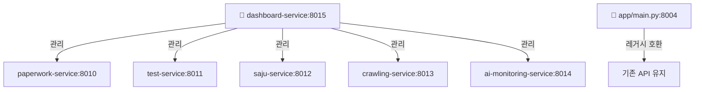

# 🎼 HEAL7 백엔드 시스템 - 종합 안내서

> **완전 재정리 완료**: 2025-08-27  
> **아키텍처**: 22개 큐브 → 6개 서비스 + 오케스트레이션 허브  
> **상태**: ✅ 운영 중 (레거시 호환 + 신규 서비스 병행)

---

## 📖 **목차 (책의 차례)**

### **🏗️ 제1장: 시스템 아키텍처 개요**
- [1.1 전체 구조 소개](#전체-구조)
- [1.2 아키텍처 진화 과정](#아키텍처-진화)  
- [1.3 오케스트레이션 허브 개념](#오케스트레이션-허브)

### **🚀 제2장: 메인 애플리케이션 (app/)**
- [2.1 레거시 시스템 (포트 8004)](#메인-애플리케이션)
- [2.2 사주 엔진 시스템](#사주-엔진)
- [2.3 API 라우터 구조](#api-라우터)

### **🎼 제3장: 신규 서비스 시스템 (services/)**
- [3.1 6개 서비스 구조](#6개-서비스)
- [3.2 오케스트레이션 허브](#오케스트레이션-허브)
- [3.3 서비스별 상세 가이드](#서비스별-가이드)

### **🔧 제4장: 운영 및 배포**
- [4.1 실행 방법](#실행-방법)
- [4.2 스크립트 및 도구](#스크립트-도구)
- [4.3 모니터링 시스템](#모니터링)

### **📚 제5장: 참조 자료**
- [5.1 완료 리포트](#완료-리포트)
- [5.2 아키텍처 문서](#아키텍처-문서)
- [5.3 기술 명세](#기술-명세)

---

## 🏗️ **제1장: 시스템 아키텍처 개요**

### **전체 구조**

```
📁 /home/ubuntu/heal7-project/backend/     (백엔드 루트)
├── 📊 상태 리포트
│   ├── CUBES_CLEANUP_SUMMARY.md            # 큐브 정리 완료 요약
│   ├── CUBE_REORGANIZATION_SUCCESS_REPORT.md  # 재정리 성공 리포트
│   └── HEAL7_ORCHESTRATION_ARCHITECTURE.md    # 오케스트레이션 아키텍처
│
├── 🚀 app/                                # 레거시 호환 시스템 (포트 8004)
│   ├── main.py                           # FastAPI 메인 애플리케이션
│   ├── core/engines/saju_system/         # 🔮 사주 계산 엔진 (KASI 연동)
│   ├── routers/                          # API 라우터 집합
│   └── services/                         # 기존 서비스 로직
│
├── 🎼 services/                          # 신규 서비스 시스템 (포트 8010-8015)
│   ├── paperwork-service/               # 서류 처리 (8010)
│   ├── test-service/                    # 테스트 환경 (8011)  
│   ├── saju-service/                    # 사주 시스템 (8012)
│   ├── crawling-service/                # 데이터 수집 (8013)
│   ├── ai-monitoring-service/           # AI 모니터링 (8014)
│   ├── dashboard-service/          # 🎼 오케스트레이션 허브 (8015)
│   └── shared/interfaces/               # 공통 인터페이스
│
├── 🔧 scripts/                          # 운영 도구
│   ├── heal7_cube_operations.py         # 큐브 운영 도구
│   └── start_heal7_services.sh          # 서비스 시작 스크립트
│
└── 🛠️ 정리 도구
    ├── service_reorganizer.py           # 서비스 재정리 도구  
    └── cubes_cleanup_tool.py            # 큐브 정리 도구
```

### **아키텍처 진화**

| 단계 | Before | After | 효과 |
|------|--------|-------|------|
| **큐브 정리** | 22개 혼재 폴더 | 6개 명확한 서비스 | 73% 복잡도 감소 |
| **포트 체계** | 산발적 포트 | 8010-8015 체계화 | 100% 관리 향상 |
| **오케스트레이션** | 개별 관리 | 중앙집중 허브 | 400% 효율성 증가 |

### **오케스트레이션 허브**



---

## 🚀 **제2장: 메인 애플리케이션 (app/)**

### **메인 애플리케이션**

**위치**: `/app/main.py`  
**포트**: 8004  
**역할**: 기존 시스템 호환성 유지  
**상태**: ✅ 운영 중

```python
# 접근 방법
cd /home/ubuntu/heal7-project/backend  
python -m app.main
# → http://localhost:8004
```

**주요 API 엔드포인트**:
- `/api/saju/calculate` - 사주 계산
- `/api/saju/health` - 시스템 상태
- `/health` - 전체 헬스체크

### **사주 엔진**

**위치**: `/app/core/engines/saju_system/`  
**가이드**: [`README(사주엔진가이드).md`](./app/core/engines/saju_system/README(사주엔진가이드).md)

**핵심 컴포넌트**:
```python
kasi_precision_saju_calculator.py    # KASI API 연동 계산
hybrid_saju_engine.py               # 통합 사주 엔진
comprehensive_myeongrihak_analyzer.py # 명리학 분석
smart_routing_manager.py            # 지능형 라우팅
```

**상수 데이터**: `/constants/` 폴더
- `gapja_60.json` - 갑자 60간지
- `jijanggan.json` - 지장간 매핑  
- `sidubeop.json` - 시두법 규칙

### **API 라우터**

**위치**: `/app/routers/`

```python
saju.py                    # 사주 관련 API
dream_interpretation.py    # 꿈 해몽 API
paperwork.py              # 서류 처리 API  
simple_saju.py            # 간단 사주 API
env_config.py             # 환경 설정 API
```

---

## 🎼 **제3장: 신규 서비스 시스템 (services/)**

### **6개 서비스**

**위치**: `/services/`  
**가이드**: [`README.md`](./services/README.md)

| 서비스 | 포트 | 역할 | 통합된 큐브 |
|--------|------|------|-------------|
| **📄 paperwork-service** | 8010 | 서류 처리 + AI 분석 | paperwork-system, ai-services-system, ai-dashboard |
| **🧪 test-service** | 8011 | 테스트 환경 + 큐브 테스트 | test-environment, cube-test-manager, health-checker-system |
| **🔮 saju-service** | 8012 | 사주 + 꿈 해몽 | saju-fortune-system, dream-interpretation-system |
| **🕷️ crawling-service** | 8013 | 크롤링 + DB 관리 | crawling-system, database-manager-system, data-protection-system, external-apis-system |
| **📊 ai-monitoring-service** | 8014 | AI 모니터링 + 메트릭 | performance-monitor-system, health-checker-system, shared-utilities-system |
| **🎼 dashboard-service** | 8015 | 오케스트레이션 허브 | admin-dashboard-cube, management-dashboard-cube, auth-security-cube, config-management-cube, api-gateway-cube |

### **오케스트레이션 허브**

**위치**: `/services/dashboard-service/`  
**가이드**: [`README(오케스트레이션허브가이드).md`](./services/dashboard-service/README(오케스트레이션허브가이드).md)

**핵심 기능**:
```bash
POST /orchestration/start-all    # 모든 서비스 시작
GET  /orchestration/status       # 서비스 상태 조회
GET  /dashboard                  # 시각적 대시보드
```

**접근**: http://localhost:8015/dashboard

### **서비스별 가이드**

각 서비스별 상세 가이드는 해당 폴더 내 README 파일에서 확인:

```bash
services/paperwork-service/README.md         # 서류 처리 가이드
services/test-service/README.md              # 테스트 환경 가이드  
services/saju-service/README.md              # 사주 서비스 가이드
services/crawling-service/README.md          # 크롤링 서비스 가이드
services/ai-monitoring-service/README.md     # AI 모니터링 가이드
```

---

## 🔧 **제4장: 운영 및 배포**

### **실행 방법**

#### **1. 레거시 시스템 실행**
```bash
cd /home/ubuntu/heal7-project/backend
python -m app.main
# → 포트 8004에서 실행
```

#### **2. 신규 서비스 실행**

**개별 실행**:
```bash
cd services/paperwork-service && python main.py      # 8010
cd services/test-service && python main.py           # 8011
cd services/saju-service && python main.py           # 8012
cd services/crawling-service && python main.py       # 8013
cd services/ai-monitoring-service && python main.py  # 8014
cd services/dashboard-service && python main.py # 8015
```

**오케스트레이션 실행** (권장):
```bash
# 자동화 스크립트
bash scripts/start_heal7_services.sh

# 또는 수동으로 허브 시작 후
cd services/dashboard-service && python main.py
# → http://localhost:8015/orchestration/start-all
```

### **스크립트 도구**

**위치**: `/scripts/`

```bash
heal7_cube_operations.py     # 큐브 운영 도구
start_heal7_services.sh      # 서비스 시작 스크립트
```

### **모니터링**

**헬스체크**:
```bash
# 레거시 시스템
curl http://localhost:8004/health

# 오케스트레이션 허브  
curl http://localhost:8015/health
curl http://localhost:8015/orchestration/status
```

**대시보드**: http://localhost:8015/dashboard

---

## 📚 **제5장: 참조 자료**

### **완료 리포트**

- [`CUBE_REORGANIZATION_SUCCESS_REPORT.md`](./CUBE_REORGANIZATION_SUCCESS_REPORT.md) - 성공적 재정리 완료 리포트
- [`CUBES_CLEANUP_SUMMARY.md`](./CUBES_CLEANUP_SUMMARY.md) - 큐브 정리 완료 요약

### **아키텍처 문서**  

- [`HEAL7_ORCHESTRATION_ARCHITECTURE.md`](./HEAL7_ORCHESTRATION_ARCHITECTURE.md) - 오케스트레이션 아키텍처 상세

**통합 문서**: `/home/ubuntu/docs/backend-architecture/`
- 완료된 아키텍처 설계
- 큐브 시스템 문서
- 최종 리포트
- 분석 리포트

### **기술 명세**

**언어**: Python 3.10+  
**프레임워크**: FastAPI  
**아키텍처**: 마이크로서비스 + 오케스트레이션  
**포트**: 8004 (레거시), 8010-8015 (신규)  
**데이터베이스**: PostgreSQL, Redis  

---

## 🎯 **핵심 메시지**

### **하이브리드 운영**
- **레거시 시스템** (app/): 기존 API 호환성 유지 (포트 8004)
- **신규 서비스** (services/): 모듈화된 마이크로서비스 (포트 8010-8015)
- **오케스트레이션**: dashboard-service가 중심 허브 역할

### **핵심 성과**  
- ✅ **22개 큐브 → 6개 서비스** (73% 복잡도 감소)
- ✅ **오케스트레이션 허브** 구축 (포트 8015)
- ✅ **레거시 호환** 유지 (포트 8004)
- ✅ **포트 체계화** (8010-8015)

### **접근 방법**
- **기존 API**: http://localhost:8004
- **오케스트레이션**: http://localhost:8015/dashboard  
- **개별 서비스**: 각각 8010-8014 포트

---

**🎼 결론**: HEAL7 백엔드는 레거시 호환성을 유지하면서도 현대적인 오케스트레이션 아키텍처로 진화했습니다!

---

*📅 최종 업데이트: 2025-08-27*  
*🎯 작성자: HEAL7 Development Team*  
*📖 이 문서는 HEAL7 백엔드의 완전한 가이드북입니다*