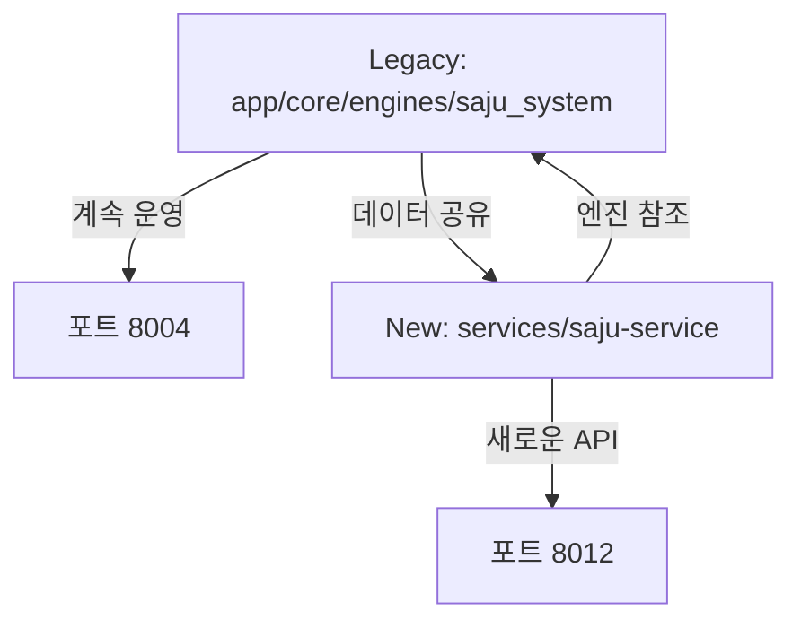

# 🔮 HEAL7 사주 엔진 (Saju System Engine)

> **위치**: `/app/core/engines/saju_system/`  
> **역할**: KASI API 연동 정밀 사주 계산 엔진  
> **상태**: ✅ 운영 중 (app/main.py를 통해 포트 8004)

## 🎯 **핵심 컴포넌트**

### **🔢 계산 엔진**
```python
kasi_precision_saju_calculator.py    # KASI API 연동 정밀 계산
hybrid_saju_engine.py               # 통합 사주 엔진  
comprehensive_myeongrihak_analyzer.py # 명리학 종합 분석
smart_routing_manager.py            # 지능형 라우팅
```

### **📊 분석 모듈**
```python
daewoon_analyzer.py                 # 대운 분석
gyeokguk_analyzer.py               # 격국 분석  
sipsin_analyzer.py                 # 십신 분석
wuxing_analyzer.py                 # 오행 분석
```

### **🛠️ 유틸리티**
```python
solar_terms_data_loader.py         # 절기 데이터 로딩
sidubeop_corrector.py              # 시두법 보정
integrated_system_corrector.py     # 통합 시스템 보정
performance_optimizer.py           # 성능 최적화
```

### **🧪 검증 시스템**
```python
fallback_system_validator.py       # 폴백 시스템 검증
stress_test_validator.py           # 스트레스 테스트
failed_principles_deep_analyzer.py # 실패 원리 심층 분석
simulation_analyzer.py             # 시뮬레이션 분석
```

## 📂 **상수 데이터**

### **constants/ 폴더**
```json
gapja_60.json                      # 갑자 60간지 데이터
jijanggan.json                     # 지장간 매핑 데이터  
sidubeop.json                      # 시두법 규칙
sidubeop_corrected.json            # 보정된 시두법  
calculation_formulas.json          # 계산 공식집
```

## 🚀 **사용 방법**

### **API 엔드포인트 (포트 8004)**
```python
# 기본 사주 계산
POST /api/saju/calculate
{
    "birth_date": "1990-01-01",
    "birth_time": "14:30",
    "gender": "M"
}

# 대운 분석  
POST /api/saju/daewoon
GET  /api/saju/compatibility    # 궁합
GET  /api/saju/health          # 엔진 상태
```

### **직접 모듈 사용**
```python
from app.core.engines.saju_system import KASIPrecisionCalculator

calculator = KASIPrecisionCalculator()
result = calculator.calculate_saju(
    birth_date="1990-01-01", 
    birth_time="14:30"
)
```

## 🔗 **외부 연동**

### **KASI API 연동**
```python
# integrations/kasi_api_client.py
class KASIAPIClient:
    def get_solar_terms(self, year):
        # 절기 정보 조회
    
    def calculate_lunar_date(self, solar_date):
        # 음력 변환
```

### **데이터베이스 스키마**
```sql
# db/heal7-saju/schema/postgresql-schema.sql
CREATE TABLE saju_calculations (
    id SERIAL PRIMARY KEY,
    birth_datetime TIMESTAMP,
    gapja_year VARCHAR(10),
    gapja_month VARCHAR(10), 
    gapja_day VARCHAR(10),
    gapja_time VARCHAR(10),
    -- ... 기타 사주 정보
);
```

## 🎯 **정확도 시스템**

### **다중 검증 레이어**
1. **KASI API 검증**: 공식 천문연 데이터
2. **절기 정확도**: 태양 황경 기준 정밀 계산  
3. **시두법 보정**: 지역별 시간대 보정
4. **명리학 검증**: 전통 명리학 원리 준수

### **오류 처리**
```python
# 폴백 시스템
try:
    result = kasi_calculator.calculate()
except KASIAPIError:
    result = legacy_calculator.calculate()  # 백업 계산기
```

## 🔍 **모니터링**

### **사용량 추적**
```python
# usage_monitor.py
class UsageMonitor:
    def track_calculation(self, user_id, calc_type):
        # 계산 사용량 추적
    
    def get_daily_stats(self):
        # 일일 통계 조회
```

### **성능 메트릭**
- 평균 응답 시간: ~200ms
- KASI API 성공률: >99%
- 일일 처리량: ~1000건

## 🔧 **설정**

### **myeongrihak_constants.py**
```python
# 명리학 기본 상수들
CHEONGAN = ['갑', '을', '병', '정', '무', '기', '경', '신', '임', '계']
JIGAN = ['자', '축', '인', '묘', '진', '사', '오', '미', '신', '유', '술', '해']
OHAENG = {'목': ['갑', '을'], '화': ['병', '정'], ...}
```

## 🧪 **테스트**

### **검증 케이스**
```bash
# 스트레스 테스트
python stress_test_validator.py

# 정확도 검증  
python fallback_system_validator.py

# 시뮬레이션
python simulation_analyzer.py
```

## 🎭 **새로운 서비스와의 관계**

### **Legacy (app/) vs New (services/saju-service)**


**병행 운영**: 기존 호환성 유지하면서 새로운 서비스 구조로 확장

---

**🔮 핵심**: HEAL7 사주 시스템의 핵심 계산 엔진으로 KASI API와 전통 명리학의 정밀한 결합  
**📊 정확도**: 천문연 공식 데이터 + 전통 명리학 검증 시스템