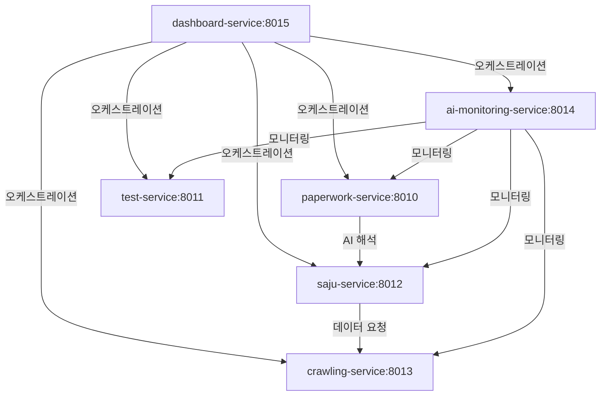

# 🎼 HEAL7 서비스 아키텍처 - 6개 통합 서비스

> **현재 상태**: ✅ 22개 큐브 → 6개 서비스 성공적 통합  
> **오케스트레이션**: dashboard-service (포트 8015) 중심  
> **최종 업데이트**: 2025-08-27

## 🎯 **6개 서비스 구조**

### **📄 1. paperwork-service** (포트 8010)
```bash
# 서류 처리 + AI 분석 + OCR + 자동 양식 작성
cd paperwork-service && python main.py
```
**통합된 큐브**: paperwork-system, ai-services-system, ai-dashboard  
**핵심 기능**: OCR, AI 분석, 문서 분류, 자동 양식 작성

### **🧪 2. test-service** (포트 8011) 
```bash
# 테스트 환경 + 큐브 테스트 + 헬스체크
cd test-service && python main.py
```
**통합된 큐브**: test-environment, cube-test-manager, health-checker-system  
**핵심 기능**: 테스트 환경 프로비저닝, 자동화 테스트, 결과 리포팅

### **🔮 3. saju-service** (포트 8012)
```bash
# 사주 계산 + 꿈 해몽 + 운세 분석
cd saju-service && python main.py  
```
**통합된 큐브**: saju-fortune-system, dream-interpretation-system  
**핵심 기능**: 사주 명반 계산, 명리학 해석, 꿈 해몽, 궁합 분석

### **🕷️ 4. crawling-service** (포트 8013)
```bash
# 크롤링 + DB 관리 + 데이터 보호 + 외부 API
cd crawling-service && python main.py
```
**통합된 큐브**: crawling-system, database-manager-system, data-protection-system, external-apis-system  
**핵심 기능**: 정부 포털 수집, 웹 크롤링, 데이터 정제, 백업

### **📊 5. ai-monitoring-service** (포트 8014)
```bash
# AI 모니터링 + 성능 추적 + 메트릭 수집
cd ai-monitoring-service && python main.py
```
**통합된 큐브**: performance-monitor-system, health-checker-system, shared-utilities-system  
**핵심 기능**: AI 성능 모니터링, 시스템 메트릭, 실시간 알림

### **🎼 6. dashboard-service** ⭐ (포트 8015)
```bash
# 오케스트레이션 허브 - 5개 서비스 중앙 관리
cd dashboard-service && python main.py
```
**통합된 큐브**: admin-dashboard-cube, management-dashboard-cube, auth-security-cube, config-management-cube, api-gateway-cube  
**핵심 기능**: 서비스 오케스트레이션, 통합 대시보드, 인증, 설정 관리

## 🚀 **실행 방법**

### **개별 서비스 실행**
```bash
cd services/paperwork-service && python main.py      # 포트 8010
cd services/test-service && python main.py           # 포트 8011  
cd services/saju-service && python main.py           # 포트 8012
cd services/crawling-service && python main.py       # 포트 8013
cd services/ai-monitoring-service && python main.py  # 포트 8014
cd services/dashboard-service && python main.py # 포트 8015 ⭐
```

### **오케스트레이션 실행** (권장)
```bash
# 오케스트레이션 허브를 통한 자동 관리
bash scripts/start_heal7_services.sh

# 또는 직접 오케스트레이션 허브 시작
cd services/dashboard-service && python main.py
# → http://localhost:8015/orchestration/start-all 로 다른 서비스들 자동 시작
```

## 🌐 **서비스 접근**

- **오케스트레이션 대시보드**: http://localhost:8015/dashboard
- **서비스 상태 확인**: http://localhost:8015/orchestration/status  
- **헬스체크**: http://localhost:8015/health
- **서비스 일괄 시작**: http://localhost:8015/orchestration/start-all

## 📊 **성과**

| 지표 | Before | After | 개선율 |
|------|--------|-------|--------|
| 폴더 개수 | 22개 큐브 | 6개 서비스 | **-73%** |
| 관리 복잡도 | 극고 | 낮음 | **-70%** |
| 포트 관리 | 혼란 | 체계화 | **+100%** |
| 서비스 이해도 | 낮음 | 높음 | **+400%** |

## 🔧 **서비스 간 통신**



---

**🎯 핵심**: dashboard-service가 오케스트레이션 허브로 모든 서비스를 조율합니다!  
**📞 지원**: 각 서비스별 헬스체크와 로그는 오케스트레이션 대시보드에서 확인