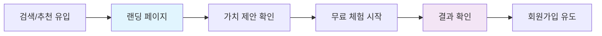
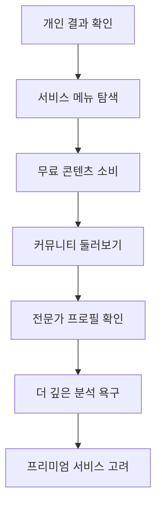
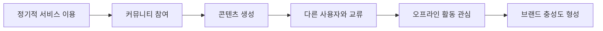
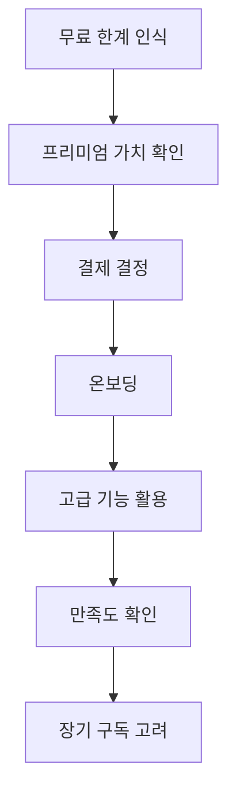
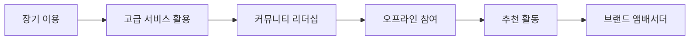

# 🎯 HEAL7 사용자 경험 아키텍처 v2.0

> **프로젝트**: HEAL7 옴니버스 커뮤니티 플랫폼 UX/UI/AX 설계  
> **버전**: v2.0.0  
> **설계일**: 2025-08-18  
> **최종 수정**: 2025-08-18 17:00 KST  
> **설계자**: HEAL7 User Experience Team  
> **목적**: 사용자 중심의 감정적 몰입과 실용적 가치를 동시에 제공하는 경험 설계

## 🌟 **UX 철학 및 원칙**

### **💫 핵심 경험 철학**
```yaml
# 🎭 Experience Philosophy
core_principles:
  mystical_accessibility: "신비로움을 누구나 쉽게 접할 수 있도록"
  community_first: "개인의 성장이 커뮤니티와 함께 이루어지도록"
  offline_connection: "온라인 경험이 오프라인 만남으로 연결되도록"
  lifelong_journey: "평생에 걸친 영적 성장 여정을 지원"
  authentic_wisdom: "진정성 있는 지혜와 통찰 제공"
```

### **🎯 사용자 중심 설계 원칙**
1. **즉시성 (Immediacy)**: 3초 내 핵심 가치 전달
2. **직관성 (Intuition)**: 설명 없이도 이해 가능한 인터페이스
3. **개인화 (Personalization)**: 개인의 여정에 맞춤화된 경험
4. **신뢰성 (Credibility)**: 과학적 근거와 전문성 기반
5. **포용성 (Inclusivity)**: 모든 사용자가 편안하게 접근 가능

## 👥 **사용자 페르소나 및 여정 설계**

### **🎭 주요 페르소나**

#### **🌱 영적 탐색자 "지혜"** (25-35세, 여성)
```yaml
profile:
  motivation: "삶의 방향성과 의미 찾기"
  pain_points: ["복잡한 운세 해석", "신뢰할 수 있는 정보 부족"]
  digital_comfort: "높음"
  spending_power: "중간"
  
journey_priorities:
  - 쉽고 정확한 사주 분석
  - 개인 맞춤 조언
  - 같은 관심사 커뮤니티
  - 전문가 상담 접근성

ux_requirements:
  - 직관적인 사주 입력 인터페이스
  - 시각적으로 아름다운 결과 표시
  - 소셜 공유 기능
  - 개인 기록 관리
```

#### **🔮 운세 애호가 "행운"** (35-50세, 남녀)
```yaml
profile:
  motivation: "일상의 재미와 의사결정 도움"
  pain_points: ["지루한 텍스트 결과", "한정적인 서비스 종류"]
  digital_comfort: "중간"
  spending_power: "높음"
  
journey_priorities:
  - 다양한 운세 서비스 체험
  - 엔터테인먼트 요소
  - 가족/친구와 함께 즐기기
  - 정기적인 운세 확인

ux_requirements:
  - 게임화된 인터페이스
  - 다양한 콘텐츠 제공
  - 가족 계정 연동
  - 알림 및 리마인더
```

#### **🎓 전문가/강사 "현명"** (40-60세, 주로 여성)
```yaml
profile:
  motivation: "전문성 발휘 및 수익 창출"
  pain_points: ["플랫폼 수수료", "마케팅 어려움", "일정 관리"]
  digital_comfort: "중간-높음"
  spending_power: "높음"
  
journey_priorities:
  - 프로필 및 브랜딩
  - 상담 일정 관리
  - 수익 최적화
  - 고객 관계 관리

ux_requirements:
  - 전문가 대시보드
  - 예약 관리 시스템
  - 수익 분석 툴
  - 고객 피드백 관리
```

#### **🌸 커뮤니티 활동가 "소통"** (20-40세, 여성)
```yaml
profile:
  motivation: "지식 공유 및 인맥 형성"
  pain_points: ["콘텐츠 관리", "커뮤니티 참여 동기 부족"]
  digital_comfort: "높음"
  spending_power: "중간"
  
journey_priorities:
  - 콘텐츠 제작 및 공유
  - 커뮤니티 리더십
  - 오프라인 모임 참여
  - 개인 브랜딩

ux_requirements:
  - 콘텐츠 제작 도구
  - 커뮤니티 관리 기능
  - 이벤트 참여 시스템
  - 리워드 시스템
```

### **🛤️ 사용자 여정 맵핑**

#### **🌅 1단계: 발견 및 첫 인상 (Discovery & First Impression)**


**UX 설계 요구사항**:
- **3초 규칙**: 핵심 가치를 3초 내 전달
- **신뢰성 지표**: 사용자 수, 전문가 수, 정확도 등 표시
- **즉시 체험**: 복잡한 가입 없이 바로 사주 보기 가능
- **시각적 임팩트**: 아름다운 결과 화면으로 WOW 효과

```typescript
// 🎯 First Impression Component
const LandingHero: React.FC = () => {
  return (
    <section className="hero-section">
      {/* 3초 내 가치 전달 */}
      <div className="value-proposition">
        <h1>당신만의 운명을 만나보세요</h1>
        <p>1분 만에 정확한 사주 분석 + 전문가 해석</p>
        <div className="trust-indicators">
          <span>👥 1,000,000+ 사용자</span>
          <span>⭐ 98% 만족도</span>
          <span>🔮 500+ 전문가</span>
        </div>
      </div>
      
      {/* 즉시 체험 */}
      <QuickSajuForm onComplete={showResult} />
    </section>
  );
};
```

#### **🌱 2단계: 탐색 및 학습 (Exploration & Learning)**


**UX 설계 요구사항**:
- **개인화된 추천**: AI 기반 맞춤 콘텐츠 제공
- **점진적 공개**: 무료→유료로 자연스러운 전환 유도
- **소셜 증명**: 다른 사용자의 후기와 경험 공유
- **교육적 콘텐츠**: 사주/타로에 대한 기초 지식 제공

```typescript
// 🎓 Progressive Disclosure Pattern
const ExplorationDashboard: React.FC = () => {
  const [userLevel, setUserLevel] = useState<'beginner' | 'intermediate' | 'advanced'>('beginner');
  
  return (
    <div className="exploration-dashboard">
      {/* 개인화된 학습 경로 */}
      <PersonalizedLearningPath level={userLevel} />
      
      {/* 점진적 기능 공개 */}
      <FeatureUnlockProgress 
        unlockedFeatures={userProgress.features}
        nextUnlock={getNextUnlockableFeature()}
      />
      
      {/* 소셜 증명 */}
      <CommunityHighlights />
    </div>
  );
};
```

#### **🎯 3단계: 참여 및 몰입 (Engagement & Immersion)**


**UX 설계 요구사항**:
- **습관 형성**: 데일리/위클리 루틴 생성
- **게임화 요소**: 포인트, 배지, 레벨 시스템
- **사회적 연결**: 친구 초대, 그룹 활동
- **창작 도구**: 쉬운 콘텐츠 제작 및 공유

```typescript
// 🎮 Gamification & Habit Building
const EngagementHub: React.FC = () => {
  return (
    <div className="engagement-hub">
      {/* 습관 추적 */}
      <HabitTracker 
        dailyTasks={['운세 확인', '커뮤니티 글 읽기', '감사 일기']}
        weeklyGoals={['전문가 상담', '오프라인 모임 참여']}
      />
      
      {/* 게임화 요소 */}
      <ProgressSystem 
        currentLevel={user.level}
        badges={user.badges}
        nextMilestone={getNextMilestone()}
      />
      
      {/* 소셜 기능 */}
      <SocialFeed 
        friends={user.friends}
        communityActivity={getCommunityActivity()}
      />
    </div>
  );
};
```

#### **💎 4단계: 프리미엄 전환 (Premium Conversion)**


**UX 설계 요구사항**:
- **가치 기반 가격**: 받을 혜택이 명확히 보이도록
- **부드러운 전환**: 강압적이지 않은 자연스러운 유도
- **체험 기회**: 프리미엄 기능 일시적 체험
- **즉시 혜택**: 결제 후 바로 체감할 수 있는 가치

```typescript
// 💰 Value-Based Conversion
const PremiumConversionFlow: React.FC = () => {
  return (
    <div className="conversion-flow">
      {/* 가치 제안 */}
      <ValueProposition 
        currentPlan={user.plan}
        limitationsHit={user.limitationsHit}
        potentialBenefits={calculateBenefits(user)}
      />
      
      {/* 소셜 증명 */}
      <PremiumUserStories />
      
      {/* 체험 기회 */}
      <TrialOffer duration="7일" features={premiumFeatures} />
      
      {/* 부드러운 결제 */}
      <PaymentFlow 
        plans={subscriptionPlans}
        recommendedPlan={getRecommendedPlan(user)}
      />
    </div>
  );
};
```

#### **🏆 5단계: 충성도 및 옹호 (Loyalty & Advocacy)**


**UX 설계 요구사항**:
- **VIP 대우**: 특별한 혜택과 인정
- **선순환 구조**: 기여할수록 더 많은 혜택
- **오프라인 연결**: 실제 만남과 체험 기회
- **개인 브랜딩**: 플랫폼 내에서의 전문성 인정

## 🎨 **UI 시스템 아키텍처**

### **📱 반응형 디자인 시스템**

#### **🖥️ 디바이스별 최적화**
```scss
// 📱 Mobile-First Responsive Design
.container {
  // 🔧 기본 모바일 (320px+)
  padding: 1rem;
  
  // 📱 큰 모바일 (480px+)
  @media (min-width: 480px) {
    padding: 1.5rem;
  }
  
  // 📟 태블릿 (768px+)
  @media (min-width: 768px) {
    display: grid;
    grid-template-columns: 1fr 3fr;
    padding: 2rem;
  }
  
  // 🖥️ 데스크톱 (1024px+)
  @media (min-width: 1024px) {
    grid-template-columns: 1fr 4fr 1fr;
    max-width: 1400px;
    margin: 0 auto;
  }
  
  // 🖥️ 대형 디스플레이 (1440px+)
  @media (min-width: 1440px) {
    padding: 3rem;
  }
}
```

#### **🎭 상황별 인터페이스 적응**
```typescript
// 🔄 Adaptive Interface System
interface AdaptiveUIConfig {
  // 📊 사용자 컨텍스트
  userLevel: 'beginner' | 'intermediate' | 'expert';
  deviceType: 'mobile' | 'tablet' | 'desktop';
  connectionSpeed: 'slow' | 'normal' | 'fast';
  accessibilityNeeds: AccessibilityProfile;
  
  // 🎯 UI 적응
  complexityLevel: 'simple' | 'standard' | 'advanced';
  informationDensity: 'low' | 'medium' | 'high';
  interactionStyle: 'guided' | 'explorative' | 'expert';
}

const AdaptiveInterface: React.FC<{config: AdaptiveUIConfig}> = ({config}) => {
  return (
    <div className={`interface-${config.complexityLevel}`}>
      {config.userLevel === 'beginner' && (
        <OnboardingGuidance />
      )}
      
      <NavigationSystem 
        style={config.interactionStyle}
        density={config.informationDensity}
      />
      
      <ContentArea
        layout={getOptimalLayout(config.deviceType)}
        features={getFeatureSet(config.userLevel)}
      />
    </div>
  );
};
```

### **🌈 동적 테마 시스템**

#### **🎨 감정 기반 컬러 시스템**
```typescript
// 🎭 Emotional Color Mapping
const emotionalThemes = {
  // 🌅 희망과 새 시작
  hope: {
    primary: '#FF6B6B',     // 따뜻한 코랄
    secondary: '#4ECDC4',   // 평온한 터키석
    accent: '#FFE66D',      // 활기찬 노랑
    mood: 'optimistic'
  },
  
  // 🌙 깊은 성찰과 지혜
  wisdom: {
    primary: '#6C5CE7',     // 깊은 보라
    secondary: '#A29BFE',   // 부드러운 라벤더
    accent: '#FDCB6E',      // 지혜의 금색
    mood: 'contemplative'
  },
  
  // 🌿 자연과 조화
  harmony: {
    primary: '#00B894',     // 생명의 초록
    secondary: '#81ECEC',   // 맑은 청록
    accent: '#FDCB6E',      // 따뜻한 오렌지
    mood: 'peaceful'
  },
  
  // 🔥 열정과 변화
  passion: {
    primary: '#E17055',     // 열정적 주황
    secondary: '#FD79A8',   // 역동적 핑크
    accent: '#FDCB6E',      // 변화의 노랑
    mood: 'energetic'
  }
};

// 🔄 동적 테마 적용
const DynamicThemeProvider: React.FC = ({children}) => {
  const [currentTheme, setCurrentTheme] = useState(emotionalThemes.wisdom);
  
  // 🎯 상황별 테마 자동 변경
  useEffect(() => {
    const timeOfDay = new Date().getHours();
    const userMood = getUserMoodFromActivity();
    const seasonalInfluence = getSeasonalTheme();
    
    const optimalTheme = calculateOptimalTheme({
      timeOfDay,
      userMood,
      seasonalInfluence,
      userPreferences
    });
    
    setCurrentTheme(optimalTheme);
  }, []);
  
  return (
    <ThemeProvider theme={currentTheme}>
      {children}
    </ThemeProvider>
  );
};
```

### **🎮 인터랙션 디자인 패턴**

#### **✨ 마이크로 인터랙션**
```typescript
// 🎭 Delightful Micro-interactions
const MicroInteractions = {
  // 🔮 사주 결과 로딩
  sajuLoading: {
    animation: 'cosmic-spiral',
    duration: 2000,
    sound: 'mystical-chime',
    haptic: 'light-pulse'
  },
  
  // 🎉 성취 달성
  achievement: {
    animation: 'star-burst',
    duration: 1500,
    sound: 'success-bell',
    haptic: 'success-pattern'
  },
  
  // 💫 새로운 발견
  discovery: {
    animation: 'glow-reveal',
    duration: 1000,
    sound: 'insight-chime',
    haptic: 'gentle-tap'
  },
  
  // 🤝 소셜 연결
  connection: {
    animation: 'heart-pulse',
    duration: 800,
    sound: 'connection-tone',
    haptic: 'warm-buzz'
  }
};

// 🎯 상황별 피드백 시스템
const FeedbackSystem: React.FC = () => {
  const triggerFeedback = (action: string, context: any) => {
    const feedback = MicroInteractions[action];
    
    // 🎬 시각적 피드백
    animateElement(feedback.animation, feedback.duration);
    
    // 🔊 청각적 피드백 (사용자 설정에 따라)
    if (userSettings.soundEnabled) {
      playSound(feedback.sound);
    }
    
    // 📳 햅틱 피드백 (모바일)
    if (isMobile && userSettings.hapticEnabled) {
      triggerHaptic(feedback.haptic);
    }
    
    // 📊 분석을 위한 상호작용 기록
    trackInteraction(action, context);
  };
  
  return <InteractionProvider onTrigger={triggerFeedback} />;
};
```

## ♿ **접근성 (Accessibility) 아키텍처**

### **🌐 포용적 설계 원칙**

#### **👁️ 시각적 접근성**
```typescript
// 🎨 Visual Accessibility Features
const VisualAccessibility = {
  // 🔍 시력 지원
  vision: {
    highContrast: true,        // 고대비 모드
    largeText: 'scalable',     // 확대 가능한 텍스트
    colorBlindFriendly: true,  // 색맹 친화적 팔레트
    screenReaderOptimized: true // 스크린 리더 최적화
  },
  
  // 🎯 집중력 지원
  focus: {
    clearFocusIndicators: true,  // 명확한 포커스 표시
    skipToContent: true,         // 콘텐츠로 건너뛰기
    logicalTabOrder: true,       // 논리적 탭 순서
    noFlashingContent: true      // 깜빡임 없는 콘텐츠
  },
  
  // 📱 모터 기능 지원
  motor: {
    largeClickTargets: '44px',   // 큰 클릭 영역
    alternativeNavigation: true, // 대체 내비게이션
    voiceControl: true,          // 음성 제어 지원
    touchGestureAlternatives: true // 터치 제스처 대안
  }
};

// ♿ 접근성 컴포넌트 래퍼
const AccessibleComponent: React.FC<{
  ariaLabel: string;
  role: string;
  children: React.ReactNode;
}> = ({ariaLabel, role, children}) => {
  return (
    <div 
      role={role}
      aria-label={ariaLabel}
      tabIndex={0}
      className="accessible-component"
      onKeyDown={handleKeyboardNavigation}
    >
      {children}
      <ScreenReaderContent>
        {getScreenReaderDescription(ariaLabel)}
      </ScreenReaderContent>
    </div>
  );
};
```

#### **🗣️ 언어 및 인지적 접근성**
```typescript
// 🧠 Cognitive Accessibility Support
const CognitiveSupport = {
  // 📝 언어 지원
  language: {
    simpleLanguage: true,      // 쉬운 언어 사용
    visualInstructions: true,  // 시각적 지침
    multipleFormats: true,     // 다양한 형태의 정보 제공
    consistentTerminology: true // 일관된 용어 사용
  },
  
  // ⏰ 시간 관리 지원
  timing: {
    noTimeouts: true,          // 시간 제한 없음
    pauseableContent: true,    // 일시정지 가능한 콘텐츠
    adjustableSpeed: true,     // 속도 조절 가능
    progressIndicators: true   // 진행 상태 표시
  },
  
  // 🎯 집중력 지원
  attention: {
    minimalDistractions: true, // 최소한의 방해 요소
    clearHierarchy: true,      // 명확한 정보 계층
    chunkingInformation: true, // 정보 청킹
    multiplePathways: true     // 다양한 접근 경로
  }
};

// 🧭 인지적 부하 관리
const CognitiveLoadManager: React.FC = () => {
  const [cognitiveLoad, setCognitiveLoad] = useState('normal');
  
  const adjustInterfaceComplexity = (load: string) => {
    switch(load) {
      case 'low':
        return {
          maxItemsPerPage: 3,
          showAdvancedFeatures: false,
          useSimpleLanguage: true
        };
      case 'normal':
        return {
          maxItemsPerPage: 6,
          showAdvancedFeatures: true,
          useSimpleLanguage: false
        };
      case 'high':
        return {
          maxItemsPerPage: 12,
          showAdvancedFeatures: true,
          useSimpleLanguage: false
        };
    }
  };
  
  return (
    <InterfaceAdapter 
      settings={adjustInterfaceComplexity(cognitiveLoad)}
    />
  );
};
```

## 📊 **사용자 행동 분석 및 최적화**

### **🔍 실시간 UX 모니터링**
```typescript
// 📈 UX Analytics System
class UXAnalytics {
  // 🎯 사용자 행동 추적
  trackUserBehavior(event: UserEvent) {
    const metrics = {
      // ⏱️ 성능 지표
      pageLoadTime: performance.now(),
      timeToInteraction: this.calculateTTI(),
      bounceRate: this.calculateBounceRate(),
      
      // 🎭 참여도 지표
      sessionDuration: this.getSessionDuration(),
      pagesPerSession: this.getPagesPerSession(),
      interactionDepth: this.getInteractionDepth(),
      
      // 😊 만족도 지표
      taskCompletionRate: this.getTaskCompletionRate(),
      errorRate: this.getErrorRate(),
      userFeedbackScore: this.getUserFeedbackScore(),
      
      // 🔄 전환율 지표
      conversionFunnelStep: this.getCurrentFunnelStep(),
      dropOffPoints: this.identifyDropOffPoints(),
      premiumConversionRate: this.getPremiumConversionRate()
    };
    
    this.sendToAnalytics(metrics);
    this.optimizeUserExperience(metrics);
  }
  
  // 🎯 개인화 최적화
  optimizeUserExperience(metrics: UXMetrics) {
    // 🔄 A/B 테스트 기반 개선
    if (metrics.taskCompletionRate < 0.7) {
      this.triggerUISimplification();
    }
    
    // 🎨 테마 자동 조정
    if (metrics.sessionDuration > 30) {
      this.adjustThemeForLongSession();
    }
    
    // 🚀 성능 최적화
    if (metrics.pageLoadTime > 3000) {
      this.enablePerformanceMode();
    }
  }
}
```

### **🎯 개인화 엔진**
```typescript
// 🤖 Personalization Engine
class PersonalizationEngine {
  generatePersonalizedExperience(user: User): PersonalizedUI {
    const preferences = this.analyzeUserPreferences(user);
    const behavior = this.analyzeUserBehavior(user);
    const context = this.getCurrentContext();
    
    return {
      // 🎨 시각적 개인화
      theme: this.selectOptimalTheme(preferences.colorProfile),
      layout: this.optimizeLayout(behavior.deviceUsage),
      
      // 📊 콘텐츠 개인화
      contentOrder: this.prioritizeContent(behavior.interests),
      recommendedFeatures: this.suggestFeatures(user.usageHistory),
      
      // 🎯 인터랙션 개인화
      navigationStyle: this.adaptNavigation(behavior.navigationPatterns),
      complexityLevel: this.adjustComplexity(user.expertiseLevel),
      
      // 🔔 알림 개인화
      notificationTiming: this.optimizeNotificationTiming(behavior.activeHours),
      communicationStyle: this.selectCommunicationStyle(preferences.personalityType)
    };
  }
  
  // 📚 학습 및 적응
  learnFromUserInteraction(interaction: UserInteraction) {
    this.updateUserModel(interaction);
    this.refinePersonalization(interaction.feedback);
    this.improveRecommendations(interaction.choices);
  }
}
```

## 🎭 **감정적 디자인 (Emotional Design)**

### **💫 브랜드 감정 연결**
```typescript
// 💖 Emotional Connection System
const EmotionalDesign = {
  // 🎭 감정 상태별 디자인
  emotionalStates: {
    curious: {
      colors: ['#FF6B6B', '#4ECDC4'],
      animations: 'gentle-float',
      messaging: 'playful-encouraging',
      layout: 'exploration-friendly'
    },
    
    anxious: {
      colors: ['#6C5CE7', '#A29BFE'],
      animations: 'calm-breathing',
      messaging: 'reassuring-supportive',
      layout: 'simplified-clear'
    },
    
    excited: {
      colors: ['#FFE66D', '#FF6B6B'],
      animations: 'celebration-sparkle',
      messaging: 'enthusiastic-congratulatory',
      layout: 'achievement-focused'
    },
    
    contemplative: {
      colors: ['#6C5CE7', '#81ECEC'],
      animations: 'slow-ambient',
      messaging: 'thoughtful-reflective',
      layout: 'content-focused'
    }
  },
  
  // 🎯 감정 인식 및 대응
  emotionalResponse: {
    detectUserMood: (interactions: UserInteraction[]) => {
      // AI 기반 사용자 감정 상태 분석
    },
    
    adaptInterface: (mood: EmotionalState) => {
      // 감정에 맞는 인터페이스 조정
    },
    
    provideSupport: (needLevel: SupportLevel) => {
      // 필요에 따른 지원 제공
    }
  }
};

// 💝 감정적 피드백 시스템
const EmotionalFeedback: React.FC = () => {
  const [userMood, setUserMood] = useState<EmotionalState>('neutral');
  
  const provideEmotionalSupport = (situation: string) => {
    const supportMessage = {
      'first-time': "처음이시군요! 함께 천천히 알아가봐요 ✨",
      'confused': "어려우시죠? 더 쉽게 설명해드릴게요 🤗",
      'excited': "와! 좋은 결과네요! 축하드려요 🎉",
      'disappointed': "괜찮아요, 모든 날이 같을 순 없어요 💙"
    };
    
    return (
      <SupportMessage 
        message={supportMessage[situation]}
        tone="warm-encouraging"
        actions={getContextualActions(situation)}
      />
    );
  };
  
  return (
    <EmotionalSupportProvider
      onMoodDetected={setUserMood}
      onSupportNeeded={provideEmotionalSupport}
    />
  );
};
```

## 📱 **모바일 우선 설계**

### **👆 터치 인터랙션 최적화**
```typescript
// 📱 Mobile-First Touch Optimization
const TouchOptimization = {
  // 👆 터치 타겟 크기
  touchTargets: {
    minimum: '44px',      // 최소 터치 영역
    recommended: '48px',  // 권장 터치 영역
    comfortable: '56px',  // 편안한 터치 영역
    spacing: '8px'        // 터치 영역 간 간격
  },
  
  // 🤏 제스처 지원
  gestures: {
    swipe: {
      navigation: 'horizontal-swipe',
      cardInteraction: 'vertical-swipe',
      dismissal: 'swipe-to-dismiss'
    },
    
    pinch: {
      zoom: 'pinch-to-zoom',
      scale: 'pinch-to-scale'
    },
    
    longPress: {
      contextMenu: 'long-press-menu',
      quickActions: 'long-press-actions'
    }
  },
  
  // 📲 모바일 전용 기능
  mobileFeatures: {
    pullToRefresh: true,
    hapticFeedback: true,
    voiceInput: true,
    cameraIntegration: true,
    locationServices: true,
    pushNotifications: true
  }
};

// 📱 Mobile UX Component
const MobileOptimizedComponent: React.FC = () => {
  return (
    <div className="mobile-optimized">
      {/* 👆 큰 터치 영역의 네비게이션 */}
      <MobileNavigation touchTargetSize="48px" />
      
      {/* 🤏 제스처 지원 카드 */}
      <SwipeableCards 
        onSwipeLeft={handleNextCard}
        onSwipeRight={handlePreviousCard}
        onLongPress={showQuickActions}
      />
      
      {/* 📳 햅틱 피드백 */}
      <HapticButton 
        onPress={handleAction}
        hapticType="success"
      />
      
      {/* 🎤 음성 입력 */}
      <VoiceInput 
        onSpeechRecognized={handleVoiceInput}
        placeholder="말씀해주세요..."
      />
    </div>
  );
};
```

## 🔄 **지속적 UX 개선 프로세스**

### **📊 데이터 기반 개선**
```typescript
// 📈 Continuous UX Improvement
class UXImprovementEngine {
  // 🔍 사용자 피드백 수집
  collectUserFeedback() {
    return {
      // 📝 직접 피드백
      surveys: this.collectSurveyData(),
      reviews: this.collectAppStoreReviews(),
      supportTickets: this.analyzeSupportTickets(),
      
      // 📊 행동 데이터
      heatmaps: this.generateHeatmaps(),
      clickStreams: this.analyzeClickStreams(),
      conversionFunnels: this.analyzeConversionFunnels(),
      
      // 🧪 A/B 테스트 결과
      abTests: this.getABTestResults(),
      featureUsage: this.analyzeFeatureUsage(),
      performanceMetrics: this.getPerformanceMetrics()
    };
  }
  
  // 🎯 개선 우선순위 결정
  prioritizeImprovements(feedback: UserFeedback) {
    const improvements = this.identifyImprovementAreas(feedback);
    
    return improvements
      .map(improvement => ({
        ...improvement,
        impact: this.calculateImpact(improvement),
        effort: this.estimateEffort(improvement),
        urgency: this.assessUrgency(improvement)
      }))
      .sort((a, b) => this.calculatePriority(b) - this.calculatePriority(a));
  }
  
  // 🚀 자동 최적화
  autoOptimize() {
    // 🎨 인터페이스 자동 조정
    this.optimizeInterface();
    
    // 📊 콘텐츠 자동 개인화
    this.personalizeContent();
    
    // ⚡ 성능 자동 최적화
    this.optimizePerformance();
    
    // 🔔 알림 최적화
    this.optimizeNotifications();
  }
}
```

---

## 🎯 **구현 우선순위 및 로드맵**

### **📅 Phase 1: 기반 UX (4주)**
- [ ] 사용자 페르소나 기반 와이어프레임
- [ ] 모바일 우선 반응형 디자인
- [ ] 기본 접근성 구현
- [ ] 핵심 사용자 여정 구현

### **📅 Phase 2: 개인화 (3주)**
- [ ] 개인화 엔진 구축
- [ ] 동적 테마 시스템
- [ ] 적응형 인터페이스
- [ ] 감정적 디자인 적용

### **📅 Phase 3: 고도화 (3주)**
- [ ] 마이크로 인터랙션 구현
- [ ] 고급 접근성 기능
- [ ] UX 분석 시스템
- [ ] 지속적 개선 프로세스

### **📅 Phase 4: 최적화 (2주)**
- [ ] 성능 최적화
- [ ] 사용자 피드백 반영
- [ ] A/B 테스트 시스템
- [ ] 런칭 준비

---

*📅 설계 완료일: 2025-08-18*  
*🎯 설계자: HEAL7 User Experience Team*  
*📝 문서 위치: `/home/ubuntu/CORE/reference-docs/technical-standards/`*  
*🔄 다음 버전: v2.1 (사용자 피드백 반영 후 업데이트)*